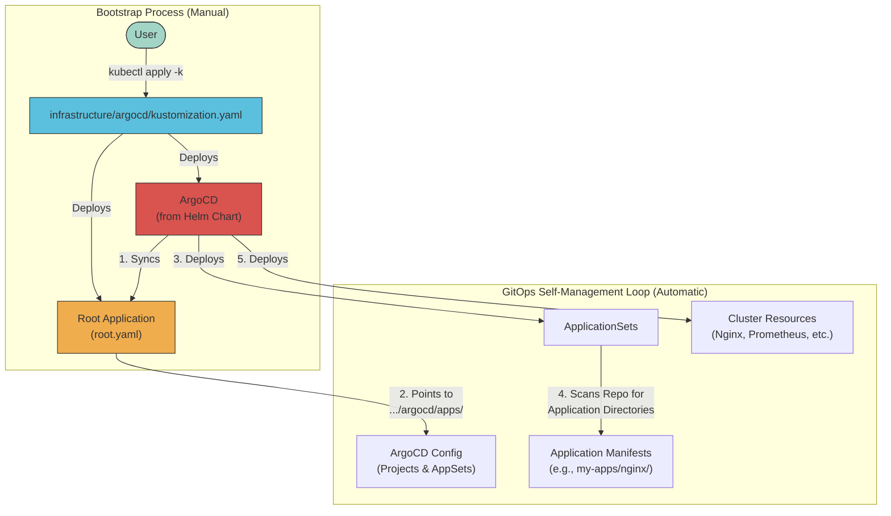

# Talos ArgoCD Proxmox Cluster

[](https://deepwiki.com/mitchross/talos-argocd-proxmox)

> Production-grade GitOps Kubernetes cluster on Talos OS with self-managing ArgoCD, Cilium, and zero-touch PVC backup/restore

A GitOps-driven Kubernetes cluster using **Talos OS** (secure, immutable Linux for K8s), ArgoCD, and Cilium, running on Proxmox. Managed via **[Omni](https://github.com/siderolabs/omni)** (Sidero's Talos management platform) with the **[Proxmox Infrastructure Provider](https://github.com/siderolabs/omni-infra-provider-proxmox)** for automated node provisioning.

## Key Features

- **Self-Managing ArgoCD** - ArgoCD manages its own installation, upgrades, and ApplicationSets from Git
- **Directory = Application** - Apps discovered automatically by directory path, no manual Application manifests
- **Sync Wave Ordering** - Strict deployment ordering prevents race conditions
- **Zero-Touch Backups** - Add a label to a PVC, get automatic Kopia backups to NFS with disaster recovery
- **Gateway API** - Modern ingress via Cilium Gateway API (not legacy Ingress)
- **GPU Support** - Full NVIDIA GPU support via Talos system extensions and GPU Operator
- **Zero SSH** - All node management via Omni UI or Talos API

## Repositories & Resources

| Resource | Description |
|----------|-------------|
| [Omni](https://github.com/siderolabs/omni) | Talos cluster management platform |
| [Proxmox Infra Provider](https://github.com/siderolabs/omni-infra-provider-proxmox) | Proxmox infrastructure provider for Omni |
| [Starter Repo](https://github.com/mitchross/sidero-omni-talos-proxmox-starter) | Full config & automation for Sidero Omni + Talos + Proxmox |
| [Reference Guide](https://www.virtualizationhowto.com/2025/08/how-to-install-talos-omni-on-prem-for-effortless-kubernetes-management/) | VirtualizationHowTo guide for Talos Omni on-prem setup |

## Architecture



### Sync Wave Architecture

ArgoCD deploys applications in strict order to prevent dependency issues:

| Wave | Component | Purpose |
|------|-----------|---------|
| **0** | Foundation | Cilium (CNI), ArgoCD, 1Password Connect, External Secrets, AppProjects |
| **1** | Storage | Longhorn, VolumeSnapshot Controller, VolSync |
| **2** | PVC Plumber | Backup existence checker (must run before Kyverno in Wave 4) |
| **4** | Infrastructure AppSet | Cert-Manager, External-DNS, GPU Operators, Kyverno, Gateway, databases (explicit path list) |
| **5** | Monitoring AppSet | Discovers `monitoring/*` (Prometheus, Grafana, Loki) |
| **6** | My-Apps AppSet | Discovers `my-apps/*/*` (user applications) |

## Prerequisites

1. **Omni deployed and accessible** - See [Omni Setup Guide](omni/omni/README.md)
2. **Sidero Proxmox Provider configured** - See [proxmox provider config](omni/proxmox-provider/)
3. **Cluster created in Omni** - Talos cluster provisioned and healthy
4. **kubectl access** - Download kubeconfig from Omni UI
5. **Local tools installed**: `kubectl`, `kustomize`, `cilium` CLI, `1password` CLI (`op`)

## Bootstrap Process

Once your cluster is provisioned via Omni, follow these steps to install the GitOps stack.

### Step 1: Install Cilium CNI

Omni provisions Talos clusters without a CNI. Install Cilium to get networking functional:

```bash
cilium install \
    --version 1.19.0 \
    --set cluster.name=talos-prod-cluster \
    --set ipam.mode=kubernetes \
    --set kubeProxyReplacement=true \
    --set securityContext.capabilities.ciliumAgent="{CHOWN,KILL,NET_ADMIN,NET_RAW,IPC_LOCK,SYS_ADMIN,SYS_RESOURCE,DAC_OVERRIDE,FOWNER,SETGID,SETUID}" \
    --set securityContext.capabilities.cleanCiliumState="{NET_ADMIN,SYS_ADMIN,SYS_RESOURCE}" \
    --set cgroup.autoMount.enabled=false \
    --set cgroup.hostRoot=/sys/fs/cgroup \
    --set k8sServiceHost=localhost \
    --set k8sServicePort=7445 \
    --set hubble.enabled=false \
    --set hubble.relay.enabled=false \
    --set hubble.ui.enabled=false \
    --set gatewayAPI.enabled=true \
    --set gatewayAPI.enableAlpn=true \
    --set gatewayAPI.enableAppProtocol=true
```

> **Important — version must match:** The `cilium install` CLI version must match the Helm chart version in `infrastructure/networking/cilium/kustomization.yaml` (currently **1.19.0**). Use `cilium install --version 1.19.0` to pin it. If versions differ, ArgoCD upgrades Cilium at Wave 0 and regenerates some Hubble certs but not others, causing TLS handshake failures (`x509: certificate signed by unknown authority`) that block all sync waves.
>
> **Important — Hubble is disabled at bootstrap on purpose:** The CLI install only provides basic CNI networking. ArgoCD enables Hubble at Wave 0 via the full `values.yaml` (which has `hubble.enabled: true`). This ensures ArgoCD is the sole owner of Hubble TLS certificates — no cert mismatch between CLI install and ArgoCD's Helm render. The `ignoreDifferences` in `cilium-app.yaml` then preserves those certs on subsequent syncs.
>
> **Important — cluster name must match:** `cluster.name` must match `infrastructure/networking/cilium/values.yaml` for Hubble certificate SANs. If `cilium install` is run without `--set cluster.name=talos-prod-cluster`, certificates are generated for `default` or `kind-kind`, causing TLS failures.

### Step 2: Install Gateway API CRDs

```bash
kubectl apply -f https://github.com/kubernetes-sigs/gateway-api/releases/download/v1.4.1/standard-install.yaml
kubectl apply --server-side -f https://github.com/kubernetes-sigs/gateway-api/releases/download/v1.4.1/experimental-install.yaml
```

Verify Cilium:
```bash
cilium status
kubectl get pods -n kube-system -l k8s-app=cilium
```

### Step 3: Pre-Seed 1Password Secrets

```bash
kubectl create namespace 1passwordconnect
kubectl create namespace external-secrets

eval $(op signin)

export OP_CREDENTIALS=$(op read op://homelab-prod/1passwordconnect/1password-credentials.json)
export OP_CONNECT_TOKEN=$(op read 'op://homelab-prod/1password-operator-token/credential')

kubectl create secret generic 1password-credentials \
  --namespace 1passwordconnect \
  --from-literal=1password-credentials.json="$OP_CREDENTIALS"

kubectl create secret generic 1password-operator-token \
  --namespace 1passwordconnect \
  --from-literal=token="$OP_CONNECT_TOKEN"

kubectl create secret generic 1passwordconnect \
  --namespace external-secrets \
  --from-literal=token="$OP_CONNECT_TOKEN"
```

### Step 4: Bootstrap ArgoCD

**Option A: Bootstrap Script (Recommended)**

```bash
./scripts/bootstrap-argocd.sh
```

**Option B: Manual Steps**

```bash
kubectl apply -f infrastructure/controllers/argocd/ns.yaml

helm upgrade --install argocd argo-cd \
  --repo https://argoproj.github.io/argo-helm \
  --version 9.1.3 \
  --namespace argocd \
  --values infrastructure/controllers/argocd/values.yaml \
  --wait \
  --timeout 10m

kubectl wait --for condition=established --timeout=60s crd/applications.argoproj.io
kubectl wait --for=condition=Available deployment/argocd-server -n argocd --timeout=300s

kubectl apply -f infrastructure/controllers/argocd/http-route.yaml
kubectl apply -f infrastructure/controllers/argocd/root.yaml
```

### Step 5: Verify

```bash
# Check ArgoCD pods
kubectl get pods -n argocd

# Watch applications sync (all should reach 'Synced')
kubectl get applications -n argocd -w

# View sync wave order
kubectl get applications -n argocd -o custom-columns=NAME:.metadata.name,WAVE:.metadata.annotations.argocd\\.argoproj\\.io/sync-wave,STATUS:.status.sync.status
```

### Step 6: Access ArgoCD UI (Optional)

```bash
kubectl port-forward svc/argocd-server -n argocd 8080:443
# Open https://localhost:8080
kubectl -n argocd get secret argocd-initial-admin-secret -o jsonpath="{.data.password}" | base64 -d
```

## What Happens After Bootstrap

ArgoCD takes over and manages everything from Git:

1. **Wave 0**: Cilium, 1Password Connect, External Secrets deploy in parallel
2. **Wave 1**: Longhorn, Snapshot Controller, VolSync deploy after networking + secrets are ready
3. **Wave 2**: PVC Plumber deploys (backup checker for Kyverno)
4. **Wave 4**: Infrastructure AppSet deploys cert-manager, Kyverno, GPU operators, databases, gateway, etc.
5. **Wave 5**: Monitoring AppSet deploys Prometheus, Grafana, Loki
6. **Wave 6**: My-Apps AppSet deploys user applications

New applications are discovered automatically by directory structure - add a directory with a `kustomization.yaml` and push to Git.

## Cluster Access (Omni)

- **Kubeconfig**: Download from Omni UI > your cluster > "Download Kubeconfig"
- **Node management**: All done through Omni web UI (upgrades, configuration, patches)
- **No `talosctl` needed**: Omni handles Talos upgrades and system extensions

## Backup System

All PVC backups use **Kopia on NFS** via VolSync, automated by Kyverno policies. Add `backup: "hourly"` or `backup: "daily"` label to any PVC and backups happen automatically with zero-touch disaster recovery.

- **Backend**: Kopia filesystem repository on TrueNAS NFS (`192.168.10.133:/mnt/BigTank/k8s/volsync-kopia-nfs`)
- **Encryption**: Kopia password from 1Password (`rustfs` item)
- **Restore**: Automatic on PVC recreation - PVC Plumber checks for existing backups, Kyverno injects `dataSourceRef`
- **Details**: See [docs/pvc-plumber-full-flow.md](docs/pvc-plumber-full-flow.md) and [docs/backup-restore.md](docs/backup-restore.md)

## Hardware

```
Compute
├── AMD Threadripper 2950X (16c/32t)
├── 128GB ECC DDR4 RAM
├── 2x NVIDIA RTX 3090 24GB
└── Google Coral TPU

Storage
├── 4TB ZFS RAID-Z2
├── NVMe OS Drive
└── Longhorn distributed storage for K8s

Network
├── 2.5Gb Networking
├── Firewalla Gold
└── Internal DNS Resolution
```

## Troubleshooting

| Issue | Steps |
|-------|-------|
| **ArgoCD not syncing** | `kubectl get applicationsets -n argocd` / `kubectl describe applicationset infrastructure -n argocd` / Force refresh: delete and re-apply `root.yaml` |
| **Cilium issues** | `cilium status` / `kubectl logs -n kube-system -l k8s-app=cilium` / `cilium connectivity test` |
| **Storage issues** | `kubectl get pvc -A` / `kubectl get pods -n longhorn-system` |
| **Secrets not syncing** | `kubectl get externalsecret -A` / `kubectl get pods -n 1passwordconnect` / `kubectl describe clustersecretstore 1password` |
| **GPU issues** | `kubectl get nodes -l feature.node.kubernetes.io/pci-0300_10de.present=true` / `kubectl get pods -n gpu-operator` |
| **Backup issues** | `kubectl get replicationsource -A` / `kubectl get pods -n volsync-system -l app.kubernetes.io/name=pvc-plumber` |

### Emergency Reset

```bash
# Remove finalizers and delete all applications
kubectl get applications -n argocd -o name | xargs -I{} kubectl patch {} -n argocd --type json -p '[{"op": "remove","path": "/metadata/finalizers"}]'
kubectl delete applications --all -n argocd
./scripts/bootstrap-argocd.sh
```

## Documentation

- **[CLAUDE.md](CLAUDE.md)** - Full development guide and patterns for this repository
- **[docs/pvc-plumber-full-flow.md](docs/pvc-plumber-full-flow.md)** - Complete PVC backup/restore flow diagram
- **[docs/backup-restore.md](docs/backup-restore.md)** - Backup/restore workflow
- **[docs/argocd.md](docs/argocd.md)** - ArgoCD GitOps patterns
- **[docs/network-topology.md](docs/network-topology.md)** - Network architecture
- **[docs/network-policy.md](docs/network-policy.md)** - Cilium network policies
- **[omni/](omni/)** - Omni deployment configs, machine classes, and cluster templates
  - **[omni/omni/README.md](omni/omni/README.md)** - Omni instance setup guide
  - **[omni/docs/](omni/docs/)** - Architecture, operations, prerequisites, troubleshooting

## Contributing

1. Fork the repository
2. Create a feature branch
3. Submit a pull request

## License

MIT License
