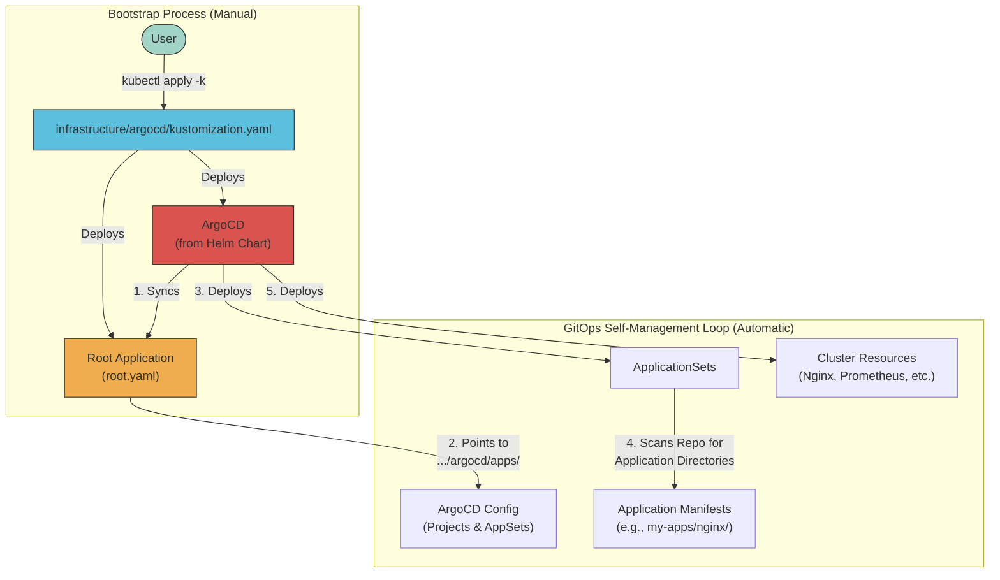

# Talos ArgoCD Proxmox Cluster

[](https://deepwiki.com/mitchross/talos-argocd-proxmox)

> Production-grade GitOps Kubernetes cluster on Talos OS with self-managing ArgoCD, Cilium, and zero-touch PVC backup/restore

A GitOps-driven Kubernetes cluster using **Talos OS** (secure, immutable Linux for K8s), ArgoCD, and Cilium, running on Proxmox. Managed via **[Omni](https://github.com/siderolabs/omni)** (Sidero's Talos management platform) with the **[Proxmox Infrastructure Provider](https://github.com/siderolabs/omni-infra-provider-proxmox)** for automated node provisioning.

## Key Features

- **Self-Managing ArgoCD** - ArgoCD manages its own installation, upgrades, and ApplicationSets from Git
- **Directory = Application** - Apps discovered automatically by directory path, no manual Application manifests
- **Sync Wave Ordering** - Strict deployment ordering prevents race conditions
- **Zero-Touch Backups** - Add a label to a PVC, get automatic Kopia backups to NFS with disaster recovery
- **Gateway API** - Modern ingress via Cilium Gateway API (not legacy Ingress)
- **GPU Support** - Full NVIDIA GPU support via Talos system extensions and GPU Operator
- **Zero SSH** - All node management via Omni UI or Talos API

## Repositories & Resources

| Resource | Description |
|----------|-------------|
| [Omni](https://github.com/siderolabs/omni) | Talos cluster management platform |
| [Proxmox Infra Provider](https://github.com/siderolabs/omni-infra-provider-proxmox) | Proxmox infrastructure provider for Omni |
| [Starter Repo](https://github.com/mitchross/sidero-omni-talos-proxmox-starter) | Full config & automation for Sidero Omni + Talos + Proxmox |
| [Reference Guide](https://www.virtualizationhowto.com/2025/08/how-to-install-talos-omni-on-prem-for-effortless-kubernetes-management/) | VirtualizationHowTo guide for Talos Omni on-prem setup |

## Architecture


```mermaid
graph TD;
    subgraph "Bootstrap Process (Manual)"
        User(["User"]) -- "kubectl apply -k" --> Kustomization["infrastructure/argocd/kustomization.yaml"];
        Kustomization -- "Deploys" --> ArgoCD["ArgoCD<br/>(from Helm Chart)"];
        Kustomization -- "Deploys" --> RootApp["Root Application<br/>(root.yaml)"];
    end

    subgraph "GitOps Self-Management Loop (Automatic)"
        ArgoCD -- "1. Syncs" --> RootApp;
        RootApp -- "2. Points to<br/>.../argocd/apps/" --> ArgoConfigDir["ArgoCD Config<br/>(Projects & AppSets)"];
        ArgoCD -- "3. Deploys" --> AppSets["ApplicationSets"];
        AppSets -- "4. Scans Repo for<br/>Application Directories" --> AppManifests["Application Manifests<br/>(e.g., my-apps/nginx/)"];
        ArgoCD -- "5. Deploys" --> ClusterResources["Cluster Resources<br/>(Nginx, Prometheus, etc.)"];
    end

    style User fill:#a2d5c6,stroke:#333
    style Kustomization fill:#5bc0de,stroke:#333
    style RootApp fill:#f0ad4e,stroke:#333
    style ArgoCD fill:#d9534f,stroke:#333
```

### Sync Wave Architecture

ArgoCD deploys applications in strict order to prevent dependency issues:

| Wave | Component | Purpose |
|------|-----------|---------|
| **0** | Foundation | Cilium (CNI), ArgoCD, 1Password Connect, External Secrets, AppProjects |
| **1** | Core controllers | cert-manager, Longhorn, VolumeSnapshot Controller, VolSync |
| **2** | pvc-plumber v4 core + VolSync backup cluster | pvc-plumber v4.0.1 reconciler (namespace gate + PVC fuse labels; **no admission webhook**) + shared Kopia credentials |
| **3** | CNPG Barman Plugin | Database backup plugin before DB clusters |
| **4** | Infrastructure AppSet + custom entrypoints | External-DNS, GPU Operators, Gateway, KEDA core, Temporal Worker Controller |
| **4** | Database AppSet | CloudNativePG operators & instances (`selfHeal: false` for DR) |
| **5** | OTEL + Monitoring AppSet | OpenTelemetry Operator, Prometheus, Grafana, Loki |
| **6** | Observability overlays + My-Apps AppSet | KEDA/OTEL ServiceMonitors and `my-apps/*/*` user applications |

## Prerequisites

1. **Omni deployed and accessible** - See [Omni Setup Guide](omni/omni/README.md)
2. **Sidero Proxmox Provider configured** - See [proxmox provider config](omni/proxmox-provider/)
3. **Omni service account key available** - Stored in 1Password as described below
4. **Local tools installed**: `omnictl`, `talosctl`, `kubectl`, `kustomize`, Cilium CLI (`cilium` or `cilium-cli`), and 1Password CLI (`op`)

## Current Version Pins

These are the repository targets as of June 22, 2026:

| Component | Version | Source of truth |
|-----------|---------|-----------------|
| Omni server and `omnictl` | `v1.8.2` | `omni/omni/omni.env.example` |
| Talos Linux | `v1.13.4` | `omni/cluster-template/cluster-template-singlenode-gpu.yaml` |
| Kubernetes | `v1.36.2` | `omni/cluster-template/cluster-template-singlenode-gpu.yaml` |
| Cilium | `1.19.5` | `infrastructure/networking/cilium/kustomization.yaml` |
| Gateway API CRDs | `v1.4.1` | Bootstrap commands below |
| Proxmox provider | `latest@sha256:96433a...` | `omni/proxmox-provider/docker-compose.yml` |

Keep the Omni server and local `omnictl` on the same release. Older clients
usually work, but can miss rollout fixes and newer API behavior.

Gateway API `v1.4.1` is an intentional compatibility pin. Gateway API `v1.5.x`
moved `TLSRoute` to `v1`, but Cilium 1.19 still expects `v1alpha2`; Cilium 1.20
is the first Cilium minor with Gateway API 1.5.1 support.

## Provision or Recreate the Cluster

Omni and the Proxmox provider must already be running, and your local `omnictl`
must already be signed in to Omni. The order is:

**(1) apply the machine class → (2) provision or destroy → (3) pull the
service-account key → (4) generate kube/talos access → (5) [bootstrap](#bootstrap-process).**

> **Two clusters live here.** The commands below use the **single-node GPU**
> cluster. Swap the names/files for the multi-node prod cluster:
>
> | | Single-node GPU | Multi-node prod |
> |---|---|---|
> | Cluster | `talos-singlenode-gpu-prod` | `talos-prod-cluster` |
> | Machine class | `omni/machine-classes/single-node-control-plane.yaml` + `omni/machine-classes/single-node-talos-gpu.yaml` | `omni/machine-classes/` |
> | Template | `omni/cluster-template/cluster-template-singlenode-gpu.yaml` | `omni/cluster-template/cluster-template.yaml` |
> | Topology | 2 VMs (1 CP + 1 GPU worker) | 3 CP + 3 workers + 1 GPU |

### 1. Apply the machine classes

Machine classes and the cluster template are snapshots inside Omni — VMs are
built from whatever Omni stored at provision time, not from this repo. Always
apply the class and sync the template BEFORE machines provision (2026-06-11
incident: provisioning against stale snapshots produced workers with a stale
disk layout, a mid-bootstrap Talos rolling upgrade, and a forced reprovision).
Always sync THIS template — not a `cluster-template-working.yaml` variant.

```bash
omnictl apply -f omni/machine-classes/single-node-control-plane.yaml
omnictl apply -f omni/machine-classes/single-node-talos-gpu.yaml
omnictl get machineclasses
```

### 2. Provision (or destroy) the cluster

Template sync owns the MachineSets — do not create them separately.

```bash
# Optional preview before applying:
omnictl cluster template validate -f omni/cluster-template/cluster-template-singlenode-gpu.yaml
omnictl cluster template sync -v -f omni/cluster-template/cluster-template-singlenode-gpu.yaml --dry-run

# Provision / update (idempotent):
omnictl cluster template sync -v -f omni/cluster-template/cluster-template-singlenode-gpu.yaml

# Watch until healthy:
omnictl cluster template status -f omni/cluster-template/cluster-template-singlenode-gpu.yaml --wait 30m
omnictl get machines        # confirm the node(s) reach Running
```

Full destroy:

```bash
omnictl cluster delete talos-singlenode-gpu-prod --destroy-disconnected-machines
omnictl get machines        # must drain to empty
# Sanity-check the Proxmox UI: the cluster's VMs disappear.
```

### 3. Authenticate and pull the service-account key

```bash
eval "$(op signin)"

export OMNI_ENDPOINT=https://omni.vanillax.me:443
export OMNI_SERVICE_ACCOUNT_KEY="$(op read 'op://homelab-prod/talos-prod-sa/OMNI_SERVICE_ACCOUNT_KEY')"

omnictl get infraproviderstatuses   # confirm the Proxmox provider is connected
```

> **`OMNI_ENDPOINT` is mandatory when the service-account key is exported.**
> With `OMNI_SERVICE_ACCOUNT_KEY` set, omnictl ignores the config-file
> contexts entirely. Forgetting the endpoint fails with the cryptic
> `delegating_resolver: invalid target address "": missing address`.

First time on a fresh Omni? Create the service account first — see
[Cluster Access](#cluster-access-omni-service-account).

### 4. Generate Kubernetes and Talos access

```bash
omnictl kubeconfig --cluster talos-singlenode-gpu-prod --service-account --user talos-prod-sa --force
omnictl talosconfig --cluster talos-singlenode-gpu-prod --force
kubectl get nodes -o wide
```

> **Run `talosconfig` once per cluster — re-running stacks `-1`/`-2`/… contexts.**
> `omnictl talosconfig` merges into `~/.talos/config` (`--merge` defaults to
> **true**), and talos renames any *colliding* context with a `-N` suffix
> instead of replacing it. `--force` does **not** prevent this — it only applies
> when writing a standalone file (`--merge=false`). You only need talosconfig
> once (or after a nuke/recreate, when the cluster CA rotates). To refresh
> idempotently, drop the old context first:
>
> ```bash
> talosctl config remove omni-prod-talos-singlenode-gpu-prod -y   # ignore "not found"
> omnictl talosconfig --cluster talos-singlenode-gpu-prod
> # already piled up -1..-N? collapse them:
> talosctl config contexts                                        # inspect
> talosctl config remove omni-prod-talos-singlenode-gpu-prod-1 -y # repeat per dup
> ```

Nodes are expected to remain `NotReady` until Cilium is installed — then
continue with the **[Bootstrap Process](#bootstrap-process)** (secret seeding →
Gateway CRDs → Cilium → ArgoCD).

**Multi-node prod only** — verify the storage nodes were born with the expected
layout (catches the stale-Omni-config failure mode immediately instead of at
Longhorn bootstrap):

```bash
# Talos v1.13.4 on FIRST boot (no pending rolling upgrade):
kubectl get nodes -o custom-columns='NAME:.metadata.name,OS:.status.nodeInfo.osImage'
# expect: every node Talos (v1.13.4)

# Single 800G disk per storage node — if you see sda+sdb the Omni
# template/classes are STALE (old 2-disk layout):
talosctl -n <worker-ip> get disks   # expect sda only (~800G)

# After Longhorn starts: every storage node auto-creates its default V1
# filesystem disk at /var/lib/longhorn (no labels/annotations involved):
kubectl get nodes.longhorn.io -n longhorn-system   # expect 4 Ready storage nodes
```

After ArgoCD's root app is applied there are **zero manual storage steps**:
Longhorn (V1 engine) auto-creates its filesystem disk at `/var/lib/longhorn` on
every storage node, pvc-plumber auto-syncs at Wave 2, and VolSync restores run
unattended.

### Mass-restore stability notes

- **Replica rebuilds are throttled to 1/node in Git**
  (`infrastructure/storage/longhorn/node-failure-settings.yaml`) — verify
  the live Setting matches during any mass restore. Full-cluster restores
  overload any engine on this hardware; do not raise the limit mid-bootstrap.
- A mover pod stuck >15 min on `MountVolume ... hasn't been attached yet`
  with an old VolumeAttachment = stale CSI state — delete the mover pod
  (its Job recreates it, forcing a fresh attach).
- Pods crashlooping on `read-only file system` after a storage disruption:
  the volume must FULLY detach (or the pod must land on a different node)
  to drop the stale ro mount — scale to 0, wait for the Longhorn volume to
  show `detached`, scale back (CNPG: `cnpg.io/hibernation=on` → wait →
  `off`).
- History: the Longhorn V2/SPDK engine was tried and retired here
  (2026-06-12, open Longhorn bugs #13315/#13314). Do not re-enable V2
  without a fixed release and a passed DR drill — short version in
  `docs/disaster-recovery.md`, forensics in git history.

## Bootstrap Process

Once your cluster is provisioned via Omni, follow these steps to install the GitOps stack.

### Step 0: Get Cluster Access (kubectl)

You need `kubectl` access before anything else. The default OIDC kubeconfig expires and requires a browser — use the **Omni service account** for a stable bearer token instead.

> **Prerequisite**: You must have the `OMNI_SERVICE_ACCOUNT_KEY` stored in 1Password (item: `talos-prod-sa`). See [Cluster Access](#cluster-access-omni-service-account) for how to create a service account if you don't have one yet.

```bash
# Sign in to 1Password
eval $(op signin)

# Set Omni endpoint
export OMNI_ENDPOINT=https://omni.vanillax.me:443

# Pull the service account key from 1Password
export OMNI_SERVICE_ACCOUNT_KEY="$(op read 'op://homelab-prod/talos-prod-sa/OMNI_SERVICE_ACCOUNT_KEY')"

# Generate bearer-token kubeconfig (not OIDC)
omnictl kubeconfig --cluster talos-singlenode-gpu-prod --service-account --user talos-prod-sa --force

# Verify access
kubectl get nodes
```

<details>
<summary>Fish shell</summary>

```fish
set -x OMNI_ENDPOINT https://omni.vanillax.me:443
set -x OMNI_SERVICE_ACCOUNT_KEY (op read 'op://homelab-prod/talos-prod-sa/OMNI_SERVICE_ACCOUNT_KEY')
omnictl kubeconfig --cluster talos-singlenode-gpu-prod --service-account --user talos-prod-sa --force
kubectl get nodes
```

</details>

### Step 1: Install Gateway API CRDs

Install both channels before enabling Cilium Gateway API support. Cilium 1.19
still watches the experimental `TLSRoute` API.

```bash
kubectl apply -f https://github.com/kubernetes-sigs/gateway-api/releases/download/v1.4.1/standard-install.yaml
kubectl apply --server-side -f https://github.com/kubernetes-sigs/gateway-api/releases/download/v1.4.1/experimental-install.yaml
```

### Step 2: Install Cilium CNI

Omni provisions Talos clusters without a CNI. Install Cilium to get networking functional:

```bash
cilium-cli install \
    --version 1.19.5 \
    --set cluster.name=talos-singlenode-gpu-prod \
    --set ipam.mode=kubernetes \
    --set kubeProxyReplacement=true \
    --set securityContext.capabilities.ciliumAgent="{CHOWN,KILL,NET_ADMIN,NET_RAW,IPC_LOCK,SYS_ADMIN,SYS_RESOURCE,DAC_OVERRIDE,FOWNER,SETGID,SETUID}" \
    --set securityContext.capabilities.cleanCiliumState="{NET_ADMIN,SYS_ADMIN,SYS_RESOURCE}" \
    --set cgroup.autoMount.enabled=false \
    --set cgroup.hostRoot=/sys/fs/cgroup \
    --set k8sServiceHost=localhost \
    --set k8sServicePort=7445 \
    --set hubble.enabled=false \
    --set hubble.relay.enabled=false \
    --set hubble.ui.enabled=false \
    --set gatewayAPI.enabled=true \
    --set gatewayAPI.enableAlpn=true \
    --set gatewayAPI.enableAppProtocol=true
```

  > **Important — version must match:** The CLI install version must match the Helm chart version in `infrastructure/networking/cilium/kustomization.yaml` (currently **1.19.5**). Use `--version 1.19.5` to pin it. If versions differ, ArgoCD upgrades Cilium at Wave 0 and regenerates some Hubble certs but not others, causing TLS handshake failures (`x509: certificate signed by unknown authority`) that block all sync waves.
>
> **Important — Hubble is disabled at bootstrap on purpose:** The CLI install only provides basic CNI networking. ArgoCD enables Hubble at Wave 0 via the full `values.yaml` (which has `hubble.enabled: true`). This ensures ArgoCD is the sole owner of Hubble TLS certificates — no cert mismatch between CLI install and ArgoCD's Helm render. The `ignoreDifferences` in `cilium-app.yaml` then preserves those certs on subsequent syncs.
>
> **Important — cluster name must match:** `cluster.name` must match `infrastructure/networking/cilium/values.yaml` for Hubble certificate SANs. If `cilium install` is run without `--set cluster.name=talos-singlenode-gpu-prod`, certificates are generated for `default` or `kind-kind`, causing TLS failures.

Verify Cilium:
```bash
cilium-cli status
kubectl get pods -n kube-system -l k8s-app=cilium
```

On Arch/CachyOS, the package often installs the binary as `cilium-cli` rather than `cilium`. The bootstrap script accepts either name.

### Step 3: Pre-Seed 1Password Secrets

```bash
kubectl create namespace 1passwordconnect
kubectl create namespace external-secrets

eval $(op signin)

export OP_CREDENTIALS=$(op read op://homelab-prod/1passwordconnect/1password-credentials.json)
export OP_CONNECT_TOKEN=$(op read 'op://homelab-prod/1password-operator-token/credential')

kubectl create secret generic 1password-credentials \
  --namespace 1passwordconnect \
  --from-literal=1password-credentials.json="$OP_CREDENTIALS"

kubectl create secret generic 1password-operator-token \
  --namespace 1passwordconnect \
  --from-literal=token="$OP_CONNECT_TOKEN"

kubectl create secret generic 1passwordconnect \
  --namespace external-secrets \
  --from-literal=token="$OP_CONNECT_TOKEN"
```

### Step 4: Bootstrap ArgoCD

**Option A: Bootstrap Script (Recommended)**

```bash
./scripts/bootstrap-argocd.sh
```

**Option B: Manual Steps**

```bash
kubectl apply -f infrastructure/controllers/argocd/ns.yaml

helm upgrade --install argocd argo-cd \
  --repo https://argoproj.github.io/argo-helm \
  --version 9.7.1 \
  --namespace argocd \
  --values infrastructure/controllers/argocd/values.yaml \
  --wait \
  --timeout 10m

kubectl wait --for condition=established --timeout=60s crd/applications.argoproj.io
kubectl wait --for=condition=Available deployment/argocd-server -n argocd --timeout=300s

kubectl apply -f infrastructure/controllers/argocd/http-route.yaml
kubectl apply -f infrastructure/controllers/argocd/root.yaml
```

### Step 5: Verify

```bash
# Check ArgoCD pods
kubectl get pods -n argocd

# Watch applications sync (all should reach 'Synced')
kubectl get applications -n argocd -w

# View sync wave order
kubectl get applications -n argocd -o custom-columns=NAME:.metadata.name,WAVE:.metadata.annotations.argocd\\.argoproj\\.io/sync-wave,STATUS:.status.sync.status
```

### Step 6: Access ArgoCD UI (Optional)

```bash
kubectl port-forward svc/argocd-server -n argocd 8080:443
# Open https://localhost:8080
# Admin password is pre-configured via bootstrap Helm values
```

## What Happens After Bootstrap

ArgoCD takes over and deploys everything from Git in the strict order shown in
the [Sync Wave Architecture](#sync-wave-architecture) table above — Wave 0
(Cilium, secrets) through Wave 6 (user apps).

New applications are discovered automatically by directory structure - add a directory with a `kustomization.yaml` and push to Git.

## Cluster Access (Omni Service Account)

The default `omnictl kubeconfig` uses OIDC exec auth which expires and requires a browser login. For long-lived access, create a **service account** with a bearer token instead.

**IMPORTANT: Use the CLI, not the Omni UI.** UI-generated PGP keys are incompatible with the CLI's gopenpgp library (`EdDSA verification failure`).

```bash
# 1. Create the service account (1 year max TTL)
omnictl serviceaccount create talos-prod-sa --use-user-role

# 2. Save the output — OMNI_ENDPOINT and OMNI_SERVICE_ACCOUNT_KEY
#    Store both values in 1Password immediately. The key is shown ONCE.

# 3. Generate a bearer-token kubeconfig (NOT OIDC)
OMNI_ENDPOINT=https://omni.vanillax.me:443 \
OMNI_SERVICE_ACCOUNT_KEY="<key-from-step-2>" \
omnictl kubeconfig --cluster talos-singlenode-gpu-prod --service-account --user talos-prod-sa --force

# 4. Verify
kubectl get nodes
```

**Renewal** (expires after 1 year):
```bash
omnictl serviceaccount destroy talos-prod-sa
omnictl serviceaccount create talos-prod-sa --use-user-role
# Regenerate kubeconfig with step 3 above, update key in 1Password
```

**Gotchas**:
- Always create via **CLI** — UI-generated keys fail with `gopenpgp: EdDSA verification failure`
- The `--service-account` flag is what gives you a bearer token. Without it you get OIDC exec (the thing that expires)
- If the key fails with signature errors, write it to a file and use `$(cat /tmp/key.txt)` instead of inline quoting
- Node management is done through Omni web UI (upgrades, configuration, patches)

## Backup System

Normal application PVC backups use **VolSync + Kopia** with the RustFS/S3 repository, wired by the permissive **pvc-plumber v4.0.1** controller.

- **pvc-plumber owns wiring**: namespace software gate, PVC fuse labels, `ReplicationSource` and `ReplicationDestination` ownership, and `/audit`.
- **VolSync/Kopia move bytes**: pvc-plumber does not replace the data mover.
- **No admission gate**: v4 has no admission webhook and no Kyverno dependency.
- **No monitoring dependency**: pvc-plumber core bootstraps without Prometheus.
- **Exclusions**: CNPG uses native Barman/S3. Redis and PostHog are backup-exempt and disposable.
- **Details**: See [docs/disaster-recovery.md](docs/disaster-recovery.md) and [docs/domains/cnpg/disaster-recovery.md](docs/domains/cnpg/disaster-recovery.md).

## Cluster Upgrades & Talos 1.13 Notes

The cluster is running Talos **1.13.4** (migrated from 1.12 in April 2026).
A few things changed at 1.13 that you'll hit if you spin up or rebuild a
cluster — read this before touching the cluster template.

### Do not rebuild on Talos 1.13.2

Talos 1.13.3 fixed containerd mount propagation and concurrent config-apply
problems; 1.13.4 added another kube-scheduler integer-marshalling fix. This
template sets scheduler integer arguments and should remain on 1.13.4 or a
newer validated 1.13 patch.

**Observed 1.13.2 failure:** some freshly provisioned nodes repeatedly failed
to create pod sandboxes with errors such as `lstat /proc/.../ns/ipc: no such
file or directory`, `can't find shim for sandbox`, and `ttrpc: closed`.
Rebooting and reinstalling Cilium did not repair the affected nodes. Moving
them to 1.13.4 restored containerd, control-plane pods, and Cilium.

If Omni reports that all machines were processed while some nodes still show
an old Talos version, upgrade Omni to at least 1.8.2. For an already-stuck
rollout, reprovision one affected machine at a time with:

```bash
omnictl cluster machine delete <machine-id> --timeout 15m
```

Wait for the replacement to become `Ready` before deleting another machine.
For control planes, this one-at-a-time rule preserves etcd quorum.

### `machine.install.disk` is now mandatory

Talos 1.13 replaced the old install/upgrade flow with the
**LifecycleService API**. Earlier versions could auto-detect a system
disk during `maintenanceUpgrade`; 1.13 requires an explicit
`machine.install.disk` in the machine config.

**Symptom if missing:** fresh VMs boot, but control planes stay stuck in
`stage=7 (UPGRADING)` with `configuptodate=false` forever. Resource
versions cycle into the hundreds. The LoadBalancer never goes healthy,
Kubernetes never bootstraps. **No error surfaces anywhere** — it silently
fails inside `maintenanceUpgrade`.

This repo ships the fix as a cluster-level config patch in both
`omni/cluster-template/cluster-template-singlenode-gpu.yaml` and
`omni/cluster-template/cluster-template.yaml`:

```yaml
- name: install-disk
  inline:
    machine:
      install:
        disk: /dev/sda   # Proxmox virtio-scsi-single + scsi0 presents as /dev/sda
```

All machine classes (CP / worker / GPU) use the same bus layout, so the
patch goes at cluster scope — not per-machineset. If you add a class
with a different disk presentation (e.g., NVMe passthrough →
`/dev/nvme0n1`), override it per-machineset instead.

### NVIDIA driver migration (in progress)

Talos 1.13 is the target point for migrating the GPU worker from the
proprietary NVIDIA kernel modules to the NVIDIA **open** kernel modules.
Talos continues to own the host driver and the container toolkit via
system extensions; the GPU Operator stays scoped to device plugin, GFD,
validator, and runtime-class management.

Plan: `docs/superpowers/plans/2026-04-19-talos-1.13-oss-nvidia-migration.md`

Key files touched by the migration:
- `omni/cluster-template/cluster-template-singlenode-gpu.yaml` and
  `omni/cluster-template/cluster-template.yaml` — swap extension from
  `nonfree-kmod-nvidia-production` to the OSS equivalent.
- `infrastructure/controllers/nvidia-gpu-operator/kustomization.yaml` —
  align with Talos 1.13 beta OSS guide, especially
  `hostPaths.driverInstallDir`.
- `infrastructure/controllers/nvidia-gpu-operator/cluster-policy.yaml` —
  keep dormant reference aligned with OSS assumptions.

Because there's only **one** GPU worker, this is a maintenance-window
migration with explicit rollback — not a canary. `llama-cpp` is offline
for the duration.

### Upgrading Omni / omnictl

Use Omni and `omnictl` **1.8.2 or newer** with this Talos 1.13.4 template.
Omni 1.8.2 fixes a rollout deadlock where a Talos upgrade and machine-config
change both wait for the same one-machine control-plane slot. When upgrading:

1. Take an Omni etcd snapshot (`omni/omni/README.md` → Backup/Recovery).
2. Upgrade the Omni container to 1.8.2 or newer, then restart. Verify the UI
   loads
   and existing clusters still show healthy.
3. Upgrade `omnictl` on your workstation to match the server version —
   mismatched versions fail with obscure gRPC errors.
4. Regenerate the service-account kubeconfig if it's older than 30
   days (token rotation often lags server upgrades).

### CNPG clean-slate baseline (April 2026)

After the RustFS wipe in April 2026, every CNPG database was re-bootstrapped
from scratch via `initdb` (v1 of each overlay). Any database DR
runbook older than 2026-04-18 references the old WAL chain and will not
work. Current procedure is in
[docs/domains/cnpg/disaster-recovery.md](docs/domains/cnpg/disaster-recovery.md) — that
doc was rewritten against the new clean-slate pattern, so treat it as
authoritative over anything in `docs/research/storage/`.

## Hardware

```
Compute
├── AMD Threadripper 2950X (16c/32t)
├── 128GB ECC DDR4 RAM
├── 2x NVIDIA RTX 3090 24GB
└── Google Coral TPU

Storage
├── 4TB ZFS RAID-Z2
├── NVMe OS Drive
└── Longhorn distributed storage for K8s

Network
├── 2.5Gb Networking
├── Firewalla Gold
└── Internal DNS Resolution
```

## Troubleshooting

| Issue | Steps |
|-------|-------|
| **ArgoCD not syncing** | `kubectl get applicationsets -n argocd` / `kubectl describe applicationset infrastructure -n argocd` / Check for stale operations before reverting Git: `kubectl get application argocd -n argocd -o yaml` |
| **Cilium issues** | `cilium status` / `kubectl logs -n kube-system -l k8s-app=cilium` / `cilium connectivity test` |
| **Storage issues** | `kubectl get pvc -A` / `kubectl get pods -n longhorn-system` |
| **Secrets not syncing** | `kubectl get externalsecret -A` / `kubectl get pods -n 1passwordconnect` / `kubectl describe clustersecretstore 1password` |
| **GPU issues** | `kubectl get nodes -l feature.node.kubernetes.io/pci-0300_10de.present=true` / `kubectl get pods -n gpu-operator` |
| **Backup issues** | `kubectl get replicationsource -A` / `kubectl get pods -n volsync-system -l app.kubernetes.io/name=pvc-plumber` |

### Emergency Reset

```bash
# Remove finalizers and delete all applications
kubectl get applications -n argocd -o name | xargs -I{} kubectl patch {} -n argocd --type json -p '[{"op": "remove","path": "/metadata/finalizers"}]'
kubectl delete applications --all -n argocd
./scripts/bootstrap-argocd.sh
```

## Documentation

- **[CLAUDE.md](CLAUDE.md)** - Full development guide and patterns for this repository
- **[docs/disaster-recovery.md](docs/disaster-recovery.md)** - current application PVC backup/restore workflow
- **[docs/domains/argocd/argocd.md](docs/domains/argocd/argocd.md)** - ArgoCD GitOps patterns
- **[docs/domains/argocd/entrypoints.md](docs/domains/argocd/entrypoints.md)** - Root entrypoints, waves, and AppSet/custom-entrypoint decisions
- **[docs/domains/networking/topology.md](docs/domains/networking/topology.md)** - Network architecture
- **[docs/domains/networking/policy.md](docs/domains/networking/policy.md)** - Cilium network policies
- **[omni/](omni/)** - Omni deployment configs, machine classes, and cluster templates
  - **[omni/omni/README.md](omni/omni/README.md)** - Omni instance setup guide
  - **[omni/docs/](omni/docs/)** - Architecture, operations, prerequisites, troubleshooting

## Contributing

1. Fork the repository
2. Create a feature branch
3. Submit a pull request

## License

MIT License
