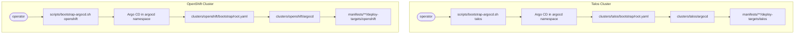

# Talos ArgoCD Proxmox Cluster

[](https://deepwiki.com/mitchross/talos-argocd-proxmox)

> Talos-first GitOps Kubernetes with optional per-cluster expansion targets.

This repo is a production homelab GitOps reference. Talos on Proxmox remains
the default path: one cluster, one local upstream Helm Argo CD, Cilium, Gateway
API, Longhorn, monitoring, apps, and PVC backup/restore.

The repo is also structured so additional clusters can be added without turning
Talos into a hub. OpenShift is the first optional expansion target. Each cluster
gets its own local Argo CD instance and manages only `https://kubernetes.default.svc`.
There is no hub/spoke registration and no `argocd cluster add`.

## Key Features

- **Talos by default** - a single-cluster user can bootstrap Talos and stop there.
- **One Argo CD per cluster** - Talos, OpenShift, and future GKE/AKS targets each run local upstream Helm Argo CD.
- **Kustomize deploy targets** - shared or portable workloads use `base/` plus `deploy-targets/<cluster>/`.
- **Metadata-driven AppSets** - Argo CD discovers deploy targets through `.argocd/config.json`, not fragile path basenames.
- **Sync wave ordering** - strict deployment order prevents controller, storage, secret, and app races.
- **Gateway API** - Talos uses Cilium Gateway API; OpenShift uses OpenShift-specific Gateway API manifests.
- **Zero-touch Talos backups** - add a label to a PVC and get automatic Kopia backups with disaster recovery.
- **GPU support on Talos** - NVIDIA GPU support via Talos system extensions and GPU Operator.

## Layout

```text
clusters/
  talos/
    bootstrap/       # hand-run upstream Helm Argo CD bootstrap inputs
    argocd/          # Talos root app-of-apps tree
  openshift/
    bootstrap/       # hand-run upstream Helm Argo CD bootstrap inputs
    argocd/          # OpenShift root app-of-apps tree

manifests/
  infra/             # controllers, networking, storage, platform services
  database/          # database operators and instances
  monitoring/        # Talos monitoring stack
  apps/              # user-facing applications

components/
  talos/
  openshift/
```

Talos remains the canonical full-fidelity target under `deploy-targets/talos`.
OpenShift app targets exist for the full catalog; only workloads that have been
cleanly made portable need a shared `base/`.

## Repositories & Resources

| Resource | Description |
|----------|-------------|
| [Omni](https://github.com/siderolabs/omni) | Talos cluster management platform |
| [Proxmox Infra Provider](https://github.com/siderolabs/omni-infra-provider-proxmox) | Proxmox infrastructure provider for Omni |
| [Starter Repo](https://github.com/mitchross/sidero-omni-talos-proxmox-starter) | Full config and automation for Sidero Omni + Talos + Proxmox |
| [Reference Guide](https://www.virtualizationhowto.com/2025/08/how-to-install-talos-omni-on-prem-for-effortless-kubernetes-management/) | VirtualizationHowTo guide for Talos Omni on-prem setup |

## Architecture


```mermaid
graph TD;
    subgraph "Talos Cluster"
        TalosUser(["operator"]) --> TalosBootstrap["scripts/bootstrap-argocd.sh talos"];
        TalosBootstrap --> TalosArgo["Argo CD in argocd namespace"];
        TalosArgo --> TalosRoot["clusters/talos/bootstrap/root.yaml"];
        TalosRoot --> TalosTree["clusters/talos/argocd"];
        TalosTree --> TalosTargets["manifests/**/deploy-targets/talos"];
    end

    subgraph "OpenShift Cluster"
        OsUser(["operator"]) --> OsBootstrap["scripts/bootstrap-argocd.sh openshift"];
        OsBootstrap --> OsArgo["Argo CD in argocd namespace"];
        OsArgo --> OsRoot["clusters/openshift/bootstrap/root.yaml"];
        OsRoot --> OsTree["clusters/openshift/argocd"];
        OsTree --> OsTargets["manifests/**/deploy-targets/openshift"];
    end
```

## Sync Waves

Talos:

| Wave | Component | Purpose |
|------|-----------|---------|
| **0** | Foundation | Cilium, Argo CD, 1Password Connect, External Secrets, AppProjects |
| **1** | Core controllers | cert-manager, Longhorn, VolumeSnapshot Controller, VolSync |
| **2** | Backup plumbing | pvc-plumber v4 core and VolSync backup cluster wiring |
| **3** | CNPG Barman Plugin | Database backup plugin before database clusters |
| **4** | Infrastructure + database | Infra AppSet, database AppSet, KEDA, Temporal Worker Controller |
| **5** | OTEL + monitoring | OpenTelemetry Operator, Prometheus, Grafana, Loki, Tempo |
| **6** | Overlays + apps | KEDA/OTEL ServiceMonitors and Talos app deploy targets |

OpenShift:

| Wave | Component | Purpose |
|------|-----------|---------|
| **0** | Foundation | Argo CD, 1Password Connect, External Secrets, AppProjects |
| **1** | Core controllers | cert-manager and OpenShift LVM storage |
| **4** | Infrastructure | OpenShift Gateway API deploy target |
| **6** | Apps | Full app catalog through OpenShift deploy targets |

## Prerequisites

Talos default path:

1. **Omni deployed and accessible** - see [Omni Setup Guide](omni/omni/README.md).
2. **Sidero Proxmox Provider configured** - see [proxmox provider config](omni/proxmox-provider/).
3. **Cluster created in Omni** - Talos cluster provisioned and healthy.
4. **Local tools installed** - `kubectl`, `kustomize`, Helm, Cilium CLI (`cilium` or `cilium-cli`), and `op`.

OpenShift optional path:

1. **OpenShift cluster access** - `kubectl` or `oc` points at the target OpenShift cluster.
2. **Gateway API available** - verify the GatewayClass name before live sync. This repo currently assumes `openshift-default`.
3. **OLM available** - required for the starter LVM Storage Operator Subscription.
4. **Local tools installed** - `kubectl`, `kustomize`, Helm, and `op`.

OpenShift storage policy:

- Use OpenShift local LVM storage for small PVCs.
- Use NFS for AI/shared/large-but-portable data after the OpenShift NFS implementation is chosen.
- All apps have OpenShift deploy targets for catalog-level testing, but large stateful apps still need explicit storage, SCC, and backup review before being considered production-ready.

See [OpenShift Storage And App Migration Strategy](docs/domains/multicluster/openshift-storage-and-app-migration.md).

## Talos Bootstrap

Once your Talos cluster is provisioned via Omni, follow these steps to install
the GitOps stack.

### Step 0: Get Cluster Access (kubectl)

You need `kubectl` access before anything else. The default OIDC kubeconfig expires and requires a browser — use the **Omni service account** for a stable bearer token instead.

> **Prerequisite**: You must have the `OMNI_SERVICE_ACCOUNT_KEY` stored in 1Password (item: `talos-prod-sa`). See [Cluster Access](#cluster-access-omni-service-account) for how to create a service account if you don't have one yet.

```bash
# Sign in to 1Password
eval $(op signin)

# Set Omni endpoint
export OMNI_ENDPOINT=https://omni.vanillax.me:443

# Pull the service account key from 1Password
export OMNI_SERVICE_ACCOUNT_KEY="$(op read 'op://homelab-prod/talos-prod-sa/OMNI_SERVICE_ACCOUNT_KEY')"

# Generate bearer-token kubeconfig (not OIDC)
omnictl kubeconfig --cluster talos-prod-cluster --service-account --user talos-prod-sa --force

# Verify access
kubectl get nodes
```

<details>
<summary>Fish shell</summary>

```fish
set -x OMNI_ENDPOINT https://omni.vanillax.me:443
set -x OMNI_SERVICE_ACCOUNT_KEY (op read 'op://homelab-prod/talos-prod-sa/OMNI_SERVICE_ACCOUNT_KEY')
omnictl kubeconfig --cluster talos-prod-cluster --service-account --user talos-prod-sa --force
kubectl get nodes
```

</details>

### Step 1: Install Cilium CNI

Omni provisions Talos clusters without a CNI. Install Cilium to get networking functional:

```bash
cilium-cli install \
    --version 1.19.4 \
    --set cluster.name=talos-prod-cluster \
    --set ipam.mode=kubernetes \
    --set kubeProxyReplacement=true \
    --set securityContext.capabilities.ciliumAgent="{CHOWN,KILL,NET_ADMIN,NET_RAW,IPC_LOCK,SYS_ADMIN,SYS_RESOURCE,DAC_OVERRIDE,FOWNER,SETGID,SETUID}" \
    --set securityContext.capabilities.cleanCiliumState="{NET_ADMIN,SYS_ADMIN,SYS_RESOURCE}" \
    --set cgroup.autoMount.enabled=false \
    --set cgroup.hostRoot=/sys/fs/cgroup \
    --set k8sServiceHost=localhost \
    --set k8sServicePort=7445 \
    --set hubble.enabled=false \
    --set hubble.relay.enabled=false \
    --set hubble.ui.enabled=false \
    --set gatewayAPI.enabled=true \
    --set gatewayAPI.enableAlpn=true \
    --set gatewayAPI.enableAppProtocol=true
```

  > **Important - version must match:** The `cilium install` CLI version must match the Helm chart version in `manifests/infra/cilium/deploy-targets/talos/kustomization.yaml` (currently **1.19.4**). Use `cilium install --version 1.19.4` to pin it. If versions differ, ArgoCD upgrades Cilium at Wave 0 and regenerates some Hubble certs but not others, causing TLS handshake failures (`x509: certificate signed by unknown authority`) that block all sync waves.
>
> **Important - Hubble is disabled at bootstrap on purpose:** The CLI install only provides basic CNI networking. ArgoCD enables Hubble at Wave 0 via the full `values.yaml` (which has `hubble.enabled: true`). This ensures ArgoCD is the sole owner of Hubble TLS certificates, with no cert mismatch between CLI install and ArgoCD's Helm render. The `ignoreDifferences` in `cilium-app.yaml` then preserves those certs on subsequent syncs.
>
> **Important - cluster name must match:** `cluster.name` must match `manifests/infra/cilium/deploy-targets/talos/values.yaml` for Hubble certificate SANs. If `cilium install` is run without `--set cluster.name=talos-prod-cluster`, certificates are generated for `default` or `kind-kind`, causing TLS failures.

### Step 2: Install Gateway API CRDs

```bash
kubectl apply -f https://github.com/kubernetes-sigs/gateway-api/releases/download/v1.4.1/standard-install.yaml
kubectl apply --server-side -f https://github.com/kubernetes-sigs/gateway-api/releases/download/v1.4.1/experimental-install.yaml
```

Verify Cilium:
```bash
cilium status
kubectl get pods -n kube-system -l k8s-app=cilium
```

On Arch/CachyOS, the package often installs the binary as `cilium-cli` rather than `cilium`. The bootstrap script accepts either name.

### Step 3: Pre-Seed 1Password Secrets

```bash
kubectl create namespace 1passwordconnect
kubectl create namespace external-secrets

eval $(op signin)

export OP_CREDENTIALS=$(op read op://homelab-prod/1passwordconnect/1password-credentials.json)
export OP_CONNECT_TOKEN=$(op read 'op://homelab-prod/1password-operator-token/credential')

kubectl create secret generic 1password-credentials \
  --namespace 1passwordconnect \
  --from-literal=1password-credentials.json="$OP_CREDENTIALS"

kubectl create secret generic 1password-operator-token \
  --namespace 1passwordconnect \
  --from-literal=token="$OP_CONNECT_TOKEN"

kubectl create secret generic 1passwordconnect \
  --namespace external-secrets \
  --from-literal=token="$OP_CONNECT_TOKEN"
```

### Step 4: Bootstrap ArgoCD

**Option A: Bootstrap Script (Recommended)**

```bash
./scripts/bootstrap-argocd.sh talos
```

**Option B: Manual Steps**

```bash
kubectl apply -f clusters/talos/bootstrap/ns.yaml

helm upgrade --install argocd argo-cd \
  --repo https://argoproj.github.io/argo-helm \
  --version 9.5.17 \
  --namespace argocd \
  --values clusters/talos/bootstrap/values.yaml \
  --wait \
  --timeout 10m

kubectl wait --for condition=established --timeout=60s crd/applications.argoproj.io
kubectl wait --for=condition=Available deployment/argocd-server -n argocd --timeout=300s

kubectl apply -f clusters/talos/bootstrap/root.yaml
```

### Step 5: Verify

```bash
# Check ArgoCD pods
kubectl get pods -n argocd

# Watch applications sync (all should reach 'Synced')
kubectl get applications -n argocd -w

# View sync wave order
kubectl get applications -n argocd -o custom-columns=NAME:.metadata.name,WAVE:.metadata.annotations.argocd\\.argoproj\\.io/sync-wave,STATUS:.status.sync.status
```

### Step 6: Access ArgoCD UI (Optional)

```bash
kubectl port-forward svc/argocd-server -n argocd 8080:443
# Open https://localhost:8080
# Admin password is pre-configured via bootstrap Helm values
```

## OpenShift Bootstrap

OpenShift uses the same model: hand-run upstream Helm Argo CD, then let that
cluster's local Argo CD manage only itself. It does not use the OpenShift GitOps
Operator.

### Step 0: Get Cluster Access

```bash
oc login <api-url>
kubectl get nodes
kubectl config current-context
```

### Step 1: Verify Platform Assumptions

```bash
kubectl get gatewayclass
kubectl api-resources | grep -E 'gateway.networking.k8s.io|operators.coreos.com|lvm.topolvm.io'
```

The starter OpenShift Gateway deploy target assumes GatewayClass
`openshift-default`; update `manifests/infra/gateway/deploy-targets/openshift/gateway.yaml`
if your cluster exposes a different class.

The starter LVM storage deploy target assumes the Red Hat `lvms-operator`
Subscription and `lvm.topolvm.io/v1alpha1` `LVMCluster` schema. Verify those
against the live cluster before syncing.

### Step 2: Pre-Seed 1Password Secrets

Use the same 1Password secret pre-seed commands from the Talos section against
the OpenShift kube context.

### Step 3: Bootstrap Argo CD

```bash
./scripts/bootstrap-argocd.sh openshift
```

Manual equivalent:

```bash
kubectl apply -f clusters/openshift/bootstrap/ns.yaml

helm upgrade --install argocd argo-cd \
  --repo https://argoproj.github.io/argo-helm \
  --version 9.5.17 \
  --namespace argocd \
  --values clusters/openshift/bootstrap/values.yaml \
  --wait \
  --timeout 10m

kubectl wait --for condition=established --timeout=60s crd/applications.argoproj.io
kubectl wait --for=condition=Available deployment/argocd-server -n argocd --timeout=300s

kubectl apply -f clusters/openshift/bootstrap/root.yaml
```

## What Happens After Bootstrap

Argo CD takes over and manages everything from Git. Talos syncs the full
homelab stack through one-shot-migrated Talos deploy targets. OpenShift syncs
the full app catalog through OpenShift deploy targets.

New deploy targets are discovered by `.argocd/config.json` files:

```text
manifests/apps/<category>/<app>/deploy-targets/<cluster>/.argocd/config.json
manifests/infra/<component>/deploy-targets/<cluster>/.argocd/config.json
```

The JSON points Argo CD at the deploy target path, so deep Kustomize overlays
do not depend on basename guessing.

## Local Validation

```bash
./scripts/validate-argocd-apps.sh
kustomize build --enable-helm clusters/talos/bootstrap >/tmp/talos-bootstrap.yaml
kustomize build --enable-helm clusters/openshift/bootstrap >/tmp/openshift-bootstrap.yaml
kustomize build clusters/talos/argocd >/tmp/talos-argocd.yaml
kustomize build clusters/openshift/argocd >/tmp/openshift-argocd.yaml
```

## Cluster Access (Omni Service Account)

The default `omnictl kubeconfig` uses OIDC exec auth which expires and requires a browser login. For long-lived access, create a **service account** with a bearer token instead.

**IMPORTANT: Use the CLI, not the Omni UI.** UI-generated PGP keys are incompatible with the CLI's gopenpgp library (`EdDSA verification failure`).

```bash
# 1. Create the service account (1 year max TTL)
omnictl serviceaccount create talos-prod-sa --use-user-role

# 2. Save the output — OMNI_ENDPOINT and OMNI_SERVICE_ACCOUNT_KEY
#    Store both values in 1Password immediately. The key is shown ONCE.

# 3. Generate a bearer-token kubeconfig (NOT OIDC)
OMNI_ENDPOINT=https://omni.vanillax.me:443 \
OMNI_SERVICE_ACCOUNT_KEY="<key-from-step-2>" \
omnictl kubeconfig --cluster talos-prod-cluster --service-account --user talos-prod-sa --force

# 4. Verify
kubectl get nodes
```

**Renewal** (expires after 1 year):
```bash
omnictl serviceaccount destroy talos-prod-sa
omnictl serviceaccount create talos-prod-sa --use-user-role
# Regenerate kubeconfig with step 3 above, update key in 1Password
```

**Gotchas**:
- Always create via **CLI** — UI-generated keys fail with `gopenpgp: EdDSA verification failure`
- The `--service-account` flag is what gives you a bearer token. Without it you get OIDC exec (the thing that expires)
- If the key fails with signature errors, write it to a file and use `$(cat /tmp/key.txt)` instead of inline quoting
- Node management is done through Omni web UI (upgrades, configuration, patches)

## Backup System

Normal application PVC backups use **VolSync + Kopia** with the RustFS/S3 repository, wired by the permissive **pvc-plumber v4.0.1** controller.

- **pvc-plumber owns wiring**: namespace software gate, PVC fuse labels, `ReplicationSource` and `ReplicationDestination` ownership, and `/audit`.
- **VolSync/Kopia move bytes**: pvc-plumber does not replace the data mover.
- **No admission gate**: v4 has no admission webhook and no Kyverno dependency.
- **No monitoring dependency**: pvc-plumber core bootstraps without Prometheus.
- **Exclusions**: CNPG uses native Barman/S3. Redis and PostHog are backup-exempt and disposable.
- **Details**: See [docs/volsync-storage-recovery.md](docs/volsync-storage-recovery.md) and [docs/domains/cnpg/disaster-recovery.md](docs/domains/cnpg/disaster-recovery.md).

## Cluster Upgrades & Talos 1.13 Notes

The cluster is running Talos **1.13** (migrated from 1.12 in April 2026).
A few things changed at 1.13 that you'll hit if you spin up or rebuild a
cluster — read this before touching the cluster template.

### `machine.install.disk` is now mandatory

Talos 1.13 replaced the old install/upgrade flow with the
**LifecycleService API**. Earlier versions could auto-detect a system
disk during `maintenanceUpgrade`; 1.13 requires an explicit
`machine.install.disk` in the machine config.

**Symptom if missing:** fresh VMs boot, but control planes stay stuck in
`stage=7 (UPGRADING)` with `configuptodate=false` forever. Resource
versions cycle into the hundreds. The LoadBalancer never goes healthy,
Kubernetes never bootstraps. **No error surfaces anywhere** — it silently
fails inside `maintenanceUpgrade`.

This repo ships the fix as a cluster-level config patch in
`omni/cluster-template/cluster-template.yaml`:

```yaml
- name: install-disk
  inline:
    machine:
      install:
        disk: /dev/sda   # Proxmox virtio-scsi-single + scsi0 presents as /dev/sda
```

All machine classes (CP / worker / GPU) use the same bus layout, so the
patch goes at cluster scope — not per-machineset. If you add a class
with a different disk presentation (e.g., NVMe passthrough →
`/dev/nvme0n1`), override it per-machineset instead.

### NVIDIA driver migration (in progress)

Talos 1.13 is the target point for migrating the GPU worker from the
proprietary NVIDIA kernel modules to the NVIDIA **open** kernel modules.
Talos continues to own the host driver and the container toolkit via
system extensions; the GPU Operator stays scoped to device plugin, GFD,
validator, and runtime-class management.

Plan: `docs/superpowers/plans/2026-04-19-talos-1.13-oss-nvidia-migration.md`

Key files touched by the migration:
- `omni/cluster-template/cluster-template.yaml` — swap extension from
  `nonfree-kmod-nvidia-production` to the OSS equivalent.
- `manifests/infra/nvidia-gpu-operator/deploy-targets/talos/kustomization.yaml` —
  align with Talos 1.13 beta OSS guide, especially
  `hostPaths.driverInstallDir`.
- `manifests/infra/nvidia-gpu-operator/deploy-targets/talos/cluster-policy.yaml` —
  keep dormant reference aligned with OSS assumptions.

Because there's only **one** GPU worker, this is a maintenance-window
migration with explicit rollback — not a canary. `llama-cpp` is offline
for the duration.

### Upgrading Omni / omnictl to the 1.13 toolchain

Omni 1.7 is required to provision/upgrade Talos 1.13 clusters. When
upgrading:

1. Take an Omni etcd snapshot (`omni/omni/README.md` → Backup/Recovery).
2. Upgrade the Omni container to 1.7.x, restart. Verify the UI loads
   and existing clusters still show healthy.
3. Upgrade `omnictl` on your workstation to match the server version —
   mismatched versions fail with obscure gRPC errors.
4. Regenerate the service-account kubeconfig if it's older than 30
   days (token rotation often lags server upgrades).

### CNPG clean-slate baseline (April 2026)

After the RustFS wipe in April 2026, every CNPG database was re-bootstrapped
from scratch via `initdb` (v1 of each overlay). Any database DR
runbook older than 2026-04-18 references the old WAL chain and will not
work. Current procedure is in
[docs/domains/cnpg/disaster-recovery.md](docs/domains/cnpg/disaster-recovery.md) — that
doc was rewritten against the new clean-slate pattern, so treat it as
authoritative over anything in `docs/research/storage/`.

## Hardware

```
Compute
├── AMD Threadripper 2950X (16c/32t)
├── 128GB ECC DDR4 RAM
├── 2x NVIDIA RTX 3090 24GB
└── Google Coral TPU

Storage
├── 4TB ZFS RAID-Z2
├── NVMe OS Drive
└── Longhorn distributed storage for K8s

Network
├── 2.5Gb Networking
├── Firewalla Gold
└── Internal DNS Resolution
```

## Troubleshooting

| Issue | Steps |
|-------|-------|
| **ArgoCD not syncing** | `kubectl get applicationsets -n argocd` / `kubectl describe applicationset infrastructure -n argocd` / Check for stale operations before reverting Git: `kubectl get application argocd -n argocd -o yaml` |
| **Cilium issues** | `cilium status` / `kubectl logs -n kube-system -l k8s-app=cilium` / `cilium connectivity test` |
| **Storage issues** | `kubectl get pvc -A` / `kubectl get pods -n longhorn-system` |
| **Secrets not syncing** | `kubectl get externalsecret -A` / `kubectl get pods -n 1passwordconnect` / `kubectl describe clustersecretstore 1password` |
| **GPU issues** | `kubectl get nodes -l feature.node.kubernetes.io/pci-0300_10de.present=true` / `kubectl get pods -n gpu-operator` |
| **Backup issues** | `kubectl get replicationsource -A` / `kubectl get pods -n volsync-system -l app.kubernetes.io/name=pvc-plumber` |

### Emergency Reset

```bash
# Remove finalizers and delete all applications
kubectl get applications -n argocd -o name | xargs -I{} kubectl patch {} -n argocd --type json -p '[{"op": "remove","path": "/metadata/finalizers"}]'
kubectl delete applications --all -n argocd
./scripts/bootstrap-argocd.sh
```

## Documentation

- **[CLAUDE.md](CLAUDE.md)** - Full development guide and patterns for this repository
- **[docs/volsync-storage-recovery.md](docs/volsync-storage-recovery.md)** - current application PVC backup/restore workflow
- **[docs/domains/argocd/argocd.md](docs/domains/argocd/argocd.md)** - ArgoCD GitOps patterns
- **[docs/domains/argocd/entrypoints.md](docs/domains/argocd/entrypoints.md)** - Root entrypoints, waves, and AppSet/custom-entrypoint decisions
- **[docs/domains/networking/topology.md](docs/domains/networking/topology.md)** - Network architecture
- **[docs/domains/networking/policy.md](docs/domains/networking/policy.md)** - Cilium network policies
- **[omni/](omni/)** - Omni deployment configs, machine classes, and cluster templates
  - **[omni/omni/README.md](omni/omni/README.md)** - Omni instance setup guide
  - **[omni/docs/](omni/docs/)** - Architecture, operations, prerequisites, troubleshooting

## Contributing

1. Fork the repository
2. Create a feature branch
3. Submit a pull request

## License

MIT License
