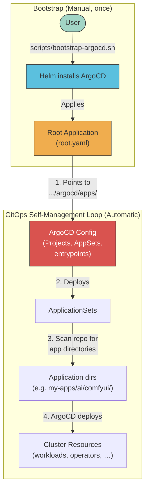

# Talos ArgoCD Proxmox Cluster

[](https://deepwiki.com/mitchross/talos-argocd-proxmox)

> Production-grade GitOps Kubernetes cluster on Talos OS with self-managing ArgoCD, Cilium, and zero-touch PVC backup/restore.

A GitOps-driven Kubernetes cluster on **Talos OS** (secure, immutable Linux for K8s) with **ArgoCD** and **Cilium**, running on Proxmox. Nodes are provisioned and managed through **[Omni](https://github.com/siderolabs/omni)** (Sidero's Talos platform) with the **[Proxmox Infrastructure Provider](https://github.com/siderolabs/omni-infra-provider-proxmox)** — no SSH, no manual node config.

The whole cluster boots from one script. Once Omni hands you a running Talos cluster, bootstrap is **four copy-paste steps** (Gateway CRDs → Cilium → secrets → ArgoCD), and ArgoCD takes over and deploys everything else from this repo.

## Key Features

- **Self-Managing ArgoCD** — ArgoCD manages its own install, upgrades, and ApplicationSets from Git
- **Directory = Application** — apps are discovered by directory path; no hand-written `Application` manifests
- **Sync Wave Ordering** — strict deployment order prevents race conditions
- **Zero-Touch Backups** — label a namespace + drop a per-PVC stub, get automatic [kopiur](https://github.com/home-operations/kopiur) (Kopia-native) backups to RustFS/S3 with restore-before-bind DR
- **Gateway API** — modern ingress via Cilium Gateway API (not legacy Ingress)
- **GPU Support** — full NVIDIA GPU support via Talos system extensions + GPU Operator
- **Zero SSH** — all node management via Omni UI or the Talos API

## Repositories & Resources

| Resource | Description |
|----------|-------------|
| [Omni](https://github.com/siderolabs/omni) | Talos cluster management platform |
| [Proxmox Infra Provider](https://github.com/siderolabs/omni-infra-provider-proxmox) | Proxmox infrastructure provider for Omni |
| [Starter Repo](https://github.com/mitchross/sidero-omni-talos-proxmox-starter) | Full config & automation for Sidero Omni + Talos + Proxmox |
| [Reference Guide](https://www.virtualizationhowto.com/2025/08/how-to-install-talos-omni-on-prem-for-effortless-kubernetes-management/) | VirtualizationHowTo guide for Talos Omni on-prem setup |

## How It Works


```mermaid
graph TD;
    subgraph "Bootstrap (Manual, once)"
        User(["User"]) -- "scripts/bootstrap-argocd.sh" --> Helm["Helm installs ArgoCD"];
        Helm -- "Applies" --> RootApp["Root Application<br/>(root.yaml)"];
    end

    subgraph "GitOps Self-Management Loop (Automatic)"
        RootApp -- "1. Points to<br/>.../argocd/apps/" --> ArgoConfigDir["ArgoCD Config<br/>(Projects, AppSets,<br/>entrypoints)"];
        ArgoConfigDir -- "2. Deploys" --> AppSets["ApplicationSets"];
        AppSets -- "3. Scan repo for<br/>app directories" --> AppManifests["Application dirs<br/>(e.g. my-apps/ai/comfyui/)"];
        AppManifests -- "4. ArgoCD deploys" --> ClusterResources["Cluster Resources<br/>(workloads, operators, …)"];
    end

    style User fill:#a2d5c6,stroke:#333
    style Helm fill:#5bc0de,stroke:#333
    style RootApp fill:#f0ad4e,stroke:#333
    style ArgoConfigDir fill:#d9534f,stroke:#333,color:#fff
```

**The core idea: a directory *is* an application.** Add a directory with a `kustomization.yaml` under `my-apps/`, `infrastructure/`, or `monitoring/`, push to Git, and an ApplicationSet discovers it and creates the ArgoCD `Application` automatically. No manual `Application` resources.

```
my-apps/ai/comfyui/              → ArgoCD Application "comfyui"
infrastructure/storage/longhorn/ → ArgoCD Application "longhorn"
monitoring/prometheus-stack/     → ArgoCD Application "prometheus-stack"
```

### Sync Wave Architecture

ArgoCD deploys in strict order so dependencies land before the things that need them:

| Wave | Component | Purpose |
|------|-----------|---------|
| **0** | Foundation | Cilium (CNI), ArgoCD, 1Password Connect, External Secrets, AppProjects |
| **1** | Core controllers | cert-manager, Longhorn, VolumeSnapshot Controller |
| **2** | kopiur operator | Kopia-native backup operator (CRDs + controller + webhook); serves the volume populator for restore-before-bind |
| **3** | CNPG Barman Plugin + kopiur config | DB backup plugin before DB clusters; kopiur `ClusterRepository` + credential fanout + `VolumeSnapshotClass` |
| **4** | Infrastructure AppSet + custom entrypoints + Database AppSet | cert-manager extras, GPU Operators, Gateway, KEDA, VPA, Temporal Worker Controller; CNPG instances (`selfHeal: false` for DR) |
| **5** | OTEL Operator + Monitoring AppSet | OpenTelemetry Operator, Prometheus, Grafana, Loki |
| **6** | Observability overlays + My-Apps AppSet | KEDA/OTEL ServiceMonitors (after monitoring CRDs exist) and `my-apps/*/*` user apps |

> The backup stack is **kopiur** (since 2026-06-27). The retired pvc-plumber + VolSync stack is gone — if you see those names in old docs or git history, ignore them. See [Backup System](#backup-system).

## Prerequisites

1. **Omni + the Proxmox provider are running** and reachable — see [Omni Setup Guide](omni/omni/README.md) and [proxmox-provider/](omni/proxmox-provider/)
2. **An Omni service-account key** stored in 1Password (item `talos-prod-sa`) — see [Cluster Access](#cluster-access-omni-service-account) to create one
3. **Local tools**: `omnictl`, `talosctl`, `kubectl`, `kustomize`, Cilium CLI (`cilium` or `cilium-cli`), 1Password CLI (`op`), and `helm`

### Version pins (as of 2026-06-28)

| Component | Version | Source of truth |
|-----------|---------|-----------------|
| Omni server + `omnictl` | `v1.9.0` | `omni/omni/omni.env.example` |
| Talos Linux | `v1.13.4` | `omni/cluster-template/cluster-template-singlenode-gpu.yaml` |
| Kubernetes | `v1.36.2` | `omni/cluster-template/cluster-template-singlenode-gpu.yaml` |
| Cilium | `1.19.5` | `infrastructure/networking/cilium/kustomization.yaml` |
| Gateway API CRDs | `v1.4.1` | bootstrap commands below |
| ArgoCD Helm chart | `10.0.0` | `scripts/bootstrap-argocd.sh` |
| Proxmox provider | `latest@sha256:96433a…` | `omni/proxmox-provider/docker-compose.yml` |

Keep the Omni server and local `omnictl` on the **same** release — mismatched versions fail with obscure gRPC errors.

> **Gateway API `v1.4.1` is an intentional pin.** `v1.5.x` moved `TLSRoute` to `v1`, but Cilium 1.19 still expects `v1alpha2`. Cilium 1.20 is the first minor with Gateway API 1.5.1 support — don't bump the CRDs ahead of Cilium.

---

## Bootstrap

> **Two clusters live here.** Everything below uses the **single-node GPU** cluster. For the multi-node prod cluster, swap the names/files:
>
> | | Single-node GPU | Multi-node prod |
> |---|---|---|
> | Cluster | `talos-singlenode-gpu-prod` | `talos-prod-cluster` |
> | Machine class | `omni/machine-classes/single-node-control-plane.yaml` + `single-node-talos-gpu.yaml` | `omni/machine-classes/` |
> | Template | `omni/cluster-template/cluster-template-singlenode-gpu.yaml` | `omni/cluster-template/cluster-template.yaml` |
> | Topology | 2 VMs (1 CP + 1 GPU worker) | 3 CP + 3 workers + 1 GPU |

The full path from nothing to a running GitOps cluster, in order. Steps 1–3 are the Omni side (provision a Talos cluster); steps 4–7 are the bootstrap (install the GitOps stack). If Omni already gave you a running cluster with `kubectl` access, skip to step 4.

<details>
<summary><b>The whole sequence, copy-paste</b> — the annotated steps below explain each block and the gotchas</summary>

```bash
# 1. Destroy the old cluster (only when rebuilding)
omnictl cluster delete talos-singlenode-gpu-prod --destroy-disconnected-machines

# 2. Apply machine classes, then sync the cluster template to provision
omnictl apply -f omni/machine-classes/single-node-control-plane.yaml
omnictl apply -f omni/machine-classes/single-node-talos-gpu.yaml
omnictl get machineclasses
omnictl cluster template sync -v -f omni/cluster-template/cluster-template-singlenode-gpu.yaml

# 3. Authenticate to Omni and get kube/talos access
eval "$(op signin)"
export OMNI_ENDPOINT=https://omni.vanillax.me:443
export OMNI_SERVICE_ACCOUNT_KEY="$(op read 'op://homelab-prod/talos-prod-sa/OMNI_SERVICE_ACCOUNT_KEY')"
omnictl kubeconfig  --cluster talos-singlenode-gpu-prod --service-account --user talos-prod-sa --force
omnictl talosconfig --cluster talos-singlenode-gpu-prod --force
kubectl get nodes -o wide   # NotReady until Cilium is installed

# 4. Gateway API CRDs
kubectl apply -f https://github.com/kubernetes-sigs/gateway-api/releases/download/v1.4.1/standard-install.yaml
kubectl apply --server-side -f https://github.com/kubernetes-sigs/gateway-api/releases/download/v1.4.1/experimental-install.yaml

# 5. Cilium CNI (see step 5 below for the full flag list)
cilium-cli install --version 1.19.5 --set cluster.name=talos-singlenode-gpu-prod ...

# 6. Pre-seed 1Password secrets
kubectl create namespace 1passwordconnect
kubectl create namespace external-secrets
export OP_CREDENTIALS=$(op read op://homelab-prod/1passwordconnect/1password-credentials.json)
export OP_CONNECT_TOKEN=$(op read 'op://homelab-prod/1password-operator-token/credential')
kubectl create secret generic 1password-credentials  --namespace 1passwordconnect --from-literal=1password-credentials.json="$OP_CREDENTIALS"
kubectl create secret generic 1password-operator-token --namespace 1passwordconnect --from-literal=token="$OP_CONNECT_TOKEN"
kubectl create secret generic 1passwordconnect        --namespace external-secrets --from-literal=token="$OP_CONNECT_TOKEN"

# 7. Hand off to GitOps
./scripts/bootstrap-argocd.sh
```

</details>

### 1. Apply the machine classes

Machine classes and the cluster template are **snapshots stored inside Omni** — VMs are built from whatever Omni had at provision time, not live from this repo. Always apply the class and sync the template **before** machines provision.

```bash
omnictl apply -f omni/machine-classes/single-node-control-plane.yaml
omnictl apply -f omni/machine-classes/single-node-talos-gpu.yaml
omnictl get machineclasses
```

> **Sync THIS template** before provisioning — not a `cluster-template-working.yaml` variant. (2026-06-11 incident: provisioning against a stale snapshot produced workers with the wrong disk layout, a mid-bootstrap Talos rolling upgrade, and a forced reprovision.)

### 2. Provision (or destroy) the cluster

Template sync owns the MachineSets — don't create them separately.

```bash
# Optional preview:
omnictl cluster template validate -f omni/cluster-template/cluster-template-singlenode-gpu.yaml
omnictl cluster template sync -v -f omni/cluster-template/cluster-template-singlenode-gpu.yaml --dry-run

# Provision / update (idempotent):
omnictl cluster template sync -v -f omni/cluster-template/cluster-template-singlenode-gpu.yaml

# Watch until healthy:
omnictl cluster template status -f omni/cluster-template/cluster-template-singlenode-gpu.yaml --wait 30m
omnictl get machines
```

Full teardown (for a clean rebuild):

```bash
omnictl cluster delete talos-singlenode-gpu-prod --destroy-disconnected-machines
omnictl get machines        # must drain to empty; the VMs disappear from the Proxmox UI
```

### 3. Authenticate and get cluster access

```bash
eval "$(op signin)"

export OMNI_ENDPOINT=https://omni.vanillax.me:443
export OMNI_SERVICE_ACCOUNT_KEY="$(op read 'op://homelab-prod/talos-prod-sa/OMNI_SERVICE_ACCOUNT_KEY')"

omnictl kubeconfig  --cluster talos-singlenode-gpu-prod --service-account --user talos-prod-sa --force
omnictl talosconfig --cluster talos-singlenode-gpu-prod --force

kubectl get nodes -o wide   # nodes show NotReady until Cilium is installed (step 5) — that's expected
```

> **`OMNI_ENDPOINT` is mandatory whenever `OMNI_SERVICE_ACCOUNT_KEY` is set.** With the key exported, omnictl ignores config-file contexts entirely; forgetting the endpoint fails with the cryptic `delegating_resolver: invalid target address "": missing address`.

> **Run `talosconfig` once per cluster.** `omnictl talosconfig` merges into `~/.talos/config` (`--merge` defaults to **true**), and talos renames a *colliding* context with a `-1`/`-2`/… suffix instead of replacing it — `--force` does **not** prevent this. You only need it once (or after a nuke/recreate, when the CA rotates). To refresh idempotently, drop the old context first:
>
> ```bash
> talosctl config remove omni-prod-talos-singlenode-gpu-prod -y   # ignore "not found"
> omnictl talosconfig --cluster talos-singlenode-gpu-prod
> ```
>
> First time on a fresh Omni? Create the service account first — see [Cluster Access](#cluster-access-omni-service-account).

### 4. Install Gateway API CRDs

Install both channels before enabling Cilium Gateway API support — Cilium 1.19 still watches the experimental `TLSRoute` API.

```bash
kubectl apply -f https://github.com/kubernetes-sigs/gateway-api/releases/download/v1.4.1/standard-install.yaml
kubectl apply --server-side -f https://github.com/kubernetes-sigs/gateway-api/releases/download/v1.4.1/experimental-install.yaml
```

### 5. Install Cilium (CNI)

Omni provisions Talos without a CNI. Install Cilium to get networking up:

```bash
cilium-cli install \
    --version 1.19.5 \
    --set cluster.name=talos-singlenode-gpu-prod \
    --set ipam.mode=kubernetes \
    --set kubeProxyReplacement=true \
    --set securityContext.capabilities.ciliumAgent="{CHOWN,KILL,NET_ADMIN,NET_RAW,IPC_LOCK,SYS_ADMIN,SYS_RESOURCE,DAC_OVERRIDE,FOWNER,SETGID,SETUID}" \
    --set securityContext.capabilities.cleanCiliumState="{NET_ADMIN,SYS_ADMIN,SYS_RESOURCE}" \
    --set cgroup.autoMount.enabled=false \
    --set cgroup.hostRoot=/sys/fs/cgroup \
    --set k8sServiceHost=localhost \
    --set k8sServicePort=7445 \
    --set hubble.enabled=false \
    --set hubble.relay.enabled=false \
    --set hubble.ui.enabled=false \
    --set gatewayAPI.enabled=true \
    --set gatewayAPI.enableAlpn=true \
    --set gatewayAPI.enableAppProtocol=true
```

Verify, then the nodes flip to `Ready`:

```bash
cilium-cli status
kubectl get nodes
```

> Three settings here **must match** the values ArgoCD will render at Wave 0 (`infrastructure/networking/cilium/`), or Wave 0 fights the CLI install:
> - **`--version 1.19.5`** must match `infrastructure/networking/cilium/kustomization.yaml`. A mismatch makes ArgoCD upgrade Cilium at Wave 0, regenerating some Hubble certs but not others → `x509: certificate signed by unknown authority` blocks every later wave.
> - **`cluster.name`** must match `values.yaml` (Hubble cert SANs). Run without it and certs are issued for `default`/`kind-kind` → TLS failures.
> - **Hubble stays disabled at bootstrap on purpose** — ArgoCD enables it at Wave 0 so it's the sole owner of the Hubble TLS certs (no CLI-vs-ArgoCD cert mismatch).
>
> On Arch/CachyOS the binary is often `cilium-cli`, not `cilium`. The bootstrap script accepts either.

### 6. Pre-seed 1Password secrets

These secrets bootstrap 1Password Connect + External Secrets, which then sync every other secret from the vault.

```bash
kubectl create namespace 1passwordconnect
kubectl create namespace external-secrets

export OP_CREDENTIALS=$(op read op://homelab-prod/1passwordconnect/1password-credentials.json)
export OP_CONNECT_TOKEN=$(op read 'op://homelab-prod/1password-operator-token/credential')

kubectl create secret generic 1password-credentials \
  --namespace 1passwordconnect \
  --from-literal=1password-credentials.json="$OP_CREDENTIALS"

kubectl create secret generic 1password-operator-token \
  --namespace 1passwordconnect \
  --from-literal=token="$OP_CONNECT_TOKEN"

kubectl create secret generic 1passwordconnect \
  --namespace external-secrets \
  --from-literal=token="$OP_CONNECT_TOKEN"
```

### 7. Bootstrap ArgoCD

```bash
./scripts/bootstrap-argocd.sh
```

The script pre-flights Cilium, installs ArgoCD via Helm, seeds the `argocd-redis` auth secret (so a fresh cluster doesn't wedge), and applies `root.yaml` to hand control to GitOps self-management.

<details>
<summary>Manual equivalent (Option B)</summary>

```bash
kubectl apply -f infrastructure/controllers/argocd/ns.yaml

helm upgrade --install argocd argo-cd \
  --repo https://argoproj.github.io/argo-helm \
  --version 10.0.0 \
  --namespace argocd \
  --values infrastructure/controllers/argocd/values.yaml \
  --wait --timeout 10m

kubectl wait --for condition=established --timeout=60s crd/applications.argoproj.io
kubectl wait --for=condition=Available deployment/argocd-server -n argocd --timeout=300s

kubectl apply -f infrastructure/controllers/argocd/root.yaml
```

</details>

### 8. Verify

```bash
# Watch applications sync (all should reach 'Synced')
kubectl get applications -n argocd -w

# View sync-wave order
kubectl get applications -n argocd \
  -o custom-columns=NAME:.metadata.name,WAVE:.metadata.annotations.argocd\\.argoproj\\.io/sync-wave,STATUS:.status.sync.status

# (Optional) ArgoCD UI — admin password is pre-configured via the bootstrap Helm values
kubectl port-forward svc/argocd-server -n argocd 8080:443
# open https://localhost:8080
```

## What Happens After Bootstrap

ArgoCD takes over and deploys everything from Git in the order shown in the [Sync Wave Architecture](#sync-wave-architecture) table — Wave 0 (Cilium, secrets) through Wave 6 (user apps). There are **zero manual storage steps**: Longhorn auto-creates its filesystem disk at `/var/lib/longhorn` on every storage node, the kopiur operator comes up at Wave 2, and any restore-before-bind PVCs populate unattended.

From here, new applications are discovered automatically — add a directory with a `kustomization.yaml` and push to Git.

> **Multi-node prod only** — confirm storage nodes were born with the expected layout (catches a stale-Omni-config failure at provision time instead of at Longhorn bootstrap):
>
> ```bash
> kubectl get nodes -o custom-columns='NAME:.metadata.name,OS:.status.nodeInfo.osImage'  # expect every node Talos (v1.13.4)
> talosctl -n <worker-ip> get disks               # expect a single ~800G sda (sda+sdb = STALE 2-disk layout)
> kubectl get nodes.longhorn.io -n longhorn-system # expect 4 Ready storage nodes after Longhorn starts
> ```

### Mass-restore stability notes

- **Replica rebuilds are throttled to 1/node in Git** (`infrastructure/storage/longhorn/node-failure-settings.yaml`). Full-cluster restores overload any engine on this hardware — don't raise the limit mid-bootstrap.
- A mover pod stuck >15 min on `MountVolume … hasn't been attached yet` with an old VolumeAttachment = stale CSI state — delete the mover pod (its Job recreates it, forcing a fresh attach).
- Pods crashlooping on `read-only file system` after a storage disruption: the volume must FULLY detach (or the pod must land on another node) to drop the stale ro mount — scale to 0, wait for the Longhorn volume to show `detached`, scale back (CNPG: `cnpg.io/hibernation=on` → wait → `off`).
- History: the Longhorn V2/SPDK engine was tried and retired here (2026-06-12, open Longhorn bugs #13315/#13314). Do not re-enable V2 without a fixed release and a passed DR drill — short version in [docs/disaster-recovery.md](docs/disaster-recovery.md).

## Cluster Access (Omni Service Account)

The default `omnictl kubeconfig` uses OIDC exec auth, which expires and needs a browser login. For long-lived access, create a **service account** with a bearer token.

> **Use the CLI, not the Omni UI.** UI-generated PGP keys are incompatible with the CLI's gopenpgp library (`EdDSA verification failure`).

```bash
# 1. Create the service account (1 year max TTL)
omnictl serviceaccount create talos-prod-sa --use-user-role

# 2. Save BOTH OMNI_ENDPOINT and OMNI_SERVICE_ACCOUNT_KEY into 1Password immediately — the key is shown ONCE.

# 3. Generate a bearer-token kubeconfig (NOT OIDC)
OMNI_ENDPOINT=https://omni.vanillax.me:443 \
OMNI_SERVICE_ACCOUNT_KEY="<key-from-step-2>" \
omnictl kubeconfig --cluster talos-singlenode-gpu-prod --service-account --user talos-prod-sa --force

# 4. Verify
kubectl get nodes
```

**Renewal** (expires after 1 year):

```bash
omnictl serviceaccount destroy talos-prod-sa
omnictl serviceaccount create talos-prod-sa --use-user-role
# Regenerate the kubeconfig with step 3 above, then update the key in 1Password.
```

**Gotchas**
- Create via **CLI** — UI keys fail with `gopenpgp: EdDSA verification failure`.
- `--service-account` is what gives you a bearer token; without it you get OIDC exec (the thing that expires).
- If the key fails with signature errors, write it to a file and use `$(cat /tmp/key.txt)` instead of inline quoting.
- Node management (upgrades, config, patches) is done through the Omni web UI.

## Backup System

Normal application PVC backups use **[kopiur](https://github.com/home-operations/kopiur)** — a Kopia-native Kubernetes operator — to the RustFS/S3 repository. It replaced the retired pvc-plumber + VolSync stack on 2026-06-27.

- **How a PVC opts in**: label the namespace `kopiur.home-operations.com/repo: cluster-kopia`, add a per-PVC stub (`SnapshotPolicy` + `SnapshotSchedule` + `Restore`) via the shared `my-apps/common/kopiur-backup` Kustomize component, and point the PVC's `dataSourceRef` at `<pvc>-restore`. See [`.claude/commands/add-backup.md`](.claude/commands/add-backup.md).
- **Restore-before-bind DR**: a restore against an **unreachable** repo leaves the PVC `Pending` (never binds an empty volume); a brand-new PVC against a **reachable** repo with no snapshot binds empty and backs up forward (`onMissingSnapshot: Continue` = deploy-or-restore).
- **Mover permissions**: the mover runs as the **data owner's uid:gid**, not root — under baseline Pod Security, root can't read non-root data. See [docs/domains/storage/kopiur-mover-permissions.md](docs/domains/storage/kopiur-mover-permissions.md).
- **Exclusions**: CNPG uses native Barman → S3 (not kopiur). Redis and PostHog are backup-exempt and disposable.
- **Read first**: [docs/domains/storage/kopiur-backup-architecture.md](docs/domains/storage/kopiur-backup-architecture.md), then [docs/disaster-recovery.md](docs/disaster-recovery.md) and [docs/domains/cnpg/disaster-recovery.md](docs/domains/cnpg/disaster-recovery.md).

## Cluster Upgrades & Talos 1.13 Notes

The cluster runs Talos **1.13.4** (migrated from 1.12 in April 2026). A few things changed at 1.13 that you'll hit when you spin up or rebuild — read this before touching the cluster template.

### Don't rebuild on Talos 1.13.2

1.13.3 fixed containerd mount propagation and concurrent config-apply; 1.13.4 added a kube-scheduler integer-marshalling fix. This template sets scheduler integer args and must stay on 1.13.4 (or a newer validated 1.13 patch).

**Observed 1.13.2 failure:** freshly provisioned nodes repeatedly failed to create pod sandboxes (`lstat /proc/.../ns/ipc: no such file or directory`, `can't find shim for sandbox`, `ttrpc: closed`). Rebooting and reinstalling Cilium didn't help; moving them to 1.13.4 restored containerd, control-plane pods, and Cilium. For a stuck rollout, reprovision one machine at a time (preserves etcd quorum for control planes):

```bash
omnictl cluster machine delete <machine-id> --timeout 15m   # wait for Ready before the next
```

### `machine.install.disk` is now mandatory

Talos 1.13 replaced the old install/upgrade flow with the **LifecycleService API**. Earlier versions auto-detected a system disk during `maintenanceUpgrade`; 1.13 requires an explicit `machine.install.disk`.

**Symptom if missing:** fresh VMs boot, but control planes stick in `stage=7 (UPGRADING)` with `configuptodate=false` forever, the LoadBalancer never goes healthy, and Kubernetes never bootstraps — **with no error surfaced anywhere**. The repo ships the fix as a cluster-level patch in both cluster templates:

```yaml
- name: install-disk
  inline:
    machine:
      install:
        disk: /dev/sda   # Proxmox virtio-scsi-single + scsi0 presents as /dev/sda
```

All machine classes (CP / worker / GPU) share the bus layout, so the patch goes at cluster scope. A class with a different disk presentation (e.g. NVMe passthrough → `/dev/nvme0n1`) needs a per-machineset override.

### Upgrading Omni / omnictl

Run Omni and `omnictl` **on the same release** (currently `v1.9.0`, pinned in `omni/omni/omni.env.example`). When upgrading:

1. Take an Omni etcd snapshot (`omni/omni/README.md` → Backup/Recovery).
2. Upgrade the Omni container, restart, and confirm the UI loads and existing clusters stay healthy.
3. Upgrade `omnictl` on your workstation to match — mismatched versions fail with obscure gRPC errors.
4. Regenerate the service-account kubeconfig if it's older than ~30 days (token rotation lags server upgrades).

### CNPG clean-slate baseline (April 2026)

After the RustFS wipe in April 2026, every CNPG database was re-bootstrapped from scratch via `initdb`. Any DR runbook older than 2026-04-18 references the old WAL chain and won't work — use [docs/domains/cnpg/disaster-recovery.md](docs/domains/cnpg/disaster-recovery.md), which is authoritative.

## Hardware

```
Compute
├── AMD Threadripper 2950X (16c/32t)
├── 128GB ECC DDR4 RAM
├── 2x NVIDIA RTX 3090 24GB
└── Google Coral TPU

Storage
├── 4TB ZFS RAID-Z2
├── NVMe OS Drive
└── Longhorn distributed storage for K8s

Network
├── 2.5Gb Networking
├── Firewalla Gold
└── Internal DNS Resolution
```

## Troubleshooting

| Issue | Steps |
|-------|-------|
| **ArgoCD not syncing** | `kubectl get applicationsets -n argocd` · `kubectl describe applicationset infrastructure -n argocd` · check for stale operations before reverting Git: `kubectl get application argocd -n argocd -o yaml` |
| **Cilium issues** | `cilium status` · `kubectl logs -n kube-system -l k8s-app=cilium` · `cilium connectivity test` |
| **Storage issues** | `kubectl get pvc -A` · `kubectl get pods -n longhorn-system` |
| **Secrets not syncing** | `kubectl get externalsecret -A` · `kubectl get pods -n 1passwordconnect` · `kubectl describe clustersecretstore 1password` |
| **GPU issues** | `kubectl get nodes -l feature.node.kubernetes.io/pci-0300_10de.present=true` · `kubectl get pods -n gpu-operator` |
| **Backup issues** | `kubectl -n <ns> get snapshotpolicy,snapshotschedule,restore,snapshot` (Snapshot should reach `Completed` with non-zero files) · `kubectl -n <ns> get secret kopiur-rustfs` · `kubectl get pods -n kopiur-system` |

### Emergency reset

```bash
# Remove finalizers and delete all applications, then re-bootstrap
kubectl get applications -n argocd -o name \
  | xargs -I{} kubectl patch {} -n argocd --type json -p '[{"op":"remove","path":"/metadata/finalizers"}]'
kubectl delete applications --all -n argocd
./scripts/bootstrap-argocd.sh
```

## Documentation

- **[CLAUDE.md](CLAUDE.md)** — full development guide and patterns for this repo
- **[docs/index.md](docs/index.md)** — documentation landing page + doc map
- **[docs/easy-guide.md](docs/easy-guide.md)** — the whole system explained from zero (GitOps → sync waves → components → kopiur → DR) — the doc to share
- **[docs/domains/storage/kopiur-backup-architecture.md](docs/domains/storage/kopiur-backup-architecture.md)** — kopiur backup/restore architecture (start here for backups)
- **[docs/disaster-recovery.md](docs/disaster-recovery.md)** — full-cluster destroy/rebuild runbook
- **[docs/domains/argocd/argocd.md](docs/domains/argocd/argocd.md)** · **[entrypoints.md](docs/domains/argocd/entrypoints.md)** — ArgoCD patterns, root entrypoints, and waves
- **[docs/domains/networking/topology.md](docs/domains/networking/topology.md)** · **[policy.md](docs/domains/networking/policy.md)** — network architecture and Cilium policies
- **[omni/](omni/)** — Omni deployment configs, machine classes, and cluster templates ([Omni setup](omni/omni/README.md))

## Contributing

1. Fork the repository
2. Create a feature branch
3. Submit a pull request

## License

MIT License
