# 🚀 Talos ArgoCD Proxmox Cluster

> Modern GitOps deployment structure using Talos OS, ArgoCD, and Cilium, with Proxmox virtualization

A GitOps-driven Kubernetes cluster using **Talos OS** (secure, immutable Linux for K8s), ArgoCD, and Cilium, with integrated Cloudflare Tunnel for secure external access. Built for both home lab and production environments using **enterprise-grade GitOps patterns**.

## 🎯 Choose Your Bootstrap Method

This repository supports two bootstrap approaches:

| Method | Best For | Guide |
|--------|----------|-------|
| **🚀 Omni + Sidero Proxmox** | Recommended for new deployments. Web UI cluster management, automated provisioning, simplified operations. | **[BOOTSTRAP.md](BOOTSTRAP.md)** ⭐ |
| **⚙️ Manual Talos** | Advanced users who want full control over Talos configuration with `talhelper` and `talosctl`. | See [Quick Start](#-quick-start) below |

> **Using Omni?** Skip the manual setup below and jump to **[BOOTSTRAP.md](BOOTSTRAP.md)** for the streamlined workflow.

## 📦 Repositories & Resources

| Resource | Description |
|----------|-------------|
| [Omni](https://github.com/siderolabs/omni) | SaaS-simple deployment of Kubernetes on your own hardware |
| [Proxmox Infra Provider](https://github.com/siderolabs/omni-infra-provider-proxmox) | Proxmox infrastructure provider for Omni |
| [Starter Repo](https://github.com/mitchross/sidero-omni-talos-proxmox-starter) | Full config & automation for Sidero Omni + Talos + Proxmox |
| [Reference Guide](https://www.virtualizationhowto.com/2025/08/how-to-install-talos-omni-on-prem-for-effortless-kubernetes-management/) | VirtualizationHowTo guide for Talos Omni on-prem setup |

## 📋 Table of Contents

- [Repositories & Resources](#-repositories--resources)
- [Prerequisites](#-prerequisites)
- [Architecture](#-architecture)
- [Quick Start](#-quick-start) (Manual Talos Method)
  - [1. System Dependencies](#1-system-dependencies)
  - [2. Generate Talos Configs](#2-generate-talos-configs)
  - [3. Boot & Bootstrap Talos Nodes](#3-boot--bootstrap-talos-nodes)
  - [4. Install Gateway API CRDs](#4-install-gateway-api-crds)
  - [5. Configure Secret Management](#5-configure-secret-management)
  - [6. Bootstrap ArgoCD & Deploy The Stack](#6-bootstrap-argocd--deploy-the-stack)
- [Verification](#-verification)
- [Talos-Specific Notes](#️-talos-specific-notes)
- [MinIO S3 Backup Configuration](#-minio-s3-backup-configuration)
- [Documentation](#-documentation)
- [Troubleshooting](#-troubleshooting)

## 📋 Prerequisites

- Proxmox VMs or bare metal (see hardware below)
- Domain configured in Cloudflare
- 1Password account for secrets management
- **Omni account** (recommended) or manual Talos setup
- `kubectl` and `helm` installed locally

> **See [BOOTSTRAP.md](BOOTSTRAP.md) for detailed prerequisites and setup instructions.**

## 🏗️ Architecture

```mermaid
graph TD;
    subgraph "Bootstrap Process (Manual)"
        User(["👨‍💻 User"]) -- "kubectl apply -k" --> Kustomization["infrastructure/argocd/kustomization.yaml"];
        Kustomization -- "Deploys" --> ArgoCD["ArgoCD<br/>(from Helm Chart)"];
        Kustomization -- "Deploys" --> RootApp["Root Application<br/>(root.yaml)"];
    end

    subgraph "GitOps Self-Management Loop (Automatic)"
        ArgoCD -- "1. Syncs" --> RootApp;
        RootApp -- "2. Points to<br/>.../argocd/apps/" --> ArgoConfigDir["ArgoCD Config<br/>(Projects & AppSets)"];
        ArgoCD -- "3. Deploys" --> AppSets["ApplicationSets"];
        AppSets -- "4. Scans Repo for<br/>Application Directories" --> AppManifests["Application Manifests<br/>(e.g., my-apps/nginx/)"];
        ArgoCD -- "5. Deploys" --> ClusterResources["Cluster Resources<br/>(Nginx, Prometheus, etc.)"];
    end

    style User fill:#a2d5c6,stroke:#333
    style Kustomization fill:#5bc0de,stroke:#333
    style RootApp fill:#f0ad4e,stroke:#333
    style ArgoCD fill:#d9534f,stroke:#333
```



### Key Features
- **2025 Homelab GitOps Pattern**: Flattened ApplicationSets provide clean separation of concerns.
- **Self-Managing ArgoCD**: ArgoCD manages its own installation, upgrades, and ApplicationSets from Git.
- **Simple Directory Discovery**: Applications are discovered automatically based on their directory path. No extra files needed.
- **Production Ready**: Proper error handling, retries, and monitoring integration.
- **GPU Integration**: Full NVIDIA GPU support via Talos system extensions and GPU Operator
- **Zero SSH**: All node management via Talosctl API

### 🌊 Sync Wave Architecture

The cluster uses **ArgoCD Sync Waves** to strictly order deployments, preventing "chicken-and-egg" dependency issues:

1.  **Wave 0 (Foundation)**: Networking (Cilium) & Secrets (1Password/External Secrets)
2.  **Wave 1 (Storage)**: Persistent Storage (Longhorn) & Object Storage (Garage)
3.  **Wave 2 (System)**: Core Infrastructure (Cert-Manager, Databases, GPU)
4.  **Wave 3 (Monitoring)**: Observability Stack (Prometheus, Grafana)
5.  **Wave 4 (Apps)**: User Workloads

*See [docs/argocd.md](docs/argocd.md) for the deep dive on health checks and dependency management.*

## 🚀 Quick Start

The cluster bootstrap process is fully documented in **[BOOTSTRAP.md](BOOTSTRAP.md)**. Follow that guide for step-by-step instructions.

**Quick Overview:**
1. **Provision Cluster** - Use Omni + Sidero Proxmox Provider (recommended) or manual Talos
2. **Install Cilium** - CNI networking with Gateway API support
3. **Configure Secrets** - Set up 1Password Connect and External Secrets
4. **Bootstrap ArgoCD** - Deploy GitOps controller using the bootstrap script
5. **Watch It Deploy** - ArgoCD automatically discovers and syncs all applications

### Automated Deployment

Once ArgoCD is bootstrapped, it automatically:
- Syncs all applications from Git using **Sync Waves** (prevents race conditions)
- Manages its own configuration (self-managing GitOps)
- Discovers new applications by directory structure (no manual Application manifests)
- Maintains cluster state declaratively

**See [BOOTSTRAP.md](BOOTSTRAP.md) for complete instructions.**

## 🔍 Verification
After bootstrap completes, verify everything is working:

```bash
# Watch ArgoCD sync status (STATUS should show 'Synced')
kubectl get applications -n argocd -w

# Verify all pods are running (may take 10-15 minutes)
kubectl get pods -A

# Check External Secrets are populated
kubectl get externalsecret -A

# Verify Longhorn backups configured
kubectl get backuptarget -n longhorn-system

# View sync waves in action
kubectl get applications -n argocd -o custom-columns=NAME:.metadata.name,WAVE:.metadata.annotations.argocd\.argoproj\.io/sync-wave,STATUS:.status.sync.status
```

**Full verification steps in [BOOTSTRAP.md](BOOTSTRAP.md#verification)**

## 🛡️ Talos OS Features
- **No SSH**: All management via API (Omni UI or `talosctl`)
- **Immutable OS**: No package manager, no shell access
- **Declarative**: All config stored in Git or Omni
- **System Extensions**: GPU, storage drivers enabled at boot
- **Secure by Default**: Minimal attack surface

### Node Management

**Using Omni (Recommended):**
- Manage all nodes through Omni web UI
- Automated Talos upgrades
- Visual cluster health monitoring
- No manual `talosctl` commands needed

**Manual Talos:**
- See `iac/talos/` directory for configuration
- Use `talosctl` for node operations
- Requires `talhelper` for config generation

> **For manual Talos setup and upgrades, see legacy documentation in `iac/talos/README.md`**

## 🗄️ MinIO S3 Backup Configuration

This cluster uses **TrueNAS Scale MinIO** for S3-compatible storage backups, particularly for Longhorn persistent volume backups.

### MinIO Setup on TrueNAS Scale

1.  **Install MinIO App** in TrueNAS Scale Apps
2.  **Access MinIO Console** at `http://192.168.10.133:9002`
3.  **Configure via MinIO Client (mc)**:

```bash
# Access MinIO container shell in TrueNAS
sudo docker exec -it <minio_container_name> /bin/sh

# Set up MinIO client alias (use your MinIO root credentials)
mc alias set local http://localhost:9000 minio <your-root-password>

# Verify connection
mc admin info local

# Create dedicated user for Longhorn backups
mc admin user add local longhorn-user SecurePassword123!

# Create service account for the user (generates access keys)
mc admin user svcacct add local longhorn-user --name "longhorn-backup-access"
# Output: Access Key: ABC123XYZ789EXAMPLE0
# Output: Secret Key: ExampleSecretKey123+RandomChars/ForDocumentation

# Create backup bucket
mc mb local/longhorn-backups

# Create IAM policy for Longhorn bucket access
cat > /tmp/longhorn-policy.json << 'EOF'
{
  "Version": "2012-10-17",
  "Statement": [
    {
      "Effect": "Allow",
      "Action": [
        "s3:GetBucketLocation",
        "s3:ListBucket",
        "s3:ListBucketMultipartUploads"
      ],
      "Resource": "arn:aws:s3:::longhorn-backups"
    },
    {
      "Effect": "Allow",
      "Action": [
        "s3:GetObject",
        "s3:PutObject",
        "s3:DeleteObject",
        "s3:AbortMultipartUpload",
        "s3:ListMultipartUploadParts"
      ],
      "Resource": "arn:aws:s3:::longhorn-backups/*"
    }
  ]
}
EOF

# Apply the policy
mc admin policy create local longhorn-backup-policy /tmp/longhorn-policy.json
mc admin policy attach local longhorn-backup-policy --user longhorn-user

# Verify setup
mc ls local/longhorn-backups
```

### 1Password Secret Management

Store MinIO credentials securely in 1Password:

1.  **Create 1Password item** named `minio`
2.  **Add fields**:
    -   `minio_access_key`: `ABC123XYZ789EXAMPLE0`
    -   `minio_secret_key`: `ExampleSecretKey123+RandomChars/ForDocumentation`  
    -   `minio_endpoint`: `http://192.168.10.133:9000`

### Longhorn S3 Backup Configuration

The cluster automatically configures Longhorn to use MinIO via:

-   **External Secret**: `infrastructure/storage/longhorn/externalsecret.yaml`
-   **Backup Settings**: `infrastructure/storage/longhorn/backup-settings.yaml`
-   **Backup Target**: `s3://longhorn-backups@us-east-1/`

### Backup Schedule

Automated backups are configured with different tiers:

| Data Tier | Snapshot Frequency | Backup Frequency | Retention |
|-----------|-------------------|------------------|-----------|
| **Critical** | Hourly | Daily (2 AM) | 30 days |
| **Important** | Every 4 hours | Daily (3 AM) | 14 days |
| **Standard** | Daily | Weekly | 4 weeks |

## 📋 Documentation
- **[View Documentation Online](https://mitchross.github.io/talos-argocd-proxmox)** - Full documentation website
- **[Local Documentation](docs/)** - Browse documentation in the repository:
  - [ArgoCD Setup](docs/argocd.md) - **Enterprise GitOps patterns and self-management**
  - [Storage Architecture](docs/storage-architecture.md) - Storage configuration and architecture

## 💻 Hardware Stack
```
🧠 Compute
├── AMD Threadripper 2950X (16c/32t)
├── 128GB ECC DDR4 RAM
├── 2× NVIDIA RTX 3090 24GB
└── Google Coral TPU

💾 Storage
├── 4TB ZFS RAID-Z2
├── NVMe OS Drive
└── Longhorn/Local Path Storage for K8s

🌐 Network
├── 2.5Gb Networking
├── Firewalla Gold
└── Internal DNS Resolution
```

## 🔄 Scaling Options

While this setup uses a single node, you can add worker nodes for additional compute capacity:

| Scaling Type | Description | Benefits |
|--------------|-------------|----------|
| **Single Node** | All workloads on one server | Simplified storage, easier management |
| **Worker Nodes** | Add compute-only nodes | Increased capacity without storage complexity |
| **Multi-Master** | High availability control plane | Production-grade resilience |

## 🔍 Troubleshooting

| Issue Type | Troubleshooting Steps |
|------------|----------------------|
| **Talos Node Issues** | • `talosctl health`<br>• Check Talos logs: `talosctl logs -n <node-ip> -k` |
| **ArgoCD Self-Management** | • `kubectl get application argocd -n argocd`<br>• Check ApplicationSet status<br>• Review ArgoCD logs |
| **ApplicationSet Issues** | • `kubectl get applicationsets -n argocd`<br>• Check directory patterns<br>• Verify Git connectivity |
| **Network Issues** | • Check Cilium status<br>• Verify Gateway API<br>• Test DNS resolution |
| **Storage Issues** | • Verify PV binding<br>• Check Longhorn/Local PV logs<br>• Validate node affinity |
| **Secrets Issues** | • Check External Secrets Operator logs<br>• Verify 1Password Connect status |
| **GPU Issues** | • Check GPU node labels<br>• Verify NVIDIA Operator pods<br>• Check `nvidia-smi` on GPU nodes |

### ArgoCD Application Cleanup
If you need to remove all existing applications to rebuild:

```bash
# Remove finalizers from all applications
kubectl get applications -n argocd -o name | xargs -I{} kubectl patch {} -n argocd --type json -p '[{"op": "remove","path": "/metadata/finalizers"}]'

# Delete all applications
kubectl delete applications --all -n argocd

# For stuck ApplicationSets
kubectl get applicationsets -n argocd -o name | xargs -I{} kubectl patch {} -n argocd --type json -p '[{"op": "remove","path": "/metadata/finalizers"}]'
kubectl delete applicationsets --all -n argocd

# Bootstrap with the new 2025 homelab pattern
# Note: This is the full, correct bootstrap sequence.
kustomize build infrastructure/argocd --enable-helm | kubectl apply -f -
kubectl wait --for condition=established --timeout=60s crd/applications.argoproj.io
kubectl wait --for=condition=Available deployment/argocd-server -n argocd --timeout=300s
kubectl apply -f infrastructure/argocd/root.yaml
```

## 🚀 Taking to Production

This homelab setup translates directly to enterprise environments:

1.  **Replace Git repo** with your organization's repository
2.  **Add proper RBAC** for team-based access
3.  **Configure notifications** for Slack/Teams integration  
4.  **Add policy enforcement** with tools like OPA Gatekeeper
5.  **Implement proper secrets management** with External Secrets or Vault
6.  **Add multi-cluster support** with ArgoCD ApplicationSets

The patterns and structure remain the same - this is **production-grade GitOps**.

## 🤝 Contributing

1.  Fork the repository
2.  Create a feature branch
3.  Submit a pull request

## 📜 License

MIT License