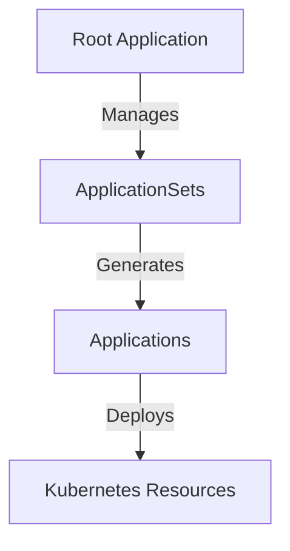

# ArgoCD & GitOps Architecture

This document details the "App of Apps" GitOps architecture used in this cluster, specifically focusing on the **Sync Wave** strategy and **Health Check Customizations** that enable a fully self-managing cluster.

## 🏗️ The "App of Apps" Pattern

We use a hierarchical "App of Apps" pattern to manage the entire cluster state.



### The Root Application
The entry point is `infrastructure/controllers/argocd/root.yaml`. This application:
1.  Points to `infrastructure/controllers/argocd/apps/`
2.  Deploys the `ApplicationSet` definitions found there.
3.  Is the *only* thing applied manually (during bootstrap).

### ApplicationSets
We use three primary ApplicationSets to categorize workloads:
1.  **Infrastructure** (`infrastructure-appset.yaml`): Core system components (Cilium, Longhorn, Cert-Manager).
2.  **Monitoring** (`monitoring-appset.yaml`): Observability stack (Prometheus, Grafana).
3.  **My Apps** (`my-apps-appset.yaml`): User workloads.

## 🌊 Sync Waves & Dependency Management

To solve the "chicken-and-egg" problem of bootstrapping a cluster (e.g., needing storage for apps, but networking for storage), we use **ArgoCD Sync Waves**.

### The Wave Strategy

| Wave | Phase | Components | Description |
|------|-------|------------|-------------|
| **0** | **Foundation** | `cilium`, `argocd`, `1password-connect`, `external-secrets`, `projects` | **Networking & Secrets**. The absolute minimum required for other pods to start and pull credentials. |
| **1** | **Storage** | `longhorn`, `snapshot-controller`, `volsync` | **Persistence**. Depends on Wave 0 for Pod-to-Pod communication and secrets. |
| **2** | **PVC Plumber** | `pvc-plumber` | **Backup checker**. Must be running before Kyverno policies in Wave 4 call its API. |
| **4** | **Infrastructure** | `cert-manager`, `kyverno`, `gpu-operator`, `databases`, `gateway`, etc. | **Core Services** via ApplicationSet (explicit path list). |
| **5** | **Monitoring** | `prometheus-stack`, `loki-stack`, `tempo` | **Observability** via ApplicationSet (discovers `monitoring/*`). |
| **6** | **User** | `my-apps/*/*` | **Workloads** via ApplicationSet (discovers `my-apps/*/*`). |

### How It Works
Each `Application` resource in `infrastructure/controllers/argocd/apps/` is annotated with a sync wave:

```yaml
apiVersion: argoproj.io/v1alpha1
kind: Application
metadata:
  name: cilium
  annotations:
    argocd.argoproj.io/sync-wave: "0"
```

ArgoCD processes these waves sequentially. **Wave 1 will NOT start until Wave 0 is healthy.**

## 🏥 Health Check Customizations

Standard ArgoCD behavior is to mark a parent Application as "Healthy" as soon as the child Application resource is created, *even if the child app is still syncing or degraded*. This breaks the Sync Wave logic for App-of-Apps.

To fix this, we inject a custom Lua health check in `infrastructure/controllers/argocd/values.yaml`.

### The "Wait for Child" Script

```lua
resource.customizations.health.argoproj.io_Application: |
  hs = {}
  hs.status = "Progressing"
  hs.message = ""
  if obj.status ~= nil then
    if obj.status.health ~= nil then
      hs.status = obj.status.health.status
      if obj.status.health.message ~= nil then
        hs.message = obj.status.health.message
      end
    end
  end
  return hs
```

**What this does:**
1.  It overrides the health assessment of `Application` resources.
2.  It forces the parent (Root App) to report the *actual status* of the child Application.
3.  If `cilium` (Wave 0) is "Progressing", the Root App sees it as "Progressing".
4.  The Root App **pauses** processing Wave 1 until all Wave 0 apps report "Healthy".

## 🔄 Self-Management Loop

1.  **Bootstrap**: You apply `root.yaml`.
2.  **Adoption**: ArgoCD sees `cilium` defined in Git (Wave 0). It adopts the running Cilium instance.
3.  **Expansion**: ArgoCD deploys `external-secrets` (Wave 0).
4.  **Wait**: ArgoCD waits for Cilium and External Secrets to be green.
5.  **Storage**: ArgoCD deploys `longhorn` (Wave 1).
6.  **Completion**: The process continues until all waves are healthy.

This ensures a deterministic, reliable boot sequence every time.

## Server-Side Diff vs Client-Side Diff

This cluster uses **Server-Side Diff** (`resource.server-side-diff: "true"` in `argocd-cm`) paired with **Server-Side Apply** (`ServerSideApply=true` in syncOptions). These must be aligned — using one without the other causes silent sync failures.

### Client-Side Diff (legacy, DO NOT USE with SSA)

ArgoCD downloads the live resource from the cluster, then compares it against the Git manifest **locally in the ArgoCD controller**. It's essentially doing `diff manifest.yaml live-resource.yaml` on its own.

**Problem**: ArgoCD doesn't know what Kubernetes would actually do with the manifest. Kubernetes adds defaults, mutating webhooks modify fields, and SSA has field ownership rules. ArgoCD is guessing — and sometimes guesses wrong (thinks it's "in-sync" when it's not).

### Server-Side Diff (modern, REQUIRED with SSA)

ArgoCD sends the Git manifest to the Kubernetes API as a **dry-run server-side apply** and gets back what the result *would* look like. Then it compares *that* against the live resource.

**Why it's better**: Kubernetes itself tells ArgoCD "here's what would change if you applied this" — accounting for defaults, field ownership, webhooks, everything. No guessing.

### Why the Mismatch Breaks ConfigMaps

Without Server-Side Diff, using Server-Side Apply + `ApplyOutOfSyncOnly`:

```
Git: configmap data = NEW content
                ↓
Client-side diff: "managed fields metadata looks the same..." → IN SYNC (wrong!)
                ↓
ApplyOutOfSyncOnly: "it's in-sync, skip it"
                ↓
Result: configmap never applied, ArgoCD says "Synced" ✓ (LIE)
```

With Server-Side Diff:

```
Git: configmap data = NEW content
                ↓
K8s API dry-run: "this would change .data.presets.ini" → OUT OF SYNC
                ↓
Sync: applies the configmap
                ↓
Result: configmap actually updated ✓
```

### Configuration

Enabled globally in `infrastructure/controllers/argocd/values.yaml`:

```yaml
configs:
  cm:
    resource.server-side-diff: "true"
```

### Sync Options (CRITICAL — do not add ApplyOutOfSyncOnly)

Standard sync options for all ApplicationSets:

```yaml
syncOptions:
- CreateNamespace=true
- ServerSideApply=true          # Server-side apply for better conflict resolution
- RespectIgnoreDifferences=true # Honor ignoreDifferences for PVC, HTTPRoute, etc.
- Replace=false                 # Use patch, not full replace
```

**DO NOT add these options:**
- `ApplyOutOfSyncOnly=true` — Even with ServerSideDiff, has [known edge cases with key removal](https://github.com/argoproj/argo-cd/issues/24882). Not worth the risk for a homelab-scale cluster.
- `IgnoreMissingTemplate=true` — Can mask real template errors in ApplicationSets.

### References
- [ArgoCD Diff Strategies](https://argo-cd.readthedocs.io/en/stable/user-guide/diff-strategies/)
- [ArgoCD SSA ConfigMap sync failure (#22687)](https://github.com/argoproj/argo-cd/issues/22687)
- [ArgoCD key removal not detected (#24882)](https://github.com/argoproj/argo-cd/issues/24882)
