# Hardware, disk placement, and GitOps decisions

Prefer a quick look around? [Explore the interactive lab inventory](../lab.md).
The measurements and reasoning are below.

**Purpose:** give an engineering recommendation for this lab: what to keep,
where workloads belong, which disks deserve attention, and what should change
before claiming automatic recovery from a host failure.

**Status:** review and proposed design, September 5, 2026. No hardware moves,
new placement policies, replica migrations, or Talos upgrades were performed
for this report. Recommendations below are not deployed configuration.

**Evidence:** the [physical inventory](2026-09-05-inventory.md), read-only SSH
and storage measurements from this audit, the
[detailed findings](2026-09-05-architecture-audit.md), and repository commit
`3cac0eb1`. Node labels, taints, Longhorn disk eligibility and resource usage
were checked again while preparing this report. Short measurements describe
the sampled workload; they are not endurance tests or sustained power averages.

## My assessment

Keep Argo CD, directory discovery, Kustomize, Cilium, plain Postgres and Kopiur.
The platform has a credible reconstruction story and useful local conventions.
Its largest availability gap is the combination of one-copy application state
and one control-plane host. Buying faster disks helps latency and durability;
it does not, by itself, close that gap.

Make the HP SFF and Elite the preferred home for ordinary services. Keep the
Threadripper for GPU and heavy work while reducing ordinary services' dependence
on it. Treat the Dell as temporary capacity and the shed as an edge host with
attached devices. Keep the stable NAS in its existing role.

The first hardware purchase I would prioritize is a qualified approximately
480 GB SSD with power-loss protection for the control-plane VM. The next disk
decision is the Elite data SSD. I would not start by buying six identical SATA
drives, breaking the Threadripper mirror, or repurposing the NAS server.



A second live copy serves routine failover. A backup reconstructs lost state.
Both are useful, but they solve different failures.

## Hardware and disk report

| Host | What is actually there | Judgment and intended role |
|---|---|---|
| HP SFF `.21` | i5-8500, 64 GB RAM; worker 40 GiB/6 vCPU and sole control plane 12 GiB/4 vCPU; two PNY CS900 1 TB SATA SSDs | Best current general-purpose anchor. Separate VM disks reduce storage contention, but both VMs fail with the chassis. Preserve control-plane I/O isolation. |
| HP Elite `.22` | i5-13500T, 32 GB RAM; worker 24 GiB/16 vCPU; WD SN530 256 GB boot and Intel SSDPEKNW512G8 512 GB data NVMe | Good second wired compute/storage host. Replace or qualify the worn data SSD before expanding its long-term storage responsibility. Zigbee is attached here. |
| Threadripper `.14` | 2950X, 128 GB RAM, one RTX 3090; GPU VM 100 GiB/30 vCPU; two EDILOCA 512 GB NVMe, two mirrored HPE 480 GB SATA SSDs, PNY 1 TB host boot | Keep for GPU and selected heavy jobs. It already owns useful enterprise storage. Past host hard locks and the desired future retirement make it a poor new quorum dependency. |
| Dell `.16` | OptiPlex 7060/i5-8500, 40 GB RAM; worker 30 GiB/6 vCPU; adapted Apple 251 GB boot SSD and Samsung 850 EVO 500 GB data SSD | Expendable compute, development and restartable jobs. The exposed assembly is the owner's long-term concern; the audit did not establish a recurring Dell crash fault. |
| Shed HP `.20` | ProDesk 600 G4 DM/i5-8500T, 32 GB RAM; worker 25,000 MiB/4 vCPU; BC501 256 GB boot plus PNY CS900 1 TB data | USB/radio workloads and explicitly permitted edge jobs. Longhorn replica scheduling is already disabled. Wi-Fi interruption should not take a required database copy or quorum member away. |
| Pi `.15` | Pi 5, 8 GB RAM, Patriot P300 256 GB NVMe; Omni and Technitium | Keep the small external management host. DNS and Omni share a failure boundary; this is not an SD-card installation. |
| TrueNAS `.133` | DL360, one Xeon E5-2680 v4, about 384 GB RAM; NAS and RustFS; 10 GbE | Keep as storage. Extra RAM is not a reason to introduce Kubernetes/Proxmox dependencies into a stable appliance. |

### The disk problems are specific

**Control-plane latency is the strongest measured performance finding.** Its
100 GiB virtual disk occupies a dedicated 1 TB PNY, with approximately 831 GiB
of VG space unused. Etcd WAL fsync p99 was about 49 ms, with a worst five-minute
p99 around 59 ms over 24 hours; backend commit p99 was about 62 ms. The
[etcd diagnostic guidance](https://etcd.io/docs/v3.6/faq/) uses below 10 ms and
25 ms respectively. Investigate the complete guest/Proxmox/controller/device
path. These measurements do not prove the PNY alone is responsible.

**The Elite SSD is an endurance-planning issue.** It reports 74% estimated
endurance used, about 56,418 powered hours, 539 unsafe shutdowns, and zero media
errors. That is a reason to plan replacement, not a diagnosis of current failure
or a countdown with 26% of calendar life remaining.

**The Dell disk is old, with a connection history to investigate.** Its Samsung
reports about 74,097 hours and 8,162 historical CRC errors, without reported
reallocated/uncorrectable errors. A growing CRC counter would justify examining
cables, power and connectors. The accumulated count alone does not identify an
active fault. Do not put fresh enterprise disks in this box ahead of the HPs.

**There was no evidence of continuous fleet-wide saturation.** A concurrent
30-second sample found modest I/O. HPE mirror members averaged about 366 write
IOPS at 0.15 ms; the Elite data drive about 179 at 0.12 ms. Those block-layer
averages are not durable fsync p99. The SFF did show I/O pressure, and the etcd
tail latency deserves follow-up despite quiet averages elsewhere.

**Capacity and latency must be tracked separately.** The SFF worker's host VG
has little unallocated space, while its Longhorn filesystem had about 655 GiB
free. The GPU flash filesystem had about 152 GiB free of 300 GiB, with 415 GiB
of logical replica capacity scheduled. That last figure is overcommit, not
415 GiB physically written. Reserve space for snapshots, second copies and
restore staging before choosing smaller replacement disks.

### The disk moves I would make

| Priority | Proposed move | Benefit and condition |
|---|---|---|
| 1 | Put a qualified ~480 GB PLP SATA SSD in the SFF for the existing control-plane VM disk | Targets the measured etcd problem without changing application PVCs. Compare durable latency through the same VM storage path before and after. A larger capacity device is unnecessary for the observed 100 GiB allocation. |
| 2 | Replace the Elite data SSD with a suitable drive for its actual interface and enclosure | Reduces dependence on the most visibly consumed endurance budget. Confirm the physical bay/cable before buying enterprise SATA for a Mini currently using NVMe. |
| 3 | Reuse the displaced SFF PNY 1 TB for low-priority capacity, or keep it as a migration spare | If the Elite has a compatible SATA bay, this is a no-additional-drive-cost capacity option after testing. It does not establish better fsync performance or PLP. Otherwise retain it; there is no benefit in swapping it with an identical shed PNY just to move hardware. |
| 4 | Add/replace a worker data SSD only when replicated-state measurements justify it | A worker PLP upgrade can follow the control-plane/Elite work. A 480 GB disk cannot simply replace the SFF's 690 GiB data LV or the shed's 850 GiB LV. Rebuild/restore and update device selectors instead of trying to shrink them in place. |

The NAS boot mirror contains the third HPE 480 GB SSD. Replacing that member
with a qualified spare could release it for the SFF control plane, but this is
a separate NAS boot migration: preserve configuration/keys, verify the replacement
and finish resilvering before reusing the HPE. It is a legitimate reuse option
if a suitable spare is available; buying one SSD avoids coupling two working
systems just to recover that drive.

Keep both Threadripper HPE drives in the existing mdadm RAID1/thick-LVM pool.
They back the 300 GB flash disk and an additional 120 GiB guest disk. The latter
is not represented in the declared machine class and its consumer still needs
tracing. Neither physical drive is spare. Splitting the mirror would sacrifice
local disk redundancy and relocate a large amount of live state; this is poor
first-step value compared with one targeted purchase.

When evaluating used drives, check interface, sector format/controller support,
usable capacity, actual PLP specification, endurance counters and the seller's
return policy. Test sustained synchronous writes through the intended VM path
on a disposable filesystem. No destructive raw-device benchmark belongs on a
disk containing the live control plane or application volumes. Current market
prices were not established by the older Deal Scout purchasing brief.

### Disk selection blocks a blind rebuild

The GPU machine class declares 450 GB boot, 450 GB AI cache and 300 GB flash.
The Omni 1.11 fresh-install resolver selects the smallest eligible disk absent
an explicit selection: the data disk wins. Installed machines retain their
detected system disk. An override tied only to the current machine UUID will
not cover the provider's next replacement UUID.

The current boot/ephemeral filesystem contains about 175 GiB of used space and
hosts Longhorn replicas. Reducing it to 128 GiB is not a safe correction. Fix
selection for a newly provisioned UUID, or redesign boot versus data allocation
with a verified migration plan. Keep disk work and the in-place Talos rollout
as separate changes. This finding is recorded in
[#2237](https://github.com/mitchross/talos-argocd-proxmox/pull/2237) and the
[Omni resolver source](https://github.com/siderolabs/omni/blob/v1.11.0/internal/backend/runtime/omni/controllers/omni/installdisk/resolve.go).

## Use the NAS where it helps

BigTank has four 10 TB drives in two mirrors, about 18.2 TiB pool size and 55%
allocation. It is the appropriate existing home for shared media, large files
and off-cluster Kopiur repositories. Ten-gigabit networking helps transfers;
it does not turn spinning disks into a low-latency random-write device.

The separate Backup10T pool is one disk at about 68% allocation. The AI pool
is three SSDs striped without redundancy, about 74% allocated. Classify that
pool's contents before calling them expendable or moving its members. A separate
pool in the same NAS is not an independent appliance or proof that RustFS has
another recoverable copy.

`BigTank/k8s` has `sync=disabled`, inherited by the inspected NFS/iSCSI app
datasets. `BigTank/k8s/rustfs` explicitly has `sync=standard`. Accepting a NAS
outage is different from accepting loss of writes that applications believed
were committed. Before moving a database to NAS storage, choose its durability
policy and measure that configuration. The
[ZFS property semantics](https://openzfs.github.io/openzfs-docs/man/v2.1/7/zfsprops.7.html)
explain why a benchmark with sync disabled cannot prove durable database latency.

**Keep the NAS RAM as-is.** The owner's dashboard screenshot confirms 377.6 GiB
visible ECC memory, 340.5 GiB ZFS cache, 13.6 GiB services and 23.5 GiB free.
Calling this cache worthless or wasted was unsupported. Occupancy shows that ZFS
is using the RAM; working-set reuse and client latency determine the benefit.

ARC around 340 GiB on a 378 GiB-visible machine, no current memory pressure,
and a warm 30-second sample with no demand-data misses do not show how much RAM
is required. No RAM purchase is justified. If reducing NAS RAM becomes worthwhile,
test a 128 GiB ARC cap through representative backup, restore and media cycles,
then consider 64 GiB only if client latency and backend reads remain acceptable.
These are experimental test points, not recommended minimum RAM sizes. Undo the
cap if recovery or application latency worsens. An ARC cap leaves the DIMMs
powered; savings require measuring an actual hardware/configuration change.

Measured outlet snapshots were roughly 182 W for Threadripper, 114 W for the
NAS chassis plus 43 W for its separate drive PSU, 33 W for Elite, 63 W for SFF
and Dell together, and 23 W for the shed. Use the existing
[power metering](../domains/power/metering.md) to compare representative periods.
Every sustained 10 W reduction is 87.6 kWh/year; actual savings depend on the
tariff. A future mini PC/eGPU may reduce host overhead, but 3090 idle power,
the eGPU enclosure and passthrough compatibility need their own evaluation.

## Zones and workload placement

### Keep failure domains distinct from workload roles

Zones already exist and were confirmed live: `hp-sff`, `hp-elite`, `dell`,
`house` for Threadripper, and `shed`. The two SFF VMs correctly share `hp-sff`.
Keep these identifiers for now because existing storage and scheduling policies
consume them. They describe physical hosts in this lab, not independently
powered datacenters. Do not relabel all database nodes `zone=database`: that
would erase the distinction between two physical machines.

Add a small, explicit workload-pool label in the Omni template. Proposed values:

| Nodes | Proposed `node.vanillax.dev/pool` | Suitable work |
|---|---|---|
| SFF worker and Elite worker | `general` | Ordinary services, database processes and selected replicated application state |
| Threadripper worker | `gpu` | Whole-card GPU work, required local model cache, selected heavy CPU/I/O jobs |
| Shed worker | `edge` | Attached radio/USB work and explicitly permitted restartable jobs |
| Dell worker | `disposable` | Tests, builds and other work allowed to stop without losing required service state |
| SFF control plane | Retain the existing control-plane role/taint | Cluster control; do not open it to general applications as part of a labeling change |

The pool is a placement rule; it is not a CPU or disk reservation. Keep the
existing hardware class, link and device-discovery labels where consumers need
them. Add gateway eligibility as a separate capability, not a sixth dedicated
node pool. Longhorn node/disk tags separately select storage replicas; Kubernetes
pod affinity does not move volume data.

**Ordinary apps:** prefer the two general workers first. Use required general-pool
affinity only after confirming admitted requests, peak memory, PVC accessibility
and room to restart elsewhere. Do not mechanically hard-pin every app today:
the GPU VM still hosts substantial non-GPU state and compute.

**GPU work:** retain the real GPU resource request and existing exclusive-card
scale-swap. A pool label alone cannot reserve the 3090. Eventually a GPU taint
can exclude unrelated new pods, but first classify the existing CPU services,
Longhorn helpers and download/backup jobs that must still run there.

**Device work:** preserve Home Assistant's NFD Zigbee selector in
`my-apps/home/home-assistant/deployment.yaml`. It follows the attached device,
currently Elite, rather than assuming all home automation belongs in the shed.
USB availability remains an accepted physical dependency.

**Temporary work:** once the Dell's required state has been relocated, a
`NoSchedule` taint can make new placement opt-in. It does not evict existing
pods. A toleration permits scheduling; matching affinity chooses the intended
pool. Keep the existing shed Wi-Fi taint. Audit storage/CSI/monitoring daemon
tolerations before introducing another taint. See
[Kubernetes taint behavior](https://kubernetes.io/docs/concepts/scheduling-eviction/taint-and-toleration/).

### Spread replicas across physical hosts

Use the existing zone label for host-aware spread. This example is a proposed
pod-template fragment for a replicated general service; the selector must match
that service's actual pod labels:

```yaml
spec:
  template:
    spec:
      nodeSelector:
        node.vanillax.dev/pool: general
      topologySpreadConstraints:
        - maxSkew: 1
          topologyKey: topology.kubernetes.io/zone
          whenUnsatisfiable: ScheduleAnyway
          nodeAffinityPolicy: Honor
          nodeTaintsPolicy: Honor
          labelSelector:
            matchLabels:
              app: example-service
```

Soft spread permits degraded operation when only one host remains; verify the
normal placement because this is a preference. For a workload where separation
must be enforced, use a reviewed hard constraint and accept that an extra pod
can remain Pending. Do not put `minDomains: 3` on services eligible for only two
physical hosts. Spread acts when pods schedule; VPA in-place resizing does not
rebalance them. [Kubernetes topology spread](https://kubernetes.io/docs/concepts/scheduling-eviction/topology-spread-constraints/)
documents those behaviors.

Some current replicas are meaningful: 1Password, CoreDNS, cloudflared and Cilium
operator pods were distributed in the audit. Others are misleading: all three
Coroot Keeper members were on the SFF, and two nginx example replicas were on
Threadripper. Coroot's selector in `monitoring/coroot/coroot.yaml` confines its
backend and Keeper to one host. Decide whether Coroot earns a multi-host database
or should be simplified; changing Keeper's replica count is a quorum migration,
not a cosmetic YAML edit.

### Resource isolation and security isolation need their own controls

The latest sample showed worker memory around 13.3 GiB on SFF, 8.9 GiB on Elite,
11.1 GiB on Dell and 41.2 GiB on Threadripper. SFF and Elite together expose about
61.7 GiB allocatable, but a failed host removes its capacity. These figures do
not prove all non-GPU work fits on the remaining host. Size the promised surviving
set using admitted requests and peak usage, including storage and backup jobs.

VPA is working: 120 recommendations across 124 policies at the post-upgrade
checkpoint, with observed successful in-place resizes. It helps request sizing;
it does not enforce I/O isolation or guarantee enough failover capacity.

Keep per-app namespaces. Start resource budgets with genuinely noisy batch jobs:
bounded concurrency, explicit requests/limits and lower scheduling priority.
Keep important control-plane writes on a separate physical disk. Namespace quotas
can cap batch admission but do not cap disk IOPS or reserve bandwidth. Do not
install another scheduler or a descheduler merely to implement these pools.

For network isolation, use opt-in namespace policies with tested dependencies.
The current broad Cilium allow policy is additive and defeats narrower allow-only
restrictions. Zones, namespaces and taints alone do not stop network traffic.
Exclude opted-in namespaces from the broad policy before expecting allowlists
to constrain them; prove allowed DNS/API/backup traffic and blocked unwanted
egress in a canary before wider use.

## Storage availability and control-plane choices

The audit found 74 of 75 Longhorn claims requesting one replica; Temporal Postgres
was the exception. Its copies were on Dell and Elite. Current Longhorn tags still
include Dell in `wired-storage`. Change placement only after surviving replacement
copies are healthy; removing a tag does not itself migrate or protect old data.
The Omni default-tags annotation initializes empty tags and is not a continuous
reconciler for existing Longhorn nodes.

Start with a disposable two-copy canary on SFF and Elite. Their current SMART
results do not prohibit a bounded test; do not require a hardware purchase just
to establish behavior. Then migrate whole services, including all required state:

| Service | State the audit actually found | Proposed treatment |
|---|---|---|
| Gitea | 10 GiB Postgres and 10 GiB shared files, one copy each on Elite | Strong first ordinary-service candidate for two copies of both volumes; verify a repository and login after recovery |
| Temporal | 10 GiB Postgres, two copies on Dell/Elite | Establish an SFF copy before retiring Dell from the storage set; verify schedules/timers after a restore |
| Paperless | Postgres on Threadripper; data/media/consume/export claims on SFF | Inventory the full file/DB recovery unit; moving only Postgres leaves a host dependency |
| Immich | 20 GiB Postgres, 50 GiB library, 20 GiB ML cache on Threadripper; separate NAS photos | Protect identity/library state; keep rebuildable ML cache inexpensive; retain the accepted NAS dependency |
| Home Assistant | 10 GiB config on Elite with the physical Zigbee device | A second config copy aids recovery, but cannot keep the absent USB device functioning |
| Open WebUI / Karakeep | Small state volumes; Karakeep also has a search index | Protect authoritative state first; prove an index is reconstructible before treating its volume as disposable |

Keep bulk files and backups on TrueNAS, and keep disposable caches single-copy.
Kopiur remains recovery for lost/corrupt data. An automatic loop that deletes an
unavailable PVC would add split-writer and wrong-snapshot races. A future restore
controller needs fencing, a per-service lock, a pinned snapshot, a new target,
application validation and one controlled cutover. That is substantially more
complex than expanding selected live replicas.

One control plane remains a real limit: if the SFF dies, the cluster cannot
schedule replacement pods even when their data survives. Existing running pods
may continue serving. Three control-plane members would need three qualified
physical hosts; two members cannot tolerate a member loss.

I would keep the current single control plane until a third suitable wired host
is identified. SFF and Elite are two candidates; Dell is intentionally temporary,
Threadripper has the power/reliability concerns above, and the shed depends on
Wi-Fi. A future efficient wired Mini replacing the Dell is a more coherent third
member. Allowing workloads on those control-plane nodes is reasonable if measured
CPU/RAM and etcd disk headroom are reserved; three full duplicate 12 GiB VMs are
not a design requirement. No new control-plane sizing has been validated here.

## My opinion of the Argo setup

**The repository layout is worth keeping.** One deployed app per directory is
easy to navigate. Auto-discovery for user apps and an explicit infrastructure
list serve different lifecycle needs. For one environment, adding base/overlay
directories everywhere would add hops without meaningful reuse. The shared
Kopiur component is useful DRY; a universal app/Postgres chart with dozens of
options would make UID, backup identity and migration behavior harder to review.

**The complexity is concentrated at controller boundaries.** The useful fixes
are in `infrastructure/controllers/argocd/apps/` and `values.yaml`, not a new
GitOps platform:

| Area | Assessment | Concrete action |
|---|---|---|
| Discovery and ownership | Coherent; no duplicate rendered ownership in the original expanded graph | Preserve app identities and directory boundaries; test basename uniqueness and shared-component cache invalidation |
| Waves | Direct child Application health gates are useful; an ApplicationSet's wave does not wait for all generated children | Keep explicit gates for a small set of CRD dependencies and document eventual convergence elsewhere |
| Diff ignores | Some are justified by immutable PVC fields and generated certificates; others hide operator intent | Narrow HTTPRoute backend-weight, whole CRD conversion and whole OTel annotation ignores with before/after render and sync tests |
| Self-management | Appropriate for this lab; an Argo mistake can also disable the repair controller | Preserve the bootstrap recovery path, cache contract and known rerun behavior; make unrelated Helm failures visible |
| Authentication | Owner deliberately uses a predictable 1Password-stored credential for internal Argo | Preserve that contract; the random-password proposal was withdrawn |
| Projects and access | Permissive AppProjects are an intentional single-operator trade-off | Do not present UI grouping as tenant isolation; tighten before adding untrusted writers |
| Prune and lifecycle | Automatic prune/self-heal is useful and already established | Keep parked apps explicit, and separate retirement of live resources from backup-history retention |
| CI | Strong manifest checks; the PostHog dependency hold demonstrated an application/schema contract outside those checks | Require a small useful check set for merges and review critical upgrades; green YAML is insufficient evidence for a DB migration |

I would simplify redundant observability before rewriting application manifests.
Coroot brings another Prometheus/ClickHouse/Keeper stack; Loki has split roles
that are mostly singletons. Those costs need a daily operational benefit. Keep
Prometheus, logs that answer real incidents, Lens and a small status view; keep
Trivy and on-demand investigation. Automatic Keep-to-Holmes dispatch is already
disabled. Do not add another large monitoring backend before selecting the view
you will actually use.

## Cilium assessment

Keep VXLAN, the media-bridge workarounds, split xDS, Gateway API and the separate
internal/external paths. They fit actual connectivity and prior incidents.
Cilium metrics are now discovered: 14 targets were healthy after the fix.

The next two changes should be tested isolation and gateway placement.
`infrastructure/networking/cilium/l2-policy.yaml` currently allows every node to
announce VIPs, including the shed and temporary Dell. A Kubernetes scheduling
taint does not exclude Cilium's lease participation. Propose an explicit gateway
eligibility label for the SFF and Elite physical hosts, including the SFF control
plane if appropriate, then test every VIP from the LAN before removing old
candidates. Do not exclude the control plane mechanically; the repository records
a prior loss of reachability from that approach. Verify interfaces as well as
node labels. See [Cilium L2 selection](https://docs.cilium.io/en/stable/network/l2-announcements/).

Separately verify cloudflared's origin certificate/SNI before replacing its
current verification bypass. This has nothing to do with adding Cloudflare
Access or making internal Argo public. Those are not requested architecture changes.

## Concrete follow-up PRs and acceptance

These are descriptions for proposed work, not additional deployed fixes.

| Category | Plain-English PR description | Proof before proceeding |
|---|---|---|
| Critical / Technical Debt | **Make new GPU machines choose the boot disk reliably.** Update provisioning and disk-selection checks so a replacement UUID cannot install Talos onto the flash data disk. | Test all declared device layouts, missing/ambiguous matches and a disposable fresh provision; preserve current data capacity |
| Critical / Technical Debt | **Give selected services a surviving copy of their data.** Qualify SFF/Elite storage and move complete app recovery units onto the wired two-copy tier. | Canary recovery, measured sync-write latency, healthy copies on two physical hosts, backup and application checks; retain old state until accepted |
| Critical / Technical Debt | **Move etcd onto qualified storage.** Keep the VM's identity and change its backing disk with a documented rollback. | Restorable etcd/VM backup, lower WAL/commit tail latency, unchanged flush guarantees, healthy API after restart |
| Refactoring & Simplification | **Declare what each node is for.** Add pool labels, move ordinary services toward the HPs, and make Dell/edge placement deliberate. | Verify live labels, admitted requests, PVC placement and a remaining-host capacity budget; migrate before enforcing taints |
| Refactoring & Simplification | **Let Argo detect meaningful configuration changes.** Narrow broad diff ignores while preserving known immutable-PVC and generated-certificate behavior. | Intended route/annotation changes become visible; unchanged objects stay quiet; bootstrap/rerun checks pass |
| Missing Baseline | **Keep VIPs on dependable wired hosts and test isolated workloads.** Separate gateway eligibility from pod scheduling and prove namespace traffic boundaries. | LAN/internal/public route checks, VIP-owner loss test with an exit path, canary allowed/denied connections |
| Missing Baseline | **Show whether services can recover.** Display unavailable apps, stale backups by tier, lost replicas, low disk space and etcd latency in a small view using existing data. | Induced canary failures appear with a useful next action; no automatic LLM invocation |

Physical disk work needs a maintenance runbook after destination fit is confirmed.
For application data, preserve Kopiur identity and use the existing
[PVC migration procedure](../domains/storage/pvc-storageclass-migration.md).
For the sole control plane, use a verified etcd/VM recovery path; Kopiur application
backups are not its machine backup. Stop if the target layout, restore contents
or surviving replica is ambiguous. Keep the source disk/volume intact until the
replacement passes application checks, and never boot two copies of the same
control-plane identity. A failed benchmark does not justify relaxing flush or
sync durability to make its numbers look better.

## Decision still needed

The Elite Mini's actual SATA carrier, cable and available space with both NVMe
devices installed have not been physically verified. HP's
[model specifications](https://support.hp.com/sg-en/document/ish_5868243-5868287-16)
describe a removable carrier for 2.5-inch storage; that does not prove this used
unit includes one. Confirm that before selecting the second purchase or routing
the displaced SFF PNY into it. Until then, that move remains conditional.
