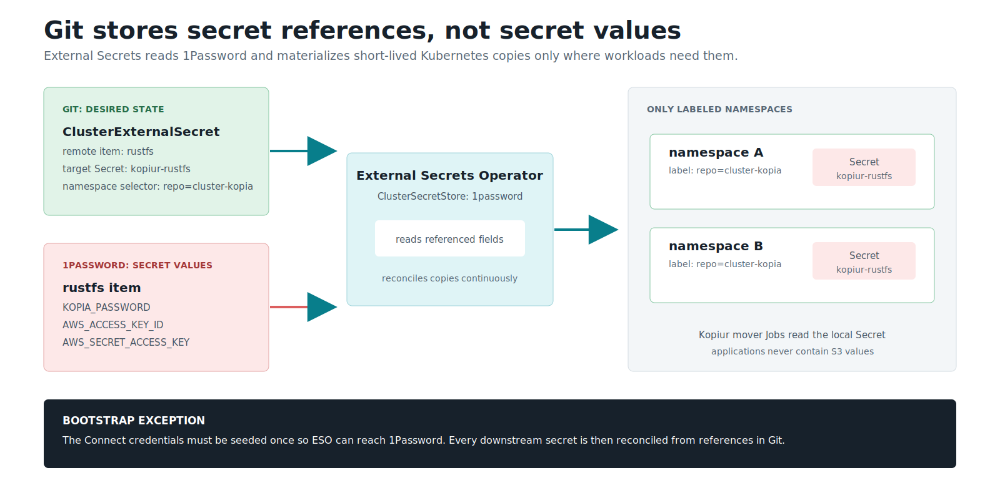

# Backup Repository Setup (S3 + Kopia, via kopiur)

The **one-time backend setup** behind the
[backup/restore system](storage-architecture.md): the S3 box, the bucket, the
credentials, and how they fan out to every namespace. You do this once; after
that, a single namespace label does everything.

The kopia repo is a first-class CR (`ClusterRepository`). For how backup *and
restore* flow once the backend is up, see
[kopiur backup architecture](domains/storage/kopiur-backup-architecture.md).



*Git owns the references; 1Password owns the values; External Secrets owns the
namespace copies. [Open the full-size credential-flow diagram](assets/secret-fanout-flow.svg).*

> **This cluster uses** [RustFS](https://github.com/rustfs/rustfs) (an
> S3-compatible object store) running off-cluster at `192.168.10.133:30292`.
> Any S3 works — MinIO, TrueNAS S3, Garage, Backblaze B2 — only the endpoint
> and credentials change.

## The credential flow

```text
 1Password item: rustfs
 (kopia_password · accessKey · secretKey)
        │
        ▼
 External Secrets Operator
        │
        ▼
 ClusterExternalSecret  kopiur-rustfs
        │ Secret copy         │ Secret copy
        ▼                     ▼
 namespace A            namespace B
 (repo=cluster-kopia)   (repo=cluster-kopia)
        │                     │
        └────────┬────────────┘
                 ▼
        kopiur mover Jobs
                 │ kopia
                 ▼
        RustFS S3  (bucket: kopiur)
```

One credential, stored once, materialized automatically into every namespace
that opts in. Apps never carry S3 config.

## The pieces (all in `infrastructure/controllers/kopiur/`)

| File | Resource | What it sets up |
|---|---|---|
| `clusterrepository.yaml` | `ClusterRepository cluster-kopia` | the kopia repo → RustFS `s3://kopiur` |
| `externalsecret.yaml` | `ClusterExternalSecret kopiur-rustfs` | fans the repo creds into labeled namespaces |
| `volumesnapshotclass.yaml` | `VolumeSnapshotClass longhorn-snapclass` | how CSI snapshots are taken (kopiur `copyMethod: Snapshot`) |
| `namespace.yaml` | `Namespace kopiur-system` | operator + managed `Maintenance` + cluster creds live here |

This is the GitOps-managed *config* for kopiur — not the operator itself, which
is the Helm Application at `core-dependencies/kopiur-operator-app.yaml`.

## One-time setup steps

### 1. The S3 side — RustFS on TrueNAS

The S3 store must live **outside the cluster** — the whole point is that it
survives the cluster. Here it's [RustFS](https://github.com/rustfs/rustfs)
running as a **TrueNAS app** on the NAS (S3 API endpoint
`192.168.10.133:30292`; the console is on `:30293` — **point Kubernetes at the
API port, not the console**).

1. Install the RustFS app on TrueNAS; its app/root credentials exist only
   for bootstrap and console administration — **never point Kubernetes at
   the root key.**
2. In the RustFS console, create the buckets:
   - `kopiur` — the Kopia repository for kopiur (this doc; the repo lives at the
     **bucket root**, `prefix: ""`)
   - `postgres-backups` — CNPG/Barman database backups (separate system)
3. Create one **workload access key** (named `homelab-workload`) for all
   Kubernetes S3 clients, with its allow policy scoped to those buckets —
   exact IAM policy JSON and the root-vs-workload rationale:
   [RustFS credential runbook](domains/rustfs/credential-runbook.md).
   **The workload key MUST have read/write on the `kopiur` bucket** — if the
   policy only scopes it to other buckets, widen it, or the
   `ClusterRepository` create/connect fails.
4. **Register & verify the key works before you ever rely on it** — see the
   rules below.

### 2. The secret side (1Password → ESO)

One item, `rustfs`, in the `homelab-prod` vault (full field list incl. the
admin-only root keys: [credential runbook](domains/rustfs/credential-runbook.md)):

| Field | Used as |
|---|---|
| `kopia_password` | `KOPIA_PASSWORD` — encrypts every backup; **lose this, lose the backups** |
| `rustfs-workload-access-key` | `AWS_ACCESS_KEY_ID` |
| `rustfs-workload-secret-key` | `AWS_SECRET_ACCESS_KEY` |
| `root-access-key` / `root-secret-key` | TrueNAS app admin only — never used by workloads |

### 3. The repository CR (in Git, already done)

`infrastructure/controllers/kopiur/clusterrepository.yaml` declares the repo as a
first-class CR. The shape that matters:

```yaml
apiVersion: kopiur.home-operations.com/v1alpha1
kind: ClusterRepository
metadata:
  name: cluster-kopia
spec:
  backend:
    s3:
      bucket: kopiur
      prefix: ""                       # dedicated bucket — repo at the root
      endpoint: 192.168.10.133:30292   # BARE host:port, no scheme/trailing slash
      region: us-east-1
      tls:
        disableTls: true               # RustFS is plain HTTP (LAN-only)
      auth:
        secretRef: { name: kopiur-rustfs, namespace: kopiur-system }
  encryption:
    passwordSecretRef: { name: kopiur-rustfs, namespace: kopiur-system, key: KOPIA_PASSWORD }
  create:
    enabled: true                      # fresh repo at the bucket root
  allowedNamespaces:
    selector:
      matchLabels:
        kopiur.home-operations.com/repo: cluster-kopia
```

Notes that bite if you get them wrong:
- The endpoint is a **bare `host:port`** — no `http://`, no trailing slash.
- TLS-off plain-HTTP RustFS is `tls.disableTls: true`.
- A cluster-scoped `secretRef` **must** carry an explicit `namespace`
  (webhook-enforced).
- `allowedNamespaces.selector` is label-driven tenancy: any namespace labeled
  `kopiur.home-operations.com/repo: cluster-kopia` may use this repo. The
  **same label** drives the credential fan-out below, so onboarding an app is
  one namespace label.

### 4. The credential fan-out (in Git, already done)

`infrastructure/controllers/kopiur/externalsecret.yaml` is ONE
`ClusterExternalSecret kopiur-rustfs` that materializes the `kopiur-rustfs`
Secret into every namespace labeled `kopiur.home-operations.com/repo:
cluster-kopia` (the consumer namespaces **and** `kopiur-system` itself, which
needs the creds for the controller connection and the managed `Maintenance`):

```yaml
# the Secret each labeled namespace receives (kopiur-rustfs)
KOPIA_PASSWORD:        <from 1Password: kopia_password>
AWS_ACCESS_KEY_ID:     <from 1Password: rustfs-workload-access-key>
AWS_SECRET_ACCESS_KEY: <from 1Password: rustfs-workload-secret-key>
```

The endpoint/bucket/TLS settings are **not** in this Secret — they live on the
`ClusterRepository` CR. The Secret only carries creds + the kopia password.

> **The Secret NAME must equal the `ClusterRepository`'s
> `auth.secretRef.name` / `encryption.passwordSecretRef.name` (`kopiur-rustfs`)**
> and carry the well-known keys (`KOPIA_PASSWORD` / `AWS_ACCESS_KEY_ID` /
> `AWS_SECRET_ACCESS_KEY`). This is the "without credential projection" path:
> ESO delivers the creds (least-privilege) instead of granting the operator
> cluster-wide secrets-write RBAC.

Label the namespace, get the Secret. No per-app credential plumbing, ever.

### 5. The snapshot class

`infrastructure/controllers/kopiur/volumesnapshotclass.yaml` ships
`VolumeSnapshotClass longhorn-snapclass` (driver `driver.longhorn.io`, the
cluster-default snapshot class). kopiur's `copyMethod: Snapshot` references it by
name, so every backup depends on it.

### 6. Fail-closed behavior

On a restore-before-bind, if the repo is **unreachable**, kopiur raises a
backend error *before* it reaches the "no snapshot → bind empty" decision, so
the PVC stays `Pending` and never binds an empty volume. There is no separate
admission gate to maintain. Full flow:
[kopiur backup architecture §4 (restore-before-bind)](domains/storage/kopiur-backup-architecture.md).

## Verifying the backend

```bash
# the repository CR is healthy (operator connected/created the repo):
kubectl get clusterrepository cluster-kopia -o wide

# the Secret fans out to a labeled namespace:
kubectl get secret kopiur-rustfs -n <ns>

# the endpoint is reachable from the cluster:
nc -zw5 192.168.10.133 30292 && echo OK

# any completed mover proves auth end-to-end:
kubectl get snapshot -A
```

## Operational rules

- **Register the access key on the S3 server, then verify before any
  destructive rebuild.** An unregistered external credential blocks all
  recovery even with perfect Git state — the
  [DR pre-nuke checklist](disaster-recovery.md#pre-nuke-checklist) checks
  this for you.
- **Confirm the workload key has read/write on the `kopiur` bucket.** A policy
  scoped to another bucket lets everything else look healthy while the
  `ClusterRepository` fails to create/connect.
- **The Kopia password is the single blast radius.** One shared repo, one
  password, every backup encrypted with it. Keep it only in 1Password;
  acceptable on a LAN, see
  [known limitations](storage-architecture.md#known-limitations-and-non-goals).
- **Rotation:** the per-step rotation procedure (new key on RustFS → update
  1Password → force ESO refresh → CNPG picks up automatically) lives in the
  [credential runbook](domains/rustfs/credential-runbook.md).
