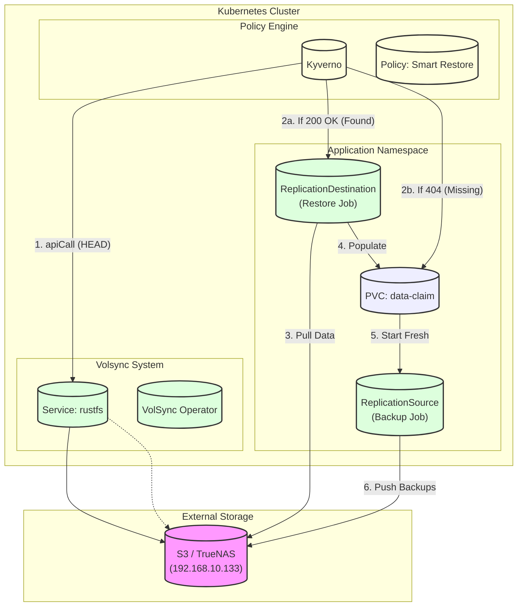

# Backup & Restore Architecture

A zero-touch, fully automated backup and restore system for Kubernetes persistent data.

## Overview

This cluster automatically backs up application data to S3 and restores it when needed - without any manual intervention. Whether you're starting fresh, rebuilding from a disaster, or just re-adding an app you removed, the system handles everything.

### The Goal

```
Add a label to your PVC → Backups happen automatically → Restores happen automatically
```

That's it. No clicking buttons. No running restore commands. No editing configs.

### How It Works (Smart Restore)

The architecture uses a **"Look Before You Leap"** strategy to decide whether to restore data or start fresh.

When you deploy an app with `backup: "hourly"` on its PVC:

1. **Kyverno Intercepts**: Before the PVC is created, Kyverno pauses and checks S3.
2. **S3 Check**: Kyverno pings the S3 bucket via an internal Service (`rustfs`).
    - **Found (200 OK):** Kyverno says "Ah, this is a restore!" and creates a restore job.
    - **Missing (404):** Kyverno says "New App!" and lets it start empty.
3. **VolSync Response**: If a restore job was created, VolSync populates the PVC *before* the app starts.

The system figures out which scenario you're in and does the right thing.

---

## Architecture

### Components



### Component Roles

| Component | Resource | Purpose |
| :--- | :--- | :--- |
| **Kyverno** | `ClusterPolicy/volsync-smart-restore` | **The Brain.** Performs an `apiCall` to S3 to check if a backup exists. If yes, generates the `ReplicationDestination`. |
| **Kyverno** | `ClusterPolicy/generate-volsync-backup` | **The Safety.** Automatically generates the `ReplicationSource` so future backups happen. |
| **VolSync** | `Service/rustfs` | **The Bridge.** Maps the external TrueNAS IP (192.168.10.133) to an internal DNS name so Kyverno can reach it. |
| **VolSync** | `ReplicationDestination` | **The Restore.** Instructs VolSync to populate a PVC from S3. Validates data integrity before binding. |

---

## Scenarios

### Scenario 1: Fresh Cluster (First Time Setup)

You're setting up a brand new cluster with no previous data.

**What happens:**
1. You deploy your apps via ArgoCD.
2. Kyverno checks S3 for `s3://backups/ns/app`. Result: **404 Not Found**.
3. Kyverno allows the PVC to be created *without* a restore source.
4. App starts with empty storage.
5. Kyverno generates a `ReplicationSource`, starting hourly backups.

**Result:** Apps work normally, clean slate.

### Scenario 2: Cluster Rebuild (Disaster Recovery)

Your cluster died. You rebuild it from scratch.

**What happens:**
1. You bootstrap ArgoCD.
2. Kyverno checks S3. Result: **200 OK** (Backup found!).
3. Kyverno generates a `ReplicationDestination` pointing to that backup.
4. Kyverno mutates the PVC to add `dataSourceRef: ReplicationDestination`.
5. The PVC stays "Pending" while VolSync pulls data from S3.
6. Once restored, the PVC binds, and the Pod starts.

**Result:** Fully automated recovery. Zero interaction.

---

## Technical Details

### The "Bridge" (Service)
Since policies run inside the cluster, they need to reach external storage reliably. We create a Service `rustfs` that points to `192.168.10.133`.
- **Why?** It allows using `http://rustfs/...` in policies instead of hardcoded IPs. 
- **Benefit:** If the Storage IP changes, you update one Service file, not 50 policies.

### The "Smart" Policy (apiCall)
Kyverno 1.10+ supports `apiCall` context variables. We use this to perform an HTTP HEAD request.
- **Method:** `HEAD` (lightweight, just checks existence)
- **Target:** `http://rustfs.volsync-system.svc:9000/volsync-backups/<namespace>/<pvc-name>`
- **Logic:**
  - `if response.code == 200` -> **RESTORE**
  - `if response.code == 404` -> **FRESH**

---

## Current Implementation Status

| Component | Status | Notes |
|-----------|--------|-------|
| VolSync Operator | ✅ Deployed | |
| Longhorn Storage | ✅ Deployed | |
| **Service Bridge** | ✅ Implemented | `rustfs-service.yaml` maps to 192.168.10.133 |
| **Smart Policy** | ✅ Implemented | `volsync-smart-restore.yaml` uses apiCall |
| Pre-warm CronJob | ❌ Removed | Replaced by Smart Policy |

See the [implementation plan](./volsync-implementation-plan.md) for deeper technical specs.
