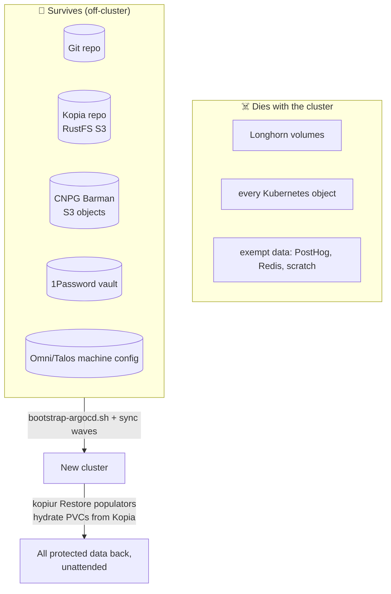
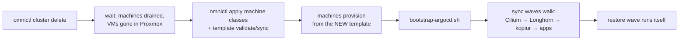

# Disaster Recovery

> The full-cluster destroy → rebuild → restore runbook, and the proof history
> behind it. Concepts + per-PVC operations live in
> [storage-architecture.md](storage-architecture.md). The backup/restore engine
> is **kopiur** (replaced pvc-plumber + VolSync, retired 2026-06-27) — how the
> pieces fit and the exact flows live in
> [domains/storage/kopiur-backup-architecture.md](domains/storage/kopiur-backup-architecture.md)
> and [domains/storage/kopiur-mover-permissions.md](domains/storage/kopiur-mover-permissions.md);
> this page does not re-derive them. Databases recover via a **separate system**
> — [CNPG/Barman](domains/cnpg/disaster-recovery.md).

> [!CAUTION]
> The destructive steps require explicit operator intent. This documents the
> verified path; it is not an invitation to nuke during routine maintenance.

---

## The DR model in one diagram



Clusters are cattle. The Kopia repository, the Git repo, and the secrets
vault are the pets. Everything between them is reconstructed automatically.

## Proof history

| Date | Engine | Event | Result |
|---|---|---|---|
| 2026-06-02 | pvc-plumber + VolSync | Planned full nuke (first acceptance) | **24/24 managed PVCs restored**, 24/24 post-restore backups Successful |
| 2026-06-12 | pvc-plumber + VolSync | **Unplanned**: Longhorn V2 engine meltdown mid-rebuild | **25/25 restored** despite an instance-manager crash, a poisoned node, and a host reboot — the repo never lost a byte |
| 2026-06-13 | pvc-plumber + VolSync | Planned rebuild onto Longhorn V1 | **24/24 restored unattended in ~75 minutes**, zero manual storage steps; operator at ~1m CPU; exemption contract honored |
| 2026-06-27 | **kopiur** | Karakeep **full-namespace DR drill** (restore-before-bind) | Both RWO PVCs deleted; recreated from Git with `dataSourceRef → Restore`, held **Pending** until the kopiur populator hydrated them from the latest Kopia snapshot, then bound **with data** — proved restore-before-bind on the new engine ([kopiur-trial.md](kopiur-trial.md)) |

The three 2026-06 full-cluster deaths above were on the prior pvc-plumber +
VolSync stack (two inside 36 hours, one about as hostile as storage failure
gets — every protected volume came back). kopiur replaced that stack on
2026-06-27; its restore-before-bind path is proven by the karakeep namespace
drill, with a full-cluster kopiur nuke still to be banked. The restore canary
(below) now runs the kopiur path continuously to keep the proof fresh.

> **The V2 footnote:** Longhorn's V2/SPDK engine was briefly tried and
> retired the same day — interrupted rebuilds under mass-restore load
> permanently corrupt replica metadata (open upstream bugs
> [#13315](https://github.com/longhorn/longhorn/issues/13315),
> [#13314](https://github.com/longhorn/longhorn/issues/13314)). The cluster
> runs V1, the upstream default. Don't revisit V2 without those fixed and a
> passed DR drill; full forensics in git history.

---

## Pre-nuke checklist

Block the nuke until every box checks — **you restore *from* these**:

- [ ] GitHub reachable; the rebuild revision **pushed** (ArgoCD pulls origin, not your working tree)
- [ ] GHCR image pulls work
- [ ] 1Password reachable; Connect token valid and recoverable off-cluster
- [ ] Cloudflare token valid and recoverable off-cluster
- [ ] RustFS/S3 endpoint reachable; access key registered on the external server; Kopia auth works
      (a past nuke proved an unregistered external credential blocks recovery even with perfect Git state)
- [ ] Talos secrets / Omni machine configs available off-cluster
- [ ] **Backups fresh**: each backed-up PVC has a recent `Completed` kopiur `Snapshot` you can live with — apps roll back to exactly that snapshot. Spot-check across namespaces:
      `kubectl get snapshot -A` (look at the newest per source) and confirm no `SnapshotSchedule` is wedged: `kubectl get snapshotschedule -A`
- [ ] **No PVC lacks a snapshot it expects to restore from.** A first restore only hydrates if a Snapshot already exists (kopiur `onMissingSnapshot: Continue` binds a snapshot-less PVC *empty* and backs up forward). Confirm every PVC you intend to *restore* (not seed) shows at least one `Completed` Snapshot before the nuke.
- [ ] Restore canary green: recent `last-drill-result=pass`

## Rebuild sequence



**Ordering rule (twice-learned):** machine classes and the cluster template
are **snapshots inside Omni** — apply + sync them *before* machines
provision, or VMs are built from stale state and must be reprovisioned.

**Bootstrap rules** (proven by the 2026-06 rebuilds):

- CRDs first, controllers second, CRs third.
- Observability is **not** a core dependency — core apps must bootstrap
  without Prometheus; `kube-prometheus-stack` is the sole owner of
  `monitoring.coreos.com` CRDs.
- The **kopiur operator** lands at **Wave 2** (`infrastructure/controllers/kopiur-operator/`
  — installs the CRDs + operator + webhook); **kopiur-config** at **Wave 3**
  (`infrastructure/controllers/kopiur/` — namespace, the `ClusterRepository
  cluster-kopia` → RustFS `s3://kopiur`, and the `ClusterExternalSecret`
  credential fan-out). Databases (Wave 4) and app backups (Wave 6) follow. The
  per-PVC kopiur CRs (`SnapshotPolicy`/`SnapshotSchedule`/`Restore`) and the
  `kopiur.home-operations.com/repo: cluster-kopia` namespace label render with
  each app at Wave 6.
- Replica rebuilds stay throttled to **1/node**
  (`infrastructure/storage/longhorn/node-failure-settings.yaml`) — a mass
  restore saturates any engine on shared homelab hardware; do not raise it
  mid-bootstrap.

## What the restore wave looks like (calibrated expectations)

- Each backed-up PVC is recreated from Git with `spec.dataSourceRef → Restore
  "<pvc>-restore"`. Kubernetes withholds binding while a populator
  `dataSourceRef` is present, so the **PVC sits `Pending`** until the kopiur
  populator restores the latest Kopia snapshot, then binds **with data** and the
  pod starts. (Full flow:
  [kopiur-backup-architecture.md §4](domains/storage/kopiur-backup-architecture.md#4-restore-before-bind-flow-the-dr-magic).)
- **Backend-down is fail-safe (this replaces the old `wait-for-rustfs` MAP).**
  The MutatingAdmissionPolicy is gone, but the guarantee is preserved by kopiur
  itself: if the Kopia repo is **unreachable** during a restore, kopiur raises
  the backend error *before* the `onMissingSnapshot` decision, so the PVC stays
  `Pending` and retries — **it never binds empty over a black-holed backend.**
  (Source-verified in kopiur `crates/controller/src/restore/mod.rs`
  `resolve_snapshot`.) The one case that *does* bind empty is a brand-new PVC
  with **no snapshot yet** while the **repo is reachable** (`onMissingSnapshot:
  Continue` = deploy-or-restore), which is why the pre-nuke checklist insists a
  Snapshot exists for anything you intend to restore.
- Restores complete in rough size order. (pvc-plumber/VolSync baseline for
  comparison: the 2026-06-13 wave did 24/24 in ~45 minutes of wave time.)
- **The API server will wobble.** etcd fsync latency inflates under
  cluster-wide restore I/O — expect intermittent `readyz` failures, slow
  kubectl, csi-sidecar leader-election restarts. It recovers between bursts;
  it is load, not failure.
- A few movers may hit cross-node attach conflicts ("volume is currently
  attached to a different node") as Jobs recreate pods — Longhorn's
  attachment reconciler clears these; the last stragglers land as load drains.
- Verdict signals that something is actually wrong: a kopiur mover Job in
  `Failed`, a `Restore` stuck without ever populating its PVC (PVC `Pending`
  long after the repo is confirmed reachable), or a `Snapshot` stuck in error.
  Watch with `kubectl -n <ns> get snapshotpolicy,snapshotschedule,restore,snapshot`.

## In-cluster registry and Gitea Actions

`registry.vanillax.me` is an in-cluster registry backed by cluster storage.
After a full nuke, the registry pod, Service, and HTTPRoute can all be healthy
while the registry catalog is still empty. Any workload pinned to
`registry.vanillax.me/...` will then fail with `ImagePullBackOff` until those
images are rebuilt or repushed.

Check the catalog from inside the registry pod:

```bash
kubectl exec -n kube-system deploy/registry -- \
  wget -qO- http://127.0.0.1:5000/v2/_catalog
```

Restore Gitea first, then get the Gitea Actions runner online. The runner
needs `Secret/gitea-actions/act-runner-token`; Git declares that as an
ExternalSecret and 1Password stores the generated token:

- vault: `homelab-prod`
- item: `gitea-actions`
- field: `act_runner_token`

Generate or rotate the token from the restored Gitea pod:

```bash
kubectl exec -n gitea deploy/gitea -- gitea actions generate-runner-token
```

If 1Password is not updated yet, this manual patch gets the live runner moving:

```bash
TOKEN="$(kubectl exec -n gitea deploy/gitea -- \
  gitea actions generate-runner-token | tail -n 1 | tr -d '\r\n')"
kubectl create secret generic act-runner-token \
  -n gitea-actions \
  --from-literal=token="$TOKEN" \
  --dry-run=client -o yaml | kubectl apply -f -
kubectl rollout restart -n gitea-actions deploy/act-runner
kubectl logs -n gitea-actions deploy/act-runner -c runner --tail=50
```

Expected runner log:

```text
runner: cluster-runner-1 ... declare successfully
```

For radar-ng, the recovery images are pinned in
`my-apps/development/radar-ng/`. If the registry is empty and the runner is not
usable yet, manually refill the exact pinned tags from local checkouts:

```bash
cd ~/programming/radar-ng/backend
VERSION=v1.1.4 ./scripts/build-push.sh tile-server
VERSION=v1.1.1 ./scripts/build-push.sh basemap open-meteo-worker
VERSION=v1.1.7 ./scripts/build-push.sh temporal-worker

cd ~/programming/talos-argocd-proxmox
./scripts/build-push-custom-apps.sh basemap-bootstrap
kubectl -n radar-ng delete job basemap-bootstrap
kubectl -n radar-ng rollout restart deploy/tile-server deploy/basemap deploy/open-meteo
kubectl -n radar-ng delete pod -l app=radar-ng-worker
```

On this single-worker cluster, `Insufficient cpu` during recovery usually means
requested CPU is saturated, not that the Proxmox host is busy. Verify with:

```bash
kubectl describe node talos-singlenode-gpu-prod-gpu-workers-f7x5ct \
  | sed -n '/Allocated resources:/,/Events:/p'
kubectl top nodes
```

## Post-restore acceptance

State BOTH claims, with live numbers:

1. **Restore contract**: every backed-up PVC `Bound` via its kopiur `Restore`
   populator (none stuck `Pending`), and the first post-restore `Snapshot` for
   each source reaches `Completed`. Cross-check per namespace:
   `kubectl -n <ns> get pvc,restore,snapshot`.
2. **Exemption hygiene**: every intentionally backup-exempt PVC is still bound
   and still carries the fully-qualified
   `storage.vanillax.dev/backup-exempt-reason` annotation — non-zero isn't a
   restore failure but it masks real problems (history: two exempt PVCs once sat
   unnoticed because acceptance only quoted the protected counters). PostHog,
   Redis, and `project-nomad/nomad-storage` are the expected exempt set; CNPG is
   not in either count — it recovers via Barman/S3 (separate system).

---

## The restore canary

Point-in-time acceptance rots; the canary keeps the proof fresh.

`my-apps/system/restore-canary/` (re-pointed to kopiur — its
`kopiur/restore-canary-data.yaml` stub carries the `SnapshotPolicy` +
`SnapshotSchedule` + `Restore`, and the PVC's `dataSourceRef` points at the
`Restore`) + `scripts/restore-canary-drill.sh` continuously re-run the real DR
path against a dedicated test PVC:

```
sentinel (old UID + sha256) → forced kopiur Snapshot
→ delete ONLY the canary PVC → Git/Argo recreate with dataSourceRef → Restore
→ kopiur populator restore → byte-identical verification
```

A passing drill proves the *entire* chain — Git render, kopiur CR wiring,
kopia round-trip, populator restore — with data integrity checked by hash,
never touching production PVCs. Results land as
`restore-canary.vanillax.dev/last-drill-*` annotations on the namespace.

What it does **not** prove: restores of backups older than its own, CNPG
recovery (separate system), or app-level data semantics — drill those
separately when they matter.

## Failure-mode catalog (from the 2026-06-12 incident)

Worked fixes for everything the hostile rebuild threw at us — stale CSI
attachments, read-only filesystems, wedged clone PVCs, finalizer-stuck
resources — live in the
[common failure modes table](storage-architecture.md#common-failure-modes).
