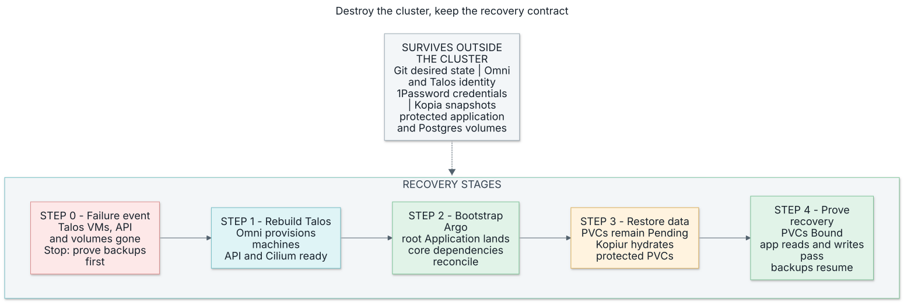

# Disaster Recovery

> The full-cluster destroy → rebuild → restore runbook. Concepts + per-PVC
> operations live in [storage-architecture.md](storage-architecture.md); the
> backup/restore engine (**kopiur**) and its exact flows live in
> [kopiur-backup-architecture.md](domains/storage/kopiur-backup-architecture.md)
> and [kopiur-mover-permissions.md](domains/storage/kopiur-mover-permissions.md).
> Databases are plain Postgres + kopiur (CNPG retired 2026-08-13 — history in
> the [plain Postgres migration doc](domains/cnpg/plain-postgres-migration.md))
> and use the same automatic PVC restoration. Database recovery still needs
> application-level acceptance; see [post-restore acceptance](#post-restore-acceptance).



*Recovery is complete only after desired state, credentials, and protected data
converge and are verified. [Open the full-size DR sequence](assets/disaster-recovery-sequence.svg).*

!!! danger
    The destructive steps require explicit operator intent. This documents the
    verified path; it is not an invitation to nuke during routine maintenance.

---

## The DR model in one diagram

```text
  Dies with the cluster            Survives (off-cluster)
  -----------------------          -------------------------------
  - Longhorn volumes               - Git repo
  - every Kubernetes object        - Kopia repo (RustFS S3)
  - exempt data:                   - 1Password vault
      PostHog CH/Kafka/Redis,
      Redis, scratch
                                   - Omni/Talos machine config

  Survives ==[ bootstrap-argocd.sh + sync waves ]==> New cluster
      New cluster
        ==[ kopiur Restore populators hydrate PVCs from Kopia ]==>
      All protected data back, unattended
```

Clusters are cattle. The Kopia repository, the Git repo, and the secrets
vault are the pets. Everything between them is reconstructed automatically.

!!! warning "Longhorn runs the V1 engine — do not switch to V2"
    Interrupted rebuilds under mass-restore load corrupt V2/SPDK replica metadata
    (upstream [#13315](https://github.com/longhorn/longhorn/issues/13315),
    [#13314](https://github.com/longhorn/longhorn/issues/13314)). Stay on V1.

---

## Pre-nuke checklist

Block the nuke until every box checks — **you restore *from* these**:

- [ ] GitHub reachable; the rebuild revision **pushed** (ArgoCD pulls origin, not your working tree)
- [ ] GHCR image pulls work
- [ ] 1Password reachable; Connect token valid and recoverable off-cluster
- [ ] Cloudflare token valid and recoverable off-cluster
- [ ] RustFS/S3 endpoint reachable; access key registered on the external server; Kopia auth works
      (a past nuke proved an unregistered external credential blocks recovery even with perfect Git state)
- [ ] Talos secrets / Omni machine configs available off-cluster
- [ ] **Backups fresh**: each backed-up PVC has a recent `Succeeded` kopiur `Snapshot` you can live with — apps roll back to exactly that snapshot. Spot-check across namespaces:
      `kubectl get snapshot -A` (look at the newest per source) and confirm no `SnapshotSchedule` is wedged: `kubectl get snapshotschedule -A`.
      To top up a stale one on demand: `kubectl kopiur snapshot now --policy <name> -n <ns>` (CLI ≥0.5.1, krew)
- [ ] **No PVC lacks a snapshot it expects to restore from.** A first restore only hydrates if a Snapshot already exists (kopiur `onMissingSnapshot: Continue` binds a snapshot-less PVC *empty* and backs up forward). Confirm every PVC you intend to *restore* (not seed) shows at least one `Succeeded` Snapshot before the nuke.
- [ ] Restore canary green: recent `last-drill-result=pass`

## Rebuild sequence

> **Historical identity migration:** the 2026-07-31 domain-prefix change is
> complete. Its merge-after-destruction step is not part of a normal rebuild.
> Future Application renames need a separate ownership/finalizer migration;
> deleting an old Application identity can prune the resources it owns.

```text
  omnictl cluster delete
    -> wait: machines drained, VMs gone in Proxmox
    -> omnictl apply machine classes + template validate/sync
    -> machines provision from the NEW template
    -> Gateway API CRDs
    -> seed Cilium CNI
    -> seed 1Password credentials
    -> bootstrap-argocd.sh
    -> sync waves install Cilium management -> Longhorn -> kopiur -> DB support
    -> generated apps: backed-up PVCs hydrate via restore-before-bind
    -> verify application reads/writes, credentials and fresh backups
```

> **Manual pre-steps before `bootstrap-argocd.sh`** — the script assumes them.
> Follow the single canonical procedure in `README.md` § Rebuild and Bootstrap.
> Skip the Cilium seed and the new cluster has no CNI (nodes stay `NotReady`);
> skip the 1Password seed and External Secrets can never start.

**Ordering rule (twice-learned):** machine classes and the cluster template
are **snapshots inside Omni** — apply + sync them *before* machines
provision, or VMs are built from stale state and must be reprovisioned. Applying
a changed MachineClass does not resize or replace an already allocated VM; a
replacement/full rebuild is required for its new virtual hardware to take
effect.

### Gate the wave train on cross-node pod networking

Run this after the Cilium install and **before** `bootstrap-argocd.sh`. Nodes
reaching `Ready` only proves the kubelet talks to the API server; it does not
prove that pods on different nodes can talk to each other. A rebuild is exactly
when that differs — new VMs, new NICs, new placement.

```bash
kubectl -n kube-system exec ds/cilium -c cilium-agent -- cilium-health status
```

Every node must report **`1/1` under both `Node` and `Endpoints`**. `Node 1/1`
with `Endpoints 0/1` is the trap: the node is reachable at its host IP while the
pod network to it is broken. Node-level checks, `kubectl get nodes`, and ICMP all
pass in that state.

Do not start the wave train with any node showing `Endpoints 0/1`. Sync waves
gate on pod readiness, which a broken pod network does not disturb — so the waves
proceed normally and the failures surface much later as unrelated apps stuck on
missing Secrets. Fix the network first; it is far cheaper than unwinding a
half-converged cluster.

**Bootstrap rules** (proven by the 2026-06 rebuilds):

- CRDs first, controllers second, CRs third.
- Observability is **not** a core dependency — core apps must bootstrap
  without Prometheus; `kube-prometheus-stack` is the sole owner of
  `monitoring.coreos.com` CRDs.
- The **kopiur operator** lands at **Wave 2** (`infrastructure/controllers/kopiur-operator/`
  — installs the CRDs + operator + webhook); **kopiur-config** at **Wave 3**
  (`infrastructure/controllers/kopiur/` — namespace, the `ClusterRepository
  cluster-kopia` → RustFS `s3://kopiur`, and the `ClusterExternalSecret`
  credential fan-out). Databases (Wave 4) and app backups (Wave 6) follow. The
  per-PVC kopiur CRs (`SnapshotPolicy`/`SnapshotSchedule`/`Restore`) and the
  `kopiur.home-operations.com/repo: cluster-kopia` namespace label render with
  each app at Wave 6.
- Replica rebuilds stay throttled to **1/node**
  (`infrastructure/storage/longhorn/node-failure-settings.yaml`) — a mass
  restore saturates any engine on shared homelab hardware; do not raise it
  mid-bootstrap.

## What the restore wave looks like (calibrated expectations)

- Each backed-up PVC is recreated from Git with `spec.dataSourceRef → Restore
  "<pvc>-restore"`. Kubernetes withholds binding while a populator
  `dataSourceRef` is present, so the **PVC sits `Pending`** until the kopiur
  populator restores the latest Kopia snapshot, then binds **with data** and the
  pod starts. (Full flow:
  [kopiur-backup-architecture.md §4](domains/storage/kopiur-backup-architecture.md#4-restore-before-bind-flow-the-dr-magic).)
- **Backend-down is fail-safe.** If the Kopia repo is **unreachable** during a
  restore, kopiur raises the backend error before the `onMissingSnapshot` decision,
  so the PVC stays `Pending` and retries — **it never binds empty over a black-holed
  backend.** The one case that *does* bind empty is a brand-new PVC with **no
  snapshot yet** while the repo is reachable (`onMissingSnapshot: Continue` =
  deploy-or-restore) — which is why the pre-nuke checklist insists a Snapshot exists
  for anything you intend to restore.
- Historical rebuilds of roughly 24 PVCs took about an hour. Current app count,
  data size, placement and storage load differ; this is a reference measurement,
  not a current recovery-time guarantee.
- **PostHog adds ~nothing to the wave**: only `postgres-data` restores
  (~165 MB actual — seconds to hydrate). Its ClickHouse/Kafka/Redis rebuild
  empty by design; PostHog's rebuild cost is the migrate Job re-creating the
  ClickHouse schema (minutes), not data movement.
- Past restore bursts increased etcd fsync latency and caused API readiness
  and leader-election failures. Watch those symptoms during recovery; persistent
  failures require investigating storage latency and node health. Do not assume
  every API failure is harmless restore load.
- A few movers may hit cross-node attach conflicts ("volume is currently
  attached to a different node") as Jobs recreate pods — Longhorn's
  attachment reconciler clears these; the last stragglers land as load drains.
- Verdict signals that something is actually wrong: a kopiur mover Job in
  `Failed`, a `Restore` stuck without ever populating its PVC (PVC `Pending`
  long after the repo is confirmed reachable), or a `Snapshot` stuck in error.
  Watch with `kubectl -n <ns> get snapshotpolicy,snapshotschedule,restore,snapshot`.
- **A `Failed` Restore is terminal — kopiur never retries it.** A mover pod
  stuck Unschedulable past `failurePolicy.podStartupDeadlineSeconds` fails the
  CR with `MoverPodWedged`, and no spec change or Argo sync resets it — an infra
  outage during the restore wave can fail every Restore at once. Recovery:
  delete the Failed CRs and let Argo recreate them — each fresh CR pins the
  then-latest snapshot; the unbound PVC is untouched throughout.

  ```bash
  kubectl get restore -A --no-headers | awk '$3=="Failed" {system("kubectl -n "$1" delete restore "$2)}'
  ```
- **Privileged-mover namespaces may lag a grant race** (upstream kopiur #194):
  in the three root-mover namespaces (home-assistant, tubesync, nginx-example)
  the controller can miss the `privileged-movers` annotation event when the
  namespace and CRs land together (exactly the DR cold-start timing) and leave
  `MoverPermitted=False` until a ~5 min backstop requeue. If a Restore there
  sits blocked well past that, nudge it: `kubectl -n <ns> annotate restore
  <name> kopiur.home-operations.com/kick="$(date +%s)"` (any no-op metadata
  touch retriggers reconcile).

## In-cluster registry and Gitea Actions

`registry.vanillax.me` is an in-cluster registry backed by cluster storage.
After a full nuke, the registry pod, Service, and HTTPRoute can all be healthy
while the registry catalog is still empty. Any workload pinned to
`registry.vanillax.me/...` will then fail with `ImagePullBackOff` until those
images are rebuilt or repushed.

Check the catalog from inside the registry pod:

```bash
kubectl exec -n kube-system deploy/registry -- \
  wget -qO- http://127.0.0.1:5000/v2/_catalog
```

Restore Gitea first, then get the Gitea Actions runner online. The runner
needs `Secret/gitea-actions/act-runner-token`; Git declares that as an
ExternalSecret and 1Password stores the generated token:

- vault: `homelab-prod`
- item: `gitea-actions`
- field: `act_runner_token`

Generate or rotate the token from the restored Gitea pod:

```bash
kubectl exec -n gitea deploy/gitea -- gitea actions generate-runner-token
```

If 1Password is not updated yet, this manual patch gets the live runner moving:

```bash
TOKEN="$(kubectl exec -n gitea deploy/gitea -- \
  gitea actions generate-runner-token | tail -n 1 | tr -d '\r\n')"
kubectl create secret generic act-runner-token \
  -n gitea-actions \
  --from-literal=token="$TOKEN" \
  --dry-run=client -o yaml | kubectl apply -f -
kubectl rollout restart -n gitea-actions deploy/act-runner
kubectl logs -n gitea-actions deploy/act-runner -c runner --tail=50
```

Expected runner log:

```text
runner: cluster-runner-1 ... declare successfully
```

For radar-ng, the recovery images are pinned in
`my-apps/development/radar-ng/`. If the registry is empty and the runner is not
usable yet, manually refill the exact pinned tags from local checkouts:

```bash
cd ~/programming/radar-ng/backend
VERSION=v1.1.4 ./scripts/build-push.sh tile-server
VERSION=v1.1.1 ./scripts/build-push.sh basemap open-meteo-worker
VERSION=v1.1.7 ./scripts/build-push.sh temporal-worker

cd ~/programming/talos-argocd-proxmox
./scripts/build-push-custom-apps.sh basemap-bootstrap
kubectl -n radar-ng delete job basemap-bootstrap
kubectl -n radar-ng rollout restart deploy/tile-server deploy/basemap deploy/open-meteo
kubectl -n radar-ng delete pod -l app=radar-ng-worker
```

An `Insufficient cpu` scheduling event means requests exceed an eligible node's
available allocatable CPU. Inspect affinity, taints and requests across eligible
nodes; low host utilization alone does not make a pod schedulable. Verify with:

```bash
kubectl describe node <eligible-node> \
  | sed -n '/Allocated resources:/,/Events:/p'
kubectl top nodes
```

## Post-restore acceptance

Record all three acceptance checks, with live evidence:

1. **Restore contract**: every backed-up PVC `Bound` via its kopiur `Restore`
   populator (none stuck `Pending`), and the first post-restore `Snapshot` for
   each source reaches `Succeeded`. Cross-check per namespace:
   `kubectl -n <ns> get pvc,restore,snapshot`.
2. **Exemption hygiene**: every intentionally backup-exempt PVC is still bound
   and still carries the fully-qualified
   `storage.vanillax.dev/backup-exempt-reason` annotation — non-zero isn't a
   restore failure but it masks real problems (history: two exempt PVCs once sat
   unnoticed because acceptance only quoted the protected counters). PostHog's
   ClickHouse/Kafka/Redis, standalone Redis, and `project-nomad/nomad-storage`
   are the expected exempt set (PostHog's `postgres-data` is protected — it
   carries the API keys/dashboards).

3. **Application recovery**: a Bound PVC is necessary but not sufficient. Check
   Postgres accepts authenticated connections and the app can read existing data
   and complete a normal write. Verify Gitea can read a known repository and its
   database, Paperless can retrieve an existing document, and Temporal can complete
   a new workflow/timer. For apps with separate file/database PVCs, confirm both
   restore points describe compatible data. Validate restored credentials against
   1Password before treating an authentication failure as data corruption.

---

## The restore canary

Point-in-time acceptance rots; the canary provides a safe, isolated place to
repeat the proof.

`my-apps/system/restore-canary/` re-runs the real DR path against a dedicated test
PVC: its `kopiur/restore-canary-data.yaml` stub carries the `SnapshotPolicy` +
`SnapshotSchedule` + `Restore`, and the PVC's `dataSourceRef` points at the `Restore`.
The `SnapshotSchedule` keeps a fresh snapshot and a weekly quick verification
checks repository blobs. Those automated checks do **not** prove a restore. To
drill the full path, write and hash a sentinel, force and wait for a successful
snapshot, delete the canary PVC **and its `Restore` CR**, and let Argo recreate
both so the populator re-hydrates the PVC:

```
sentinel (new UID + sha256) → forced kopiur Snapshot
→ delete the canary PVC AND restore-canary-data-restore
→ Git/Argo recreate both → Restore re-resolves to the new snapshot
→ kopiur populator restore → byte-identical verification
```

**Delete the `Restore` CR too — the drill is invalid without it.** A `Restore`
resolves its source **once, at admission, and never re-resolves**
(`status.resolved` is pinned; `offset: 0` means "latest as of admission", not
"latest now"). Delete only the PVC and the populator replays whatever snapshot
the `Restore` pinned on first use, so the drill reports `RestoreSucceeded`
against frozen data regardless of whether backups work. Every drill between
2026-08-03 and 2026-08-13 restored a 2026-06-10 sentinel this way and still
passed its own success check.

Gate the verdict on the pin before the bytes:

```
kubectl -n restore-canary get restore restore-canary-data-restore \
  -o jsonpath='{.status.resolved.pinnedAt} {.status.resolved.kopiaSnapshotID}'
```

`pinnedAt` must be newer than the drill snapshot. A healthy drill moves
`Pending → Restoring → Bound`; a PVC that binds instantly never ran the
populator, and a `TargetAlreadyBound` reason means the `Restore` short-circuited
because the PVC still existed.

A manually executed passing drill proves the *entire* chain — Git render, kopiur CR wiring,
kopia round-trip, populator restore — with data integrity checked by hash,
never touching production PVCs. Results land as
`restore-canary.vanillax.dev/last-drill-*` annotations on the namespace.

Treat a missing or stale `last-drill-*` annotation as “restore not recently
proven,” even when snapshots and quick verification are green. Automating the
destructive PVC deletion is intentionally deferred until a kopiur-native,
namespace-contained drill helper has been reviewed.

What it does **not** prove: restores of backups older than its own, or
app-level data semantics — drill those separately when they matter.

## Failure-mode catalog

Worked fixes for the things a hostile rebuild throws at you — stale CSI attachments,
read-only filesystems, wedged clone PVCs, finalizer-stuck resources — live in the
[common failure modes table](storage-architecture.md#common-failure-modes).
