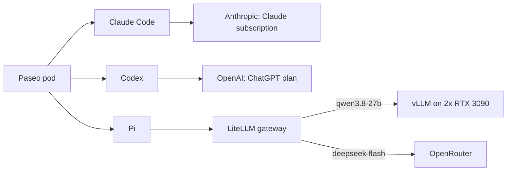

# Paseo and the AI stack

**Purpose:** explain how Paseo's coding agents reach their models, and where each setting lives.
**Status:** current state.
**Steps:** [Paseo README](https://github.com/mitchross/talos-argocd-proxmox/blob/main/my-apps/development/paseo/README.md) (connect, log in, verify).
**Agent map:** [Paseo CLAUDE.md](https://github.com/mitchross/talos-argocd-proxmox/blob/main/my-apps/development/paseo/CLAUDE.md).

## What Paseo is

Paseo is a browser workspace for coding agents. It runs as one pod in the `paseo` namespace.
You open `https://paseo.vanillax.me`, pick an agent, and the agent works in `/workspace` inside the pod.
The pod keeps running when you close the browser, so long tasks continue.

## Three agents, three ways to pay

| Agent | Model | Login | Cost |
|---|---|---|---|
| Claude Code | Anthropic models | one-time `/login` in the pod | Claude subscription limits |
| Codex | OpenAI models | one-time `codex login --device-auth` | ChatGPT plan limits |
| Pi | local Qwen, or DeepSeek through LiteLLM | none; key from 1Password | free locally, paid on OpenRouter |

Pi is the only agent that uses your GPUs. It talks to LiteLLM, never to vLLM directly.
LiteLLM records every call in Langfuse and holds the OpenRouter key.

## Where each setting lives

| Kind | Example | Lives in | Survives a pod restart because |
|---|---|---|---|
| Desired state | env vars, Pi model list, sampler hook | Git, applied by Argo CD | Argo CD reapplies it |
| Secret | Paseo password, LiteLLM key | 1Password, synced by External Secrets | ESO recreates the Secret |
| Login state | `gh`, Claude, Codex logins | `/home/paseo` volume | Longhorn keeps it; Kopiur backs it up daily |
| Tools | agent CLIs, compilers, aliases | the `paseo-dev` image | the digest is pinned in Git |

## Pi: PC and cluster use the same providers

The [Pi agent guide](pi-agent-local-dev.md#where-pi-runs-your-pc-or-the-cluster) compares both setups.
The cluster copy differs only in the LiteLLM URL. CI keeps the two equal.

## Image and other homelabs

The image lives in [homelab-images](https://github.com/mitchross/homelab-images/tree/main/images/paseo-dev).
Its README is a standalone setup guide for another homelab, without this cluster's secrets.

## Known limits

- A single password guards the public URL. Paseo has no login rate limit.
- The pod's GitHub login can reach every repo of the account.
- The shared Cilium policy lets the pod reach other cluster services.
