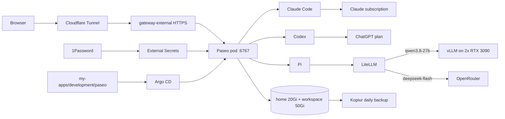

# Paseo: coding agents in the cluster

**Purpose:** host Paseo in this cluster, connect to it, log the agents in, and keep it running.
**Status:** current state. Argo CD syncs [`my-apps/development/paseo`](https://github.com/mitchross/talos-argocd-proxmox/tree/main/my-apps/development/paseo) as `my-apps-paseo`.
**Agent map:** [Paseo CLAUDE.md](https://github.com/mitchross/talos-argocd-proxmox/blob/main/my-apps/development/paseo/CLAUDE.md) says which repo owns which change.

## What Paseo is

Paseo is a browser workspace for coding agents. It runs as one pod in the `paseo` namespace.
You open `https://paseo.vanillax.me`, pick an agent, and the agent works in `/workspace` inside the pod.
The pod keeps running when you close the browser, so long tasks continue.



## How it is built

| Piece | Where | Notes |
|---|---|---|
| Image | `ghcr.io/mitchross/paseo-dev`, built in [homelab-images](https://github.com/mitchross/homelab-images/tree/main/images/paseo-dev) | Paseo, Claude Code, Codex, Pi, compilers, cluster CLIs. Pinned by digest in `deployment.yaml`. |
| Pod | [`deployment.yaml`](https://github.com/mitchross/talos-argocd-proxmox/blob/main/my-apps/development/paseo/deployment.yaml) | 1 replica, `Recreate`, uid/gid 1000, no service-account token, no liveness probe |
| Route | [`httproute.yaml`](https://github.com/mitchross/talos-argocd-proxmox/blob/main/my-apps/development/paseo/httproute.yaml) | `gateway-external`, so it is public through Cloudflare |
| Password | 1Password `paseo/password` → Secret `paseo-secrets` | Read at pod start |
| Pi's LiteLLM key | 1Password `litellm/master_key` → `paseo-secrets` | Same key as the other AI apps |
| Pi model list | [`config/pi-models.json`](https://github.com/mitchross/talos-argocd-proxmox/blob/main/my-apps/development/paseo/config/pi-models.json) → ConfigMap `pi-config` | Mounted read-only at `~/.pi/agent/models.json` |
| Qwen sampler hook | [`config/qwen-sampling.ts`](https://github.com/mitchross/talos-argocd-proxmox/blob/main/my-apps/development/paseo/config/qwen-sampling.ts) → `pi-config` | Mounted in `~/.pi/agent/extensions/` |
| Volumes | [`pvc.yaml`](https://github.com/mitchross/talos-argocd-proxmox/blob/main/my-apps/development/paseo/pvc.yaml) | `paseo-home` (logins, settings) and `paseo-workspace` (code), Longhorn, restore-before-bind |
| Backups | [`kopiur/`](https://github.com/mitchross/talos-argocd-proxmox/tree/main/my-apps/development/paseo/kopiur) | Daily snapshots, movers run as 1000:1000 |

Three settings in `deployment.yaml` matter:

| Env var | Value | Without it |
|---|---|---|
| `PASEO_HOSTNAMES` | `paseo.vanillax.me` | Requests fail with `403 Host not allowed` |
| `PASEO_TRUSTED_PROXIES` | `loopback,uniquelocal` | The page reports `useTls:false` and the browser cannot auto-connect |
| `PASEO_RELAY_ENABLED` | `false` | Paseo connects out to its public relay for phone pairing |

CI fails when `config/pi-models.json` or `config/qwen-sampling.ts` drift from the workstation
copies in the [Pi agent guide](pi-agent-local-dev.md) and `scripts/pi/`.

## 1. Connect from a browser

1. Open `https://paseo.vanillax.me`.
2. Click **Block** if the browser asks to "access other apps and services on this device".
3. Click **Direct connection** if Paseo does not connect by itself.
4. Enter host `paseo.vanillax.me`, port `443`, and turn on **Use SSL**.
5. Enter the password from 1Password `homelab-prod` → `paseo`.

Ignore **Paste pairing link**. It needs the relay, which is off.

## 2. Open a terminal

1. Click **Add project** → **Search for directory**.
2. Type `/workspace` and press Enter.
3. In the new workspace, change **Chat ⌄** to **Terminal**.
4. Leave the command box empty and press Enter.

The terminal runs inside the pod as user `paseo`.

## 3. Log in once

Each login stays in `/home/paseo`. Restarts and image updates keep it.

**GitHub:**

```bash
gh auth login --hostname github.com --git-protocol https --web
git config --global user.name "Mitch Ross"
git config --global user.email "mitchross@users.noreply.github.com"
```

1. Ignore the "failed to open browser" lines. The command keeps waiting.
2. Open `https://github.com/login/device` on your PC and enter the code.
3. Answer **Yes** to "Authenticate Git", so `git push` works.

**Claude Code** (Claude subscription, not API credit):

1. Run `claude`.
2. Type `/login` and choose the subscription account.
3. Open the link on your PC, approve, and paste the code back.
4. Type `/exit`.

**Codex** (ChatGPT plan):

1. Turn on **device code sign-in** in chatgpt.com → Settings → Security and login.
2. Run `codex login --device-auth`.
3. Open the link on your PC and enter the code.

**Check:**

```bash
gh auth status; claude --version; codex login status
```

Expect a GitHub account, a Claude Code version, and `Logged in using ChatGPT`.

**Memory and agent rules** (needs an image with Mink and chezmoi):

```bash
git config --global url."https://github.com/".insteadOf "git@github.com:"
git clone https://github.com/mitchross/mink-data.git ~/.mink
mink device rename paseo
mink sync pull && mink sync push && mink sync status
chezmoi init https://github.com/mitchross/dotfiles.git
chezmoi apply --exclude=scripts ~/.claude/CLAUDE.md ~/.codex/AGENTS.md ~/.pi/agent/AGENTS.md
```

1. Both repos are private. The `gh` login above gives `git` access over HTTPS.
2. The vault's synced config keeps the workstations' SSH remote. The `insteadOf` rule sends it over HTTPS in the pod only.
3. Do not run `mink sync init` on a fresh home: it fails without `~/.mink`, and the clone already enables sync.
4. Expect `Last pull` and `Last push` timestamps, and `Pending changes: 0`.
5. `chezmoi apply` writes only the three rule files. It renders the shared rules template in the dotfiles repo.

Clone project repos under `/workspace`, not in `/home/paseo`. The home volume holds logins, caches, and the Mink vault.

Never run `mink init` or `mink refresh-hooks` in the pod. They rewrite the repo's `.claude/` and `.pi/` hook files.
If `git status` shows those files changed, run `git restore` on them and do not commit them.

## 4. Use Pi with the cluster GPUs

Pi needs no login. It reads `LITELLM_API_KEY` from the pod environment.

```bash
pi -p "Reply with exactly: PASEO OK"
```

| Model | Runs on | Cost |
|---|---|---|
| `vanillax-vllm/qwen3.8-27b` | vLLM on the two RTX 3090s | free |
| `vanillax-auto/pi-auto` | LiteLLM picks Qwen or DeepSeek per request | sometimes paid |
| `vanillax-openrouter/deepseek-flash` | OpenRouter | paid |

Images built from homelab-images `main` add the bash aliases `pi-qwen-only`, `pi-withflash`, and `pi-flash`.
Check with `type pi-qwen-only`. `pi-direct-openrouter` does not exist in the pod: only LiteLLM holds the OpenRouter key.

## 5. Verify

```bash
kubectl -n argocd get application my-apps-paseo
kubectl -n paseo get pod,pvc,externalsecret,httproute
curl -s -o /dev/null -w '%{http_code}\n' https://paseo.vanillax.me/api/status
curl -s https://paseo.vanillax.me/ | grep -o '"useTls":[a-z]*'
```

Expect `Synced` and `Healthy`, one ready pod, both PVCs `Bound`, `401`, and `"useTls":true`.

## Change Paseo

| Change | Do this |
|---|---|
| Env vars, resources, route | PR to `my-apps/development/paseo/`. Argo CD rolls the pod. |
| Pi models or sampler | PR to the reference and the Paseo copy together. CI checks both. |
| Tools or agent versions | PR to homelab-images, wait for the CI image, then a digest PR here. |
| Password or LiteLLM key | Edit 1Password. Restart the pod when no agent work runs. |

Never edit files in the pod or on its volumes to change configuration. Git is the source of truth.

## Troubleshooting

| Symptom | Check |
|---|---|
| Browser shows the connect dialog every time | `"useTls"` on the page; it must be `true` |
| `403 Host not allowed` | `PASEO_HOSTNAMES` |
| Pi returns `400 No connected db` | `apiKey` in `config/pi-models.json` must start with `$` |
| `CreateContainerConfigError` | `kubectl -n paseo describe externalsecret paseo-secrets` |
| A PVC stays `Pending` | Restore status and storage events. Never delete the PVC. |
| An agent says it is not logged in | Log in again from the Paseo terminal (step 3) |

## Backups and rollback

```bash
kubectl -n paseo get snapshotpolicy,snapshotschedule,restore,snapshot
```

Snapshots must reach `Succeeded` with nonzero files before you rely on a restore.
See the [kopiur backup architecture](../storage/kopiur-backup-architecture.md).

Roll back an image by reverting its digest through a PR. Keep the PVCs.
Never delete the app directory as a rollback: Argo CD can prune the volumes.

## Skills, settings, and plugins

Keep personal skills and rules in a private repository. Restore them into `/home/paseo`.
Rewrite workstation paths for `/home/paseo` and `/workspace`. Project instructions arrive with each checkout.
Review hooks and MCP definitions before you enable them, and supply their credentials at runtime.

The image enables no third-party Paseo plugins. Review these before you opt in:

| Plugin | Use |
|---|---|
| [Shared Browser](https://github.com/omercnet/paseo-plugins/tree/main/paseo-shared-browser) | Share a workspace browser between agents and your phone. Needs Node 24 and a prepared Chromium runtime. |
| [PR Radar](https://github.com/omercnet/paseo-plugins/tree/main/pr-radar) | Track workspace PRs and checks. Needs an authenticated `gh`. |
| [Agent Monitor](https://github.com/omercnet/paseo-plugins/tree/main/agent-monitor) | Triage agents across workspaces. |

Plugins run with the daemon user's credentials and network access. Pin and test the versions you choose.

## Run Paseo on another cluster

[Run Paseo on another cluster](paseo-other-clusters.md) has Docker Compose and plain Kubernetes manifests, plus a prompt for a coding agent.
The image itself is built in [homelab-images](https://github.com/mitchross/homelab-images/tree/main/images/paseo-dev).

## Known limits

- One password guards the public URL. Paseo has no login rate limit.
- The pod's GitHub login can reach every repo of the account.
- The shared Cilium policy lets the pod reach other cluster services. See [network policy](../networking/policy.md).
- Pi uses LiteLLM's master key, so an agent can spend OpenRouter credit.
- After the memory step, the pod can read the private Mink vault and dotfiles.
