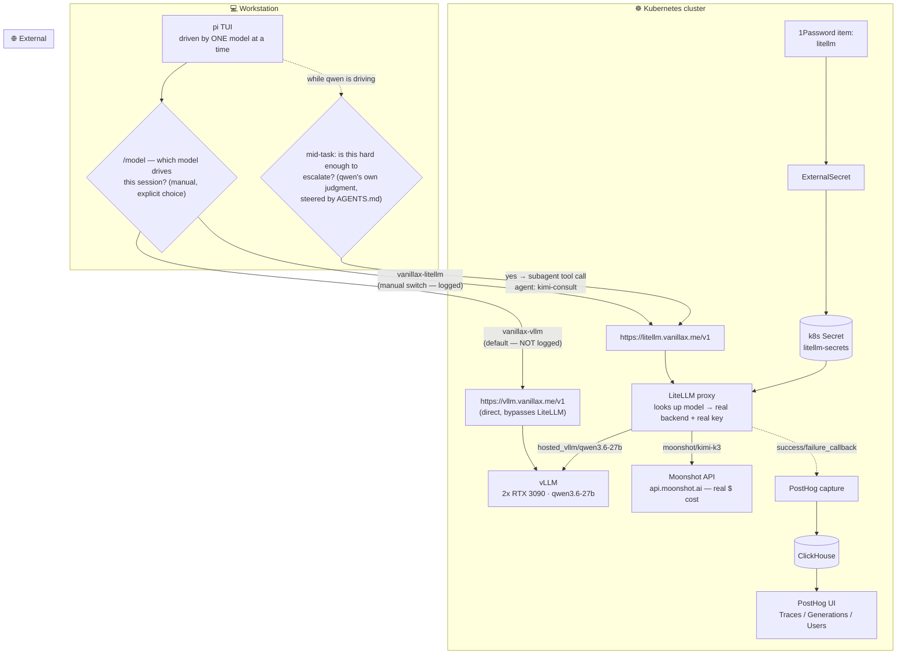

# Pi Agent — Claude-Code-Grade Local Dev on the Dual-3090 Backend

> Goal: fully local coding agents that match the Claude Code *capability set*
> — tools, repo context, skills, research — without using Claude Code. The
> toolchain is **[pi](https://github.com/badlogic/pi-mono) (primary) +
> [OpenCode](https://opencode.ai) (companion, §7)**, both backed by the
> cluster's tuned vLLM endpoint (`qwen3.6-27b`, TP=2 across both 3090s, 262K
> context, vision, tool calling). Free unlimited *volume*; keep paid frontier
> **APIs** (Anthropic/OpenAI/Google keys in the agents' provider lists) for
> the hardest 10%.
>
> Stack targets: Kubernetes/Talos GitOps (this repo), JavaScript/Node/
> TypeScript, Python, React Native, Temporal.io.
>
> Last updated: 2026-07-24 (added §9 — LiteLLM proxy + PostHog LLM Analytics,
> and the `kimi-consult` subagent; §4a's pi-subagents status corrected —
> it's back, for one targeted reason).

## Architecture

```
pi (workstation TUI)
  └── https://vllm.vanillax.me/v1          (internal gateway route, LAN only)
        └── vLLM TP=2 · qwen3.6-27b · 262K ctx · vision · qwen3_coder tool parser
              └── 2× RTX 3090 @ 290W cap (NVIDIA infrastructure DaemonSet)
```

Everything agent-side lives on the workstation (`~/.pi/agent/`); nothing here
deploys to the cluster. The backend is already agent-tuned **server-side** —
don't fight these from the client:

| Server flag (see `my-apps/ai/vllm/deployment.yaml`) | Why pi cares |
|---|---|
| `--served-model-name qwen3.6-27b` | the `id` pi must send |
| `--max-model-len 262144` | matches `contextWindow` below |
| `--max-num-seqs 2` | pi + ONE other consumer concurrently; a third request queues |
| `--enable-auto-tool-choice` + `--tool-call-parser qwen3_coder` | pi's tool calls parse natively |
| `--reasoning-parser qwen3` + thinking off by default | pi gets clean content; thinking is opt-in per request |
| `--override-generation-config` (temp 0.7 / top_p 0.8 / top_k 20 / presence 1.5) | correct Qwen agent sampling — leave pi's sampling unset |
| `--limit-mm-per-prompt {"image": 16}` | screenshot budget per prompt (pi resends the whole convo — see gotchas) |
| HTTPRoute `timeouts: 30m` | long generations won't be cut by the gateway |

## 1. Point pi at the cluster — `~/.pi/agent/models.json`

```json
{
  "providers": {
    "homelab": {
      "baseUrl": "https://vllm.vanillax.me/v1",
      "api": "openai-completions",
      "apiKey": "none",
      "compat": {
        "supportsDeveloperRole": false,
        "supportsReasoningEffort": false,
        "supportsUsageInStreaming": false,
        "thinkingFormat": "qwen-chat-template"
      },
      "models": [
        {
          "id": "qwen3.6-27b",
          "name": "Qwen3.6-27B (homelab 2x3090)",
          "reasoning": true,
          "input": ["text", "image"],
          "contextWindow": 262144,
          "maxTokens": 32768,
          "cost": { "input": 0, "output": 0 }
        }
      ]
    }
  }
}
```

- `"qwen-chat-template"` is a pi ≥0.80 built-in preset that maps pi's thinking
  toggle (Shift+Tab) to Qwen's `enable_thinking` chat-template kwarg — no
  manual `chatTemplateKwargs` block needed. Verified against the server
  (2026-07-06) via vLLM `/tokenize`: per-request kwargs are honored (nothink
  renders the forced-empty `<think></think>`, +2 tokens). The server defaults
  thinking off (`--default-chat-template-kwargs`); `models.json` hot-reloads
  on `/model`, no restart needed.
- `"supportsUsageInStreaming": false` matches what this vLLM route delivers —
  side effect: **pi's token counters read 0** for these runs. Measure work in
  wall time and tool-call counts (from the session JSONL), not tokens.
- `input: ["text","image"]` enables pi's screenshot flow (the 27B is
  multimodal).
- Select with `/model` or `pi --model qwen3.6-27b`. Verify tools work:
  `pi "read package.json and summarize the scripts"` — you should see a
  `read` tool call, not a hallucinated answer.

## 2. Claude Code → pi capability map

| Claude Code | pi equivalent | Notes |
|---|---|---|
| `CLAUDE.md` | `AGENTS.md` (global `~/.pi/agent/`, plus per-repo, concatenated up the dir tree) — and pi ≥0.80 **discovers `CLAUDE.md` natively** (see `--no-context-files` in `pi --help`) | no symlink needed: this repo's nested `CLAUDE.md`s load as-is |
| Skills | Skills — **same Agent Skills standard** | `~/.pi/agent/skills/` or `.pi/skills/`; invoke `/skill:name` |
| Slash commands | Prompt templates in `~/.pi/agent/prompts/` / `.pi/prompts/` | plain markdown, `/name` expands |
| MCP servers | **`pi install npm:pi-mcp-adapter`** (not in core — see §4a) | token-efficient proxy: ONE `mcp` tool (~200 tokens) instead of hundreds of tool defs |
| Subagents / Task | **`pi-subagents` package** (not in core) | parallel isolated agents — but see the `max-num-seqs 2` warning in §4a |
| Plan mode | **`pi-plan` package** — read-only planning + approval-based execution | the Claude Code plan-mode equivalent |
| Session resume / compact | `pi -c`, `pi -r`, `/compact` — plus a **session TREE**: `/fork`, `/tree`, branch and switch | sessions are JSONL trees, not linear — better than Claude Code for exploring alternatives |
| Permission modes | ⚠️ **none by default — "YOLO mode"** | see the safety note below; `trust.json` + `--tools`/`--exclude-tools` + opt-in permission-gating extensions |
| Hooks | 25 in-process TypeScript extension events (tool streaming, bash spawn interception, dynamic system prompt, context access) | richer than Claude Code's 14 shell hooks |
| Custom tools/hooks | TypeScript extensions in `~/.pi/agent/extensions/` | can replace built-ins, add checkpointing; `--mode rpc` drives pi from external scripts |

The design difference: Claude Code ships everything integrated; pi keeps the
**core minimal** and everything else — MCP, subagents, memory, planning — is
opt-in via the [pi.dev/packages](https://pi.dev/packages) ecosystem
(`pi install npm:<pkg>` / `pi install git:<repo>`; `pi list` / `pi update
--all` to manage). For a batteries-included start there's **LazyPi** — but
read the local-model verdict in §4a before running it. On this stack the
shell still covers most needs — every system we run (Kubernetes, ArgoCD,
Temporal, git, pnpm, uv) has a first-class CLI — so treat packages as
additive, not required.

## 3. Global `~/.pi/agent/AGENTS.md` starter

```markdown
# Environment
- Local model (qwen3.6-27b on homelab vLLM). Free tokens, 262K window, but
  PREFILL IS EXPENSIVE: keep context lean, prefer targeted reads over
  dumping whole trees. Compact or /new between unrelated tasks.
- You have bash. Prefer CLIs over guessing: kubectl, talosctl, argocd,
  temporal, gh, jq, curl.

# Kubernetes / homelab (talos-argocd-proxmox repo)
- GitOps ONLY: never kubectl apply/edit/delete to fix state — change git,
  let ArgoCD sync. kubectl is for READING (get/describe/logs/events).
- Directory = ArgoCD Application. Every YAML must be listed in its
  kustomization.yaml. Follow the repo's CLAUDE.md files — they are law.
- Secrets: 1Password + ExternalSecret. Never write a secret into git.

# TypeScript / Node
- pnpm. Strict TS. No `any` without a comment. Vitest for tests.
- Match existing lint/format config; run `pnpm tsc --noEmit && pnpm lint`
  before declaring done.

# Python
- uv for envs/deps. ruff for lint+format. pytest. Type hints on public
  functions.

# React Native
- Expo unless the repo says bare. Never edit ios/android generated dirs
  by hand in managed projects. After native dep changes: rebuild dev
  client, not just metro reload.

# Temporal
- Workflow code MUST be deterministic: no Date.now/Math.random/direct IO
  in workflows — use activities, side effects, or workflow APIs.
- Versioning: use patching/versioned workflows for changes to in-flight
  workflow definitions. Test with @temporalio/testing time-skipping.

# Verification discipline
- Done = ran it. Tests, typecheck, or a real invocation — paste the output.
```

Per-repo `AGENTS.md` adds specifics (commands, layout). For *this* repo the
nested `CLAUDE.md` files already contain the right content — reuse them.

## 4. Skills for the stack

Skills are directories with a `SKILL.md` (Agent Skills standard — same format
Claude Code uses, so they're portable both ways). Suggested starter set under
`~/.pi/agent/skills/`:

### `k8s-debug/SKILL.md`

```markdown
---
name: k8s-debug
description: Read-only triage of the homelab Kubernetes cluster (Talos +
  ArgoCD). Use when asked to investigate pod failures, sync errors, PVC
  issues, or GPU workload state.
---

READ-ONLY. Diagnose with kubectl get/describe/logs/events and argocd CLI;
propose fixes as git diffs against talos-argocd-proxmox, never kubectl
apply/edit.

Triage order:
1. `kubectl get applications -n argocd | grep -v 'Synced.*Healthy'`
2. `kubectl -n <ns> get pods,pvc,events --sort-by=.lastTimestamp | tail -30`
3. `kubectl -n <ns> logs <pod> --previous --tail=100` for crash loops
4. GPU apps (vllm/llama-cpp/comfyui) are mutually-exclusive whole-card
   scale-swaps — "Pending + 0/2 nodes available (gpu)" usually means another
   GPU app holds the cards, NOT a broken scheduler.
5. Backups: `kubectl -n <ns> get snapshotpolicy,snapshotschedule,restore,snapshot`
```

### `research/SKILL.md`

```markdown
---
name: research
description: Web research via the homelab's local search stack (SearXNG +
  Perplexica). Use for library docs, error messages, release notes, or any
  "look this up" request.
---

Two tiers, both local/private:

1. Quick lookups — SearXNG JSON:
   `curl -s 'https://search.vanillax.me/search?q=QUERY&format=json' | jq '.results[:5] | .[] | {title, url, content}'`
   (needs `format: json` enabled in SearXNG settings — check once)
2. Synthesized answers with citations — Perplexica (vane v1.12) API.
   Schema pinned against the deployed version (verified 2026-07-05): the old
   `focusMode` field is GONE; `sources` is an array and `chatModel`/
   `embeddingModel` are required `{providerId, key}` objects. Use
   `"stream": true` — non-stream buffers the whole agent run (can exceed
   120s); streaming returns `sources` events in seconds:
   `curl -sN -m 180 https://perplexica.vanillax.me/api/search -H 'Content-Type: application/json' -d '{"query":"QUERY","sources":["web"],"optimizationMode":"speed","stream":true,"chatModel":{"providerId":"llama-cpp-cluster","key":"qwen3.6-27b"},"embeddingModel":{"providerId":"transformers-default","key":"Xenova/all-MiniLM-L6-v2"}}'`
   (output is ND-JSON events: `sources` then `response` chunks; if models
   change, re-list with `curl -s https://perplexica.vanillax.me/api/providers`.
   The chat model is the SAME vLLM instance pi runs on — each call takes one
   of the two `--max-num-seqs` slots.)

Fetch promising URLs with `curl -sL` and read the content — don't answer
from snippets alone. Cite URLs in the final answer.
```

### `temporal-dev/SKILL.md`

```markdown
---
name: temporal-dev
description: Inspect and debug Temporal workflows on the homelab cluster
  (worker versioning, stuck workflows, task queue backlogs).
---

UI: https://temporal.vanillax.me
CLI: port-forward the frontend first (verify svc name in the temporal ns):
  `kubectl -n temporal port-forward svc/temporal-frontend 7233:7233 &`
  `temporal --address localhost:7233 workflow list --query 'ExecutionStatus="Running"'`
Useful: `temporal workflow show -w <id>` (event history — find the stuck
activity), `temporal task-queue describe -t <queue>` (are workers polling?).
KEDA scales workers off task-queue depth — a backlog with 0 workers means
check the ScaledObject before blaming the worker image.
```

JS/TS, Python, and React Native generally don't need skills — they need the
conventions in `AGENTS.md` plus pi's built-in `read/edit/bash/grep`: the model
runs `pnpm test`, `tsc`, `ruff`, `pytest`, `npx expo` like any other command.
Add a skill only when a workflow has non-obvious steps worth encoding (e.g.
a `release/` skill for your publishing checklist).

## 4a. Extensions: MCP, subagents, plan mode

Core pi has none of these; the package ecosystem does. What's worth installing
here, and why the choices interact with the *local* backend:

```bash
pi install npm:pi-mcp-adapter   # MCP servers (restart pi after)
pi install npm:pi-plan          # read-only plan mode + approve-to-execute
# npm:pi-subagents — NOT installed (removed 2026-07-06: zero usage in session
# history, and wide fan-outs fight --max-num-seqs 2 anyway; reinstall if a
# real parallel-isolation need appears — read the warning below first)
```

**MCP via `pi-mcp-adapter`** — config lives in `~/.pi/agent/mcp.json` (global)
or `.mcp.json` / `.pi/mcp.json` (per-project), Claude-compatible format:

```json
{
  "mcpServers": {
    "chrome-devtools": {
      "command": "npx",
      "args": ["-y", "chrome-devtools-mcp@latest"]
    },
    "some-http-server": {
      "url": "http://localhost:3845/mcp",
      "headers": { "Authorization": "Bearer ${API_KEY}" }
    }
  }
}
```

Manage with `/mcp` (interactive panel), `/mcp setup`, `/mcp reconnect <server>`.

Why this adapter is the right one for a **local** model specifically: it
exposes **one `mcp` proxy tool (~200 tokens) instead of hundreds of tool
definitions**, with on-demand tool search and lazy server lifecycle (connect
on first call, disconnect after idle). On the 27B, prefill is the tax (gotcha
#1) and every tool definition is resent each turn — a fat MCP toolset would
bloat every single request. Keep proxy mode as the default; promote only your
hottest 2–3 tools to `"directTools"` if the model fumbles the proxy calls.

Useful servers for this stack: `chrome-devtools-mcp` (React/React-Native web
debugging — the one capability plain bash can't fake), a Kubernetes MCP server
if you want structured cluster reads instead of the `k8s-debug` skill's
kubectl calls, GitHub MCP for PR/issue flows. Skip MCP wrappers for things
with good CLIs (temporal, argocd) — the CLI costs zero context.

**Subagents (`pi-subagents`) — reinstalled 2026-07-24, for one specific
reason: `kimi-consult` (§9).** It was removed 2026-07-06 (zero usage, and
every extension is failure surface — see the scripted-mode section) with the
warning that parallel subagents each open their own request against vLLM,
where `--max-num-seqs 2` means a fan-out of 3+ queues. That warning still
holds for **general-purpose subagents against the local backend** — but
`kimi-consult` doesn't hit vLLM at all; it's a single subagent pinned to a
*different* model/provider (Kimi K3 via LiteLLM → Moonshot's API), so it
doesn't touch the `max-num-seqs` budget. Don't reintroduce wide parallel
fan-outs of `worker`/`scout`/etc. against the local model without reading the
warning above first; `kimi-consult` alone doesn't reopen that problem.

**Plan mode (`pi-plan`)** — read-only propose→approve→execute. Recommended
default for anything touching this repo, since a wrong `kubectl` habit here
becomes a cluster incident; it pairs with the `k8s-debug` skill's
"diagnose read-only, fix via git" rule.

### ⚠️ Scripted mode (`pi -p`) reliability — learned the hard way (2026-07-06)

Driving pi non-interactively (`pi -p`, cron, CI, benchmark harnesses) hit an
**intermittent pre-request hang**: the node event loop parks before the first
HTTP request ever leaves the machine (server provably idle, ~0 CPU), and pi
has **no client-side request timeout**, so it hangs until the HTTPRoute's 30m
cut. Reproduced 5× in one session; forensics stack-sampled to the event loop.
What we know:

- **`@narumitw/pi-goal` was the main aggravator** — it reacts to task-shaped
  prompts ("fix X", "implement Y") pre-request; trivial prompts ("run ls")
  always passed. Removing it (`pi remove npm:@narumitw/pi-goal`) fixed the
  streak instantly — but ONE recurrence without it says it's a startup race
  pi-goal aggravates, not solely causes.
- **`--no-extensions` does NOT unload settings.json packages** — it only
  disables extension *discovery*. Bisecting with `-ne` proves nothing about
  installed packages; use `pi remove` (or `pi config`) to actually exclude one.
- Interactive TUI use is unaffected — this is a scripted-mode problem.

Operational rules for scripted pi:
1. Put the instructions in a `TASK.md` and prompt just
   `"Read TASK.md in this directory and do exactly what it says."` — short
   argv prompts, instructions in files.
2. Wrap every run in a watchdog: if no session-JSONL event appears within
   ~2 min, kill and relaunch (a retry almost always lands).
3. Constrain debugging turns: "no prose — write a repro, run it, minimal fix,
   verify" (see gotcha #11 for why).

### LazyPi — use the picker, not "install all" (local-model verdict)

[LazyPi](https://lazypi.org/) (`npx @robzolkos/lazypi`) is a curated
one-command bundle: 60+ community skills, 76 themes, MCP support, subagents,
persistent memory, planning mode, diff review, a Claude Code CLI provider.
Validated facts that matter for THIS setup:

- **It coexists with our custom provider.** LazyPi installs packages into
  `~/.pi/agent/` and never touches `models.json` — the homelab vLLM wiring
  is untouched. Installs are idempotent (re-runs skip installed packages),
  removal is per-package (`npx @robzolkos/lazypi remove <id>`), and the
  installed pieces work independently of LazyPi afterward.
- **The 60-skill firehose is a prefill tax on a local model.** pi loads
  skills by progressive disclosure — full instructions load on demand, but
  **every installed skill's name+description sits in the system prompt of
  every request**. 60+ descriptions ≈ a couple thousand tokens re-prefilled
  each turn on a backend where prefill is already the bottleneck (gotcha
  #1), and it erodes pi's core advantage (a ~200-token system prompt).
  Community reception says the same: the author's own retro
  (["LazyPi made people mad"](https://www.zolkos.com/2026/04/21/lazypi-made-people-mad))
  notes real praise as an onboarding ramp, alongside criticism that many
  extensions "eat up a lot of system-prompt context" and most users
  eventually pare down.
- **A 27B is also more distractible than a frontier model.** More skill
  descriptions = more invocation surface to fumble. pi's own docs admit
  models "don't always" read the full SKILL.md before acting; keep the
  skill list short so the daily driver can't grab the wrong one.
- **Every extension is in-process failure surface, not just prompt bloat.**
  Live evidence (2026-07-06): a single convenience extension (`pi-goal`)
  silently wedged every scripted task-shaped run pre-request and cost an
  hour to bisect (§4a scripted-mode section). Sixty more packages is sixty
  more chances at that. The bar is now: an extension must justify itself
  against "this might be the next thing I spend an hour bisecting."

**Verdict: works with our model and setup, but run the interactive picker
and take ~6–8 pieces, not everything.** Worth taking: `pi-mcp-adapter`,
`pi-plan`, diff review, memory (trial it — it also injects
context each turn), a theme. Skip: the bulk skill catalog (write the 3–4
skills from §4 instead), usage tracking (local = $0), and the **Claude Code
CLI provider** (this toolchain doesn't use Claude Code; frontier access is
via plain API keys as built-in pi providers).

**Verify after install:** send one message and read pi's live token footer.
If the first-turn prompt grew by thousands of tokens vs. pre-LazyPi, prune
skills until it's back near baseline; `npx @robzolkos/lazypi doctor` checks
install health.

### ⚠️ Safety note: pi ships in "YOLO mode"

Unlike Claude Code's deny-first permissions, **pi executes tools with NO
guardrails by default** (the author's position: "security in coding agents is
mostly theater"). With a bash tool and a kubeconfig on the same machine,
the model *can* run `kubectl delete`. Layered mitigation for cluster work:

1. **Give pi a read-only kubeconfig.** Create a `view`-bound ServiceAccount
   kubeconfig and export `KUBECONFIG` to it in pi sessions; keep the admin
   kubeconfig out of the agent's environment. This is the only *hard*
   guarantee on the list.
2. `pi-plan` for propose→approve on anything mutating.
3. AGENTS.md rules (GitOps-only) — soft, but the 27B follows them well with
   the tuned sampling.
4. An opt-in permission-gating extension from pi.dev/packages if you want
   Claude-Code-style prompts for specific commands.

## 4b. Workflow patterns worth stealing (community-proven)

- **Multi-stage review loop, free at local prices:** spec → implement →
  **review with a fresh context window** (`/fork` or a subagent) → fix → test.
  On paid APIs this pattern doubles cost; on your hardware the only cost is
  the prefill wait. This is the single most-cited pi extension pattern — and
  the fresh-context review catches what the implementing context is blind to.
- **Mix local + frontier in one session:** add your Anthropic/OpenAI key
  alongside the homelab provider (built-in providers need only `/login` — no
  models.json entry) and **Ctrl+P cycles models mid-session**. Daily loop on
  `qwen3.6-27b` for free; hit a wall → Ctrl+P to a frontier model for one
  hard turn → cycle back. This is the "local volume, frontier judgment"
  economics from the wind-down plan, inside a single conversation.
- **Session tree instead of restarts:** `/fork` before a risky refactor,
  `/tree` + switch back if it goes sideways — cheaper than `/new` because the
  shared prefix prefill is preserved by vLLM's prefix caching
  (`--enable-prefix-caching` is on).
- **Plans as files, not modes:** write plans to `PLAN.md` in-repo and have pi
  read them per session — survives context resets, gets version control, and
  works identically in OpenCode when you switch agents (§8).

## 5. Research & RAG strategy

- **Code understanding: agentic retrieval beats embedding RAG.** With 262K of
  context and grep/read tools, pi navigates repos the way Claude Code does —
  search, open, follow imports. Don't build a vector index of your code; it
  goes stale and retrieves worse than the model's own targeted greps.
- **Web research:** the `research` skill above (SearXNG for hits, Perplexica
  for synthesized+cited answers). This is the local replacement for Claude
  Code's WebSearch/WebFetch.
- **Long-document Q&A:** just read the file(s) into context — that's what the
  262K window is for. But mind the prefill bill (below); for a 500-page spec,
  Perplexica-style retrieval first, full read second.
- **Offline references:** the Kiwix instance (wired into open-webui's mcpo)
  is also plain HTTP — add a curl line to the research skill if devdocs/wiki
  bundles are loaded.

## 6. Operational gotchas (the ones that will bite)

1. **Prefill is the tax, not decode.** pi resends the whole conversation
   every turn; at 100K+ context each turn pays a multi-second-to-minutes
   prefill even with chunked prefill enabled. Discipline: `/compact` at
   milestones, `/new` per task, don't paste what the model can `read`.
2. **Concurrency budget is 2.** `max-num-seqs 2` at 262K. pi + Open WebUI is
   fine; pi + Perplexica deep-research + Karakeep tagging burst = queuing.
   One heavy agent at a time.
3. **Screenshots accumulate.** The 16-image cap exists because pi resends
   convo history (see deployment.yaml comment). If a session wedges with
   "At most N image(s) per prompt", `/compact` (drops old images) or `/new`.
4. **Internal route only.** `vllm.vanillax.me` resolves via the internal
   gateway — works on LAN/VPN, not from outside. Don't expose the /v1
   endpoint externally; it's unauthenticated.
5. **Don't override sampling client-side.** Server defaults are the tuned
   Qwen-agent profile (incl. presence_penalty 1.5, which stops tool-call
   loops). If pi settings expose temperature etc., leave them unset.
6. **After GPU scale-swaps, pi errors are expected.** If vLLM is scaled to 0
   (image-gen session on the cards), pi gets connection errors — that's the
   whole-card topology, not a bug. Scale vLLM back to 1 in git.
7. **Empty responses with thinking enabled = known local-model gotcha.**
   Community reports (pi + local Qwen) of `enable_thinking` producing
   empty `content`: everything lands in the reasoning channel and the
   client shows nothing. Our server-side `--reasoning-parser qwen3` should
   split it correctly — but if pi renders empty turns with thinking on,
   drop the `chatTemplateKwargs` thinking mapping and run nothink (the
   daily default anyway).
8. **vLLM fails loud, Ollama fails silent — that's a feature.** The
   Ollama-based pi guides warn that oversizing `num_ctx` silently falls
   back to CPU and "tanks tool-call reliability." vLLM has no such mode:
   requests over budget error visibly. If pi starts erroring at huge
   contexts, that's the 262K/KV budget talking — `/compact`, don't retry.
9. **Free upgrade pending:** swapping the vLLM checkpoint to AutoRound INT4 +
   MTP n=3 (club-3090's default dual recipe) is specifically a *code-decode*
   win (149 → ~264 TPS on code) — pi is the workload that benefits most.
   Tracked in `3090-llm-optimization.md`.
10. **Scripted `pi -p` can hang pre-request, forever.** No client timeout;
    intermittent startup race aggravated by prompt-reactive extensions
    (pi-goal). Full story + workarounds (TASK.md prompts, watchdog+retry,
    `--no-extensions` caveat) in §4a's scripted-mode section.
11. **Open-ended debug prompts trigger mega-generations.** "Diagnose the root
    cause" once produced a 25-minute unbounded think-ramble (model simulating
    the program in its head instead of running it). Constrain debug turns to
    tool use: write a repro, run it, minimal fix. And when giving the model
    failing-test feedback, give the FULL expected output and quote the spec
    rule — partial hints once produced a confident spec-violating "fix" that
    masked the symptom and self-declared success.
12. **The 27B's blind spots survive its own verification.** Benchmarked
    2026-07-06 (hard cron+DAG-scheduler challenge, 32 hidden tests): one-shot
    96.9% in ~10 min — genuinely strong, better cron algorithm than the
    frontier reference — but a checklist+self-tests discipline run scored the
    SAME 96.9% with the SAME bug: its self-written checklist omitted the rule
    it misconceived, and its self-tests avoided the case. One round of
    precise external feedback → 100% in 60s. Moral: local model writes the
    code; an external oracle (real tests, frontier review) buys the last 3%.

## 7. OpenCode alongside pi (same backend, different job)

OpenCode is the second agent in the toolchain — same vLLM endpoint, same
`AGENTS.md` files (both tools read them), different strengths. Wire it via
`~/.config/opencode/opencode.json` (or per-project `opencode.json`):

```json
{
  "$schema": "https://opencode.ai/config.json",
  "provider": {
    "homelab": {
      "npm": "@ai-sdk/openai-compatible",
      "name": "Homelab vLLM (2x3090)",
      "options": { "baseURL": "https://vllm.vanillax.me/v1" },
      "models": {
        "qwen3.6-27b": {
          "name": "Qwen3.6-27B",
          "limit": { "context": 262144, "output": 32768 }
        }
      }
    }
  },
  "model": "homelab/qwen3.6-27b"
}
```

The `models` key must exactly match the served model id (`qwen3.6-27b`);
restart OpenCode after editing and it appears in the model picker. Frontier
API keys slot in as normal OpenCode providers next to it.

**When to reach for which:**

| | pi | OpenCode |
|---|---|---|
| Philosophy | minimal core, you compose it | fuller IDE-in-terminal out of the box |
| Code intelligence | grep/read | **built-in LSP** — real go-to-def/diagnostics |
| MCP | via `pi-mcp-adapter` (token-lean proxy) | native |
| Plan mode | `pi-plan` package | built-in plan/build agent modes |
| Sessions | **tree with fork/branch** | linear |
| Extensibility | TypeScript extensions, 25 events | config + MCP |
| Best at (here) | k8s/GitOps flows with custom skills, experiments, session branching | day-in-day-out TS/Python/React-Native editing where LSP pays |

Shared-backend rule: **both agents count against `--max-num-seqs 2`.** pi +
OpenCode simultaneously is the whole budget — fine for you alone, but don't
also fire a Perplexica deep-research run mid-session. And OpenCode exposes
per-model context limits in config (above) — keep them matching the server
so it compacts instead of erroring at the ceiling.

## 8. Verify checklist

- [ ] `pi --list-models` shows `qwen3.6-27b`; `/model` selects it
- [ ] `pi "run 'ls' and tell me what you see"` → real `bash` tool call
- [ ] Tool-call loop test: "read X, edit Y, run tests" chain completes
      without the model narrating instead of calling tools
- [ ] Shift+Tab thinking toggle produces `<think>`-backed answers (server
      splits it into `reasoning_content`; pi should render it as thinking)
- [ ] Paste a screenshot → model describes it (vision path through gateway)
- [ ] `/skill:research quick lookup test` hits SearXNG and returns JSON
- [ ] (if pi-mcp-adapter installed) `/mcp` lists servers; a proxy
      `mcp({ search: ... })` call resolves a tool
- [ ] Long session: `/compact` works and the next turn's prefill drops

## 9. LiteLLM proxy — logging pi's LLM usage to PostHog

A second, optional path: an in-cluster **LiteLLM proxy** (`my-apps/ai/litellm/`)
sits between pi and its backends purely for observability — every request's
tokens, cost, latency, and model land in the self-hosted PostHog instance's
**LLM Analytics** (Clusters/Playground included, same ingestion feeds all
three). It doesn't replace the direct vLLM path above; it's a second provider
you opt into per-model.



**The one thing worth being precise about:** the everyday `vanillax-vllm` path is
**not logged**. Only traffic through LiteLLM — a manual `/model` switch, or a
`kimi-consult` escalation — shows up in PostHog.

### How the routing decision actually works

There are two *different* decisions hiding in "how does pi know to use qwen or
k3" — don't conflate them:

**1. Which model drives the session — manual, not automatic.** pi runs one
model at a time as the "brain" of a session; it doesn't dynamically pick
per-message. You choose it explicitly (`/model` or `--model`) and it stays
active — reading prompts, deciding tool calls, writing every response — until
you switch it. pi never swaps its own driver model on its own initiative.

**2. Whether the driver calls out to Kimi mid-task — automatic, an LLM
judgment call, not routing logic.** This is a **tool call**, not routing:

1. `@narumitw/pi-subagents` registers a `subagent` tool the driver (qwen) can
   call like any other tool (read/edit/bash/…).
2. `{"agent": "kimi-consult"}` is a valid argument because
   `~/.pi/agent/agents/kimi-consult.md` declares an agent by that name, with
   `model: vanillax-litellm/kimi-k3` in its frontmatter.
3. Whether qwen actually emits that call on a given turn is qwen's own
   reasoning, steered (not forced) by the "Escalate to Kimi K3" section in
   `AGENTS.md`. It's non-deterministic — the same task might or might not
   trigger it, same as deciding whether to reach for `grep`.
4. When it fires, `pi-subagents` (plain extension code, not an LLM) spawns a
   **second, separate pi process** configured per `kimi-consult.md` — pinned
   to `vanillax-litellm/kimi-k3`, read-only tools only — runs it to
   completion, and hands its final answer back to qwen as the tool result.
   Qwen keeps driving, now with Kimi's opinion in context.

No box "decides" between qwen and Kimi — qwen always decides, and Kimi only
ever appears as a tool result inside qwen's own conversation, never as a peer.

### What each box does

| Box | What it actually does |
|---|---|
| `vanillax-vllm` / `vanillax-litellm` (`models.json` entries) | Not services — client-side config only. Each tells pi "here's a base URL, an API key, and the model IDs + specs available there." Selecting a model just points pi's OpenAI-compatible HTTP client at one entry. |
| **LiteLLM proxy** | The only box doing real work in the middle. Per request: validate `Authorization: Bearer <master_key>` → read the `model` field → look it up in its own `model_list` for the *real* upstream + *real* credentials → forward using its own server-side key (pi never sees Moonshot's key or vLLM's) → stream the response back → fire-and-forget a PostHog event with token/cost/latency. A dictionary lookup + credential swap, nothing smarter. |
| **vLLM** | Doesn't know or care that LiteLLM exists. Identical GPU backend either way — the direct route and the LiteLLM-proxied route are just two different front doors to the same service. |
| **Moonshot's API** | Third-party SaaS, entirely outside the cluster. LiteLLM is just an HTTP client of it, same as pi would be directly — except pi's request only ever carries LiteLLM's master key, which Moonshot has never heard of. |
| **PostHog capture → ClickHouse** | `capture` validates/buffers events; the rows land in ClickHouse, which Traces/Generations query. The Dashboard tab's errors come from a *different* PostHog component (Django querying Postgres for cached-insight metadata) — unrelated to whether events reached ClickHouse. |
| **1Password → ExternalSecret → k8s Secret** | External Secrets Operator polls 1Password Connect hourly and materializes values as a real `Secret` object in the `litellm` namespace; the Deployment pulls it in as env vars at container start. Only the LiteLLM pod's environment ever holds `MOONSHOT_API_KEY` — it never reaches your workstation. |

### Cluster side (already deployed, GitOps-managed)

`my-apps/ai/litellm/` — a plain non-GPU app (no scale-swap concerns, unlike
the AI workloads above). Config highlights worth knowing before touching it:

- `drop_params: true` — **required**, not cosmetic. Kimi K3 fixes
  `temperature`/`top_p`/`n`/`presence_penalty`/`frequency_penalty` server-side
  and **rejects** requests that override them, rather than ignoring the
  override. Without `drop_params`, any client that sends its own sampling
  values breaks Kimi K3 calls through this proxy.
- `model_info.input_cost_per_token`/`output_cost_per_token` set explicitly
  per model — `0` for vLLM (self-hosted), `0.000003`/`0.000015` for Kimi K3
  ($3/$15 per million, Moonshot's July 2026 pricing). Set explicitly rather
  than relying on LiteLLM's built-in cost map, since Kimi K3 may be too new
  for it.
- Secrets (`master_key`, `moonshot_api_key`, `posthog_api_key`) come from the
  1Password item **`litellm`** in vault `homelab-prod` via the standard
  `ExternalSecret` pattern — see `my-apps/CLAUDE.md` if it ever needs
  recreating.
- **Memory gotcha (learned the hard way):** the container OOMKilled
  (exit 137) within ~11s of starting at a 512Mi limit — LiteLLM's Python/
  FastAPI stack + cost-map load at boot needs more than that. Current
  limit is 1536Mi (512Mi request). If you see a `CrashLoopBackOff` with
  `reason: OOMKilled` in `kubectl describe pod -n litellm`, this is why —
  don't chase it as a config bug.

### Client side — `~/.pi/agent/models.json`

Add a second provider alongside the one in §1 (don't replace it — vLLM stays
reachable directly too):

```json
"vanillax-litellm": {
  "baseUrl": "https://litellm.vanillax.me/v1",
  "api": "openai-completions",
  "apiKey": "<LITELLM_MASTER_KEY>",
  "models": [
    {
      "id": "kimi-k3",
      "name": "Kimi K3 (via LiteLLM, logged to PostHog)",
      "reasoning": true,
      "input": ["text", "image"],
      "contextWindow": 1000000,
      "maxTokens": 131072,
      "cost": { "input": 3, "output": 15, "cacheRead": 0.3, "cacheWrite": 0 }
    }
  ]
}
```

Get the master key onto disk without ever pasting it into a chat/agent
session — run this yourself:

```bash
KEY=$(op read "op://homelab-prod/litellm/master_key")
jq --arg key "$KEY" '.providers["vanillax-litellm"].apiKey = $key' \
  ~/.pi/agent/models.json > ~/.pi/agent/models.json.tmp \
  && mv ~/.pi/agent/models.json.tmp ~/.pi/agent/models.json
unset KEY
```

Verify: `pi --list-models` should list both `vanillax-vllm/qwen3.6-27b` and
`vanillax-litellm/kimi-k3`. Selecting the latter with `/model` and sending a
message routes it through LiteLLM → Moonshot, logged to PostHog.

### Kimi K3 API specifics (learned from Moonshot's docs, not assumed)

- **1M token context**, default max output 131,072 (ceiling 1,048,576) — not
  the 262K/32K you'd guess from the vLLM numbers above; it's a different
  model on a different backend.
- **`reasoning_effort`** (`low`/`high`/`max`, default `max`) replaces a
  binary thinking toggle — and **can't be disabled**. K3 always reasons at
  max depth unless told otherwise, which is exactly what you want from a
  "consult on hard problems" model, so nothing to configure.
- The fixed-sampling-params behavior above (`drop_params: true`) is the one
  real gotcha — everything else behaves like a normal OpenAI-compatible
  chat model.

### The `kimi-consult` subagent

`~/.pi/agent/agents/kimi-consult.md` defines a custom subagent (via
`@narumitw/pi-subagents`, §4a) pinned to `vanillax-litellm/kimi-k3`,
read-only tools (`read`/`grep`/`find`/`ls`). The daily-driver Qwen3.6 agent
calls it via the `subagent` tool —
`{"agent": "kimi-consult", "task": "..."}` — for a second opinion on
genuinely hard problems: an ambiguous spec, a bug it isn't converging on, an
architecture tradeoff. `~/.pi/agent/AGENTS.md`'s "Escalate to Kimi K3" section
tells the main agent when this is worth the cost (~$3/$15 per million tokens,
unlike free local Qwen) instead of leaving it to reach for automatically.

Because `kimi-consult` calls Moonshot's API rather than the local vLLM
endpoint, it does **not** consume any of the `--max-num-seqs 2` budget from
§4a/§6 — it's the one subagent use case that doesn't reopen that contention
problem.

### Verify checklist

- [ ] `kubectl get pods -n litellm` — `Running`/`1/1 Ready`, no OOMKilled
- [ ] `curl -H "Authorization: Bearer $LITELLM_MASTER_KEY" https://litellm.vanillax.me/v1/models`
      lists both `qwen3.6-27b` and `kimi-k3`
- [ ] `pi --list-models` shows `vanillax-litellm/kimi-k3`
- [ ] A message through `/model vanillax-litellm/kimi-k3` shows up in
      PostHog → AI engineering → LLM analytics within a few seconds
- [ ] `{"agent": "kimi-consult", "task": "say hello"}` via the `subagent`
      tool returns a Kimi K3 response, also logged to PostHog

## Related docs

- [`model-catalog.md`](model-catalog.md) — what `qwen3.6-27b` is, app→backend wiring
- [`3090-llm-optimization.md`](3090-llm-optimization.md) — engine/KV analysis, power profile, wind-down roadmap
- [`my-apps/ai/litellm/`](https://github.com/mitchross/talos-argocd-proxmox/tree/main/my-apps/ai/litellm) — §9's proxy source (config, secrets, deployment)
- [LiteLLM docs — Moonshot AI provider](https://docs.litellm.ai/docs/providers/moonshot) · [PostHog LLM analytics](https://posthog.com/docs/llm-analytics) · [Kimi K3 quickstart](https://platform.kimi.ai/docs/guide/kimi-k3-quickstart)
- [pi docs — models](https://github.com/badlogic/pi-mono/blob/main/packages/coding-agent/docs/models.md) · [pi coding agent](https://github.com/badlogic/pi-mono/tree/main/packages/coding-agent) · [pi.dev/packages](https://pi.dev/packages) · [pi-mcp-adapter](https://github.com/nicobailon/pi-mcp-adapter)
- Community: [disler/pi-vs-claude-code](https://github.com/disler/pi-vs-claude-code/blob/main/COMPARISON.md) (feature-by-feature map; source for the YOLO-mode and session-tree notes) · [InsiderLLM pi + local models guide](https://insiderllm.com/guides/pi-agent-local-models-ollama/) (local Qwen tool-calling gotchas) · [owainlewis review](https://newsletter.owainlewis.com/p/is-pi-better-than-claude-code) (multi-stage review-loop extension pattern)
