# ArgoCD GitOps Architecture

The ArgoCD bootstrap and sync-wave reference for this cluster.



*The root Application orders its direct resources. Applications generated by
ApplicationSets reconcile independently. [Open the full-size sync-wave diagram](../../assets/argocd-sync-waves.svg).*

## Bootstrap Rule

Apply resources in this order:

```text
CRDs first, controllers/apps second, CRs third.
```

Observability is not a core dependency. Core apps must bootstrap without Prometheus.

Do not install Prometheus Operator CRDs early to satisfy bootstrap apps. ServiceMonitor and PrometheusRule resources belong in later observability overlays. `kube-prometheus-stack` is the sole owner and provider of `monitoring.coreos.com` CRDs.

## Entry Point Layers

ArgoCD starts from the manually seeded root application:

```text
infrastructure/controllers/argocd/root.yaml
```

The root application renders three layers:

1. `core-dependencies`: foundational controllers and storage dependencies.
2. `custom-entrypoints`: repository-specific applications with explicit wave ordering.
3. `applicationsets`: infrastructure, database, monitoring, and workload generators.

See [ArgoCD entrypoints](entrypoints.md) for the concrete files.

## Current Wave Ordering

| Wave | Applications |
|---|---|
| `0` | ArgoCD projects/bootstrap, Cilium, 1Password Connect, External Secrets |
| `1` | cert-manager, Longhorn, snapshot-controller |
| `2` | kopiur operator (CRDs + controller + webhook; volume populator) |
| `3` | kopiur config (ClusterRepository `cluster-kopia` + credential fanout + VolumeSnapshotClass) |
| `4` | KEDA core, Temporal worker, infrastructure and database AppSets |
| `5` | OpenTelemetry operator core, monitoring AppSet including `kube-prometheus-stack` |
| `6` | KEDA observability, OpenTelemetry operator observability, workload AppSet |

cert-manager is Wave `1` so webhook-cert consumers in later waves can start. The kopiur operator is Wave `2` (CRDs + controller + webhook), with its repo/credential config at Wave `3`. KEDA and OpenTelemetry ServiceMonitor resources render from Wave `6` observability overlays.


## How Argo CD Sync Waves and Waiting Work

Argo CD uses **Sync Waves** to orchestrate deployment order. The `argocd.argoproj.io/sync-wave` annotation on resources (or applications) defines a sequence from Wave `0` to Wave `6`.

Within one Application sync operation, Argo CD uses this gating logic:

1. It applies all resources belonging to Wave `N`.
2. It monitors their status and **refuses to apply Wave `N+1` until every resource in Wave `N` reaches a `Healthy` state**.
3. If a resource fails, hangs, or stays `Progressing` indefinitely, Argo CD halts progression. This prevents cascade failures (e.g. deploying databases before cert-manager is ready).

The root's Lua health check propagates the health of **direct child
Applications**. An ApplicationSet is a generator, not an aggregate health gate
for its descendants. A wave annotation on the generated Application does not
serialize it against Applications from other generators.

For example, creating the monitoring AppSet at wave 5 does not prove that
Prometheus CRDs exist before the root reaches wave 6. Observability overlays
must tolerate that cold-start gap and reconcile after the CRDs arrive. Keep
monitoring out of the core bootstrap dependency chain.

### The Restore Gating Loop

During a disaster recovery (DR) rebuild, sync wave gating interacts with Kopiur's **restore-before-bind** populator:

```text
Root sync (health checks gate direct child Applications):

  Wave 0  Foundation ........ Cilium CNI, 1Password Connect, External Secrets
     |  (all Healthy)
     v
  Wave 1  Core Controllers .. cert-manager, Longhorn, Snapshot Controller
     |  (all Healthy)
     v
  Wave 2  Backup Engine ..... Kopiur Operator
     |  (all Healthy)
     v
  Wave 3  Backup Config ..... Kopiur ClusterRepository + Credential Fanout
     |  (all Healthy)
     v
  Waves 4-6  Apps & Databases

Inside each generated Application, independently:

  PVC created (dataSourceRef -> Restore)  ->  binding withheld, PVC Pending
  Kopiur Mover Job  --(1. hydrates volume)-->  PVC
  PVC  --(2. binds)-->  App Pod
  App Pod  --(3. reaches Ready)-->  Argo CD marks App Healthy
```

*   **The owning Application waits for its data**: its PVC references Kopiur through `dataSourceRef`. Kubernetes keeps that PVC `Pending` until hydration completes. This does not block unrelated generated Applications.
*   The application Pod sits in `ContainerCreating` or `Pending` because it lacks its volume. Argo CD flags the Application as **Progressing**.
*   In the background, Kopiur's volume populator spawns the mover Job, hydrates the Longhorn volume from S3, and binds the PVC.
*   Once bound, the Pod boots and reaches `Ready`. Argo CD detects the app transition from `Progressing` to `Healthy` and completes the Sync loop.

---

## What a Kustomize Component Is (Concept & Usage)

{ loading=lazy }

*The application owns varying fields; the Component owns shared defaults; the
rendered object contains both. [Open the Kustomize Component flow full size](../../assets/kustomize-component-mixin.svg).*

Kustomize bases and overlays compose resources and environment-specific patches; an overlay can include several bases. Components are useful here for optional features shared across unrelated applications, such as backup defaults.

A **Kustomize Component** is an optional bundle of resources and patches:

*   An application must explicitly load it through `components:` in its `kustomization.yaml`.
*   During `kustomize build`, Kustomize parses the application's objects and matches Component patches by API group and kind.
*   Structured JSON Patch operations add values at exact object paths, and Kustomize emits complete YAML for Argo CD to diff and apply.

The Component does not run inside Kubernetes, discover files by name, or edit
the source YAML as text. The complete mechanism and rendered example live in
the [kopiur backup architecture](../storage/kopiur-backup-architecture.md#2-how-a-kustomize-component-composes-read-this-if-components-are-new).

### How the `kopiur-backup` Component works

The shared component `my-apps/common/kopiur-backup` defines no backups itself. It looks for any `SnapshotPolicy`, `SnapshotSchedule`, or `Restore` resources defined locally in your application's folder and injects the uniform cluster configs:

```yaml
# What the developer writes in the app folder (the stub)
apiVersion: kopiur.home-operations.com/v1alpha1
kind: SnapshotPolicy
metadata:
  name: storage
spec:
  sources:
    - pvc:
        name: storage
  identity:
    username: storage
    hostname: open-webui
  mover:
    securityContext:
      runAsUser: 568 # Varies per app (data owner UID)
```

At build time, the component injects the cluster-wide fields:
*   `/spec/copyMethod` ➔ `Snapshot`
*   `/spec/volumeSnapshotClassName` ➔ `longhorn-snapclass`
*   `/spec/repository` ➔ `ClusterRepository/cluster-kopia`

Per-PVC backup configs stay tiny (storing only what varies: cron schedules and the exact data owner UID) while the cluster's backup infrastructure properties live in one shared file.

---

## Which template mechanism to use

This repository has four different kinds of reuse. They solve different
problems and should not be collapsed into one abstraction:

| Mechanism | Use it for | Do not use it for |
|---|---|---|
| ApplicationSet Go template | Generating Argo CD `Application` objects from repository or cluster metadata | Templating Kubernetes workload YAML |
| Kustomize base + overlay | A workload that genuinely differs by cluster/environment | Every single-cluster app "just in case" a second cluster appears |
| Kustomize Component | An optional cross-cutting capability mixed into unrelated apps, such as kopiur backup wiring | Parameter-heavy objects such as HTTPRoutes with unique hostnames/backends |
| Helm | Packaging an upstream controller or application chart | Replacing small, readable first-party manifests |

The four ApplicationSets use Go templates with `missingkey=error`. The Git
directory generator exposes `path` as an object, so templates use
`{{ .path.path }}` and `{{ .path.basename }}`. The strict option is intentional:
a renamed generator field must fail generation instead of silently producing an
empty Application name or path.

`templatePatch` is not needed today. Add it only when the generated
`Application` must vary a non-string field (for example, conditional automated
sync). Directory paths and names are ordinary string templates.

## Sync safety defaults

Generated Applications use:

- `ServerSideApply=true` for explicit field ownership and large resources.
- `RespectIgnoreDifferences=true` only with narrowly scoped ignore rules.
- `FailOnSharedResource=true` so a future directory/layout mistake cannot make
  two Applications fight over one Kubernetes object.
- Bounded retry so a failed hook cannot pin the app-of-apps to a stale manifest
  snapshot forever.

Do not globally ignore PVC `spec.resources.requests.storage`. With
`RespectIgnoreDifferences=true`, the ignored desired value is replaced with the
live value before apply, which prevents a valid Git-driven expansion. Git must
stay at or above the live request; scope any unavoidable legacy exception to a
specific Application/resource.

The tradeoff is deliberate: an emergency out-of-band expansion makes Git
smaller than live, and Kubernetes correctly rejects Argo's attempted shrink.
Immediately raise Git to the live size (or larger) before the next reconcile.
If an Application is already retrying, fix the desired size in Git; do not
restore the global ignore.

`PruneLast=true` is intentionally not global. Sync waves already order creates
and updates, while global prune-last can make destructive migrations less
obvious. Add it to a specific Application only when its deletion ordering has a
tested requirement.

## Renderer version contract

CI must render with the same major/minor tool behavior as the Argo CD
repo-server. With Argo CD `v3.5.2`, Cluster CI currently pins:

| Tool | Version |
|---|---|
| Kustomize | `5.8.1` |
| Helm | `4.2.1` |
| Kubeconform | `0.7.0` |
| Kubernetes schema | `1.37.0` |

Argo CD 3.5 already uses Helm 4. Keep CI and local tooling aligned when
upgrading it. The Kubernetes schema pin above is separate from the cluster's
current Kubernetes version.

Argo also passes installed cluster API versions to Kustomize's Helm renderer.
A plain local render omits the Argo chart's four ServiceMonitors because it
lacks `monitoring.coreos.com/v1`; that does not mean the live monitors are
unmanaged. To reproduce that part of the live render without a cluster:

```bash
kustomize build infrastructure/controllers/argocd --enable-helm \
  --helm-kube-version 1.37.0 \
  --helm-api-versions monitoring.coreos.com/v1
```

Expect four ServiceMonitors in `argocd`. Argo owns them after monitoring CRDs
are available; core Argo installation still works before those CRDs exist.
The [versioned renderer implementation](https://github.com/argoproj/argo-cd/blob/v3.5.2/util/kustomize/kustomize.go)
passes both Kubernetes and API capabilities to Helm through Kustomize.

## Future multi-cluster path

Do not add overlays to all current apps before a second cluster exists. The
flat `directory = Application` layout is the simplest correct model for one
cluster.

### Current topology versus expansion readiness

The September 5 inventory has six Talos nodes across five Proxmox hosts.
The sole control plane shares the HP SFF with one worker. Most Longhorn volumes
still have one replica; Temporal Postgres has two. Losing a physical host can
therefore remove both a controller and the only usable copy of some app data.
See the [physical inventory](../../audits/2026-09-05-inventory.md) and
[availability findings](../../audits/2026-09-05-architecture-audit.md).

The Dell is temporary capacity, and the shed reaches the LAN through a Wi-Fi
media bridge. Neither should become a quorum member merely because it has
spare RAM. GPU workloads depend on the Threadripper's single RTX 3090.

More nodes do not require changing the directory model. Improving availability
now requires reviewing placement, storage, and capacity together:

- Raise Longhorn replica counts only after replicas can land on distinct
  physical failure domains.
- Increase Argo CD/repo-server replicas and enable Redis HA only with enough
  schedulable nodes for anti-affinity to succeed (normally three failure
  domains for quorum-oriented components).
- Add PodDisruptionBudgets and `topologySpreadConstraints` when more than one
  replica can actually be scheduled independently.
- Replace whole-card GPU scale-swap assumptions only when GPUs exist on
  multiple workers or a deliberate sharing policy is introduced.
- Re-run VPA/capacity measurements after expansion; do not carry resource
  requests tuned for one worker forward blindly.

Multi-node and multi-cluster are separate axes: more nodes improve one
cluster's capacity/availability, while another cluster introduces a second
desired-state target and is when cluster overlays/matrix generation become
useful.

When a real dev cluster is added:

1. Register it declaratively in Argo CD and label cluster Secrets by
   environment and role.
2. Keep cluster foundations (Cilium, storage, backup repository config, secret
   plumbing) cluster-specific; they are not ordinary application overlays.
3. Move only workloads that deploy to both clusters into a base plus explicit
   `clusters/dev/...` and `clusters/prod/...` overlays.
4. Add a separate matrix ApplicationSet combining cluster labels with overlay
   paths. Keep the current single-cluster AppSets until each migrated workload
   has a verified replacement boundary.
5. Prefer directories/overlays over long-lived environment branches. One
   revision should describe the desired state of both clusters; overlays
   express the intentional differences.

ApplicationSet RollingSync is not required for this topology. Consider it only
when a real multi-cluster rollout needs dev to become Healthy before prod; the
current waves order the root's direct dependencies, not every generated workload.

---

## Emergency: Pausing Reconciliation (Incident Response)

When you must hand-patch live resources during an incident, `selfHeal: true` will
revert your fix on the next reconcile. Three escalation levels, smallest first:

1. **One Application** — annotate the Application (same annotation the database
   AppSet already preserves for DR):
   ```bash
   kubectl -n argocd annotate application <app> argocd.argoproj.io/skip-reconcile=true
   # resume:
   kubectl -n argocd annotate application <app> argocd.argoproj.io/skip-reconcile-
   ```
   Caveat: AppSets with `selfHeal` strip manual annotations unless the AppSet
   lists them under `ignoreApplicationDifferences` (only the database AppSet
   does today — add the pointer there before relying on this for other AppSets).

2. **Whole cluster (Argo CD 3.4+)** — the same annotation on the **cluster
   Secret** pauses reconciliation for every Application targeting that cluster.
   This cluster uses the implicit in-cluster destination
   (`https://kubernetes.default.svc`), which has **no cluster Secret by
   default** — a declarative in-cluster Secret would need to exist first, so
   this path is currently unavailable here as-is.

3. **Big red switch (works today, any version)** — stop the controller:
   ```bash
   kubectl -n argocd scale statefulset argocd-application-controller --replicas=0
   # resume:
   kubectl -n argocd scale statefulset argocd-application-controller --replicas=1
   ```
   Nothing reconciles, nothing prunes, UI still shows (stale) state. Resume
   triggers a full re-compare against current git — equivalent to a fresh sync.

## Runbook: App "Synced" at HEAD but Cluster Runs an Older Commit

**Symptom (2026-07-19 incident):** merged commits never reach the cluster.
The Application reports `Synced` at the latest revision, but live resources
match a prior commit (e.g. a configMapGenerator hash never changes, an image
bump never rolls). Hard refresh does not help. Upstream: open bug
[argoproj/argo-cd#26530](https://github.com/argoproj/argo-cd/issues/26530) —
the repo-server caches manifests rendered from a stale checkout under the new
revision's cache key, and the poisoned entry survives hard refresh and the
hourly `timeout.hard.reconciliation`.

**Confirm** (expected result: repeated cache hits for the app path at the
current revision even while you issue hard refreshes):
```bash
kubectl -n argocd logs deploy/argocd-repo-server --since=10m | grep "manifest cache hit"
```

**Remediate** (safe — both are stateless cache/render components; ~30s of
sync unavailability, no workload impact):
```bash
kubectl -n argocd rollout restart deploy/argocd-repo-server deploy/argocd-redis
kubectl -n argocd rollout status deploy/argocd-repo-server
kubectl -n argocd annotate application <app> argocd.argoproj.io/refresh=hard --overwrite
```
Recovery is immediate: the next render is fresh, the app goes `OutOfSync`,
and automated sync applies the real HEAD.

**Bound the blast radius:** `reposerver.repo.cache.expiration: "1h"` in
`values.yaml` (`configs.params`) caps how long a poisoned entry can live
(default was 24h). Distinct from the 2026-05-29 stale *live-state* cache
incident that motivated `timeout.hard.reconciliation` — that knob does not
clear this cache.

**Two adjacent gotchas discovered in the same incident:**
- Editing **only a hook resource** (e.g. `argocd.argoproj.io/hook: Sync` Jobs)
  never makes an app OutOfSync — hooks sit outside desired state, so the change
  only applies on the next *sync operation*. Force one:
  ```bash
  kubectl -n argocd patch application <app> --type merge \
    -p '{"operation":{"initiatedBy":{"username":"manual"},"sync":{"prune":true}}}'
  ```
- A running sync operation **blocks** while waiting on an in-flight hook Job,
  and no new operation can start. If the hook can't finish, delete the Job
  (`kubectl delete job <hook-job>`) — the op fails, then a fresh sync recreates
  the hook from the current spec (`BeforeHookCreation`).

## Related Docs

- [ArgoCD entrypoints](entrypoints.md)
- [cluster DR nuke restore runbook](../../disaster-recovery.md)
- [docs index](../../index.md)
