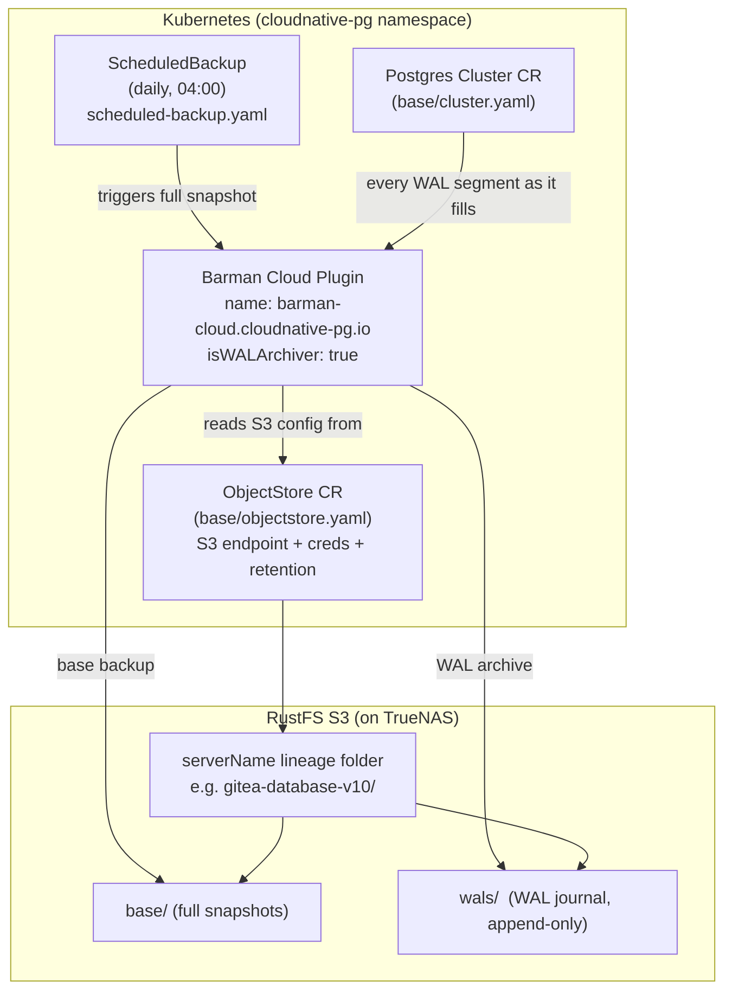
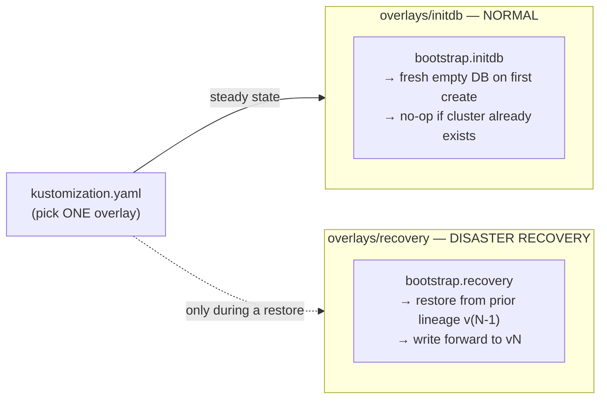
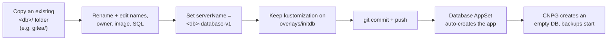
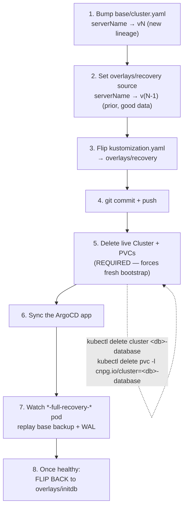

# CNPG Postgres: Backup, Restore & Start — Beginner's Guide

This is the **friendly on-ramp** for understanding how Postgres databases get
backed up, restored, and created in this cluster. If you've never touched
CloudNativePG (CNPG) before, start here.

When you need the full, gory, copy-paste DR runbook, jump to
[disaster-recovery.md](./disaster-recovery.md). When you need the exact repo
rules, see [infrastructure/database/CLAUDE.md](../../../infrastructure/database/CLAUDE.md).

---

## TL;DR

> [!TIP]
> - **CNPG** is the operator that runs our Postgres databases (gitea, immich, paperless, temporal).
> - Each database lives in its own folder: `infrastructure/database/cloudnative-pg/<db>/`. ArgoCD auto-discovers it — no manual wiring.
> - Backups go to **RustFS S3** (our S3, hosted on TrueNAS) using the **Barman Cloud Plugin**. Two parts work together: a daily **base backup** (full snapshot) + continuous **WAL archiving** (the running journal of every change). Together = point-in-time recovery (PITR).
> - There is **one feature flag** per database — a single line in its `kustomization.yaml` — that picks `overlays/initdb` (normal) or `overlays/recovery` (disaster recovery).
> - **Normal = `initdb`.** You only flip to `recovery` for an actual restore, then flip back.
> - **CNPG is NOT kopiur.** kopiur backs up files on PVCs; CNPG backs up the database itself (SQL-aware). Never mix the two.

---

## The two backup systems (and which one this is)

This cluster has **two completely separate** backup systems. They never touch
each other. Knowing which is which saves a lot of confusion.

| | **kopiur** | **CNPG (this guide)** |
|---|---|---|
| Backs up | Files on a PVC (folder-level) | The Postgres database (SQL-aware) |
| How | Kopia snapshots | Barman Cloud Plugin |
| For | App data dirs, media, configs | Postgres databases only |
| Where it's defined | per-PVC stub + `kopiur-backup` component | `infrastructure/database/cloudnative-pg/<db>/` |

> [!WARNING]
> **Never add kopiur backup CRs to a CNPG database's PVCs.** CNPG manages its
> own backups via Barman to S3. Mixing them corrupts your mental model and can
> double-handle the same data. Postgres = CNPG. Everything else = kopiur.

---

## How backups work

### The plain-English version

Two things run continuously for every database:

1. **Base backup** — a full snapshot of the whole database. Taken on a schedule
   (daily). Think "the complete photo of the DB at 4am."
2. **WAL archiving** — WAL = the **Write-Ahead Log**, a running journal that
   records *every single change* as it happens. Each time a log segment fills
   up, it's shipped to S3.

**Base backup + WAL together = point-in-time recovery (PITR).** To restore, CNPG
loads the last base backup ("the 4am photo") and then **replays the WAL journal**
forward to bring the database back to (almost) the exact moment you want.

### Where the pieces live

| Piece | File | What it does |
|-------|------|--------------|
| The database itself | `base/cluster.yaml` | The CNPG `Cluster` CR. Its `spec.plugins[]` turns on Barman + sets the **write serverName**. |
| The S3 connection | `base/objectstore.yaml` | The `ObjectStore` CR. Holds `destinationPath`, `endpointURL`, and `s3Credentials`. |
| The schedule | `scheduled-backup.yaml` | A daily `ScheduledBackup` — triggers the full base backups. |

> [!NOTE]
> We use the **Barman Cloud Plugin**, NOT the old in-tree `spec.backup.barmanObjectStore`.
> That old field was removed in CNPG 1.30.0. Do not reintroduce it. The Cluster
> references the `ObjectStore` CR by name via
> `spec.plugins[0].parameters.barmanObjectName`.

### Diagram 1 — how a backup flows



### What is a "serverName" / "lineage"?

The **`serverName`** is the named **folder** inside the S3 bucket where one
database's backups live — for example `gitea-database-v10`. We call each one a
**lineage**.

- `base/cluster.yaml` sets the **CURRENT WRITE** serverName (where new backups land).
- When you restore, you **read FROM** the prior lineage and **write forward TO a
  brand-new bumped lineage** (`vN` → `vN+1`).

> [!IMPORTANT]
> Why bump the number on every restore? Postgres requires a **clean (empty) WAL
> archive** for a freshly-created cluster. If a new cluster tried to write WAL
> into the same folder it just restored from, Barman rejects it with
> `Expected empty archive`. Bumping to a new lineage keeps the restore source
> untouched (still usable for future restores) and gives the new cluster a clean
> folder to write into.

**Current lineages (as of 2026-06-28, post-nuke):**

| Database | Current write target | Prior (restore source) |
|----------|----------------------|------------------------|
| gitea | `gitea-database-v10` | `gitea-database-v9` |
| immich | `immich-database-v6` | `immich-database-v5` |
| paperless | `paperless-database-v6` | `paperless-database-v5` |
| temporal | `temporal-database-v8` | `temporal-database-v7` |

---

## The one feature flag

Each database's root `kustomization.yaml` activates **exactly one** overlay.
This single line is the entire mode switch.

| Overlay | When | What it does |
|---------|------|--------------|
| **`overlays/initdb`** | NORMAL / steady state | `bootstrap.initdb` creates a fresh **empty** database the first time the cluster is created. On an already-running cluster it's a **no-op** (CNPG only reads `spec.bootstrap` at creation time). |
| **`overlays/recovery`** | DISASTER RECOVERY only | `bootstrap.recovery` restores from the prior lineage (via `externalClusters`), and the base writes forward to the new lineage. |

### Diagram 2 — the one feature flag



> [!TIP]
> Leave every database on `overlays/initdb` in normal life. `recovery` is only
> ever turned on as a deliberate, temporary DR action — then flipped back.

---

## Start a NEW database

Creating a brand-new database is easy because the **Database AppSet
auto-discovers** anything matching `infrastructure/database/*/*`.

### Diagram 4 — start a new DB



### Steps

1. **Copy** an existing database folder, e.g. `gitea/` → `<newdb>/`.
2. **Edit** names, owner, image, `postInitApplicationSQL`, and resource sizes in
   `base/cluster.yaml` and `overlays/initdb/bootstrap-patch.yaml`.
3. **Set the serverName** in `base/cluster.yaml` to `<newdb>-database-v1`.
4. **Set the recovery placeholder** in `overlays/recovery/bootstrap-patch.yaml`
   to `<newdb>-database-v1` too (a placeholder until a real DR event bumps both).
5. **Keep** the root `kustomization.yaml` on `overlays/initdb`.
6. **Commit + push.** No AppSet edits needed — it's auto-discovered.

(Mirrors the "Normal operation" section in
[infrastructure/database/CLAUDE.md](../../../infrastructure/database/CLAUDE.md).)

---

## Restore from backup (Disaster Recovery)

You only do this for a real DR event: the database is gone, corrupt, or empty
after a cluster nuke, and you want its data back from S3.

The big idea: **read FROM the prior lineage `v(N-1)`, write forward to a new
lineage `vN`**, by flipping the feature flag to `recovery` and forcing CNPG to
re-create the cluster from scratch.

> [!WARNING]
> **CNPG only reads `spec.bootstrap` when a cluster is first created.** Flipping
> the flag in git is NOT enough — you MUST delete the live Cluster **and its
> PVCs** so CNPG re-evaluates bootstrap on a fresh creation. Skipping the PVC
> delete is the #1 noob trap (see Gotchas).

### Diagram 3 — restore / DR sequence



### The 8 steps

1. **Bump the write target.** In `base/cluster.yaml`, set
   `spec.plugins[0].parameters.serverName` to the next lineage `vN`.
2. **Point recovery at the good data.** In `overlays/recovery/bootstrap-patch.yaml`,
   set the `externalClusters` source `serverName` to the now-prior `v(N-1)`.
3. **Flip the flag.** In the root `kustomization.yaml`, activate `overlays/recovery`.
4. **Commit + push.**
5. **Delete the live Cluster and PVCs** (REQUIRED):
   ```bash
   kubectl -n cloudnative-pg delete cluster <db>-database
   kubectl -n cloudnative-pg delete pvc -l cnpg.io/cluster=<db>-database
   ```
6. **Sync the ArgoCD app** so it re-creates the cluster from the recovery overlay.
7. **Watch the recovery.** A `<db>-database-1-full-recovery-*` pod appears and
   replays the base backup + WAL. Tail its logs; look for
   `consistent recovery state reached`.
8. **Flip back to `overlays/initdb`** once the cluster is healthy. (On an
   existing cluster, `bootstrap.initdb` is a no-op — this just keeps "steady
   state" clean so a future PVC loss can't auto-restore a stale lineage.)

> [!NOTE]
> The full runbook adds important extra steps the short version glosses over —
> notably a **hard-refresh of the ArgoCD app before deleting the Cluster** (so
> ArgoCD doesn't re-create it from a stale cached manifest), plus data
> verification and consumer-app restarts. Always follow
> [disaster-recovery.md → Runbook: restore from Barman](./disaster-recovery.md#runbook-restore-from-barman-recovery)
> for a real DR.

---

## Gotchas

> [!WARNING]
> **Delete the PVCs after deleting the Cluster.** `kubectl delete cluster` does
> NOT remove PVCs — CNPG leaves them behind as data protection. If you skip the
> PVC delete, the new cluster reuses the old empty volumes and hangs forever at
> **"Setting up primary."**

> [!WARNING]
> **Never set `recoveryTarget.targetTime` past the last archived WAL.** Postgres
> will FATAL with *"recovery ended before configured recovery target was
> reached"* and the recovery pod crash-loops. If unsure, **omit the target
> entirely** to restore to the latest available WAL.

> [!WARNING]
> **Rolling-restart the consumer apps after a rebuild.** Apps connected to the
> old database won't re-run their migrations against the freshly-restored one
> until they reconnect. Restart them:
> ```bash
> kubectl -n <app-namespace> rollout restart deployment/<app>
> ```

> [!WARNING]
> **CNPG is a SEPARATE backup system from kopiur.** kopiur = file-level PVC
> backups (Kopia). CNPG = SQL-aware database backups (Barman/S3). **Never mix
> them** — don't add kopiur CRs to CNPG PVCs, and don't expect kopiur to back up
> your Postgres data.

> [!TIP]
> If Barman complains `Expected empty archive`, the forward lineage you bumped to
> is already dirty. Don't reuse it — bump to the next clean lineage and keep the
> recovery source pointed at the last known-good one.

---

## Where to go next

- **Full DR runbook (the deep version):** [disaster-recovery.md](./disaster-recovery.md)
- **Repo rules + current lineage table:** [infrastructure/database/CLAUDE.md](../../../infrastructure/database/CLAUDE.md)
- **Why two backup systems exist:** [docs/disaster-recovery.md](../../disaster-recovery.md)
- **Live health check:** `kubectl cnpg status <db>-database -n cloudnative-pg`
