# Plain Postgres + kopiur: the CNPG exit ramp

**Decision (2026-07-09):** new databases run as **plain Postgres Deployments
backed up by kopiur**, and the four CNPG databases (gitea, immich, paperless,
temporal) migrate to that pattern one at a time. The idle Crunchy PGO operator
was removed the same day (it managed zero databases).



*Choose CNPG when PITR or operator capabilities are requirements; choose the
plain path when simple GitOps recovery and its explicit RPO are acceptable.
[Open the full-size PostgreSQL decision diagram](../../assets/postgres-recovery-choice.svg).*

## Why

CNPG's DR flow is intrinsically multi-commit: `bootstrap:` is creation-time
only (git must say initdb *or* recovery before the cluster exists) and a
recovered cluster must archive WAL to a **new** serverName lineage. That means
every cluster nuke needs the overlay flip + a post-recovery lineage-bump
commit, plus the rustfs-lifecycle bookkeeping for abandoned lineages. The
kopiur pattern needs **zero commits**: nuke, bootstrap, the PVC hydrates via
restore-before-bind, Postgres WAL-recovers like a power loss, done — the same
DR story as the other 22 backed-up PVCs.

**The trade, stated honestly:** restores land on the **last snapshot** (hourly
tier ⇒ ≤1h data loss), not any point in time. No replicas/failover (single pod,
`Recreate`). Postgres **major** upgrades become a manual dump/restore (minors
and patches stay Renovate-automated).

## The pattern (reference: `my-apps/development/gitea/postgres/`)

The Postgres twin of `my-apps/home/project-nomad/mysql/` — four pieces inside
the owning app's directory:

| Piece | Key points |
|---|---|
| `postgres/deployment.yaml` | `postgres:<MAJOR.MINOR>` pinned; `Recreate`; uid/gid/fsGroup **999**; `PGDATA` subdir; `POSTGRES_DB`/`POSTGRES_USER`/`POSTGRES_PASSWORD` env declare the database on first (empty-volume) boot — no admin tool; `--data-checksums`; `pg_isready` startup/readiness/liveness probes; 60s termination grace |
| `postgres/service.yaml` | named port `postgres`/5432 |
| `postgres/pvc.yaml` | `longhorn` + `dataSourceRef` → the kopiur `Restore` + the two masking annotations |
| `kopiur/<app>-postgres-data.yaml` | stub with mover `999:999`, **hourly** retention tier (`keepHourly: 24, keepDaily: 7, keepWeekly: 4`), distinct cron minute |

Consistency model: kopiur's CSI VolumeSnapshot is crash-consistent
(point-in-time, single volume). Postgres is designed to recover from exactly
that — WAL replay on boot, as after a power cut. `--data-checksums` makes any
torn-page corruption loudly detectable instead of silent.

The startup probe deliberately allows roughly five minutes before liveness
can restart the container. A large restored database may need a longer budget;
size it from observed recovery time, not from the normal empty-start time.

### Credential state after restore

The official image's `POSTGRES_*` initialization variables only act on an
empty data directory. A kopiur restore therefore brings back the database role
password that existed at snapshot time; changing only the 1Password item does
not change that role and can lock the application out after either rotation or
restore.

Treat password rotation as a coordinated stateful operation: authenticate with
the current password, execute `ALTER ROLE <role> WITH PASSWORD '<new>'`, update
the 1Password item immediately, let External Secrets reconcile, restart the
consumers, and verify them before discarding the old credential. Do not place
the password or SQL command in Git or shell history.

## Per-app cutover runbook (~15 min, one app at a time)

Deploying the manifests creates an **empty** Postgres beside the running CNPG
cluster; nothing changes for the app until step 4. Gitea shown; adjust names.

1. **Merge the manifests, let ArgoCD sync.** Verify the instance is up and the
   backup plumbing exists:
   ```bash
   kubectl -n gitea get pod -l app=gitea-postgres   # Running
   kubectl -n gitea get pvc gitea-postgres-data     # Bound (empty first boot)
   kubectl -n gitea get snapshotpolicy,snapshotschedule,restore
   ```
2. **Stop writers:** scale the app to 0 (`kubectl -n gitea scale deploy gitea --replicas=0`).
3. **Copy the data** (CNPG primary → new instance; password prompts read from
   the same secret both sides already use):
   ```bash
   kubectl -n cloudnative-pg exec gitea-database-1 -- \
     pg_dump -U gitea -d gitea -Fc -f /tmp/gitea.dump
   kubectl -n cloudnative-pg cp gitea-database-1:/tmp/gitea.dump /tmp/gitea.dump
   kubectl -n gitea cp /tmp/gitea.dump \
     $(kubectl -n gitea get pod -l app=gitea-postgres -o name | cut -d/ -f2):/tmp/gitea.dump
   kubectl -n gitea exec deploy/gitea-postgres -- \
     pg_restore -U gitea -d gitea --no-owner --role=gitea /tmp/gitea.dump
   ```
4. **Repoint the app** — one commit: change the DB host in the app's config
   (gitea: `values.yaml` `gitea.config.database.HOST` →
   `gitea-postgres.gitea.svc.cluster.local:5432`). Sync; scale the app back up;
   verify it works.
5. **Seed the first backup and verify** (do NOT skip — restore-before-bind is
   only as good as the newest snapshot):
   ```bash
   kubectl -n gitea get snapshot   # wait for Succeeded with non-zero files
   ```
6. **Retire the CNPG cluster** — delete
   `infrastructure/database/cloudnative-pg/gitea/` and its entry anywhere it's
   referenced; add its `serverName` lineages to the rustfs lifecycle
   expiration ConfigMap (`infrastructure/storage/rustfs-lifecycle/`) as an
   abandoned lineage.

## Full-retirement checklist (after the last DB migrates)

- [x] gitea migrated (2026-07-10: dump/restore verified 112 tables / 5 repos /
      2 users; first populated kopiur snapshot confirmed; CNPG cluster deleted,
      v9/v10 lineages added to rustfs lifecycle)
- [ ] temporal migrated
- [ ] paperless migrated
- [ ] immich migrated — **needs the pgvector/VectorChord image**
      (`ghcr.io/immich-app/postgres`), not stock `postgres`; match the major
      version immich documents
- [ ] delete `infrastructure/database/cloudnative-pg/` (operator, global
      secrets, per-DB dirs) and `custom-entrypoints/cnpg-barman-plugin-app.yaml`
      (+ its entry in `apps/kustomization.yaml`)
- [ ] retire the postgres-backups rustfs lifecycle ConfigMap once the barman
      buckets age out
- [ ] scrub CNPG rules from CLAUDE.md / infrastructure/database/CLAUDE.md and
      update `docs/domains/cnpg/` + the DR runbook's database section

Until every box is ticked, CNPG remains live for the unmigrated databases —
none of its repo rules (no kopiur on CNPG PVCs, serverName tracking, lifecycle
policy) are relaxed early.

## Related

- [kopiur backup architecture](../storage/kopiur-backup-architecture.md)
- [kopiur mover permissions](../storage/kopiur-mover-permissions.md) — why 999:999
- [CNPG disaster recovery](disaster-recovery.md) — still authoritative for unmigrated DBs
- [cluster DR runbook](../../disaster-recovery.md)
