# Technitium `vanillax.me` Split-DNS

Split-horizon DNS for `vanillax.me` is served by Technitium (`192.168.10.15`)
behind Firewalla. LAN clients get private records for internal services and fall
back to Cloudflare for public names:



*Private and public exposure are separate DNS, Gateway, and HTTPRoute choices.
[Open the full-size request-path diagram](../../assets/networking-request-paths.svg).*

```text
LAN client
  -> Firewalla DNS (192.168.10.1)
  -> vanillax.me forwarded to Technitium (192.168.10.15)
  -> local private record returned when present
  -> otherwise forwarded over DoH to Cloudflare
```

Technitium serves `vanillax.me` as a **Conditional Forwarder** zone, not a
Primary zone. An authoritative Primary zone returns NXDOMAIN for missing
records instead of falling back to Cloudflare — the Conditional Forwarder
returns local overrides when present and forwards everything else upstream.

## Components

| Component | Responsibility |
| --- | --- |
| Firewalla | Client DNS endpoint and one `vanillax.me` zone forward to Technitium |
| Technitium | Private `*.vanillax.me` overrides and Cloudflare DoH fallback |
| `external-dns-technitium` | RFC2136 A/TXT records for private HTTPRoutes |
| Cloudflare ExternalDNS | Public records for `gateway-external` routes |
| `gateway-internal-technitium` | Private routes at `192.168.10.52` |
| `gateway-external` | Public Cloudflare routes at `192.168.10.33` |

Private HTTPRoutes parent to `gateway-internal-technitium`; public routes
parent to `gateway-external`.

## 1. The Conditional Forwarder Zone

In the Technitium web console:

1. Open **Zones**.
2. Select **Add Zone**.
3. Set the zone name to `vanillax.me`.
4. Select **Conditional Forwarder Zone**.
5. Configure an HTTPS forwarder:

   ```text
   https://cloudflare-dns.com/dns-query (1.1.1.1)
   ```

6. Enable DNSSEC validation when the UI offers it.
7. Save the zone.

The Cloudflare DoH forwarder avoids Firewalla's interception of plain DNS
traffic. Records stored locally in this zone override Cloudflare; missing
records are forwarded to Cloudflare. The parenthesized IP bootstraps the DoH
hostname — without it, Technitium cannot resolve `cloudflare-dns.com` when
recursion is disabled and returns `SERVFAIL`.

Verify public fallback directly through Technitium:

```bash
dig @192.168.10.15 vanillax.me A +short
dig @192.168.10.15 news.vanillax.me A +short
```

These return public Cloudflare addresses, not NXDOMAIN.

## 2. The TSIG Key

In **Settings -> TSIG**:

1. Add key name `externaldns-vanillax`.
2. Select `HMAC-SHA256`.
3. Leave **Shared Secret** empty so Technitium generates a strong Base64 key.
4. Save the settings.

Treat the generated key as a credential. Keep it out of Git, terminal history,
screenshots, tickets, and chat.

## 3. The Secret In 1Password

The generated key lives in one 1Password item:

```text
Item:  external-dns-technitium-vanillax
Field: tsig-secret
Value: <exact Base64 value generated by Technitium>
```

The ExternalSecret passes this value through unchanged — do not Base64-encode
it again.

## 4. RFC2136 Dynamic Updates

Open **Zones -> vanillax.me -> Options -> Dynamic Updates (RFC 2136)**:

```text
Dynamic Updates: Allow

Security Policy:
  TSIG Key Name:      externaldns-vanillax
  Domain Name:        *.vanillax.me
  Allowed Record Types: A, AAAA, CNAME, TXT
```

The wildcard policy prevents the key from changing the zone apex and limits it
to the record types ExternalDNS needs.

## 5. AXFR (Zone Transfer)

ExternalDNS uses AXFR to read existing records and TXT ownership state. Without
it, updates may succeed but ExternalDNS repeatedly resubmits the same records
and logs `AXFR error: dns: bad xfr rcode: 5`.

Open **Zones -> vanillax.me -> Options -> Zone Transfer**:

```text
Zone Transfer: Allow
Zone Transfer TSIG Key Names: externaldns-vanillax
```

The populated TSIG list means transfers still require authentication even
though the transfer mode is `Allow`.

Both the RFC2136 update policy **and** the AXFR key list must live on the
`vanillax.me` Conditional Forwarder zone. Configuring them on any other zone
has no effect on this flow.

## 6. Firewalla Zone Forwarding

In Firewalla, one conditional-forwarding rule sends the whole zone to
Technitium — no per-host overrides:

```text
Domain: vanillax.me
DNS server: 192.168.10.15
Include subdomains: enabled
Scope: all LAN/VLAN networks that should use the homelab DNS view
```

Client DHCP/DNS stays pointed at Firewalla; clients are never pointed directly
at Technitium. Per-host GUI overrides (e.g. `address=/homeassistant.vanillax.me/...`)
must not exist — they shadow Technitium records and resolve private names to
the wrong endpoint.

## Verification

Check the `external-dns-technitium` controller:

```bash
kubectl -n external-dns get pods
kubectl -n external-dns logs deploy/external-dns-technitium -f
```

Steady-state message:

```text
All records are already up to date
```

These messages indicate a broken TSIG/AXFR configuration:

```text
dns: bad authentication
AXFR error
bad xfr rcode: 5
```

Private records directly against Technitium — all return `192.168.10.52`:

```bash
dig @192.168.10.15 argocd.vanillax.me A +short
dig @192.168.10.15 homeassistant.vanillax.me A +short
dig @192.168.10.15 grafana.vanillax.me A +short
dig @192.168.10.15 registry.vanillax.me A +short
```

Public fallback stays public:

```bash
dig @192.168.10.15 vanillax.me A +short
dig @192.168.10.15 news.vanillax.me A +short
dig @192.168.10.15 search.vanillax.me A +short
```

Through the client DNS path (Firewalla):

```bash
dig @192.168.10.1 argocd.vanillax.me A +short    # 192.168.10.52
dig @192.168.10.1 homeassistant.vanillax.me A +short   # 192.168.10.52
dig @192.168.10.1 vanillax.me A +short           # public Cloudflare
dig @192.168.10.1 news.vanillax.me A +short      # public Cloudflare
```

TLS and application routing:

```bash
curl -fsS -o /dev/null -w '%{http_code} %{remote_ip}\n' https://argocd.vanillax.me/
curl -fsS -o /dev/null -w '%{http_code} %{remote_ip}\n' https://homeassistant.vanillax.me/
```

Private endpoints connect to `192.168.10.52` with valid TLS.

## Operational Notes

- **TSIG secret rotation requires a pod restart.** The secret is injected as
  the env var `EXTERNAL_DNS_RFC2136_TSIG_SECRET` via `secretKeyRef` at pod
  start; updating the K8s Secret does not hot-reload it. After ESO rewrites the
  Secret, restart the deployment:

  ```bash
  kubectl -n external-dns rollout restart deploy/external-dns-technitium
  ```

- **The TSIG key name and secret bytes must match.** ExternalDNS signs RFC2136
  updates with key name `externaldns-vanillax` and the secret bytes delivered
  by ESO from the `external-dns-technitium-vanillax` 1Password item. A name/byte
  mismatch returns `dns: bad authentication` on both UPDATE and AXFR.

- **HTTPRoute parentRefs ignore rule.** In `infrastructure/controllers/argocd/values.yaml`,
  ignore only the defaulted `group`/`kind` subfields — never the whole
  `parentRefs` array or whole entries:

  ```yaml
  jqPathExpressions:
  - .spec.parentRefs[].group
  - .spec.parentRefs[].kind
  ```

  `name`/`namespace`/`sectionName` must stay diffable so route re-parenting is
  applied.

## TLS Certificate Architecture

Both gateways share **one** publicly-trusted wildcard certificate — no separate
internal cert:

| Resource | Value |
| --- | --- |
| ClusterIssuer | `cloudflare-cluster-issuer` (ACME DNS-01 via Cloudflare) |
| Certificate / Secret | `cert-vanillax` in namespace `gateway`, SAN `*.vanillax.me` |
| `gateway-external` (`192.168.10.33`) | `certificateRefs: cert-vanillax` |
| `gateway-internal-technitium` (`192.168.10.52`) | `certificateRefs: cert-vanillax` |

Public and private paths use the **same hostname** under `*.vanillax.me`, so the
same Let's Encrypt wildcard validates on both. TLS authenticates the **name**,
not the IP, so a publicly-trusted cert served from a private `192.168.10.52`
endpoint is fully valid with no browser warnings. cert-manager renews
`cert-vanillax` via DNS-01 against the public Cloudflare zone regardless of
where the gateway is reachable.

## References

- [Technitium DNS Server help](https://technitium.com/dns/help.html)
- [Technitium maintainer guidance for local overrides in Conditional Forwarder zones](https://github.com/TechnitiumSoftware/DnsServer/discussions/818)
- [Technitium Conditional Forwarder zone introduction](https://blog.technitium.com/2020/07/technitium-dns-server-v5-released.html)
