# Routed Wi-Fi Talos workers with Omni and libvirt

This guide explains how a Wi-Fi-only Linux machine contributes replaceable CPU
capacity to `talos-singlenode-gpu-prod` without becoming a control-plane or
storage failure dependency.

!!! info "Status — node joined, PodCIDR routes pending (2026-07-16)"
    The Dell worker joined `talos-singlenode-gpu-prod` and is Ready at
    `192.168.123.119` with PodCIDR `10.244.2.0/24`. Node-address routing,
    DHCP, and public egress are verified; `talos-dell-lab` is deleted. The
    three Firewalla PodCIDR routes and the final cross-node pod verification
    below remain before this status changes to current.

**Scope:** this procedure prepares a CachyOS host, connects its libvirt provider
to self-hosted Omni, creates a routed Talos VM, and adds that VM to the existing
production cluster as a worker. It deliberately leaves the wired control plane,
GPU worker, Proxmox hosts, TrueNAS, and Longhorn storage ownership unchanged.



*The invariant is that the Wi-Fi host adds optional compute. Omni owns the VM,
Firewalla and the Dell own the routes, and wired systems retain the durable
control-plane and storage roles.*

## The mental model

CachyOS remains the physical operating system. Kubernetes does not run directly
on it. QEMU/KVM runs a complete Talos VM, and the official Omni libvirt provider
turns Omni `MachineRequest` resources into local libvirt disks and domains.

```text
NUC: Omni API and desired-state repositories
  |
  | MachineRequest
  v
Dell CachyOS: libvirt + provider agent
  |
  | routed virtual bridge
  v
Talos VM: kubelet + Cilium + ordinary production workloads
```

Four address layers are involved:

| Layer | CIDR or address | Owner | Purpose |
|---|---|---|---|
| HomeLab Wi-Fi/LAN | `192.168.10.0/24` | Firewalla | NUC, wired Talos nodes, and Dell uplink |
| Dell uplink | `192.168.10.20` | Firewalla DHCP reservation | Next hop for every Dell-hosted routed subnet |
| Legacy libvirt NAT | `192.168.122.0/24` | Dell `virbr0` | Temporary provider proof only; not production |
| Routed VM network | `192.168.123.0/24` | Dell `virbr1` | Production Talos VM node addresses |
| Kubernetes pods | `10.244.0.0/16` aggregate | Kubernetes + Cilium | A distinct `/24` is assigned to each node |

The physical Dell is the router between HomeLab and `192.168.123.0/24`.
Firewalla carries a static route for that subnet through `192.168.10.20`.
Unlike the legacy `.122` network, internal `.123` traffic is not hidden by NAT.

## How Cilium traffic crosses the routed boundary

The production Cilium configuration uses native routing. Packets keep their
`10.244.x.x` source and destination addresses instead of being wrapped in a
VXLAN packet. Every node receives a non-overlapping PodCIDR:

```text
GPU worker:     10.244.0.0/24 -> node 192.168.10.177
Control plane:  10.244.1.0/24 -> node 192.168.10.81
Dell worker:    10.244.2.0/24 -> next hop 192.168.10.20 (verified 2026-07-16)
```

For the Dell PodCIDR, Firewalla routes to the physical Dell and the Dell routes
to the Talos VM. For existing PodCIDRs, Firewalla routes to the owning wired
node. Never predict the Dell PodCIDR: read it after Kubernetes assigns it.

```bash
kubectl get nodes \
  -o custom-columns='NODE:.metadata.name,NODE_IP:.status.addresses[?(@.type=="InternalIP")].address,POD_CIDR:.spec.podCIDR'
```

The live agents also read `ipv4-native-routing-cidr: 10.14.0.0/16`, which does
not cover the `10.244.0.0/16` PodCIDRs. Cross-node pod traffic still keeps pod
addresses because `bpf.masquerade` exempts cluster-known destinations via the
ipcache, so the setting is currently inert for pod-to-pod paths. Treat it as an
existing value to verify deliberately — do not change it as a side effect of
this procedure.

Internet traffic is different. The Dell masquerades only public destinations
from `192.168.123.0/24` behind its Wi-Fi address. RFC 1918 node and pod traffic
explicitly bypasses that chain, so internal traffic remains routed and visible.
Firewalla Source Networks is the preferred WAN-edge alternative, but it did not
return replies for the downstream subnet in the verified setup.

## Owning configuration

The version-controlled inputs are:

- [`omni/machine-classes/libvirt-dell-single-node.yaml`](https://github.com/mitchross/talos-argocd-proxmox/blob/main/omni/machine-classes/libvirt-dell-single-node.yaml) — VM size, pool, and routed network.
- [`omni/cluster-template/cluster-template-singlenode-gpu.yaml`](https://github.com/mitchross/talos-argocd-proxmox/blob/main/omni/cluster-template/cluster-template-singlenode-gpu.yaml) — the `dell-cpu-workers` production machine set.
- [`omni/libvirt-provider/talos-routed-network.xml`](https://github.com/mitchross/talos-argocd-proxmox/blob/main/omni/libvirt-provider/talos-routed-network.xml) — libvirt routed bridge and DHCP range.
- [`omni/libvirt-provider/omni-infra-provider-libvirt.service`](https://github.com/mitchross/talos-argocd-proxmox/blob/main/omni/libvirt-provider/omni-infra-provider-libvirt.service) — hardened provider service.
- [`omni/libvirt-provider/99-talos-libvirt-routing.conf`](https://github.com/mitchross/talos-argocd-proxmox/blob/main/omni/libvirt-provider/99-talos-libvirt-routing.conf) — persistent IPv4 forwarding.
- [`omni/libvirt-provider/talos-routed-egress-nat.sh`](https://github.com/mitchross/talos-argocd-proxmox/blob/main/omni/libvirt-provider/talos-routed-egress-nat.sh) — public-only egress NAT with RFC 1918 exclusions.
- [`omni/libvirt-provider/talos-routed-egress-nat.service`](https://github.com/mitchross/talos-argocd-proxmox/blob/main/omni/libvirt-provider/talos-routed-egress-nat.service) — persistent systemd ownership for that chain.
- [`omni/libvirt-provider/talos-dell-pod-route.service`](https://github.com/mitchross/talos-argocd-proxmox/blob/main/omni/libvirt-provider/talos-dell-pod-route.service) — the verified Dell PodCIDR route.

The NUC at `192.168.10.15` runs Omni. The provider agent runs on the Dell
because `qemu:///system` is the Dell-local libvirt API. A root-only
`provider.env` contains the provider service-account key and is never committed.

## Prerequisites and stop conditions

Before changing a cluster:

1. Reserve the Dell address as `192.168.10.20` in Firewalla.
2. Add `192.168.123.0/24 -> 192.168.10.20` as a static HomeLab route for all devices.
3. Configure public egress either through Firewalla Source Networks or the
   scoped Dell egress-NAT service below.
4. Confirm `talos-singlenode-gpu-prod` is Ready with its original nodes.
5. Confirm the temporary lab is disposable and contains no workloads or data.
6. Confirm the Dell has hardware virtualization and at least the requested CPU,
   memory, disk, and CachyOS headroom.

Stop before deleting the lab when any of these fail:

- a HomeLab device cannot reach `192.168.123.1`;
- a disposable `.123` guest cannot reach the NUC and both Talos nodes;
- a disposable `.123` guest cannot reach the internet;
- Omni reports the libvirt provider disconnected;
- production is not Ready before the change.

## Rebuild the CachyOS host

Run host commands on the Dell, not the NUC.

### 1. Install and enable virtualization

```bash
sudo pacman -Syu --needed qemu-desktop libvirt dnsmasq openbsd-netcat
sudo systemctl enable --now libvirtd.service
```

Define and autostart a directory-backed `default` pool at
`/var/lib/libvirt/images`. Preserve any existing pool instead of redefining it.

### 2. Install the provider

Install the pinned official provider binary at
`/usr/local/bin/omni-infra-provider-libvirt`, verify its published SHA-256, and
copy the version-controlled config and unit to their `/etc` paths.

Create the provider identity from a trusted Omni workstation:

```bash
omnictl infraprovider create libvirt -t 8760h
```

Install the resulting endpoint and service-account key only as:

```text
/etc/omni-infra-provider-libvirt/provider.env  0600 root:root
```

Then enable the service:

```bash
sudo systemctl daemon-reload
sudo systemctl enable --now omni-infra-provider-libvirt.service
```

Expected result: `omnictl infraprovider list` reports provider `libvirt` as
connected with an empty error column.

### 3. Create the routed network

```bash
sudo install -m 0644 \
  omni/libvirt-provider/99-talos-libvirt-routing.conf \
  /etc/sysctl.d/99-talos-libvirt-routing.conf
sudo sysctl -w net.ipv4.ip_forward=1

sudo virsh -c qemu:///system net-define \
  omni/libvirt-provider/talos-routed-network.xml
sudo virsh -c qemu:///system net-start talos-routed
sudo virsh -c qemu:///system net-autostart talos-routed
```

Permit only the required bridge and HomeLab forwarding paths:

```bash
sudo ufw allow in on virbr1 from 192.168.123.0/24
sudo ufw allow in on virbr1 proto udp from any port 68 to any port 67 \
  comment "Talos routed DHCP"
sudo ufw allow in on wlan0 from 192.168.10.0/24 to 192.168.123.1
sudo ufw route allow in on virbr1 out on wlan0 from 192.168.123.0/24
sudo ufw route allow in on wlan0 out on virbr1 \
  from 192.168.10.0/24 to 192.168.123.0/24
```

Expected result:

```text
Name:           talos-routed
Active:         yes
Persistent:     yes
Autostart:      yes
Bridge:         virbr1
```

The DHCP allowance is required even though the broader `.123/24` rule exists:
a client sends its initial discover from `0.0.0.0:68`, before it can match the
subnet source rule. Without it, Talos boots but repeatedly reports `network is
unreachable`, and `virsh net-dhcp-leases talos-routed` remains empty.

### 4. Provide public-only egress

Install the version-controlled egress script and unit when Firewalla does not
source-NAT the downstream subnet:

```bash
sudo install -D -m 0755 \
  omni/libvirt-provider/talos-routed-egress-nat.sh \
  /usr/local/libexec/talos-routed-egress-nat
sudo install -D -m 0644 \
  omni/libvirt-provider/talos-routed-egress-nat.service \
  /etc/systemd/system/talos-routed-egress-nat.service
sudo systemctl daemon-reload
sudo systemctl enable --now talos-routed-egress-nat.service
```

The dedicated iptables chain returns without translation for `10.0.0.0/8`,
`172.16.0.0/12`, and `192.168.0.0/16`, then masquerades all other destinations.
This keeps Cilium native routing symmetric while allowing Talos factory access,
DNS, image pulls, and ordinary internet egress.

### 5. Prove routing before cluster mutation

Create a disposable namespace with a short Linux interface name:

```bash
sudo ip netns add talos-route-test
sudo ip link add trtest0 type veth peer name eth0 netns talos-route-test
sudo ip link set trtest0 master virbr1
sudo ip link set trtest0 up
sudo ip -n talos-route-test link set lo up
sudo ip -n talos-route-test link set eth0 up
sudo ip -n talos-route-test addr add 192.168.123.2/24 dev eth0
sudo ip -n talos-route-test route add default via 192.168.123.1
```

From the Dell namespace, verify the NUC, both production node addresses, and an
internet address. From the NUC, verify `192.168.123.2`.

Remove the disposable namespace after proof:

```bash
sudo ip netns del talos-route-test
sudo ip link del trtest0 2>/dev/null || true
```

## Migrate the proof VM into production

!!! danger "Destructive checkpoint"
    The next step destroys only the temporary lab cluster and its provider-owned
    VM. Re-check the template filename and cluster ID. Never run template delete
    against `talos-singlenode-gpu-prod`.

1. Delete the temporary lab template resources and wait for the provider to
   remove its libvirt domain and volumes.
2. Apply `libvirt-dell-single-node.yaml` so future requests select
   `talos-routed`.
3. Validate and dry-run the production template.
4. Sync the production template. This creates only the new
   `dell-cpu-workers` machine set, patch, and extension configuration.
5. Wait for the provider to create the VM, Talos to install, the system-extension
   upgrade to settle, and the node to become Ready.
6. Enable libvirt autostart on the new provider-created domain.

Template patch paths resolve relative to the process working directory. Apply
the machine class from the repository root, then run template commands from its
directory:

```bash
omnictl apply -f omni/machine-classes/libvirt-dell-single-node.yaml
cd omni/cluster-template
omnictl cluster template validate -f cluster-template-singlenode-gpu.yaml
omnictl cluster template sync --dry-run \
  -f cluster-template-singlenode-gpu.yaml
omnictl cluster template sync -v -f cluster-template-singlenode-gpu.yaml
```

Do not intervene during a system-extension reboot merely because readiness
briefly drops. Wait until Omni reports `MachineUpgradeStatus` phase 3,
`machine is up to date`, and identical desired/current schematic IDs.

Keep `omnictl` at the same version as the Omni backend before trusting its
output. A v1.4.7 client against a v1.9.0 backend reported stale or missing
phase data while the UI was already healthy. The dashboard serves matching
binaries; the same version is also on the official GitHub release page.

## Complete native pod routing

After the Dell node becomes visible, read all PodCIDRs. Add Firewalla routes for
each current owner and route the Dell PodCIDR through `192.168.10.20`.
On the Dell, add a more-specific route for that Dell PodCIDR through the Talos
VM node address on `virbr1`.

The exact Dell route has this shape:

```bash
sudo ip route replace <dell-pod-cidr> via <dell-talos-node-ip> dev virbr1
```

The first verified production allocation was:

```text
10.244.0.0/24 -> 192.168.10.177   GPU worker
10.244.1.0/24 -> 192.168.10.81    control plane
10.244.2.0/24 -> 192.168.10.20    Dell router, then 192.168.123.119
```

Install the version-controlled route unit on the Dell after verifying those
exact current values:

```bash
sudo install -D -m 0644 \
  omni/libvirt-provider/talos-dell-pod-route.service \
  /etc/systemd/system/talos-dell-pod-route.service
sudo systemctl daemon-reload
sudo systemctl enable --now talos-dell-pod-route.service
```

Allow the native-routing paths through UFW. These rules cover both preserved
pod sources and Cilium-masqueraded node sources:

```bash
sudo ufw route allow in on wlan0 out on virbr1 \
  from 192.168.10.0/24 to 10.244.2.0/24
sudo ufw route allow in on wlan0 out on virbr1 \
  from 10.244.0.0/16 to 10.244.2.0/24
sudo ufw route allow in on virbr1 out on wlan0 \
  from 10.244.2.0/24 to 192.168.10.0/24
sudo ufw route allow in on virbr1 out on wlan0 \
  from 10.244.2.0/24 to 10.244.0.0/16
```

If Omni replaces the VM, its MAC, routed node address, and PodCIDR can change.
Re-read all three values and update both the route unit and Firewalla routes.
At larger scale, replace manual per-node PodCIDR routes with a deliberate
overlay or dynamic-routing design.

## Verification

The migration is complete only when all checks agree:

```bash
omnictl get clusterstatus talos-singlenode-gpu-prod -o yaml
kubectl get nodes -o wide
kubectl -n kube-system get pods -l k8s-app=cilium -o wide
kubectl get pods -A --field-selector=status.phase!=Running,status.phase!=Succeeded
```

Expected state:

- production has one control plane, one GPU worker, and one Dell CPU worker;
- all three nodes are Ready;
- every Cilium agent is Ready;
- the Dell worker has `node.vanillax.dev/class=dell-cpu` and
  `topology.kubernetes.io/zone=yard`;
- cross-node pod probes, DNS, image pulls, and internet egress succeed;
- the Dell domain, network, pool, libvirt service, and provider service all
  autostart;
- `talos-dell-lab` no longer exists.

Longhorn needs no exclusion for this node. The cluster sets
`createDefaultDiskLabeledNodes: "true"`, and only the GPU worker carries the
`node.longhorn.io/create-default-disk` label, so the Dell registers with zero
disks and owns no replicas. Its `longhorn-csi-plugin` DaemonSet pod stays —
that is what lets Dell-scheduled workloads mount Longhorn volumes served from
the wired node.

## Failure paths and rollback

| Symptom | Stop and inspect | Recovery |
|---|---|---|
| NUC cannot reach `.123.1` | Firewalla static route, Dell address, `virbr1` | Fix underlay before cluster changes |
| `.123` guest reaches LAN but not internet | packet capture on `wlan0`, Firewalla Source Networks, egress-NAT service | Enable one public-egress implementation; do not provision yet |
| Talos boots but never joins Omni | `virsh net-dhcp-leases`, DHCP capture on `vnet*`, UFW | Allow UDP client port 68 to server port 67 on `virbr1` |
| Talos connects to Omni but node stays NotReady | Cilium agent, API reachability, node route | Keep original production nodes; fix routing |
| Node Ready but cross-node pods fail | PodCIDRs and Firewalla routes | Add exact per-node native routes |
| Dell pods get `connection refused`/timeouts to `10.96.0.1` and services | Firewalla PodCIDR routes, Dell UFW route rules | Return paths for `10.244.x.0/24` are missing until all three routes exist |
| `omnictl` output disagrees with the Omni UI | `omnictl --version` vs backend version | Upgrade the client to the backend version before acting on CLI output |
| Provider replaces the domain | New domain lacks autostart | Re-enable autostart on the replacement |
| Wi-Fi is unstable | Node pressure/disconnect events | Cordon/drain and scale worker set to zero |

To remove the production experiment, delete the `dell-cpu-workers` document
from the template, validate, and sync. Omni will deprovision that provider-owned
VM while leaving the original control plane and GPU worker intact. Remove host
routes and `talos-routed` only after no machine request references them.

## Scaling beyond one Wi-Fi worker

Use Ansible to prepare physical hosts, but keep VM lifecycle in Omni. A future
role should manage packages, libvirt, storage pools, routed networks, sysctls,
UFW, provider binaries and checksums, systemd units, and verification. Inject
provider credentials from 1Password or Ansible Vault rather than Git.

Assign a unique node subnet per physical Wi-Fi site, for example `.123/24`,
`.124/24`, and `.125/24`. Manual native PodCIDR routing is reasonable for a
small proof, but not a fleet. Choose Cilium tunneling or a router capable of
BGP/OSPF when route count becomes operational toil.

Do not install Proxmox merely to solve Wi-Fi bridging. A normal Wi-Fi station
cannot transparently bridge arbitrary VM MAC addresses, so Proxmox would still
need a routed/NAT design. If a remote location must host 24/7 dependencies, use
a hardware point-to-point wireless bridge that presents Ethernet, or keep those
dependencies on wired Proxmox and TrueNAS systems.

## Upstream references

- [Omni infrastructure providers](https://docs.siderolabs.com/omni/infrastructure-and-extensions/infrastructure-providers)
- [Omni cluster templates](https://docs.siderolabs.com/omni/reference/cluster-templates)
- [libvirt routed network format](https://www.libvirt.org/formatnetwork.html)
- [Firewalla Network Manager, routes, and NAT settings](https://help.firewalla.com/hc/en-us/articles/360046703673-Firewalla-Feature-Guide-Network-Manager)
- [Talos KubeSpan and Cilium limitations](https://docs.siderolabs.com/talos/v1.13/networking/kubespan)
