# Wi-Fi Proxmox Talos worker with GTX 1050 Ti

This runbook replaces the retired CachyOS/libvirt Dell design with a Proxmox
VE host managed by Omni's Proxmox infrastructure provider.

!!! success "Status — deployed and verified live (2026-07-19)"
    Node `talos-singlenode-gpu-prod-dell-gpu-workers-qg4pgk` is Ready at
    `192.168.10.119` with the GTX 1050 Ti passed through: in-cluster
    `nvidia-smi` reports driver `580.159.04` (LTS), 4096 MiB, 75 W, and the
    device plugin advertises `nvidia.com/gpu: 1`. The checkpoints below were
    all exercised during that first provisioning — including the failure
    modes; read the first-boot networking findings below before "improving"
    the boot-time address handling.

**Scope:** add one replaceable Talos worker VM to
`talos-singlenode-gpu-prod`. The Dell remains behind the ASUS RT-AX86U media
bridge, owns no Longhorn replicas, and is not eligible for the large RTX 3090
AI workloads. This procedure does not change the existing control plane,
Threadripper GPU worker, storage, Cilium VXLAN mode, or application replicas.



*Omni owns the VM lifecycle, Proxmox owns PCI passthrough, and the Talos
machine set owns the stable node address and GPU driver branch.*

## Target and source of truth

| Layer | Target | Owning configuration |
|---|---|---|
| Media bridge | ASUS RT-AX86U, Media Bridge mode | Host-side state |
| Hypervisor | Dell Proxmox VE, `192.168.10.16` | Host-side state |
| Omni provider | `proxmox-dell`, running on the NUC | `omni/proxmox-provider-dell/` |
| VM | 4 vCPU, 32 GiB RAM, 100 GiB disk | `omni/machine-classes/proxmox-dell-gpu.yaml` |
| PCI mapping | `gpu-1050ti`, all GPU functions | Proxmox Datacenter resource mapping |
| Talos worker | Static `192.168.10.119` | `omni/cluster-template/cluster-template-singlenode-gpu.yaml` |
| GPU class | `node.vanillax.dev/gpu-class=gtx-1050-ti` | same cluster template |

The machine class deliberately carries **no** `ip=` kernel argument
(`kernelargs: []`). Two findings from the first provisioning attempt
(2026-07-19) make this load-bearing:

1. **DHCP works for the ISO/registration phase**, even behind the media
   bridge — the AX86U snoops DHCP for its wired clients and that snooped
   binding is what makes its L3 inbound filter pass traffic at all. The ISO
   boots, leases a temporary address, and registers with Omni over it; the
   static `192.168.10.119` from the machine config takes over at install.
2. A static `ip=` argument with an empty device field binds to the first
   non-loopback interface **alphabetically** — on Talos that is `bond0`, not
   `eth0` — which installs a dead default route and blackholes every
   guest-originated packet. The VM answers ARP but can never send; SideroLink
   never connects, and the machine sits in Maintenance forever.

## Driver compatibility boundary

The GTX 1050 Ti is Pascal (compute capability 6.1). NVIDIA moved Pascal to the
580 legacy/LTS branch; the 595 unified production driver used by the RTX 3090
worker does not drive it. Talos `v1.13.4` resolves the Dell worker's extensions
as a matched pair:

| Extension | Talos `v1.13.4` image |
|---|---|
| `siderolabs/nonfree-kmod-nvidia-lts` | `580.159.04-v1.13.4` |
| `siderolabs/nvidia-container-toolkit-lts` | `580.159.04-v1.19.1` |

Never mix the production kernel module with the LTS toolkit. The Threadripper
worker deliberately remains on the production pair.

The existing vLLM, llama-cpp, ComfyUI, SwarmUI, and llmfit manifests require
the pre-existing `gpu-worker=true` label. The 1050 Ti deliberately does not
carry that label, so it advertises one GPU without becoming a valid target for
models that need 24–48 GiB VRAM. New workloads for the Dell must opt into
`gpu-class=gtx-1050-ti` explicitly.

## Prerequisites

- A root shell or Proxmox node-shell access to `192.168.10.16`.
- Omni admin access and working `omnictl` authentication.
- SSH and Docker access to the NUC at `192.168.10.15`.
- `192.168.10.119` reserved outside the DHCP pool and unused.
- IOMMU enabled in Dell firmware; an integrated or alternate display adapter
  available for the Proxmox host is strongly preferred.
- Production cluster healthy with exactly the existing two nodes before the
  rollout.

Record the Dell's real Proxmox node name, storage name, GPU PCI path, device
IDs, and IOMMU group. Do not substitute guessed PCI addresses or IDs.

## 1. Audit the fresh Proxmox host

Run on the Dell:

```bash
pveversion --verbose
hostname
ip -brief address
pvesm status
lspci -nnk | grep -A3 -Ei 'vga|3d|nvidia|audio'
cat /proc/cmdline
find /sys/kernel/iommu_groups -type l -printf '%g %p\n' | sort -n
```

Expected:

- `vmbr0` carries `192.168.10.16/24` and can reach the gateway, NUC, Omni
  hostname, and Image Factory;
- the VM-capable storage named in the machine class is active (`local-lvm` in
  the deployed configuration);
- the GTX 1050 Ti VGA/3D function and its HDMI-audio function are visible;
- IOMMU groups exist and the GPU is isolated from devices the host needs.

Stop if `vmbr0` or `local-lvm` does not match the fresh installation. Update
the machine class to the observed names before applying it. Stop if the GPU's
IOMMU group also contains a required NIC, SATA controller, or USB controller.

## 2. Bind the whole GPU slot to VFIO

Enable Intel VT-d/IOMMU in firmware. On Proxmox, enable IOMMU using the boot
path reported by `proxmox-boot-tool status`: update `/etc/kernel/cmdline` and
run `proxmox-boot-tool refresh` for systemd-boot, or update
`/etc/default/grub` and run `update-grub` for GRUB. Use
`intel_iommu=on iommu=pt` for this Intel Dell.

Load `vfio`, `vfio_iommu_type1`, and `vfio_pci` at boot. Bind both observed
NVIDIA device IDs to `vfio-pci`, rebuild the initramfs, and reboot. Follow the
current Proxmox PCI passthrough guide rather than copying another host's IDs.

After reboot:

```bash
dmesg | grep -Ei 'DMAR|IOMMU|remapping'
lspci -nnk | grep -A3 -Ei 'nvidia|audio'
```

Expected: IOMMU is enabled and every function in the GTX slot reports
`Kernel driver in use: vfio-pci`. If the host loses networking or the GPU
shares a required IOMMU group, undo the boot/module change from the local
console before proceeding.

## 3. Create the Proxmox PCI resource mapping

In the Proxmox UI, open **Datacenter → Resource Mappings → PCI → Add**:

- ID: `gpu-1050ti`
- Node: the observed Dell Proxmox node name
- Device: the GTX 1050 Ti slot with **all functions**

The resulting mapping path should omit the function suffix, for example
`0000:01:00`, so the VGA and HDMI-audio functions travel together. Verify on
the Dell:

```bash
pvesh get /cluster/mapping/pci --output-format yaml
```

Expected: one `gpu-1050ti` entry whose path, IOMMU group, device ID, and node
match the audit. Do not continue with a stale or partial mapping.

## 4. Register and run the Omni provider

Create a third provider identity; one provider instance manages one Proxmox
API location:

```bash
omnictl infraprovider create proxmox-dell
```

Treat the emitted provider key as a secret. On the NUC, copy
`omni/proxmox-provider-dell/` into the runtime repository, create ignored
`.env` and `config.yaml` files from the examples, set the Omni endpoint, key,
and Dell Proxmox credentials, then start it:

```bash
docker compose up -d
docker compose ps
docker compose logs --tail=100
```

Expected:

```bash
omnictl infraprovider list
```

shows `proxmox-dell` connected with no error. If it is disconnected, stop and
fix NUC→Omni TLS/DNS, NUC→Dell API reachability, key type, or Proxmox
credentials. Do not apply the machine class while the provider is unhealthy.

## 5. Apply desired state without provisioning

From the repository root:

```bash
omnictl apply --dry-run -f omni/machine-classes/proxmox-dell-gpu.yaml
omnictl apply -f omni/machine-classes/proxmox-dell-gpu.yaml
cd omni/cluster-template
omnictl cluster template validate -f cluster-template-singlenode-gpu.yaml
omnictl cluster template sync --dry-run -f cluster-template-singlenode-gpu.yaml
```

The dry run should add `dell-gpu-workers` with size one and should not replace
the existing control-plane or RTX 3090 machine sets. Stop if the plan destroys
or reprovisions either existing machine.

## 6. Provision the worker

Only after the dry run is clean:

```bash
omnictl cluster template sync -v -f cluster-template-singlenode-gpu.yaml
```

Watch the Omni machine request and the Dell provider logs. The VM should boot
with the kernel-argument address, join Omni, install Talos to `/dev/sda`, apply
the full static network configuration, install the 580 LTS extensions, and
reboot. A system-extension reboot is expected; wait for desired and current
schematic IDs to match before intervening.

## Verification

```bash
omnictl get clusterstatus talos-singlenode-gpu-prod -o yaml
kubectl get nodes -o wide -L node.vanillax.dev/class,node.vanillax.dev/gpu-class
kubectl get node -l node.vanillax.dev/gpu-class=gtx-1050-ti \
  -o jsonpath='{.items[0].status.capacity.nvidia\.com/gpu}{"\n"}'
kubectl -n gpu-operator get pods -o wide
talosctl -n 192.168.10.119 get extensions
talosctl -n 192.168.10.119 read /proc/driver/nvidia/version
```

Expected:

- three healthy/connected Omni machines and three Ready Kubernetes nodes;
- the Dell is `192.168.10.119`, class `dell-gpu`, GPU class `gtx-1050-ti`;
- capacity is `nvidia.com/gpu=1` and GFD reports a GTX 1050 Ti;
- both installed NVIDIA extensions are the same `580.159.04` driver branch;
- the `nvidia-powerlimit` DaemonSet remains only on the RTX 3090 worker;
- Cilium node/endpoint health succeeds in every direction over VXLAN;
- the Dell owns no Longhorn disks or replicas.

Test the card only with a small CUDA image or a workload explicitly selecting
`gpu-class=gtx-1050-ti`. Do not use the production LLM deployments as a test.

## Failure and rollback

| Symptom | Stop and inspect | Recovery |
|---|---|---|
| VM never contacts Omni | Proxmox console (`screendump`), DHCP lease, gateway/DNS, media bridge | Verify `kernelargs: []` (a static `ip=` here blackholes the guest — see above); reprovision only the Dell request |
| VM will not start | provider logs, mapping path, IOMMU group, `vfio-pci` binding | Fix the host mapping/binding before retrying |
| NVIDIA modules fail | installed extension versions and `/proc/driver/nvidia/version` | Confirm both extensions use `-lts`; never pair LTS with production |
| Large AI pod targets Dell | pod node selector and `gpu-worker` label | Restore `gpu-worker=true` on the workload before scaling it |
| Cross-node pod traffic fails | Cilium tunnel map and UDP 8472 between node IPs | Restore VXLAN reachability; do not add PodCIDR routes |

To roll back, remove the `dell-gpu-workers` document (or set its size to zero)
in the cluster template, validate, dry-run, and sync. Omni deprovisions only
the provider-owned Dell VM. Leave the Proxmox host and PCI mapping intact for
diagnosis. Delete the `proxmox-dell` provider identity only after its container
is stopped and no machine request references it.

## Upstream references

- [Omni infrastructure providers](https://docs.siderolabs.com/omni/infrastructure-and-extensions/infrastructure-providers)
- [Omni Proxmox provider](https://github.com/siderolabs/omni-infra-provider-proxmox)
- [Talos NVIDIA proprietary drivers](https://docs.siderolabs.com/talos/v1.13/configure-your-talos-cluster/hardware-and-drivers/nvidia-gpu-proprietary)
- [NVIDIA legacy GPU support](https://nvidia.custhelp.com/app/answers/detail/a_id/3142/)
- [Proxmox VE PCI passthrough and resource mapping](https://pve.proxmox.com/pve-docs/pve-admin-guide.html)
