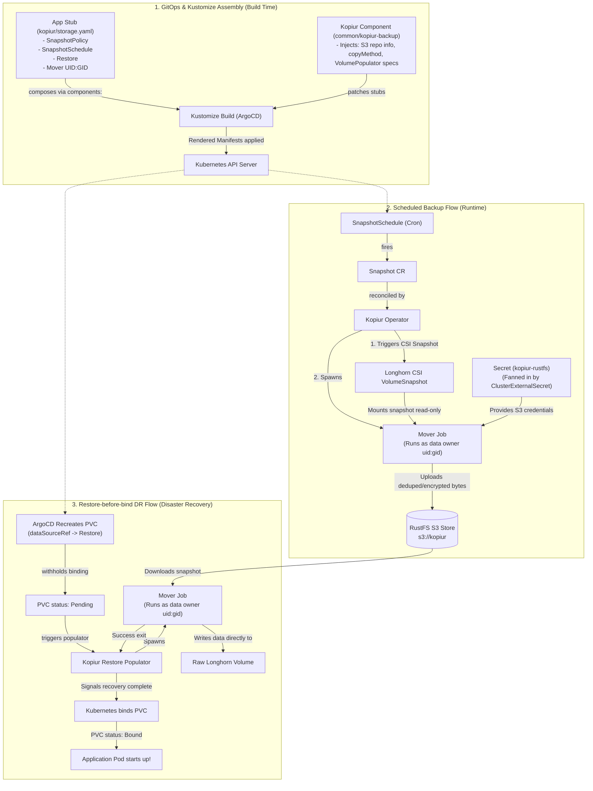

# kopiur backup architecture — the instruction manual

> How the pieces fit together for backup **and** restore, and which part lives
> where. If you're new to Kustomize **components**, start at §2 — that's the bit
> that trips people up. Permissions deep-dive: [`kopiur-mover-permissions.md`](kopiur-mover-permissions.md).

kopiur replaced pvc-plumber + VolSync (retired 2026-06-27). It is a Kopia-native
operator: you declare small CRs, it runs Jobs, kopia moves bytes to RustFS.

## Lifecycle and Flows



---

## 1. The pieces (what exists, and where)

```
 CLUSTER-WIDE (set up once)                          PER APP (you add these)
 ──────────────────────────                          ───────────────────────
 infrastructure/controllers/kopiur/                  my-apps/<cat>/<app>/
   • ClusterRepository  "cluster-kopia"                • namespace.yaml   (1 label)
       └─ points at RustFS  s3://kopiur                • pvc.yaml         (dataSourceRef)
   • ClusterExternalSecret "kopiur-rustfs"             • kopiur/<pvc>.yaml (the STUB)
       └─ copies repo creds into labeled namespaces    • kustomization.yaml
   • VolumeSnapshotClass "longhorn-snapclass"              └─ components: [kopiur-backup]
                                                            └─ resources:  [kopiur/<pvc>.yaml]
 kopiur operator (kopiur-system)
   • watches the CRs, runs Snapshot/Restore Jobs      my-apps/common/kopiur-backup/
                                                        • the shared COMPONENT (no app owns it)
```

| Piece | Scope | What it does |
|---|---|---|
| `ClusterRepository cluster-kopia` | cluster | the kopia repo definition → RustFS `s3://kopiur` |
| `ClusterExternalSecret kopiur-rustfs` | cluster | fans the repo creds into any namespace labeled `kopiur.home-operations.com/repo: cluster-kopia` |
| `VolumeSnapshotClass longhorn-snapclass` | cluster | how CSI snapshots are taken (Longhorn) |
| kopiur operator | cluster | reconciles the CRs; launches the mover Jobs |
| **component** `common/kopiur-backup` | shared | injects the **uniform** fields into your stub |
| **stub** `kopiur/<pvc>.yaml` | per-PVC | the **varying** bits: name, identity, cron, **mover UID** |
| namespace label | per-app | turns on creds + repo access for that namespace |
| PVC `dataSourceRef` | per-PVC | wires restore-before-bind to the `Restore` |

---

## 2. How a Kustomize component composes (read this if components are new)

A **component** is a reusable bundle of patches. Your app's `kustomization.yaml`
"pulls it in" with `components:`. At build time Kustomize takes the resources you
list, then lets the component **patch** them. So the per-PVC stub stays tiny (just
the bits that differ); the component fills in everything that's the same for every
backup.

```
 my-apps/<cat>/<app>/kustomization.yaml
   resources:
     - namespace.yaml            label: kopiur.home-operations.com/repo=cluster-kopia
     - pvc.yaml                  spec.dataSourceRef -> Restore "<pvc>-restore"
     - kopiur/<pvc>.yaml  ◄───── YOUR STUB (varying bits ONLY):
   components:                       SnapshotPolicy  { name, sources.pvc, identity, retention, MOVER uid:gid }
     - ../../common/kopiur-backup    SnapshotSchedule{ cron }
              │                      Restore         { fromPolicy, MOVER uid:gid }
              │
              └── patches by KIND, adds the UNIFORM fields:
                    SnapshotPolicy += repository: cluster-kopia, copyMethod: Snapshot,
                                      volumeSnapshotClassName: longhorn-snapclass
                    SnapshotSchedule += concurrencyPolicy: Forbid, runOnCreate: false
                    Restore += repository, target.populator:{}, onMissingSnapshot: Continue

   $ kubectl kustomize <app>     ─────►   FULL CRs  =  (your stub fields)  +  (component fields)
```

**Why the mover UID is in the stub, not the component:** it varies per PVC (the
data owner differs app to app — even within one namespace), and a component
patches *all* resources of a kind the same way, so it can't set a per-PVC value.
The component sets only what's identical everywhere.

---

## 3. Backup flow (what happens on a schedule)

```
 SnapshotSchedule (cron, e.g. "10 3 * * *")
        │  fires
        ▼
   Snapshot CR ──────────────► kopiur operator
                                   │
                                   ├─ 1. CSI VolumeSnapshot (longhorn-snapclass)
                                   │        └─► Longhorn point-in-time snapshot of the PVC
                                   │
                                   └─ 2. MOVER Job   (runs as the DATA OWNER uid:gid)
                                          • mounts the snapshot, read-only
                                          • reads creds from local Secret "kopiur-rustfs"
                                          │        (put there by the ClusterExternalSecret)
                                          ▼
                                        kopia ──upload──► RustFS  s3://kopiur
                                          (deduplicated + encrypted)
                                          ▼
                                        Snapshot → Completed (files, bytes)
```

The mover must run as the **data owner** or it can't read the files — see
[`kopiur-mover-permissions.md`](kopiur-mover-permissions.md).

---

## 4. Restore-before-bind flow (the DR magic)

The whole point: when a PVC is recreated, it does **not** come up empty — it
holds at `Pending` until kopiur restores its data, *then* binds.

```
 PVC deleted  /  namespace recreated  /  full DR
        │
        ▼
 ArgoCD recreates the PVC from git   (spec.dataSourceRef -> Restore "<pvc>-restore")
        │
        ▼
 Kubernetes sees a populator dataSourceRef  ──►  withholds binding   (PVC = Pending)
        │
        ▼
 kopiur Restore populator decides:
   ├─ repo reachable + snapshot exists ─► MOVER Job restores ─► PVC Binds WITH data ─► pod starts ✅
   ├─ repo reachable + NO snapshot yet  ─► onMissingSnapshot: Continue ─► binds EMPTY, backs up forward
   └─ repo UNREACHABLE                  ─► errors + retries ─► stays Pending, never empty ✅ (safe)
```

> The last line is the safety property the old `wait-for-rustfs` MAP gave us —
> kopiur preserves it for free: a backend error is raised *before* the
> "no snapshot → empty" decision, so an outage can't bind an empty volume.
> (Source-verified: `crates/controller/src/restore/mod.rs` `resolve_snapshot`.)

---

## 5. To add a backup (checklist)

1. `kubectl -n <ns> exec <pod> -- stat -c '%u:%g' <data-mountpath>` → note the **owner uid:gid**.
2. Namespace: add label `kopiur.home-operations.com/repo: cluster-kopia` (+ the
   `privileged-movers` annotation only if owner is `0`).
3. Add `kopiur/<pvc>.yaml` stub (SnapshotPolicy + Schedule + Restore) with the
   mover set to that uid:gid; pick a distinct cron minute — check **both**
   tiers: an hourly `MM * * * *` occupies minute MM of *every* hour, so a
   daily `MM 3 * * *` with the same MM collides at 03:MM (caught in the
   2026-07-04 audit: mysql 03:25 vs meilisearch hourly :25). List the taken
   minutes before picking:
   ```bash
   grep -rh 'cron:' my-apps/*/*/kopiur* my-apps/*/*/*/kopiur* | sort
   ```
4. PVC: `dataSourceRef -> Restore/<pvc>-restore` + the two `ServerSide*` annotations
   (`argocd.argoproj.io/compare-options: ServerSideDiff=false` and
   `argocd.argoproj.io/sync-options: ServerSideApply=false` — the immutable-`dataSourceRef` diff mask).
   **Retrofitting a running app?** Expected: ArgoCD shows a
   `PVC is invalid: Forbidden` ComparisonError — `dataSourceRef` is immutable
   on a Bound PVC. Harmless: backups start immediately anyway, and the
   `dataSourceRef` arms on the next recreate (which is exactly what DR is).
   The annotations + AppSet `ignoreDifferences` mask the diff.
5. Kustomization: add the stub to `resources:` and `../../common/kopiur-backup` to `components:`.
6. Verify: `kubectl -n <ns> get snapshotpolicy,snapshotschedule,restore,snapshot,secret`.

Copy from [`my-apps/ai/open-webui/`](https://github.com/mitchross/talos-argocd-proxmox/tree/main/my-apps/ai/open-webui) (simple)
or [`my-apps/home/project-nomad/mysql/`](https://github.com/mitchross/talos-argocd-proxmox/tree/main/my-apps/home/project-nomad/mysql)
(daemon-drop uid `999:568`). Full step-by-step: [`.claude/commands/add-backup.md`](https://github.com/mitchross/talos-argocd-proxmox/blob/main/.claude/commands/add-backup.md).

---

## 6. Upstream 0.5.x notes (assessed 2026-07-04, chart pinned `0.5.1`)

What changed upstream in 0.5.0/0.5.1 and how it lands here:

- **`copyMethod` now defaults to `Snapshot` upstream** (was `Direct`). We were
  already pinning `Snapshot` via the component — **keep the explicit pin**:
  upstream warns a server-defaulted field has no SSA field owner, so a GitOps
  re-apply of a manifest that *omits* the field can silently flip it on a CRD
  upgrade. Explicit value = owned field = immune. (Comment lives on the patch
  in `my-apps/common/kopiur-backup/kustomization.yaml`.)
- **`verification.quick` reshaped** to `{ schedule: { cron, jitter, timezone } }`
  (was a bare `{ cron, jitter }`). We don't use `verification` yet; if you add
  it, use the nested shape — the old shape is rejected on new writes.
  Verification is also now **gated on a verifiable snapshot existing** (no more
  verify-Job-fails-against-empty-repo on a fresh policy).
- **Metrics renamed / store-backed** (`kopiur_snapshot_*` →
  `kopiur_policy_last_backup_*`; `kopiur_resource_phase` emits active-only
  series). Irrelevant here today: the chart's ServiceMonitor/PrometheusRule/
  dashboard are all disabled and nothing in `monitoring/` scrapes kopiur metric
  names. If you ever enable scraping, use the new names.
- **`scheduleDefaults.timezone`** can now be set once on the
  `ClusterRepository` and every cron (backup schedules, verification,
  maintenance) inherits it. We deliberately stay on UTC — setting it would
  shift every existing schedule slot.
- **`failedJobsHistoryLimit`** on `SnapshotSchedule` (default 10) bounds failed
  `Snapshot` CRs; *succeeded* ones are pruned by the policy's GFS `retention` —
  which is why **every SnapshotPolicy must set `retention`** (audit-verified:
  all 22 do).
- **`files.ignoreRules` defaults** to OS-artifact junk (`/lost+found`,
  `System Volume Information`, `$RECYCLE.BIN`, `@eaDir`, `.snapshot`) — free
  win, no action.
- **`kubectl kopiur` CLI shipped in 0.5.1** (krew + Homebrew). Friendliest
  debugging surface for backup state — worth installing on workstations:
  `kubectl krew install kopiur`, then `kubectl kopiur --help`.
- **`credentialProjection` is heading for removal** (maintainer is migrating
  off it upstream). We never used it — the ESO `ClusterExternalSecret` fanout
  in `infrastructure/controllers/kopiur/externalsecret.yaml` is exactly the
  replacement pattern upstream recommends — so the eventual removal is a
  no-op here.
- **Known upstream race (#194):** in a namespace with the `privileged-movers`
  annotation, the grant event can be missed when namespace + CRs land together
  (DR cold-start), leaving `MoverPermitted=False` until a ~5 min backstop.
  Only the three root-mover namespaces (home-assistant, tubesync,
  nginx-example) qualify; the nudge is any no-op metadata touch on the CR.
  See the DR runbook.
- **Least-privilege reminder:** the `privileged-movers` annotation belongs
  ONLY on namespaces whose mover is elevated (uid 0, `runAsNonRoot: false`,
  added caps, or `privilegedMode`). The 2026-07-04 audit stripped it from 15
  namespaces where it had been blanket-copied during the VolSync migration.
