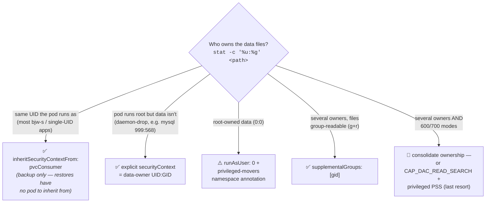

# Why the kopiur mover runs as the data owner (file permissions)

> The single most confusing thing about kopiur backups on a hardened cluster.
> If you ever see a `Snapshot` fail with `PermissionDenied` / "unable to open
> file ... permission denied", this is why — and the fix is one field.

## TL;DR

The kopiur **mover** (the short-lived pod that reads your PVC and copies it to
the repo) must run **as the user that owns the data on disk** — not as root.
Set it per-PVC in the stub:

```yaml
mover:
  securityContext: { runAsUser: 1000, runAsGroup: 1000, runAsNonRoot: true }
  podSecurityContext: { fsGroup: 1000, supplementalGroups: [1000] }
```

Find the right number with:
`kubectl -n <ns> exec <pod> -- stat -c '%u:%g' <data-mountpath>`

## In plain English

The backup tool doesn't copy your files itself. It spins up a little temporary
helper — the **mover** — whose only job is to read your app's files and copy
them to backup storage.

On Linux every file is **owned by a user** (just a number, a "UID"). To read a
file you must be its owner, be in its group, or the file is open to everyone.
Normally there's a superuser — **root** — who can read everything, like a
building superintendent with a master key.

**But the cluster takes the master key away from the mover, on purpose, for
security.** So even though the mover technically runs "as root," it's a
*declawed* root — it can only read files it personally owns, like any normal
user. (kopiur's `privilegedMode` setting sounds like it would give the key back,
but it doesn't — it only matters when *restoring*, not when reading.)

So a declawed-root mover tries to read your app's data — which is owned by some
normal user — and gets **"permission denied."** The fix is to stop sending a
declawed-root helper and instead **send a helper who IS the same user that owns
the files.** If the data is owned by user `1000`, run the mover as `1000`; now
it owns the files and reads them fine — no master key needed.

## The technical version

- Under **Pod Security Admission `baseline`** (which every app namespace
  enforces here), the mover pod runs with `securityContext.capabilities:
  drop: ["ALL"]`. That strips `CAP_DAC_READ_SEARCH` / `CAP_DAC_OVERRIDE` — the
  capabilities that let root bypass file-permission checks. So `runAsUser: 0`
  with caps dropped is a root UID with **no** permission-bypass power.
- kopiur's `mover.privilegedMode: true` does **not** add capabilities (verified
  on the live pod: still `drop: ["ALL"]`). It only governs **chown-on-restore**
  (re-creating original ownership when writing files back). It does nothing for
  the **read** path during a backup.
- Therefore the mover can only read files where its UID is the owner, its GID is
  the group (and the file is group-readable), or the file is world-readable.
  Mode-`600`/`700` files owned by another UID are unreadable → `PermissionDenied`.

### Choosing the mover identity



1. **`inheritSecurityContextFrom.pvcConsumer`** (recommended for backup) — kopiur
   copies the security context of the pod that mounts the PVC. Works perfectly
   when the **pod's UID equals the data owner** (most bjw-s / single-UID apps).
2. **Explicit `securityContext` = the data owner** — required when inherit can't
   give the right answer:
   - **Daemon-drop apps.** Some images start as root then drop to another user to
     write data. Example: mysql — the *pod* runs as root, but the database files
     are owned by `999:568`. Inherit would copy root (and fail); you must set
     `runAsUser: 999, runAsGroup: 568` explicitly.
   - **Restore (cold DR).** During restore-before-bind there is no consumer pod
     to inherit from, so the `Restore` mover always needs an explicit UID (or
     `runAsUser: 0` + `privilegedMode: true`, which uses root + chown to rebuild
     original ownership).
3. **`supplementalGroups: [<gid>]`** lets the mover read files owned by *other*
   UIDs as long as they're **group-readable** (mode `g+r`, e.g. `660`). Handy for
   volumes with a couple of different owners that all share a group.

### The genuinely hard case

Volumes with **mixed owners AND owner-only modes** (`700`/`600` files owned by
several different UIDs — docker-mailserver, some nextcloud layouts). No single
UID can read all of them, and group membership doesn't help. Two options:

- **Consolidate ownership** to one UID/GID (e.g. everything `1000:1000`). Cleanest;
  makes `inheritSecurityContextFrom.pvcConsumer` "just work."
- **Give the mover the master key back** — add `CAP_DAC_READ_SEARCH` to the mover
  `securityContext.capabilities.add`. This is **rejected by `baseline` PSS**, so
  you must raise that namespace to `privileged` Pod Security. It's the escape
  hatch for apps you can't consolidate — at the cost of relaxing that namespace.

## How this cluster does it

- The shared **`kopiur-backup` Kustomize component** injects the uniform fields
  (repository, copyMethod, populator, schedule defaults). It deliberately does
  **not** set the mover — UID varies per PVC.
- Each per-PVC stub sets its own mover `securityContext` to the data owner.
  Determined UIDs here: `568` (open-webui, perplexica, immich, qdrant, copyparty,
  frigate, restore-canary), `1000` (n8n, paperless, flatnotes, zomboid, homepage,
  jellyfin, fizzy, gitea), `1001` (karakeep), `999:568` (mysql), `0:0`
  (home-assistant, tubesync, nginx).

Examples to copy:
- Component: [`my-apps/common/kopiur-backup/kustomization.yaml`](https://github.com/mitchross/talos-argocd-proxmox/blob/main/my-apps/common/kopiur-backup/kustomization.yaml)
- Simple single-UID case: [`my-apps/ai/open-webui/kopiur/storage.yaml`](https://github.com/mitchross/talos-argocd-proxmox/blob/main/my-apps/ai/open-webui/kopiur/storage.yaml) (uid `568`)
- Daemon-drop case (mysql): [`my-apps/home/project-nomad/mysql/kopiur-backup.yaml`](https://github.com/mitchross/talos-argocd-proxmox/blob/main/my-apps/home/project-nomad/mysql/kopiur-backup.yaml) (uid `999:568`)
- Root-owned case: [`my-apps/home/home-assistant/kopiur/config.yaml`](https://github.com/mitchross/talos-argocd-proxmox/blob/main/my-apps/home/home-assistant/kopiur/config.yaml) (uid `0`, + namespace privileged-movers annotation)

See also: [`my-apps/CLAUDE.md`](https://github.com/mitchross/talos-argocd-proxmox/blob/main/my-apps/CLAUDE.md) "Application with
Persistent Storage + Backups" and [`.claude/commands/add-backup.md`](https://github.com/mitchross/talos-argocd-proxmox/blob/main/.claude/commands/add-backup.md).
