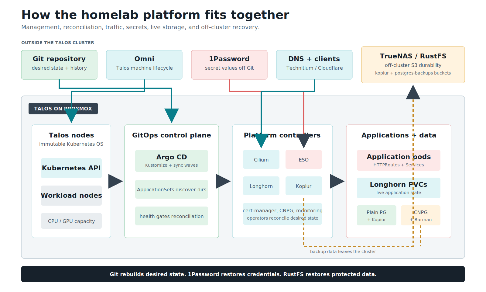

# The easy guide — explain this cluster to anyone

> The whole system — GitOps, sync waves, Kustomize components, kopiur backups,
> restore-before-bind DR — explained from zero, in order, with the real YAML.
>
> Deep-dive companions: [storage architecture](storage-architecture.md) (the
> operator's reference — design decisions, ops, troubleshooting),
> [kopiur backup architecture](domains/storage/kopiur-backup-architecture.md) (the mechanism),
> [disaster recovery](disaster-recovery.md) (the runbook).



*Git reconstructs desired state, 1Password reconstructs credentials, and RustFS
reconstructs protected data. [Open the platform map full size](assets/platform-overview.svg).*

---

## The 30-second pitch

> Destroy the entire Kubernetes cluster — every node, every disk, every app —
> and rebuild it with **one bootstrap script and a coffee**. Every application
> comes back, **with its data**, in the right order, unattended. No restore
> scripts. No snapshot IDs. No "wait, which volume was that?"

Three ideas make that true, and they stack:

1. **GitOps** — the entire cluster is a Git repo. A directory *is* an application.
2. **Sync waves** — ArgoCD deploys in a strict order, so the backup machinery
   exists before anything that needs it.
3. **Restore-before-bind** — every important volume is recreated *pre-filled
   with its backed-up data* before its app is allowed to start.

The rest of this page walks each idea from zero.

!!! question "Here because someone said *“dude, you gotta try kopiur”*?"
    You do **not** need the sync waves, ArgoCD, namespace labels, or Kustomize
    components to back up your PVCs. Those are the scaffolding *this* cluster
    uses at scale — kopiur's minimum is one operator and ~30 lines of YAML on
    any cluster with CSI snapshots. Jump straight to
    [the adoption ladder](#part-8-i-just-want-to-try-kopiur-the-adoption-ladder)
    and climb only as far as you need.

---

## Part 1 — GitOps: a directory *is* an application

There are no hand-written ArgoCD `Application` manifests for apps in this
cluster. **ApplicationSets** scan the repo's directory structure and generate
the Applications:

```text
my-apps/ai/open-webui/           →  ArgoCD Application "my-apps-open-webui"
infrastructure/storage/longhorn/ →  ArgoCD Application "longhorn"
monitoring/prometheus-stack/     →  ArgoCD Application "prometheus-stack"
```

Deploying a new app = `mkdir`, add a `kustomization.yaml`, `git push`. That's
the entire deployment pipeline.

The chain that makes it self-managing:

```text
bootstrap-argocd.sh (manual, once)
        |
        v
root Application (root.yaml)
        |
        v
argocd/apps/  (projects + AppSets + entrypoint Applications)
        |
        v
4 ApplicationSets  (infra, databases, monitoring, my-apps)
        |
        v
auto-discovered apps  (my-apps/*/* etc.)
```

The one manual act is applying `root.yaml`. From then on ArgoCD manages
*everything* — including its own Helm values and the ApplicationSets that
discover everything else. Git is the cluster; the cluster is a cache.

---

## Part 2 — How Argo waits (sync waves)

{ loading=lazy }

*Wave numbers order resources; health checks make each dependency gate wait.
[Open the sync-wave sequence full size](assets/argocd-sync-waves.svg).*

A cluster rebuild has a brutal ordering problem: apps need volumes, volumes
need the backup operator, the operator needs credentials, credentials need the
secrets machinery, and everything needs a network. Deploy it all at once and
you get retry soup.

ArgoCD solves this with one annotation:

```yaml
metadata:
  annotations:
    argocd.argoproj.io/sync-wave: "3"
```

The rule: **everything in wave N must be Synced *and Healthy* before wave
N+1 starts.** Lower waves first; a failing wave halts the walk.

This cluster's waves, and *why* each sits where it does:

| Wave | What | Why it must precede the next wave |
|---|---|---|
| **0** | Cilium (CNI), ArgoCD itself, 1Password Connect, External Secrets | No network → nothing schedules. No secrets engine → no credentials for anyone. |
| **1** | cert-manager, Longhorn, Snapshot Controller | Storage + the `VolumeSnapshot` CRDs the backup system snapshots with. |
| **2** | **kopiur operator** (CRDs + controller + webhook) | The volume populator must exist before any PVC references a `Restore`. |
| **3** | **kopiur config** (`ClusterRepository`, credential fanout, `VolumeSnapshotClass`) + CNPG Barman plugin | The repo definition + S3 creds must be live before movers run. |
| **4** | Infrastructure + database AppSets, KEDA, VPA, Temporal worker | The platform layer; CNPG databases restore themselves via Barman here. |
| **5** | Monitoring AppSet (kube-prometheus-stack), OTEL operator | Observability is deliberately **not** a core dependency. |
| **6** | **my-apps AppSet** — every user app + its per-PVC backup CRs | By now, everything a restoring PVC needs already exists. |

Two implementation details make this actually work — both bite people who copy
the pattern without them:

**1. The Application health check.** ArgoCD does not assess the health of
`Application` resources by default, which silently breaks wave-gating in
app-of-apps setups — parent apps consider children "healthy" the moment they
exist. Re-enable it in the ArgoCD values
(`infrastructure/controllers/argocd/values.yaml`):

```yaml
resource.customizations.health.argoproj.io_Application: |
  hs = {}
  hs.status = "Progressing"
  if obj.status ~= nil and obj.status.health ~= nil then
    hs.status = obj.status.health.status
  end
  return hs
```

Without this Lua snippet, waves are ordering theater — Argo applies them in
sequence but never *waits*.

**2. Health gating is what makes restores block the waves.** During a rebuild,
a restoring PVC sits `Pending` (see Part 5), so its pod can't start, so the
Application reports `Progressing`, so ArgoCD **waits**. The restore literally
holds the door:

```text
Wave 6 applies an app
        |
        v
PVC created with dataSourceRef -> Restore
        |  (K8s withholds binding)
        v
PVC: Pending
        |
        v
kopiur populator mover Job hydrates volume from S3
        |
        v
PVC: Bound (with data)
        |
        v
Pod starts -> Ready
        |
        v
Application: Healthy — Argo's sync completes
```

---

## Part 3 — Kustomize components (shared build-time patches)

{ loading=lazy }

*The app explicitly opts in, Kustomize patches matching objects during build,
and Argo receives the complete rendered output. [Open the Kustomize Component flow full size](assets/kustomize-component-mixin.svg).*

Classic Kustomize is **base → overlay**: an overlay inherits one base and
patches it. That model breaks when you want to share one cross-cutting
*feature* — "make this thing backed up" — across 20 unrelated apps that share
no base.

A **Component** is an optional Kustomize package containing reusable resources
and patches. Nothing discovers it automatically. An application explicitly
opts in through `components:`:

```yaml
# my-apps/ai/open-webui/kustomization.yaml
components:
  - ../../common/kopiur-backup     # ← mix in "backed up"
resources:
  - kopiur/storage.yaml            # ← the app's tiny per-PVC stub
```

During `kustomize build`, Kustomize parses the application's resources, finds
objects matching each patch target by API group and kind, applies the JSON
Patch operations to exact field paths, and emits complete Kubernetes YAML.
Argo CD then diffs and applies that rendered output. The Component does not run
in the cluster, watch live resources, scan the repository for filenames, or
perform text replacement.

The division of labor is the whole design:

- **The stub** (per PVC, in the app's folder) carries only what *varies*:
  the PVC name, the backup identity, retention, the cron, and the mover's
  UID (see Part 6).
- **The component** (one shared file, `my-apps/common/kopiur-backup/`)
  injects everything that's *identical* for every backup in the cluster.

The component is small enough to read in full — it's just JSON patches
targeted by resource `kind`:

```yaml
# my-apps/common/kopiur-backup/kustomization.yaml (abridged)
apiVersion: kustomize.config.k8s.io/v1alpha1
kind: Component
patches:
  - target: { kind: SnapshotPolicy, group: kopiur.home-operations.com }
    patch: |
      - { op: add, path: /spec/copyMethod, value: Snapshot }
      - { op: add, path: /spec/volumeSnapshotClassName, value: longhorn-snapclass }
      - { op: add, path: /spec/repository, value: { kind: ClusterRepository, name: cluster-kopia } }
  - target: { kind: SnapshotSchedule, group: kopiur.home-operations.com }
    patch: |
      - { op: add, path: /spec/schedule/concurrencyPolicy, value: Forbid }
      - { op: add, path: /spec/schedule/runOnCreate, value: false }
  - target: { kind: Restore, group: kopiur.home-operations.com }
    patch: |
      - { op: add, path: /spec/repository, value: { kind: ClusterRepository, name: cluster-kopia } }
      - { op: add, path: /spec/target, value: { populator: {} } }
      - { op: add, path: /spec/policy, value: { onMissingSnapshot: Continue } }
```

At build time (`kubectl kustomize my-apps/ai/open-webui`) Kustomize merges
stub + component into complete CRs. Change the repo name or the snapshot class
once, in one file, and every backup in the cluster follows.

**Why doesn't the component set the mover UID too?** A component patches *all*
resources of a kind identically, and the mover UID must match each PVC's data
owner — which differs app to app (and even within one namespace). Uniform
things go in the component; varying things stay in the stub. That line is the
entire design discipline.

---

## Part 4 — kopiur: the backup operator

{ loading=lazy }

*Build time declares the recovery contract; runtime moves the data and enforces
restore-before-bind. [Open the complete Kopiur flow full size](assets/kopiur-kustomize-flow.svg).*

[kopiur](https://github.com/home-operations/kopiur) is a Kopia-native Kubernetes
operator (Rust). You declare small CRs; it runs Jobs; [Kopia](https://kopia.io)
encrypts, deduplicates, and ships bytes to S3. The cast:

| CR | Scope | One-line job description |
|---|---|---|
| `ClusterRepository` | cluster | "The Kopia repo lives at RustFS `s3://kopiur`; namespaces with *this label* may use it." |
| `SnapshotPolicy` | per PVC | "Back up *this PVC*, under *this identity*, keep *this much* history, run the mover as *this user*." |
| `SnapshotSchedule` | per PVC | "Fire the policy on *this cron*." |
| `Snapshot` | created per run | One backup execution; ends `Succeeded` with file/byte counts. |
| `Restore` | per PVC | "I can rebuild this volume from the repo" — the thing a PVC's `dataSourceRef` points at. |

Plus one non-CR trick: the **credential fanout**. A single
`ClusterExternalSecret` copies the repo credentials (from 1Password, via
External Secrets) into every namespace labeled
`kopiur.home-operations.com/repo: cluster-kopia`. The **same label** is the
repo's tenancy allow-list. So opting a namespace into backups is *one label*.

### What a scheduled backup actually does

```text
SnapshotSchedule cron fires
        |
        v
Snapshot CR created
        |
        v
kopiur operator
        |  (1) CSI VolumeSnapshot (Longhorn, point-in-time)
        |  (2) mover Job (runs AS the data owner)
        v
CSI snapshot --(mounted read-only)--> mover Job
        |
        v  kopia: encrypt + dedup
RustFS S3  (s3://kopiur)
```

Point-in-time consistency comes from the CSI snapshot (the mover reads a
frozen copy, not the live volume). Efficiency comes from Kopia's
content-defined chunking: unchanged data uploads in near-zero time and takes
near-zero new space, across *all* apps sharing the one repo.

### The complete real example (open-webui)

This is the **entire** backup configuration for a production volume — four
small touches, all in Git (click through the tabs):

=== "1 · namespace.yaml"

    One label opts the namespace in — it drives **both** the credential fanout
    and the repo's tenancy allow-list:

    ```yaml
    metadata:
      labels:
        kopiur.home-operations.com/repo: cluster-kopia
    ```

=== "2 · pvc.yaml"

    The restore pointer (Part 5 explains why this one stanza is the magic):

    ```yaml
    spec:
      storageClassName: longhorn
      dataSourceRef:
        apiGroup: kopiur.home-operations.com
        kind: Restore
        name: storage-restore
    ```

=== "3 · kopiur/storage.yaml (the stub)"

    Only the varying bits — the component injects everything uniform:

    ```yaml
    apiVersion: kopiur.home-operations.com/v1alpha1
    kind: SnapshotPolicy
    metadata: { name: storage, namespace: open-webui }
    spec:
      sources: [{ pvc: { name: storage } }]
      identity: { username: storage, hostname: open-webui }
      retention: { keepDaily: 14, keepWeekly: 6, keepMonthly: 3 }
      mover:   # runs as the DATA OWNER — Part 6
        securityContext: { runAsUser: 568, runAsGroup: 568, runAsNonRoot: true }
        podSecurityContext: { fsGroup: 568, supplementalGroups: [568] }
    ---
    apiVersion: kopiur.home-operations.com/v1alpha1
    kind: SnapshotSchedule
    metadata: { name: storage-daily, namespace: open-webui }
    spec:
      policyRef: { name: storage }
      schedule: { cron: "5 3 * * *" }   # distinct minute per PVC — no 3 a.m. stampede
    ---
    apiVersion: kopiur.home-operations.com/v1alpha1
    kind: Restore
    metadata: { name: storage-restore, namespace: open-webui }
    spec:
      source: { fromPolicy: { name: storage, offset: 0 } }   # offset 0 = latest
      mover:
        securityContext: { runAsUser: 568, runAsGroup: 568, runAsNonRoot: true }
        podSecurityContext: { fsGroup: 568, supplementalGroups: [568] }
    ```

=== "4 · kustomization.yaml"

    Two lines wire it all together:

    ```yaml
    components: [ ../../common/kopiur-backup ]
    resources:  [ kopiur/storage.yaml ]   # (plus the app's other resources)
    ```

Verify any time:

```bash
kubectl -n open-webui get snapshotpolicy,snapshotschedule,restore,snapshot,pvc
kubectl -n open-webui get secret kopiur-rustfs   # creds arrived via the fanout
```

---

## Part 5 — Restore-before-bind (the DR magic)

This is the load-bearing idea of the whole system, and the part worth slowing
down for in any talk.

**The problem with every "normal" backup tool:** restore is a *separate step
after* the app starts. On a rebuild, the PVC is recreated **empty**, the app
boots on the empty volume, and now you're racing it:

- The app's *own* next scheduled backup snapshots the empty state — and
  retention can age out your real data.
- The app writes new state to the blank volume — restoring the old data now
  loses the new writes *and* desyncs from external systems.
- Auth-bearing apps lock you out: the credential you'd log in with lived in
  the data you lost.

Sharpest version: a **game-server world save**. Fresh world boots, players
join, and the "backup" system dutifully backs up the fresh world over your
real one.

**The fix is a first-class Kubernetes contract** — the *volume populator*.
A PVC whose `dataSourceRef` points at a populator CR is **withheld from
binding** until the populator fills it:

```yaml
spec:
  dataSourceRef:
    apiGroup: kopiur.home-operations.com
    kind: Restore
    name: storage-restore
```

That one stanza changes the failure mode completely. When the PVC is created —
first install, rebuild, or "oops, I deleted it" — exactly one of three things
happens:

| Repo state | Outcome |
|---|---|
| ✅ Reachable, snapshot exists | Mover restores the latest snapshot → PVC binds **with data** → app starts. |
| ⚪ Reachable, **no** snapshot yet | `onMissingSnapshot: Continue` → binds **empty**, starts backing up forward. Day-zero and disaster-day are the same code path. |
| 🛑 **Unreachable** | Populator errors and retries → PVC stays `Pending`. **It never binds empty over a dead backend.** |

That last row is the safety property everything else is built around: an
outage can delay recovery, but it can never silently hand your app a blank
volume that then gets backed up as if it were real.

!!! example "Try it yourself, no cluster needed"
    The [**kopiur playground**](kopiur-playground.md) is an interactive
    simulation of exactly this state machine — delete the PVC, take S3
    offline, nuke the cluster, and watch all three outcomes play out.

The honest fine print: a PVC **without** the `dataSourceRef` recreates empty —
the backup exists, but nothing tells Kubernetes to use it. CI
(`validate-kopiur-coverage.py`) hard-fails a PR where a backed-up PVC is
missing its `dataSourceRef`, and volumes that are *deliberately* unprotected
carry a `backup-exempt` label with a written reason. Everything is a recorded
decision.

> Among Kubernetes backup tools, only populator-based tools implement this
> populator-hold. Velero, K8up, Stash & co. back up fine — but restore as a
> separate imperative step, which reintroduces the exact race above. That's
> why this cluster runs kopiur. ([Full comparison](domains/storage/kopiur-evaluation.md).)

---

## Part 6 — The one gotcha: the mover runs as the data owner

If you teach one operational lesson, teach this one — it's the #1 way a
first backup fails on a hardened cluster.

The mover pod runs under **Pod Security "baseline"**, which drops all Linux
capabilities — including the two (`CAP_DAC_READ_SEARCH`/`CAP_DAC_OVERRIDE`)
that let root ignore file permissions. So a root mover on this cluster is a
**declawed root**: uid 0, no master key. Point it at files owned by uid 568
with mode `600` and it gets `PermissionDenied`, every time.

The fix isn't to give the key back; it's to **send the right user**: run the
mover *as the uid:gid that owns the data*.

```bash
# find the owner
kubectl -n <ns> exec <pod> -- stat -c '%u:%g' <data-mountpath>
```

```yaml
# put it in the stub (both SnapshotPolicy and Restore)
mover:
  securityContext: { runAsUser: 568, runAsGroup: 568, runAsNonRoot: true }
  podSecurityContext: { fsGroup: 568, supplementalGroups: [568] }
```

This is also exactly *why* the UID lives in the per-PVC stub and not the
shared component: it's the one field that genuinely varies per volume.
Full detail, including the daemon-drop (mysql `999:568`) and root-owned
(uid `0` + the `privileged-movers` namespace annotation) cases:
[mover permissions](domains/storage/kopiur-mover-permissions.md).

---

## Part 7 — Putting it together: the full DR story

{ loading=lazy }

*Recovery finishes only when desired state, credentials, protected data, and
runtime health all converge. [Open the disaster-recovery sequence full size](assets/disaster-recovery-sequence.svg).*

Everything above composes into one sentence: **the off-cluster pieces are the
pets; the cluster is cattle.**

```text
Dies with the cluster:
  - Longhorn volumes
  - every Kubernetes object

Survives (off-cluster):
  - Git repo
  - Kopia repo — RustFS S3
  - CNPG Barman S3 (databases, separate system)
  - 1Password vault
  - Omni/Talos machine config

  Survivors  --(bootstrap + sync waves)-->  New cluster
  New cluster  --(populators hydrate PVCs)-->  Everything back, with data
```

The rebuild, end to end:

1. `omnictl` provisions fresh Talos VMs on Proxmox (machine classes + template).
2. `./scripts/bootstrap-argocd.sh` — the **only** storage-relevant manual step.
3. Waves 0–3 walk: network → secrets → storage → kopiur operator → repo config.
4. Waves 4–6: databases restore via Barman; every app PVC holds `Pending`
   while its populator hydrates it; apps start on restored data, in parallel.
5. You drink the coffee.

A [restore canary](disaster-recovery.md#the-restore-canary) takes daily backups
and runs weekly quick verification. Its isolated test PVC is where an operator
can safely re-run the destructive delete→recreate→populate→byte-verify drill.

The honest boundaries:

- **Database recovery is an explicit RPO choice** — remaining CNPG databases
  use Postgres-aware Barman + WAL/PITR. Plain single-instance Postgres uses a
  single-volume crash-consistent kopiur snapshot and WAL crash recovery, with
  no PITR. Do not mix both systems on one database PVC.
- **One repo copy, on-LAN** — this is not 3-2-1; a NAS-level disaster loses
  the backups. Known, accepted, documented.
- **RPO = the cron cadence.** You lose at most one interval of data.
- **kopiur is pre-1.0** — the chart is pinned; CRD fields can churn.

---

## Part 8 — "I just want to try kopiur" (the adoption ladder)

The honest version of the colleague conversation:

> **"Dude, you gotta try kopiur."**
> "OK… but to back up my PVCs I need your sync waves? ArgoCD? Namespace
> labels? Kustomize components??"
> **"No. Those are what *operating 22 backed-up PVCs unattended* looks like.
> kopiur itself is an afternoon."**

Everything in this repo is one of these rungs. Climb only as far as your
problem actually demands:

| Rung | You add | It buys you | You need it when |
|---|---|---|---|
| **0 — backups** | kopiur operator (Helm) + `ClusterRepository` + a plain Secret + one `SnapshotPolicy`/`SnapshotSchedule` | Scheduled, encrypted, deduped PVC backups. `kubectl` only. | You have ≥1 PVC you'd cry about. |
| **1 — self-restoring PVCs** | a `Restore` CR + `dataSourceRef` on the PVC | Restore-before-bind: a recreated PVC comes back **with data**, never silently empty. | The first time you delete a PVC on purpose or by accident. |
| **2 — GitOps** | ArgoCD/Flux owning the manifests | *Unattended* recreate: delete the app, the namespace, whatever — Git puts it back and the restore fires itself. | You stop wanting to type `kubectl apply` during incidents. |
| **3 — credential fanout** | the namespace label + `ClusterExternalSecret` (or any secret sync) | New namespace = one label; repo creds appear, tenancy granted. No per-app secret plumbing. | Backed-up apps live in more than ~3 namespaces. |
| **4 — the component** | `common/kopiur-backup` Kustomize component | Per-PVC config shrinks to a ~20-line stub; cluster-wide backup policy changes in one file. | You're copy-pasting the same CR fields a 5th time. |
| **5 — sync waves** | wave annotations + the Application health Lua | A **whole-cluster rebuild** that orders itself: storage → operator → repo → apps, restores gating each app's start. | You want "nuke it and re-bootstrap" as a supported operation. |
| **6 — trust at scale** | CI coverage check + the restore canary | A PR can't ship a backed-up PVC missing its `dataSourceRef`; backup verification is scheduled and destructive restore drills have an isolated target. | The system must stay correct *without risking production data*. |

### Rung 0–1 on YOUR cluster, concretely

Prerequisites: any CSI with VolumeSnapshot support (`kubectl get
volumesnapshotclass` returns something) and any S3 endpoint (MinIO, Garage,
B2, TrueNAS…).

1. Install the operator: the OCI Helm chart
   `oci://ghcr.io/home-operations/charts/kopiur` (pin the version — it's
   pre-1.0).
2. Create a `kopiur-system` Secret with `AWS_ACCESS_KEY_ID`,
   `AWS_SECRET_ACCESS_KEY`, `KOPIA_PASSWORD` — plain `kubectl create secret`
   is fine; ESO is a rung-3 luxury.
3. Declare the repo: a `ClusterRepository` pointing at your bucket
   (bare `host:port` endpoint, `tls.disableTls: true` for plain HTTP), with
   `allowedNamespaces` matching a label of your choosing. Copy the shape from
   [backup-repository-setup.md](backup-repository-setup.md#3-the-repository-cr-in-git-already-done).
4. Label your app's namespace, copy the same Secret into it, and drop in the
   three CRs from [Part 4's tab 3](#the-complete-real-example-open-webui) —
   remembering the **one real gotcha**: the mover's UID must be the data
   owner's (Part 6).
5. Watch `kubectl -n <ns> get snapshot` reach `Completed`. That's rung 0.
6. Add the `Restore` + `dataSourceRef` (tabs 2–3), then drill it: scale to
   zero, delete the PVC, recreate it, watch it hold `Pending` and bind **with
   your data**. That's rung 1 — and the moment the whole idea clicks.

!!! tip "What's genuinely *this repo* vs. genuinely *kopiur*"
    kopiur gives you rungs 0–1 (the CRs, the populator, the mover). Rungs 2–6
    are ordinary Kubernetes/GitOps building blocks — ArgoCD, ESO, Kustomize,
    CI — arranged so the backup system needs **zero human choreography**. None
    of them are required to start; all of them are why the full-cluster-nuke
    story works unattended.

---

## FAQ (the questions colleagues actually ask)

**Why not Velero?**
Velero restores as a separate step after the PVC exists — which reintroduces
the blank-volume race from Part 5. Only populator-based tools can hold the PVC
hostage until the data is back.

**Why kopiur?**
Kopia-native with first-class CRs (`ClusterRepository` instead of hand-rolled
secrets-per-namespace), a lean mover, the volume-populator contract for
restore-before-bind, and an active home-operations community.
([Evaluation record](domains/storage/kopiur-evaluation.md).)

**Why explicit per-PVC CRs instead of "just label the PVC"?**
`dataSourceRef` is immutable and must exist *at PVC create time* — a
controller reacting to a label is too late (the PVC already bound empty).
So the wiring must live in Git at render time; the Kustomize component keeps
that from becoming boilerplate.

**One shared repo for all apps — isn't that risky?**
One encryption password is a single blast radius, accepted for a single-operator
LAN-only homelab. In exchange, Kopia dedups across *all* apps. Snapshots are
namespaced by each policy's `identity` (`hostname`/`username`), so apps never
collide.

**What happens if the S3 box is down during a rebuild?**
Restores error and retry; PVCs stay `Pending`. Nothing binds empty. Recovery
is delayed, never corrupted. (Row 3 of the table in Part 5.)

**What about the databases?**
The CNPG-managed ones use Barman WAL archiving to a separate S3 bucket —
SQL-aware, point-in-time capable, entirely independent of kopiur
([CNPG DR](domains/cnpg/disaster-recovery.md)). They are migrating to plain
Postgres + kopiur so databases follow the exact same restore-before-bind flow
as every other PVC ([migration doc](domains/cnpg/plain-postgres-migration.md));
new databases start on that pattern directly.

**How do I add a backup to a new app?**
Six steps, ~5 minutes: find the data owner's uid:gid → label the namespace →
write the stub → add the `dataSourceRef` → wire the component → verify.
[The checklist](domains/storage/kopiur-backup-architecture.md#5-to-add-a-backup-checklist).

---

## Cheat sheet

```bash
# Is everything wired? (per namespace)
kubectl -n <ns> get snapshotpolicy,snapshotschedule,restore,snapshot,pvc
kubectl -n <ns> get secret kopiur-rustfs

# Cluster-wide backup health
kubectl get snapshot -A                        # recent runs Completed?
kubectl -n kopiur-system get pods,clusterrepository
# Or the official CLI (0.5.1+): kubectl krew install kopiur && kubectl kopiur --help
# On-demand backup right now: kubectl kopiur snapshot now --policy <name> -n <ns>

# Sync-wave order at a glance
kubectl get applications -n argocd \
  -o custom-columns=NAME:.metadata.name,WAVE:.metadata.annotations.argocd\\.argoproj\\.io/sync-wave,STATUS:.status.sync.status

# Render what the component injects (no cluster needed)
kubectl kustomize my-apps/ai/open-webui
```

| I want to… | Go to |
|---|---|
| Operate it day-2 (design decisions, ops, troubleshooting) | [storage-architecture.md](storage-architecture.md) |
| Add a backup | [kopiur-backup-architecture.md §5](domains/storage/kopiur-backup-architecture.md#5-to-add-a-backup-checklist) |
| Fix `PermissionDenied` | [kopiur-mover-permissions.md](domains/storage/kopiur-mover-permissions.md) |
| Rebuild the cluster | [disaster-recovery.md](disaster-recovery.md) |
| Set up the S3 backend | [backup-repository-setup.md](backup-repository-setup.md) |
