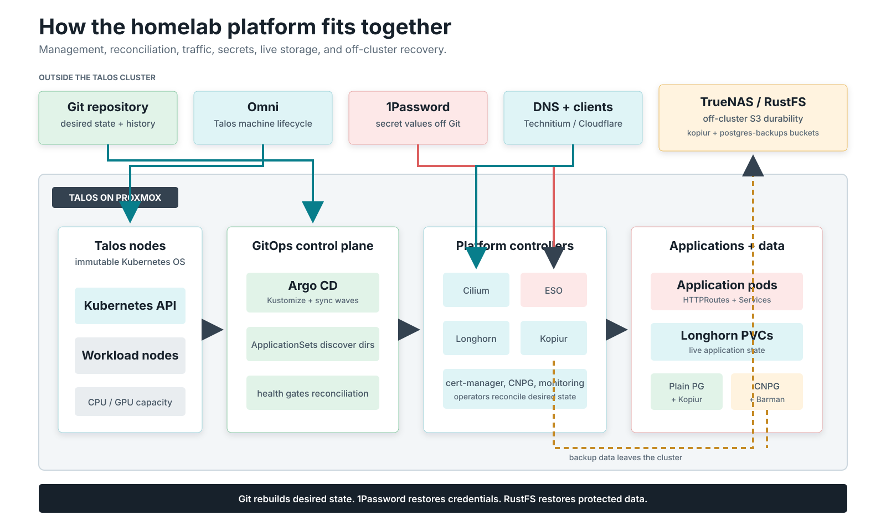

# talos-argocd-proxmox

A GitOps Kubernetes homelab on **Talos Linux** with **self-managing ArgoCD**.
ApplicationSets discover app directories. Per-PVC Kopiur resources declare
backup and restore behavior. After the operator rebuilds Talos and seeds Argo,
protected volumes restore automatically from the off-cluster repository.

> Source: [`mitchross/talos-argocd-proxmox`](https://github.com/mitchross/talos-argocd-proxmox)
> · This site renders `docs/` from that repo.

*Git reconstructs desired state, 1Password reconstructs credentials, and RustFS
reconstructs protected data. [Open the full-size platform map](assets/platform-overview.svg).*

!!! tip "The point"
    The whole cluster can be destroyed and rebuilt with every protected volume
    restored automatically from the off-cluster Kopia repository — no manual storage
    steps. See [disaster recovery](disaster-recovery.md).

## Stack

- **OS**: Talos Linux on Proxmox VMs, provisioned via Omni / Sidero
- **CNI**: Cilium with Gateway API + LoadBalancer
- **GitOps**: ArgoCD (self-managing) + ApplicationSets for auto-discovery
- **Storage**: Longhorn V1, mostly one replica despite multiple physical hosts;
  Temporal Postgres uses the wired two-replica class. NAS provides bulk files and
  off-cluster backups. [Failure domains and disk inventory](audits/2026-09-05-inventory.md).
- **Backup**: [kopiur](https://github.com/home-operations/kopiur) (Kopia-native) → RustFS S3, per-PVC `SnapshotPolicy`/`Restore` with restore-before-bind
- **Database**: plain Postgres Deployments backed up by kopiur — hourly snapshots, restore-before-bind (CNPG retired 2026-08-13)
- **Secrets**: 1Password Connect + External Secrets Operator
- **Observability**: kube-prometheus-stack, Loki, Tempo, OpenTelemetry
- **AI**: llama.cpp serves `qwen3.8-27b` on the sole RTX 3090. vLLM and image
  generation are parked. The [model catalog](domains/ai-gpu/model-catalog.md)
  owns the current backend settings; use the [scale-swap runbook](domains/ai-gpu/gpu-scale-swap.md) to change the card owner.

## Documentation

[**Explore the lab →**](lab.md) Click through the machines, IPs, disks, VMs and
what depends on each host. Includes the proposed jobs for each machine.

Start with the [hardware, disk placement and GitOps review](audits/2026-09-05-hardware-and-placement-review.md)
for the engineering recommendation, proposed workload pools and disk move priorities.
Those proposals are explicitly separate from deployed state.

The [September 5 architecture audit](audits/2026-09-05-architecture-audit.md) and
[dated repository/host inventory](audits/2026-09-05-inventory.md) record verified
findings, proposed fixes, and current-state differences that still need reconciliation.

Every page follows the [documentation reader contract](documentation-standard.md):
state the current posture, explain unfamiliar choices, provide verifiable steps,
and include failure/rollback guidance for risky operations.

-   📖 **The easy guide** — *share this one*

    ---

    The whole system from zero: GitOps → sync waves → Kustomize components →
    kopiur → restore-before-bind. Real YAML, an adoption ladder for
    "I just want to try kopiur", and the colleague FAQ.

    [→ easy-guide.md](easy-guide.md)

-   💾 **kopiur backup architecture** — *the one doc*

    ---

    The pieces, the component pattern, backup + restore flow diagrams, and
    the 6-step add-a-backup checklist.

    [→ kopiur-backup-architecture.md](domains/storage/kopiur-backup-architecture.md)

-   ☠️ **Disaster recovery** — *the runbook*

    ---

    Destroy → rebuild → restore: pre-nuke checklist, restore-wave
    expectations, and the restore canary.

    [→ disaster-recovery.md](disaster-recovery.md)

-   🗄️ **Storage architecture** — *operator's reference*

    ---

    Design decisions, who-provides-what, day-2 operations
    (enable / exempt / drill), troubleshooting, and the honest limitations.

    [→ storage-architecture.md](storage-architecture.md)

### 💾 More storage & backups

Backups are **kopiur** (Kopia-native operator).

- **[kopiur-playground.md](kopiur-playground.md)** — 🕹️ interactive, in-browser
  simulation of backup + restore-before-bind: delete a PVC, take S3 offline,
  nuke the cluster, watch what happens.
- **[domains/storage/kopiur-mover-permissions.md](domains/storage/kopiur-mover-permissions.md)** —
  why the backup mover runs as the data owner (the #1 gotcha), plain English + technical.
- **[backup-repository-setup.md](backup-repository-setup.md)** — the one-time backend
  setup: RustFS S3 bucket, credentials, the kopiur `ClusterRepository`.

### 🗃️ Domains

- **Databases**: [Run Postgres here — plain-English operator guide](domains/cnpg/run-postgres-plain-english.md) · [Plain Postgres pattern & CNPG retirement](domains/cnpg/plain-postgres-migration.md)
- **GitOps / ArgoCD**: [argocd](domains/argocd/argocd.md) · [entrypoints & waves](domains/argocd/entrypoints.md)
- **Enterprise multi-cluster planning**: [roadmap](domains/multicluster/enterprise-gitops-roadmap.md) · [concrete fleet PRD](domains/multicluster/prd.md)
- **Networking**: [topology](domains/networking/topology.md) · [Dell Proxmox Talos worker](domains/networking/dell-proxmox-talos-worker.md) · [policy](domains/networking/policy.md) · [Technitium `vanillax.me` migration](domains/networking/technitium-vanillax-me-migration.md)
- **Storage**: [move a PVC to another StorageClass](domains/storage/pvc-storageclass-migration.md) · [kopia maintenance](domains/storage/kopia-maintenance-plan.md) · [RWO/RWX model & sizing](domains/storage/storage-model-rwo-rwx-and-sizing.md) · [RustFS credentials](domains/rustfs/credential-runbook.md) · [future: tiered storage](domains/storage/architecture-future.md)
- **Observability**: [radar-ng](domains/observability/radar-ng.md)
- **Scheduling**: [VPA policy ownership and topology](domains/scheduling/vpa-and-topology.md)
- **Power**: [wall-plug metering, cost model and the power-off lockout](domains/power/metering.md)
- **Apps**: [Self-hosting PostHog on Kubernetes](posthog-self-host-k8s.md) — the full recipe (topology, single-node ClickHouse, routing, upgrade checklist), portable to any cluster
- **AI / GPU**: [model catalog](domains/ai-gpu/model-catalog.md) · [one vs two 3090s](domains/ai-gpu/single-vs-dual-3090.md) · [3090 LLM optimization](domains/ai-gpu/3090-llm-optimization.md) · [pi agent local-dev guide](domains/ai-gpu/pi-agent-local-dev.md)

## Adopting any of this

This is one operator's homelab, not a product. The patterns are portable —
the label-driven backup contract, the off-cluster repository, the
restore-canary idea, the sync-wave bootstrap — but the image tags, hostnames,
and 1Password item names are not. Start with
[storage-architecture.md](storage-architecture.md).
