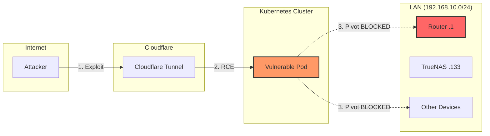
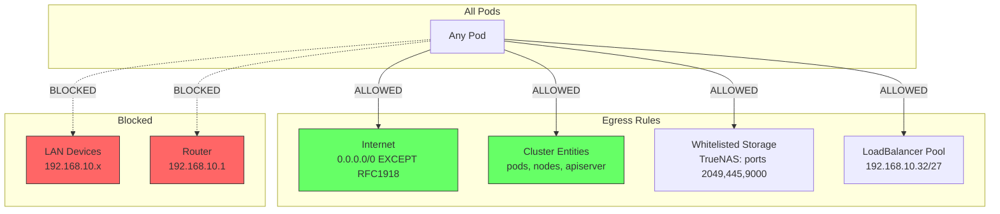
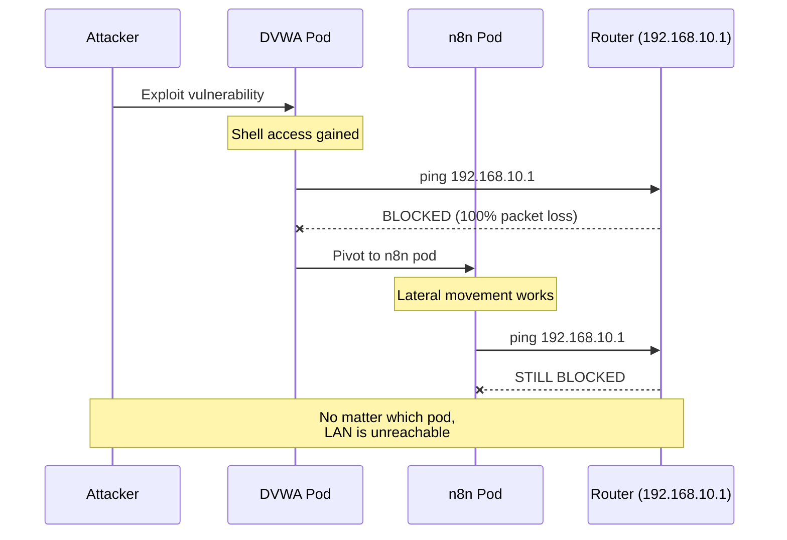

# Network Security & LAN Isolation

This document details the Cilium network policy that isolates Kubernetes pods from the local network, preventing lateral movement attacks while allowing legitimate traffic.

## Overview

The cluster uses a **CiliumClusterwideNetworkPolicy** to implement a "default deny" stance for LAN access. This provides an 80/20 security solution - one policy that protects all pods without requiring per-app network policies.

## The Threat Model

When hosting public-facing applications (via Cloudflare Tunnel), an attacker who exploits a vulnerability could:

1. Gain shell access inside a pod
2. Scan the internal network
3. Pivot to attack other LAN devices (router, NAS, other servers)



## The Solution: CiliumClusterwideNetworkPolicy

Located at: `infrastructure/networking/cilium/policies/block-lan-access.yaml`

### What Gets Blocked

| Traffic | Status | Reason |
|---------|--------|--------|
| RFC1918 ranges (10.x, 172.16.x, 192.168.x) | **BLOCKED** | Prevents LAN scanning |
| Router (192.168.10.1) | **BLOCKED** | Prevents admin/SSH access |
| Random LAN devices | **BLOCKED** | No lateral movement |

### What Gets Allowed

| Traffic | Status | Reason |
|---------|--------|--------|
| Internet (public IPs) | **ALLOWED** | Apps need external APIs |
| Pod-to-Pod (cluster) | **ALLOWED** | Inter-service communication |
| Kube-apiserver | **ALLOWED** | Kubernetes operations |
| DNS (CoreDNS) | **ALLOWED** | Name resolution |
| TrueNAS (specific ports) | **ALLOWED** | NFS/SMB/MinIO storage |
| LoadBalancer IPs | **ALLOWED** | Cilium L2 announcements |

## Policy Architecture



## Whitelisted LAN Resources

These specific IPs are allowed on specific ports only:

| IP | Hostname | Allowed Ports | Purpose |
|----|----------|---------------|---------|
| 192.168.10.133 | TrueNAS | 2049 (NFS), 111 (RPC), 445 (SMB), 9000 (MinIO), 30292-30293 (RustFS) | Storage backend (10G) |
| 192.168.10.46 | Wyze Bridge | 8554 (RTSP) | Camera streams for Frigate |
| 192.168.10.14 | Proxmox | 8006 (API) | Omni/Terraform integration |
| 192.168.10.32/27 | LB Pool | All | Cilium L2 LoadBalancer IPs |

## Why Lateral Movement Fails

The policy uses `endpointSelector: {}` which matches **ALL pods** in the cluster:

```yaml
spec:
  endpointSelector: {}  # <-- Applies to EVERY pod
```

This means:
- DVWA pod cannot reach LAN
- n8n pod cannot reach LAN
- If attacker pivots from DVWA → n8n, n8n STILL cannot reach LAN



## Testing the Policy

### Quick Test (from any pod)

```bash
# Test LAN access (should fail)
kubectl exec -n <namespace> <pod> -- ping -c 1 -W 2 192.168.10.1

# Test internet access (should work)
kubectl exec -n <namespace> <pod> -- ping -c 2 8.8.8.8
```

### Full Pentest Simulation

Deploy DVWA (Damn Vulnerable Web Application) for realistic testing:

1. Access `https://dvwa.vanillax.me`
2. Login: `admin` / `password`
3. Set security to "Low"
4. Navigate to Command Injection
5. Try: `; ping -c 1 -W 2 192.168.10.1`

**Expected Result**: 100% packet loss (LAN blocked)

### Verify from Multiple Pods

```bash
# Test from different namespaces
for ns in dvwa n8n immich; do
  echo "=== Testing from $ns ==="
  kubectl exec -n $ns deploy/${ns} -- ping -c 1 -W 2 192.168.10.1 2>&1 | grep -E "packet loss|PING"
done
```

## Hubble Observability

Use Hubble to see policy enforcement in real-time:

```bash
# Watch for dropped traffic
hubble observe --verdict DROPPED --to-ip 192.168.10.0/24

# Watch specific pod
hubble observe --pod dvwa/dvwa --verdict DROPPED
```

## Troubleshooting

### App Can't Reach Required LAN Resource

Add a specific whitelist rule:

```yaml
- toCIDR:
    - 192.168.10.X/32  # The IP you need
  toPorts:
    - ports:
        - port: "XXXX"  # Only the required port
          protocol: TCP
```

### Policy Not Taking Effect

1. Check Cilium agent is running: `kubectl get pods -n kube-system -l k8s-app=cilium`
2. Verify policy is applied: `kubectl get ciliumclusterwidenetworkpolicies`
3. Check Hubble for verdicts: `hubble observe --pod <your-pod>`

### Internet Stopped Working

Ensure `toEntities: host` is present - this allows traffic to reach the node which then NATs to the internet.

## Security Considerations

1. **Minimize Whitelists**: Only add LAN IPs that are absolutely necessary
2. **Port Restrict**: Always specify ports, never allow all ports to a LAN IP
3. **No Router Access**: Never whitelist 192.168.10.1 (your gateway)
4. **Regular Audits**: Review whitelisted IPs periodically
