# 🌐 Network Configuration

## Overview

This document describes the complete network architecture including external (Cloudflare-proxied) and internal (Firewalla DNS) traffic flows.

## Complete Network Topology

```mermaid
graph TB
    subgraph Internet["🌐 Internet"]
        ExtUser[External User<br/>anywhere.com]
    end

    subgraph Home["🏠 Home Network - 192.168.10.0/24"]
        Firewalla[Firewalla<br/>192.168.10.1<br/>Gateway & DNS]
        IntUser[Internal User<br/>Phone/Laptop]

        subgraph Cluster["☸️ Talos Kubernetes Cluster"]
            ExtGW[External Gateway<br/>192.168.10.49<br/>TCP 80,443]
            IntGW[Internal Gateway<br/>192.168.10.50<br/>TCP 80,443,5432]

            subgraph Services["Services"]
                ArgoCD[ArgoCD<br/>argocd-server:80]
                Llama[Llama WebUI<br/>ollama-webui:80]
                Immich[Immich<br/>immich:80]
            end
        end
    end

    subgraph CF["☁️ Cloudflare"]
        CFDNS[Cloudflare DNS<br/>*.vanillax.me]
        CFProxy[Cloudflare Proxy<br/>HTTP/3 QUIC Enabled]
        CFTunnel[Cloudflare Tunnel<br/>cloudflared pod]
    end

    %% External Flow - Goes through Cloudflare
    ExtUser -->|1. DNS: argocd.vanillax.me| CFDNS
    CFDNS -->|2. Returns Cloudflare IP| ExtUser
    ExtUser -->|3. HTTPS/QUIC Request| CFProxy
    CFProxy -->|4. Tunnel Connection| CFTunnel
    CFTunnel -->|5. HTTP to 192.168.10.49:80| ExtGW
    ExtGW -->|6. Route via HTTPRoute| ArgoCD

    %% Internal Flow - Direct via Firewalla DNS
    IntUser -->|1. DNS: llama.vanillax.me| Firewalla
    Firewalla -->|2. Returns 192.168.10.50| IntUser
    IntUser -->|3. HTTPS Request<br/>NO CLOUDFLARE| IntGW
    IntGW -->|4. Route via HTTPRoute| Llama

    %% Styling
    classDef external fill:#ff6b6b,stroke:#c92a2a,color:#fff
    classDef internal fill:#51cf66,stroke:#2f9e44,color:#fff
    classDef cloudflare fill:#f59f00,stroke:#e67700,color:#fff
    classDef gateway fill:#339af0,stroke:#1971c2,color:#fff

    class ExtUser,ExtGW external
    class IntUser,IntGW,Firewalla internal
    class CFDNS,CFProxy,CFTunnel cloudflare
    class ArgoCD,Llama,Immich gateway
```



## Traffic Flow Details

### 🔴 External Flow (Internet → Cloudflare → External Gateway)


### 🟢 Internal Flow (Home Network → Firewalla DNS → Internal Gateway)


## IP Address Allocation

### Physical Network (Home LAN)
| Component | IP Address | Purpose | Ports |
|-----------|------------|---------|-------|
| Firewalla | 192.168.10.1 | Gateway, DNS, Firewall | DNS:53, HTTP:80, HTTPS:443 |
| Talos Nodes | 192.168.10.x | Kubernetes nodes | Various |
| **External Gateway** | **192.168.10.49** | Public-facing services via Cloudflare Tunnel | HTTP:80, HTTPS:443 |
| **Internal Gateway** | **192.168.10.50** | LAN-only services (no Cloudflare) | HTTP:80, HTTPS:443, TCP:5432 |

### Cluster Networks
| Network | CIDR | Purpose |
|---------|------|---------|
| Pod Network | 10.14.0.0/16 | Cilium pod CIDR |
| Service Network | 10.43.0.0/16 | Kubernetes services |
| LoadBalancer Pool | 192.168.10.49-50 | Cilium L2 announcements |

## DNS Resolution Paths

### External Domains (Cloudflare DNS)
```
User Query: argocd.vanillax.me
→ Cloudflare Authoritative DNS
→ Returns: Cloudflare Proxy IP (104.x.x.x)
→ Traffic flows through Cloudflare → Tunnel → External Gateway (192.168.10.49)
```

### Internal Domains (Firewalla Custom DNS)
```
User Query: llama.vanillax.me (from home network)
→ Firewalla DNS (192.168.10.1)
→ Custom DNS Override: *.vanillax.me → 192.168.10.50
→ Returns: 192.168.10.50
→ Traffic flows directly: User → Internal Gateway (192.168.10.50)
→ NO CLOUDFLARE INVOLVED
```

## ERR_QUIC_PROTOCOL_ERROR Root Cause Analysis

### Problem Statement
When accessing **internal routes** like `argocd.vanillax.me` or `llama.vanillax.me` from the home network, browsers show `ERR_QUIC_PROTOCOL_ERROR`.

### Why This Happens (Internal Routes)

Even though internal routes **don't go through Cloudflare**, the error still occurs because:

1. **Browser Behavior**: Modern browsers (Chrome, Edge) remember that a domain supports HTTP/3 via **Alt-Svc headers** or **HTTPS RR records**
2. **Domain Matching**: When you access `argocd.vanillax.me` externally (via Cloudflare with HTTP/3), the browser caches that `*.vanillax.me` supports QUIC
3. **Internal Access Attempt**: When you later access the same domain internally (via Firewalla DNS → 192.168.10.50), the browser still tries HTTP/3/QUIC
4. **Gateway Limitation**: Cilium Gateway (without Envoy) doesn't support QUIC → Connection fails → ERR_QUIC_PROTOCOL_ERROR

### Traffic Path Analysis

#### Internal Route - argocd.vanillax.me (ERROR OCCURRED HERE)
```
Browser (at home) → DNS query to Firewalla
                  ↓
Firewalla DNS returns 192.168.10.50 (internal gateway)
                  ↓
Browser TRIED UDP 443 (QUIC) because it remembered HTTP/3 support from Cloudflare
                  ↓
❌ Internal Gateway (192.168.10.50) doesn't handle QUIC
                  ↓
ERR_QUIC_PROTOCOL_ERROR

FIX: Gateway now advertises ONLY h2,http/1.1 (no h3)
     Browser won't attempt QUIC anymore
```

#### External Route - argocd.vanillax.me (via Cloudflare - Works Fine)
```
Browser (on internet) → DNS query to Cloudflare DNS
                       ↓
Cloudflare returns Cloudflare Proxy IP
                       ↓
Browser may use HTTP/3 QUIC to Cloudflare (handled by CF)
                       ↓
✅ Cloudflare terminates QUIC, sends HTTP/2 to Tunnel
                       ↓
Tunnel → External Gateway (192.168.10.49) via HTTP/2 → Service
```

### Solution: Disable QUIC Advertisement on Gateways

Since **neither gateway needs QUIC support**:
- External gateway receives HTTP/2 from Cloudflare Tunnel (not QUIC)
- Internal gateway receives direct HTTPS from LAN clients (not QUIC)
- QUIC/HTTP3 only happens between end users and Cloudflare's edge

**The fix**: Explicitly disable HTTP/3 advertisement by only advertising HTTP/2 and HTTP/1.1 via ALPN protocols.

#### Changes Made

1. **Internal Gateway** (`gw-internal.yaml:32`): Set ALPN to `h2,http/1.1` (no h3)
2. **External Gateway** (not changed): Already uses `h2,http/1.1` by default
3. **Cilium**: No Envoy HTTP/3 configuration needed

This prevents browsers from attempting QUIC connections to your gateways, which don't support it.

### Alternative Solutions (Not Recommended)

#### Option 1: Clear Browser QUIC Cache (Temporary)
- **What**: Clear browser Alt-Svc cache: `chrome://net-internals/#sockets` → Flush socket pools
- **Why**: Forces browser to forget HTTP/3 support
- **Downside**: Temporary fix, comes back after external access

#### Option 2: Use Separate Domains
- **What**: Use different domains for internal vs external (e.g., `argocd.local` vs `argocd.vanillax.me`)
- **Why**: Browser won't confuse the two
- **Downside**: More complex DNS management, different URLs

### Recommended Path Forward

1. **Apply the gateway changes** (already made)
2. **Test internal access** to confirm QUIC errors are resolved
3. **Clear browser QUIC cache** once to force re-negotiation
4. **Verify** that browsers use HTTP/2 instead of attempting QUIC

### Validation Commands

```bash
# Apply gateway changes
kubectl apply -f infrastructure/networking/gateway/gw-internal.yaml

# Check gateway status
kubectl get gateway -n gateway gateway-internal -o yaml

# Test from internal network (verbose to see protocol negotiation)
curl -v https://argocd.vanillax.me

# Check negotiated protocol (should be HTTP/2 or HTTP/1.1, NOT h3)
curl -I https://argocd.vanillax.me

# Clear browser QUIC cache (Chrome/Edge)
# Navigate to: chrome://net-internals/#sockets
# Click "Flush socket pools"
```

## Declarative Networking with ArgoCD & Talos

- **All networking resources (Cilium, Gateway API, CoreDNS, Cloudflare Tunnel) are managed declaratively via ArgoCD.**
- **No manual creation or editing of network resources on the cluster.**
- **Talos network configuration (interfaces, routes, etc.) is set in `talconfig.yaml` and applied via Talosctl.**
- **Cilium, Gateway API, and CoreDNS are deployed and managed as part of the infrastructure ApplicationSet.**

## Directory Structure

```plaintext
infrastructure/networking/
├── cilium/           # Cilium Helm values, L2/LB policies, VIPs
├── coredns/          # CoreDNS custom configs
├── gateway/          # Gateway API resources (Gateways, HTTPRoutes)
├── cloudflared/      # Cloudflare Tunnel manifests and secrets
└── kustomization.yaml
```

## Network Architecture


## Talos Network Configuration

- **All node-level network config is set in `talconfig.yaml` and applied via Talosctl.**
- **No SSH or manual network changes on Talos nodes.**
- **Example:**
  ```yaml
  # In talconfig.yaml
  nodes:
    - hostname: node-01
      networkInterfaces:
        - deviceSelector:
            hardwareAddr: "xx:xx:xx:xx:xx:xx"
          dhcp: false
          addresses:
            - 192.168.10.100/24
          routes:
            - network: 0.0.0.0/0
              gateway: 192.168.10.1
  ```

## Cilium & Gateway API

- **Cilium** is the CNI, service mesh, and Gateway API provider.
- **Gateway API** is used for ingress and L4/L7 routing, managed by Cilium.
- **All Cilium and Gateway API resources are managed via ArgoCD.**
- **VIPs, L2/LB policies, and IP pools are defined in manifests and synced by ArgoCD.**

## CoreDNS

- **CoreDNS is managed via manifests in `infrastructure/networking/coredns/`.**
- **Custom configs for split DNS, internal domains, etc. are applied declaratively.**

## Cloudflare Tunnel

- **Cloudflare Tunnel is deployed as a Deployment/DaemonSet and managed via ArgoCD.**
- **Tunnel credentials are stored as Kubernetes secrets, managed via External Secrets Operator.**

## Validation

```bash
# Check Cilium status
cilium status
# Check Gateway API resources
kubectl get gateway -A
kubectl get httproute -A
# Check CoreDNS pods
kubectl get pods -n kube-system -l k8s-app=kube-dns
# Check Cloudflare Tunnel pods
kubectl get pods -n cloudflared
```

## Troubleshooting

| Issue Type | Troubleshooting Steps |
|------------|----------------------|
| **Cilium Issues** | • Check Cilium pod status<br>• Review Cilium logs<br>• Validate Helm values and policies in Git |
| **Gateway API Issues** | • Check Gateway/HTTPRoute status<br>• Validate manifests in Git<br>• Review Cilium logs |
| **CoreDNS Issues** | • Check CoreDNS pod status<br>• Validate custom config in Git<br>• Test DNS resolution |
| **Cloudflare Tunnel Issues** | • Check tunnel pod status<br>• Validate secret and deployment manifests<br>• Test external access |
| **Drift** | • Ensure all changes are made in Git, not manually |

## Best Practices

1. **All networking resources are managed in Git** (ArgoCD syncs them to the cluster)
2. **Talos network config is set in `talconfig.yaml`, not via kubectl or SSH**
3. **No manual changes to Cilium, Gateway API, CoreDNS, or Cloudflare Tunnel**
4. **Regularly validate ArgoCD sync status for networking manifests**
5. **Monitor Cilium, Gateway API, and DNS metrics in Prometheus/Grafana**
6. **Document all customizations and keep manifests up to date**

## Traffic Flow


## IP Allocation

- **Internal Network**: 192.168.1.0/24
  - Gateway: 192.168.1.1
  - K3s Node: 192.168.1.10

- **Pod Network**: 10.42.0.0/16 (Cilium)
  - Services: 10.43.0.0/16
  - CoreDNS: 10.43.0.10

## Gateway API Configuration

### External Gateway
```yaml
apiVersion: gateway.networking.k8s.io/v1beta1
kind: Gateway
metadata:
  name: external-gateway
  namespace: gateway-system
spec:
  gatewayClassName: cilium
  listeners:
  - name: http
    port: 80
    protocol: HTTP
    allowedRoutes:
      namespaces:
        from: All
  - name: https
    port: 443
    protocol: HTTPS
    allowedRoutes:
      namespaces:
        from: All
    tls:
      mode: Terminate
      certificateRefs:
      - name: wildcard-cert
```

### Internal Gateway
```yaml
apiVersion: gateway.networking.k8s.io/v1beta1
kind: Gateway
metadata:
  name: internal-gateway
  namespace: gateway-system
spec:
  gatewayClassName: cilium
  listeners:
  - name: http
    port: 80
    protocol: HTTP
    allowedRoutes:
      namespaces:
        from: All
```

## Components

### Cilium
- **Function**: CNI plugin, Service Mesh, Gateway API implementation
- **Installation**: Deployed via Helm in the infrastructure tier
- **Configuration**: Managed through Helm values

### CoreDNS
- **Function**: DNS management for cluster
- **Installation**: Bundled with K3s
- **Configuration**: Custom configmap for internal domains

### Gateway API
- **Function**: Ingress/Gateway management
- **Installation**: CRDs installed separately, implementation by Cilium
- **Configuration**: Gateway and HTTPRoute resources

### Cloudflare Tunnel
- **Function**: Secure external access
- **Installation**: Deployed as a Kubernetes deployment
- **Configuration**: Using tunnel credentials from secrets

## DNS Configuration

### Internal Domains
```yaml
apiVersion: v1
kind: ConfigMap
metadata:
  name: coredns-custom
  namespace: kube-system
data:
  server.conf: |
    home.arpa:53 {
        errors
        cache 30
        forward . 192.168.1.1
    }
```

## Network Flow

### Internal Access


### External Access


## Declarative Setup
All components described in this document (Cilium, CoreDNS, Gateways, Cloudflare Tunnel) are deployed declaratively as part of the `infrastructure` ApplicationSet. There are no manual `helm` or `kubectl` commands required to deploy them. Their manifests are located in `infrastructure/networking/` and are automatically synced by Argo CD.

## Validation

### Cilium Status
```bash
# Check Cilium status
cilium status

# Verify connectivity
cilium connectivity test
```

### DNS Resolution
```bash
# Test internal DNS
kubectl run -it --rm debug --image=curlimages/curl -- nslookup kubernetes.default.svc.cluster.local

# Test external DNS
kubectl run -it --rm debug --image=curlimages/curl -- nslookup example.com
```

### Gateway Routing
```bash
# Check gateway status
kubectl get gateway -A

# Test routes
kubectl get httproute -A
```

### Cloudflare Tunnel
```bash
# Check tunnel pods
kubectl get pods -n cloudflared

# Check tunnel logs
kubectl logs -n cloudflared -l app=cloudflared
```

## Troubleshooting

### DNS Issues
1. Check CoreDNS pods:
   ```bash
   kubectl get pods -n kube-system -l k8s-app=kube-dns
   kubectl logs -n kube-system -l k8s-app=kube-dns
   ```

2. Verify custom config:
   ```bash
   kubectl get configmap -n kube-system coredns-custom -o yaml
   ```

### Gateway Issues
1. Check gateway status:
   ```bash
   kubectl describe gateway -n gateway-system external-gateway
   ```

2. Verify routes:
   ```bash
   kubectl describe httproute -A
   ```

### Cloudflare Issues
1. Check tunnel status:
   ```bash
   kubectl get pods -n cloudflared
   kubectl logs -n cloudflared -l app=cloudflared
   ```

2. Verify tunnel connectivity:
   ```bash
   # Port-forward to cloudflared metrics
   kubectl port-forward -n cloudflared svc/cloudflared 8080:2000
   # Access metrics at http://localhost:8080/metrics
   ``` 