# 🌐 Network Configuration

## Overview

This document describes the complete network architecture including external (Cloudflare-proxied) and internal (Firewalla DNS) traffic flows.

## Complete Network Topology

```mermaid
graph TB
    subgraph Internet["🌐 Internet"]
        ExtUser[External User<br/>anywhere.com]
    end

    subgraph Home["🏠 Home Network - 192.168.10.0/24"]
        Firewalla[Firewalla<br/>192.168.10.1<br/>Gateway & DNS]
        IntUser[Internal User<br/>Phone/Laptop]

        subgraph Cluster["☸️ Talos Kubernetes Cluster"]
            ExtGW[External Gateway<br/>192.168.10.49<br/>TCP 80,443]
            IntGW[Internal Gateway<br/>192.168.10.50<br/>TCP 80,443,5432]

            subgraph Services["Services"]
                ArgoCD[ArgoCD<br/>argocd-server:80]
                Llama[Llama WebUI<br/>ollama-webui:80]
                Immich[Immich<br/>immich:80]
            end
        end
    end

    subgraph CF["☁️ Cloudflare"]
        CFDNS[Cloudflare DNS<br/>*.vanillax.me]
        CFProxy[Cloudflare Proxy<br/>HTTP/3 QUIC Enabled]
        CFTunnel[Cloudflare Tunnel<br/>cloudflared pod]
    end

    %% External Flow - Goes through Cloudflare
    ExtUser -->|1. DNS: argocd.vanillax.me| CFDNS
    CFDNS -->|2. Returns Cloudflare IP| ExtUser
    ExtUser -->|3. HTTPS/QUIC Request| CFProxy
    CFProxy -->|4. Tunnel Connection| CFTunnel
    CFTunnel -->|5. HTTP to 192.168.10.49:80| ExtGW
    ExtGW -->|6. Route via HTTPRoute| ArgoCD

    %% Internal Flow - Direct via Firewalla DNS
    IntUser -->|1. DNS: llama.vanillax.me| Firewalla
    Firewalla -->|2. Returns 192.168.10.50| IntUser
    IntUser -->|3. HTTPS Request<br/>NO CLOUDFLARE| IntGW
    IntGW -->|4. Route via HTTPRoute| Llama

    %% Styling
    classDef external fill:#ff6b6b,stroke:#c92a2a,color:#fff
    classDef internal fill:#51cf66,stroke:#2f9e44,color:#fff
    classDef cloudflare fill:#f59f00,stroke:#e67700,color:#fff
    classDef gateway fill:#339af0,stroke:#1971c2,color:#fff

    class ExtUser,ExtGW external
    class IntUser,IntGW,Firewalla internal
    class CFDNS,CFProxy,CFTunnel cloudflare
    class ArgoCD,Llama,Immich gateway
```



## Traffic Flow Details

### 🔴 External Flow (Internet → Cloudflare → External Gateway)


### 🟢 Internal Flow (Home Network → Firewalla DNS → Internal Gateway)


## IP Address Allocation

### Physical Network (Home LAN)
| Component | IP Address | Purpose | Ports |
|-----------|------------|---------|-------|
| Firewalla | 192.168.10.1 | Gateway, DNS, Firewall | DNS:53, HTTP:80, HTTPS:443 |
| Talos Nodes | 192.168.10.x | Kubernetes nodes | Various |
| **External Gateway** | **192.168.10.49** | Public-facing services via Cloudflare Tunnel | HTTP:80, HTTPS:443 |
| **Internal Gateway** | **192.168.10.50** | LAN-only services (no Cloudflare) | HTTP:80, HTTPS:443, TCP:5432 |

### Cluster Networks
| Network | CIDR | Purpose |
|---------|------|---------|
| Pod Network | 10.14.0.0/16 | Cilium pod CIDR |
| Service Network | 10.43.0.0/16 | Kubernetes services |
| LoadBalancer Pool | 192.168.10.49-50 | Cilium L2 announcements |

## DNS Resolution Paths

### External Domains (Cloudflare DNS)
```
User Query: argocd.vanillax.me
→ Cloudflare Authoritative DNS
→ Returns: Cloudflare Proxy IP (104.x.x.x)
→ Traffic flows through Cloudflare → Tunnel → External Gateway (192.168.10.49)
```

### Internal Domains (Firewalla Custom DNS)
```
User Query: llama.vanillax.me (from home network)
→ Firewalla DNS (192.168.10.1)
→ Custom DNS Override: *.vanillax.me → 192.168.10.50
→ Returns: 192.168.10.50
→ Traffic flows directly: User → Internal Gateway (192.168.10.50)
→ NO CLOUDFLARE INVOLVED
```

## Cilium Gateway Architecture & Connection Tracking

### Gateway Load Balancing with Cilium Envoy

The Cilium Gateway API implementation uses **Cilium Envoy** pods as L7 proxies. Understanding this architecture is critical for troubleshooting connectivity issues:


### Critical Issue: externalTrafficPolicy: Cluster (FIXED)

**Problem**: Prior to 2025-10-23, gateway services used `externalTrafficPolicy: Cluster`, which caused intermittent connectivity failures.

#### Root Cause Analysis

1. **L2 Announcement** - Cilium announces the gateway VIP (192.168.10.50) from ONE worker node via ARP
2. **Traffic arrives** at that specific node's network interface
3. **With `externalTrafficPolicy: Cluster`**:
   - kube-proxy/eBPF SNATs the traffic (changes source IP)
   - Load balances across ALL cilium-envoy pods on ALL nodes
   - Different requests from the same client can hit different envoy pods
   - Breaks HTTP connection tracking and session persistence
4. **Symptoms**:
   - One browser works, another doesn't (different envoy instances)
   - Accessing one service "triggers" another to work (new connection hits working envoy)
   - Intermittent 502/504 errors
   - WebSocket connections fail randomly

#### Solution: externalTrafficPolicy: Local

```yaml
# infrastructure/networking/cilium/values.yaml
gatewayAPI:
  enabled: true
  externalTrafficPolicy: Local     # ← CRITICAL FIX
  sessionAffinity: true
  sessionAffinityTimeoutSeconds: 10800  # 3 hours
```

**Why this fixes it**:
- Traffic arriving at Node1 ONLY routes to cilium-envoy on Node1
- No SNAT (source IP preserved)
- Consistent connection tracking
- Same client always hits same envoy pod (during L2 announcement lease)
- Session affinity ensures consistency even if L2 announcement migrates

**Trade-off**: If the node handling L2 announcements fails, there's a brief interruption during failover (typically 1-2 seconds as another node takes over ARP).

### L2 Announcement Policy Optimization

**Issue Found**: Duplicate L2AnnouncementPolicy resources (`default-l2-announcement` and `l2-policy`) caused ARP conflicts.

**Fix**: Removed duplicate policy (infrastructure/networking/cilium/l2-announcement.yaml.disabled)

**Current Configuration**:
```yaml
# infrastructure/networking/cilium/l2-policy.yaml
apiVersion: cilium.io/v2alpha1
kind: CiliumL2AnnouncementPolicy
metadata:
  name: l2-policy
spec:
  interfaces:
    - ^e.*  # eth0, ens18, etc.
  loadBalancerIPs: true
  nodeSelector:
    matchExpressions:
      - key: node-role.kubernetes.io/control-plane
        operator: DoesNotExist  # Only worker nodes announce
```

**Why worker nodes only**: Control plane nodes are excluded to ensure L2 announcements come from stable worker nodes, reducing announcement churn during control plane maintenance.

## ERR_QUIC_PROTOCOL_ERROR Root Cause Analysis

### Problem Statement
When accessing **internal routes** like `argocd.vanillax.me` or `llama.vanillax.me` from the home network, browsers show `ERR_QUIC_PROTOCOL_ERROR`.

### Why This Happens (Internal Routes)

Even though internal routes **don't go through Cloudflare**, the error still occurs because:

1. **Browser Behavior**: Modern browsers (Chrome, Edge) remember that a domain supports HTTP/3 via **Alt-Svc headers** or **HTTPS RR records**
2. **Domain Matching**: When you access `argocd.vanillax.me` externally (via Cloudflare with HTTP/3), the browser caches that `*.vanillax.me` supports QUIC
3. **Internal Access Attempt**: When you later access the same domain internally (via Firewalla DNS → 192.168.10.50), the browser still tries HTTP/3/QUIC
4. **Gateway Limitation**: Cilium Gateway (without Envoy) doesn't support QUIC → Connection fails → ERR_QUIC_PROTOCOL_ERROR

### Traffic Path Analysis

#### Internal Route - argocd.vanillax.me (ERROR OCCURRED HERE)
```
Browser (at home) → DNS query to Firewalla
                  ↓
Firewalla DNS returns 192.168.10.50 (internal gateway)
                  ↓
Browser TRIED UDP 443 (QUIC) because it remembered HTTP/3 support from Cloudflare
                  ↓
❌ Internal Gateway (192.168.10.50) doesn't handle QUIC
                  ↓
ERR_QUIC_PROTOCOL_ERROR

FIX: Gateway now advertises ONLY h2,http/1.1 (no h3)
     Browser won't attempt QUIC anymore
```

#### External Route - argocd.vanillax.me (via Cloudflare - Works Fine)
```
Browser (on internet) → DNS query to Cloudflare DNS
                       ↓
Cloudflare returns Cloudflare Proxy IP
                       ↓
Browser may use HTTP/3 QUIC to Cloudflare (handled by CF)
                       ↓
✅ Cloudflare terminates QUIC, sends HTTP/2 to Tunnel
                       ↓
Tunnel → External Gateway (192.168.10.49) via HTTP/2 → Service
```

### Solution: Disable QUIC Advertisement on Gateways

Since **neither gateway needs QUIC support**:
- External gateway receives HTTP/2 from Cloudflare Tunnel (not QUIC)
- Internal gateway receives direct HTTPS from LAN clients (not QUIC)
- QUIC/HTTP3 only happens between end users and Cloudflare's edge

**The fix**: Explicitly disable HTTP/3 advertisement by only advertising HTTP/2 and HTTP/1.1 via ALPN protocols.

#### Changes Made

1. **Internal Gateway** (`gw-internal.yaml:32`): Set ALPN to `h2,http/1.1` (no h3)
2. **External Gateway** (not changed): Already uses `h2,http/1.1` by default
3. **Cilium**: No Envoy HTTP/3 configuration needed

This prevents browsers from attempting QUIC connections to your gateways, which don't support it.

### Alternative Solutions (Not Recommended)

#### Option 1: Clear Browser QUIC Cache (Temporary)
- **What**: Clear browser Alt-Svc cache: `chrome://net-internals/#sockets` → Flush socket pools
- **Why**: Forces browser to forget HTTP/3 support
- **Downside**: Temporary fix, comes back after external access

#### Option 2: Use Separate Domains
- **What**: Use different domains for internal vs external (e.g., `argocd.local` vs `argocd.vanillax.me`)
- **Why**: Browser won't confuse the two
- **Downside**: More complex DNS management, different URLs

### Recommended Path Forward

1. **Apply the gateway changes** (already made)
2. **Test internal access** to confirm QUIC errors are resolved
3. **Clear browser QUIC cache** once to force re-negotiation
4. **Verify** that browsers use HTTP/2 instead of attempting QUIC

### Validation Commands

```bash
# Apply gateway changes
kubectl apply -f infrastructure/networking/gateway/gw-internal.yaml

# Check gateway status
kubectl get gateway -n gateway gateway-internal -o yaml

# Test from internal network (verbose to see protocol negotiation)
curl -v https://argocd.vanillax.me

# Check negotiated protocol (should be HTTP/2 or HTTP/1.1, NOT h3)
curl -I https://argocd.vanillax.me

# Clear browser QUIC cache (Chrome/Edge)
# Navigate to: chrome://net-internals/#sockets
# Click "Flush socket pools"
```

## Declarative Networking with ArgoCD & Talos

- **All networking resources (Cilium, Gateway API, CoreDNS, Cloudflare Tunnel) are managed declaratively via ArgoCD.**
- **No manual creation or editing of network resources on the cluster.**
- **Talos network configuration (interfaces, routes, etc.) is set in `talconfig.yaml` and applied via Talosctl.**
- **Cilium, Gateway API, and CoreDNS are deployed and managed as part of the infrastructure ApplicationSet.**

## Directory Structure

```plaintext
infrastructure/networking/
├── cilium/           # Cilium Helm values, L2/LB policies, VIPs
├── coredns/          # CoreDNS custom configs
├── gateway/          # Gateway API resources (Gateways, HTTPRoutes)
├── cloudflared/      # Cloudflare Tunnel manifests and secrets
└── kustomization.yaml
```

## Network Architecture


## Talos Network Configuration

- **All node-level network config is set in `talconfig.yaml` and applied via Talosctl.**
- **No SSH or manual network changes on Talos nodes.**
- **Example:**
  ```yaml
  # In talconfig.yaml
  nodes:
    - hostname: node-01
      networkInterfaces:
        - deviceSelector:
            hardwareAddr: "xx:xx:xx:xx:xx:xx"
          dhcp: false
          addresses:
            - 192.168.10.100/24
          routes:
            - network: 0.0.0.0/0
              gateway: 192.168.10.1
  ```

## Cilium & Gateway API

- **Cilium** is the CNI, service mesh, and Gateway API provider.
- **Gateway API** is used for ingress and L4/L7 routing, managed by Cilium.
- **All Cilium and Gateway API resources are managed via ArgoCD.**
- **VIPs, L2/LB policies, and IP pools are defined in manifests and synced by ArgoCD.**

## CoreDNS

- **CoreDNS is managed via manifests in `infrastructure/networking/coredns/`.**
- **Custom configs for split DNS, internal domains, etc. are applied declaratively.**

## Cloudflare Tunnel

- **Cloudflare Tunnel is deployed as a Deployment/DaemonSet and managed via ArgoCD.**
- **Tunnel credentials are stored as Kubernetes secrets, managed via External Secrets Operator.**

## Validation

```bash
# Check Cilium status
cilium status
# Check Gateway API resources
kubectl get gateway -A
kubectl get httproute -A
# Check CoreDNS pods
kubectl get pods -n kube-system -l k8s-app=kube-dns
# Check Cloudflare Tunnel pods
kubectl get pods -n cloudflared
```

## Cilium Performance Optimizations (Applied 2025-10-23)

### Bandwidth Manager & BBR Congestion Control

```yaml
# infrastructure/networking/cilium/values.yaml
bandwidthManager:
  enabled: true
  bbr: true  # Bottleneck Bandwidth and Round-trip propagation time
```

**Benefits**:
- Better TCP throughput for large file transfers
- Reduced latency for interactive applications
- Better handling of network congestion

### Connection Tracking Tuning

```yaml
bpf:
  masquerade: true
  ctTcpTimeout: 21600  # 6 hours
  ctAnyTimeout: 3600   # 1 hour for non-TCP connections
```

**Why this matters**:
- Prevents premature connection cleanup for long-lived HTTP/2 connections
- Handles WebSocket connections properly
- Reduces connection resets during idle periods

### High Availability - Cilium Operator

```yaml
operator:
  replicas: 2  # Previously 1 - was a SPOF
  affinity:
    podAntiAffinity:
      requiredDuringSchedulingIgnoredDuringExecution:
      - labelSelector:
          matchLabels:
            io.cilium/app: operator
        topologyKey: kubernetes.io/hostname
```

**Impact**:
- Eliminates single point of failure during operator restarts
- Ensures continuous gateway reconciliation
- Improves cluster stability during upgrades

## Troubleshooting

### Common Connectivity Issues

#### Symptom: Intermittent 502/504 Gateway Errors

**Diagnosis**:
```bash
# Check if externalTrafficPolicy is set to Local
kubectl get svc -n gateway cilium-gateway-gateway-internal -o yaml | grep externalTrafficPolicy

# Should show: externalTrafficPolicy: Local
# If it shows "Cluster", the fix hasn't been applied
```

**Fix**: Apply Cilium values update and restart gateway pods:
```bash
kubectl apply -k infrastructure/networking/cilium/
kubectl delete pod -n kube-system -l app.kubernetes.io/name=cilium-envoy
```

#### Symptom: One Browser Works, Another Doesn't

**Root Cause**: Different browser sessions hitting different Envoy pods due to `externalTrafficPolicy: Cluster`

**Fix**: See above - ensure `externalTrafficPolicy: Local` is applied

#### Symptom: Accessing one service makes another service work

**Root Cause**: Connection to working Envoy pod triggering successful subsequent connections

**Fix**: See above - ensure `externalTrafficPolicy: Local` and `sessionAffinity: true`

#### Symptom: Cilium Envoy pods showing gRPC timeout errors

**Diagnosis**:
```bash
kubectl logs -n kube-system -l app.kubernetes.io/name=cilium-envoy --tail=100 | grep -i "timeout\|error"
```

**Common errors**:
- `gRPC config: initial fetch timed out` - Usually resolves on its own
- `remote connection failure` - Check cilium-agent communication

**Fix**:
```bash
# Restart cilium-agent on the affected node
kubectl delete pod -n kube-system cilium-<pod-id>

# If persistent, check Cilium agent logs
kubectl logs -n kube-system cilium-<pod-id> | grep -i envoy
```

### Monitoring Cilium Health

#### Check Overall Cilium Status

```bash
# Get status from any Cilium pod
kubectl exec -n kube-system cilium-<pod-id> -- cilium status --verbose

# Look for:
# - KubeProxyReplacement: True
# - Gateway API: Enabled
# - L2 Announcements: Enabled
# - All controllers: healthy
```

#### Monitor L2 Announcements

```bash
# Check which node is announcing which VIP
kubectl exec -n kube-system cilium-<pod-id> -- cilium bpf lb list | grep "192.168.10.50\|192.168.10.49"

# Check L2 announcement policy
kubectl get ciliuml2announcementpolicy -A

# Should show only ONE policy: l2-policy
# If you see "default-l2-announcement", delete it
```

#### Verify Gateway Service Configuration

```bash
# Check internal gateway service
kubectl get svc -n gateway cilium-gateway-gateway-internal -o yaml

# Verify these fields:
# spec.externalTrafficPolicy: Local
# spec.sessionAffinity: ClientIP (if sessionAffinity is enabled)
# status.loadBalancer.ingress[0].ip: 192.168.10.50
```

#### Monitor Gateway HTTPRoutes

```bash
# List all HTTPRoutes and their status
kubectl get httproute -A -o wide

# Check specific route status
kubectl describe httproute argocd -n argocd

# Look for:
# Status.Parents[].Conditions:
#   - Type: Accepted, Status: True
#   - Type: ResolvedRefs, Status: True
```

### Performance Troubleshooting

#### Check Bandwidth Manager Status

```bash
kubectl exec -n kube-system cilium-<pod-id> -- cilium status | grep -i bandwidth

# Should show: BandwidthManager: Enabled
```

#### Monitor Connection Tracking

```bash
# View connection tracking entries
kubectl exec -n kube-system cilium-<pod-id> -- cilium bpf ct list global

# Check for stale connections
kubectl exec -n kube-system cilium-<pod-id> -- cilium monitor --type drop
```

### Using Hubble for Deep Inspection

Hubble provides L7 visibility into all traffic flowing through Cilium.

#### Access Hubble UI

```bash
kubectl port-forward -n kube-system svc/hubble-ui 12000:80
# Open http://localhost:12000 in browser
```

#### Hubble CLI Commands

```bash
# Watch traffic to/from a specific service
kubectl exec -n kube-system cilium-<pod-id> -- hubble observe --service argocd/argocd-server

# Monitor dropped packets
kubectl exec -n kube-system cilium-<pod-id> -- hubble observe --verdict DROPPED

# Check HTTP/HTTPS traffic
kubectl exec -n kube-system cilium-<pod-id> -- hubble observe --protocol http

# Filter by specific pod
kubectl exec -n kube-system cilium-<pod-id> -- hubble observe --pod argocd/argocd-server-<pod-id>
```

| Issue Type | Troubleshooting Steps |
|------------|----------------------|
| **Cilium Issues** | • Check Cilium pod status<br>• Review Cilium logs<br>• Validate Helm values and policies in Git |
| **Gateway API Issues** | • Check Gateway/HTTPRoute status<br>• Validate manifests in Git<br>• Review Cilium logs |
| **CoreDNS Issues** | • Check CoreDNS pod status<br>• Validate custom config in Git<br>• Test DNS resolution |
| **Cloudflare Tunnel Issues** | • Check tunnel pod status<br>• Validate secret and deployment manifests<br>• Test external access |
| **Drift** | • Ensure all changes are made in Git, not manually |

## Best Practices

1. **All networking resources are managed in Git** (ArgoCD syncs them to the cluster)
2. **Talos network config is set in `talconfig.yaml`, not via kubectl or SSH**
3. **No manual changes to Cilium, Gateway API, CoreDNS, or Cloudflare Tunnel**
4. **Regularly validate ArgoCD sync status for networking manifests**
5. **Monitor Cilium, Gateway API, and DNS metrics in Prometheus/Grafana**
6. **Document all customizations and keep manifests up to date**

## Configuration Change History

### 2025-10-23: Critical Cilium Gateway Fixes

**Issues Identified**:
1. Gateway services using `externalTrafficPolicy: Cluster` causing intermittent connectivity
2. No session affinity leading to request routing inconsistency
3. Duplicate L2AnnouncementPolicy resources causing ARP conflicts
4. Single Cilium operator replica creating single point of failure
5. Cilium Envoy gRPC timeout errors
6. Missing performance optimizations (bandwidth manager, BBR)

**Changes Applied**:

```yaml
# infrastructure/networking/cilium/values.yaml
gatewayAPI:
  externalTrafficPolicy: Local        # Changed from: Cluster
  sessionAffinity: true               # Added
  sessionAffinityTimeoutSeconds: 10800  # Added

operator:
  replicas: 2                          # Changed from: 1
  affinity:                            # Added
    podAntiAffinity:
      requiredDuringSchedulingIgnoredDuringExecution:
      - labelSelector:
          matchLabels:
            io.cilium/app: operator
        topologyKey: kubernetes.io/hostname

bandwidthManager:                      # Added
  enabled: true
  bbr: true

bpf:
  masquerade: true
  ctTcpTimeout: 21600                  # Added
  ctAnyTimeout: 3600                   # Added
```

**Files Modified**:
- `infrastructure/networking/cilium/values.yaml` - Gateway traffic policy and HA fixes
- `infrastructure/networking/cilium/kustomization.yaml` - Removed duplicate L2 policy reference
- `infrastructure/networking/cilium/l2-announcement.yaml` - Renamed to `.disabled`

**Expected Impact**:
- ✅ Consistent connectivity across all browsers and clients
- ✅ Eliminated "one browser works, another doesn't" issue
- ✅ Fixed "accessing one service triggers another" behavior
- ✅ Better TCP performance with BBR congestion control
- ✅ Improved HA with 2 operator replicas
- ✅ No more L2 ARP conflicts

**Validation Commands**:
```bash
# Verify externalTrafficPolicy
kubectl get svc -n gateway cilium-gateway-gateway-internal -o yaml | grep externalTrafficPolicy

# Check operator replica count
kubectl get deployment -n kube-system cilium-operator

# Verify L2 announcement policies (should only show one)
kubectl get ciliuml2announcementpolicy -A

# Test connectivity
curl -v https://argocd.vanillax.me
```

## Key Lessons Learned

### 1. externalTrafficPolicy Matters for L2 LoadBalancers

When using Cilium L2 announcements (or MetalLB), **always use `externalTrafficPolicy: Local`**:
- Preserves source IP
- Ensures traffic stays on the node handling L2 ARP
- Prevents SNAT and connection tracking issues
- Critical for consistent L7 gateway behavior

**Only use `Cluster` when**:
- You have a hardware load balancer in front
- You need to distribute load across all nodes
- You don't care about source IP preservation

### 2. Duplicate CRs Cause Subtle Issues

Having multiple `CiliumL2AnnouncementPolicy` resources with similar selectors causes:
- ARP announcement race conditions
- Unpredictable failover behavior
- Intermittent connectivity issues

**Always verify**: `kubectl get ciliuml2announcementpolicy -A` shows exactly what you expect.

### 3. Single-Replica Operators Are Single Points of Failure

For critical components like Cilium operator:
- Run at least 2 replicas
- Use pod anti-affinity to spread across nodes
- Monitor operator health in production

### 4. Cilium Envoy gRPC Timeouts Are Usually Benign

Initial gRPC fetch timeouts during Envoy startup are normal and resolve themselves. Only investigate if:
- Timeouts persist beyond 5 minutes
- You see connection failures in application logs
- Hubble shows dropped packets

### 5. Session Affinity + externalTrafficPolicy: Local = Consistent Routing

For Gateway API with L2 LoadBalancers:
```yaml
externalTrafficPolicy: Local    # Keeps traffic on announcing node
sessionAffinity: true            # Stickiness during node migration
sessionAffinityTimeoutSeconds: 10800  # 3 hours
```

This combination provides:
- Consistent routing during normal operation
- Graceful handling during node failures
- Predictable behavior for debugging

## References

- [Cilium Gateway API Documentation](https://docs.cilium.io/en/stable/network/servicemesh/gateway-api/gateway-api/)
- [Kubernetes externalTrafficPolicy](https://kubernetes.io/docs/tasks/access-application-cluster/create-external-load-balancer/#preserving-the-client-source-ip)
- [Cilium L2 Announcements](https://docs.cilium.io/en/stable/network/l2-announcements/)
- [BBR Congestion Control](https://cloud.google.com/blog/products/networking/tcp-bbr-congestion-control-comes-to-gcp-your-internet-just-got-faster)
- [Hubble Observability](https://docs.cilium.io/en/stable/observability/hubble/)

## Traffic Flow


## IP Allocation

- **Internal Network**: 192.168.1.0/24
  - Gateway: 192.168.1.1
  - K3s Node: 192.168.1.10

- **Pod Network**: 10.42.0.0/16 (Cilium)
  - Services: 10.43.0.0/16
  - CoreDNS: 10.43.0.10

## Gateway API Configuration

### External Gateway
```yaml
apiVersion: gateway.networking.k8s.io/v1beta1
kind: Gateway
metadata:
  name: external-gateway
  namespace: gateway-system
spec:
  gatewayClassName: cilium
  listeners:
  - name: http
    port: 80
    protocol: HTTP
    allowedRoutes:
      namespaces:
        from: All
  - name: https
    port: 443
    protocol: HTTPS
    allowedRoutes:
      namespaces:
        from: All
    tls:
      mode: Terminate
      certificateRefs:
      - name: wildcard-cert
```

### Internal Gateway
```yaml
apiVersion: gateway.networking.k8s.io/v1beta1
kind: Gateway
metadata:
  name: internal-gateway
  namespace: gateway-system
spec:
  gatewayClassName: cilium
  listeners:
  - name: http
    port: 80
    protocol: HTTP
    allowedRoutes:
      namespaces:
        from: All
```

## Components

### Cilium
- **Function**: CNI plugin, Service Mesh, Gateway API implementation
- **Installation**: Deployed via Helm in the infrastructure tier
- **Configuration**: Managed through Helm values

### CoreDNS
- **Function**: DNS management for cluster
- **Installation**: Bundled with K3s
- **Configuration**: Custom configmap for internal domains

### Gateway API
- **Function**: Ingress/Gateway management
- **Installation**: CRDs installed separately, implementation by Cilium
- **Configuration**: Gateway and HTTPRoute resources

### Cloudflare Tunnel
- **Function**: Secure external access
- **Installation**: Deployed as a Kubernetes deployment
- **Configuration**: Using tunnel credentials from secrets

## DNS Configuration

### Internal Domains
```yaml
apiVersion: v1
kind: ConfigMap
metadata:
  name: coredns-custom
  namespace: kube-system
data:
  server.conf: |
    home.arpa:53 {
        errors
        cache 30
        forward . 192.168.1.1
    }
```

## Network Flow

### Internal Access


### External Access


## Declarative Setup
All components described in this document (Cilium, CoreDNS, Gateways, Cloudflare Tunnel) are deployed declaratively as part of the `infrastructure` ApplicationSet. There are no manual `helm` or `kubectl` commands required to deploy them. Their manifests are located in `infrastructure/networking/` and are automatically synced by Argo CD.

## Validation

### Cilium Status
```bash
# Check Cilium status
cilium status

# Verify connectivity
cilium connectivity test
```

### DNS Resolution
```bash
# Test internal DNS
kubectl run -it --rm debug --image=curlimages/curl -- nslookup kubernetes.default.svc.cluster.local

# Test external DNS
kubectl run -it --rm debug --image=curlimages/curl -- nslookup example.com
```

### Gateway Routing
```bash
# Check gateway status
kubectl get gateway -A

# Test routes
kubectl get httproute -A
```

### Cloudflare Tunnel
```bash
# Check tunnel pods
kubectl get pods -n cloudflared

# Check tunnel logs
kubectl logs -n cloudflared -l app=cloudflared
```

## Troubleshooting

### DNS Issues
1. Check CoreDNS pods:
   ```bash
   kubectl get pods -n kube-system -l k8s-app=kube-dns
   kubectl logs -n kube-system -l k8s-app=kube-dns
   ```

2. Verify custom config:
   ```bash
   kubectl get configmap -n kube-system coredns-custom -o yaml
   ```

### Gateway Issues
1. Check gateway status:
   ```bash
   kubectl describe gateway -n gateway-system external-gateway
   ```

2. Verify routes:
   ```bash
   kubectl describe httproute -A
   ```

### Cloudflare Issues
1. Check tunnel status:
   ```bash
   kubectl get pods -n cloudflared
   kubectl logs -n cloudflared -l app=cloudflared
   ```

2. Verify tunnel connectivity:
   ```bash
   # Port-forward to cloudflared metrics
   kubectl port-forward -n cloudflared svc/cloudflared 8080:2000
   # Access metrics at http://localhost:8080/metrics
   ``` 