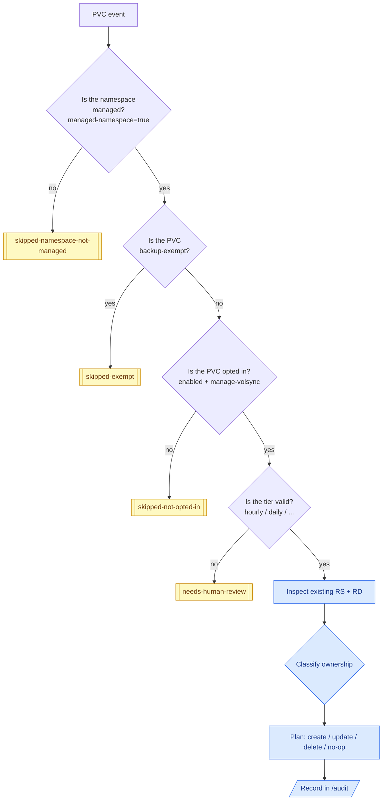
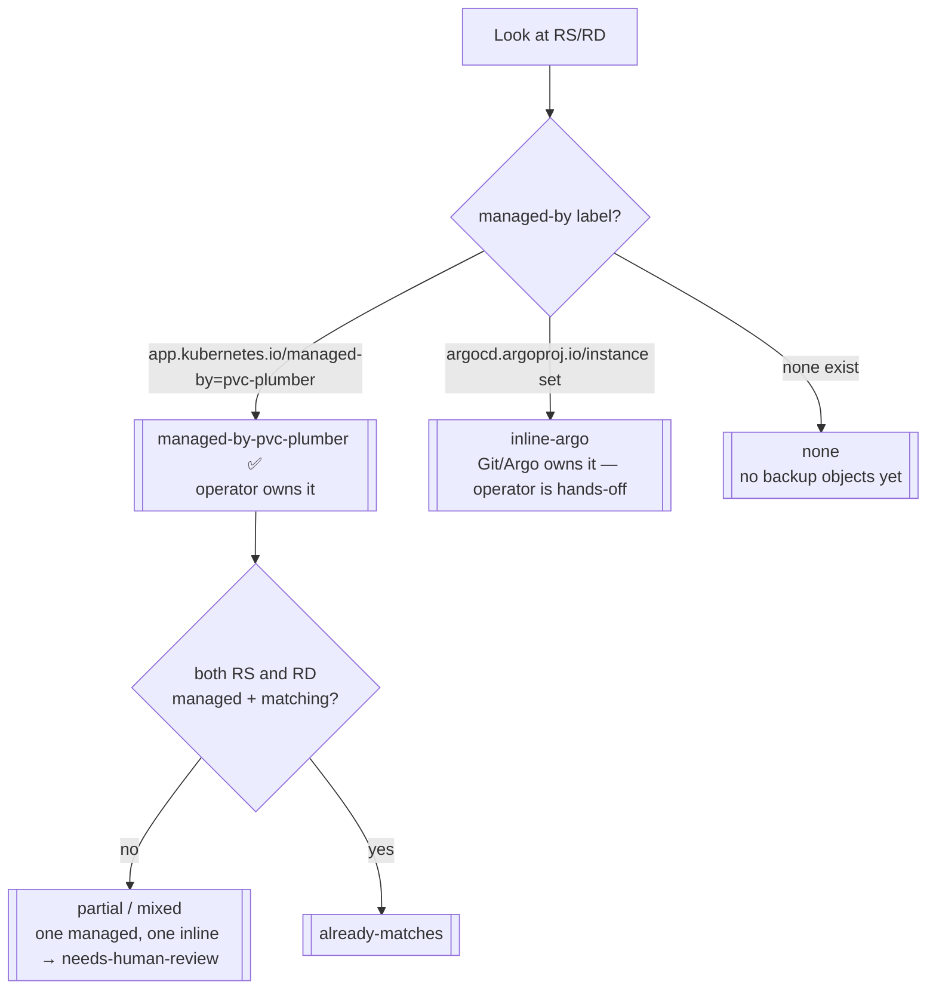
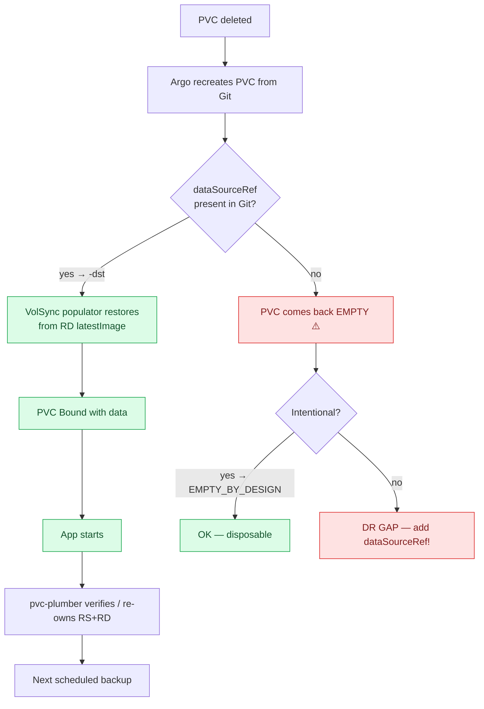
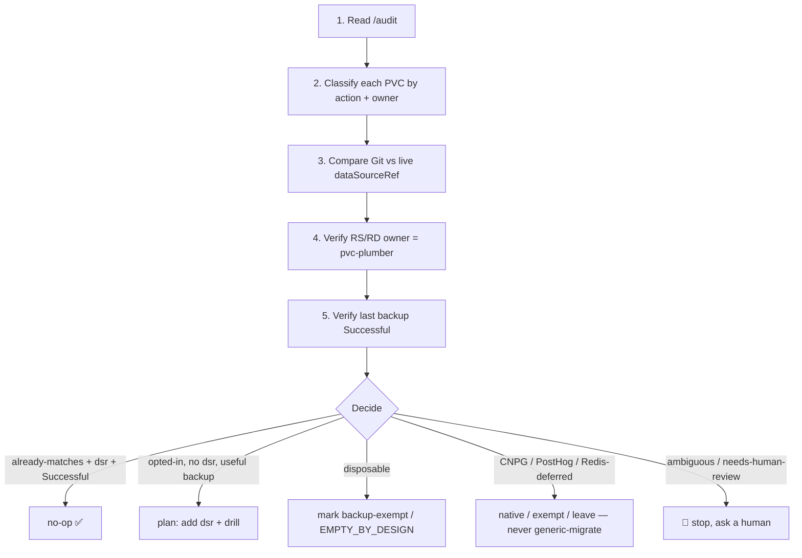

# pvc-plumber — Dynamic Workflow (how the operator thinks) 🧠

> **Audience:** an operator or agent debugging/extending the backup system, or deciding what to do
> with a PVC. This is the "decision engine in plain English" doc. Pair it with the live truth from
> `/audit` (see [the actions table](#-audit-actions--what-they-mean)).

---

## ❓ The questions pvc-plumber asks (per PVC)

It watches **PersistentVolumeClaim** events and, for each PVC, answers these in order:

In words, for every PVC it asks:

1. **Is the namespace managed?** (`pvc-plumber.io/managed-namespace: "true"`) — if not, hands off.
2. **Is the PVC backup-exempt?** (`backup-exempt: "true"`) — if so, deliberately ignore.
3. **Is the PVC opted in?** (`pvc-plumber.io/enabled` + `manage-volsync`) — if not, skip.
4. **Is the tier valid?** (`hourly`/`daily`/…) — if garbage, flag for a human.
5. **Does a matching `ReplicationSource` (`<pvc>`) exist? a `ReplicationDestination` (`<pvc>-dst`)?**
6. **Who owns the current RS/RD?** (`managed-by=pvc-plumber` vs `argocd` vs none)
7. **Are both children missing? Is there a partial split** (one managed, one inline)?
8. **(For DR-completeness, your job not the operator's)** Does the PVC have a `dataSourceRef → <pvc>-dst`?
   Would it **restore** on recreate, or come back **empty**?
9. **Is this a thing it must never touch?** CNPG / PostHog / Redis-deferred → excluded.

---

## 🧬 Ownership classes

Every RS/RD the operator sees falls into one class. This is what `owner_classification` in `/audit` reports.

| Class | Meaning | Operator action |
|---|---|---|
| `managed-by-pvc-plumber` | operator owns RS + RD | reconcile to desired (or `already-matches`) |
| `inline-argo` | Git-rendered RS/RD (e.g. deferred redis) | **audit-only — never patch** |
| `none` | no RS/RD exist | create them (if opted in) |
| partial / mixed | one managed, one inline | `needs-human-review` |
| `skipped-not-opted-in` | namespace managed, PVC not labeled | nothing |
| `skipped-exempt` | `backup-exempt=true` | nothing |
| `skipped-namespace-not-managed` | namespace lacks the gate | nothing |
| `needs-human-review` | ambiguous / invalid | **stop, ask a human** |

---

## 🔄 Restore-on-recreate (the part that actually saves you)

This is what happens when a PVC is deleted and recreated (DR, namespace rebuild, drill):

> 🔑 **The single most important rule:** a managed PVC with **no `dataSourceRef` recreates EMPTY.**
> The backup still *exists* in Kopia — but nothing tells Kubernetes to restore it. To be DR-complete,
> Git must carry `dataSourceRef → ReplicationDestination/<pvc>-dst`. If empty-on-recreate is genuinely
> intended, label it **EMPTY_BY_DESIGN** in a comment so it isn't mistaken for a gap.

---

## 📊 `/audit` actions — what they mean

`/audit` (HTTP `:8080`) returns one row per PVC. The `action` field is the verdict:

| `action` | Meaning | Is it fine? |
|---|---|---|
| `already-matches` | live RS/RD == desired, owned by operator | ✅ steady state |
| `would-create` | opted in, no RS/RD yet → operator will make them | ✅ (permissive) |
| `would-update` | RS/RD exist but drift from desired | ✅ will reconcile |
| `would-delete` | PVC unlabeled/gone → remove RS/RD | ✅ cleanup |
| `skipped-not-opted-in` | namespace managed, PVC not labeled | ⚪ expected |
| `skipped-exempt` | `backup-exempt=true` | ⚪ expected |
| `skipped-namespace-not-managed` | namespace lacks the gate | ⚪ expected |
| `write-gate-missing` | opted-in PVC but namespace not gated | ⚠️ fix the namespace label |
| `needs-human-review` | ambiguous (partial ownership, bad tier) | 🛑 **stop & investigate** |

Summary fields you'll also see: `by_action`, `by_owner_classification`, `by_label_source` (`v4` =
fuse-labeled correctly), and per-row `stale` (the operator's last evaluation age — `stale=false` on a
managed PVC is good; `stale=true` on `owner=none` not-opted-in PVCs is benign cache age).

---

## 🤖 Reusable workflow (for an agent or future-you)

A safe, repeatable algorithm for "what should I do with the backup state?":

**The algorithm in words:**
1. `curl /audit` → get the per-PVC truth.
2. Classify: `action` + `owner_classification`.
3. For each managed PVC, compare **Git** `dataSourceRef` vs **live** (drift = trouble).
4. Confirm RS *and* RD are `managed-by=pvc-plumber`.
5. Confirm `RS.status.latestMoverStatus.result == Successful`.
6. Decide: **no-op** / **migrate (add dsr + drill)** / **exempt** / **native (CNPG)** / **needs-human-review**.
7. **Stop on any uncertainty** — `needs-human-review`, partial ownership, or a backup that isn't Successful.

> 🧷 **Hard exclusions baked into the algorithm:** never generic-migrate **CNPG** (Barman owns those),
> never back up **PostHog** (disposable/exempt), and leave **redis-instance** as decided (deferred).
