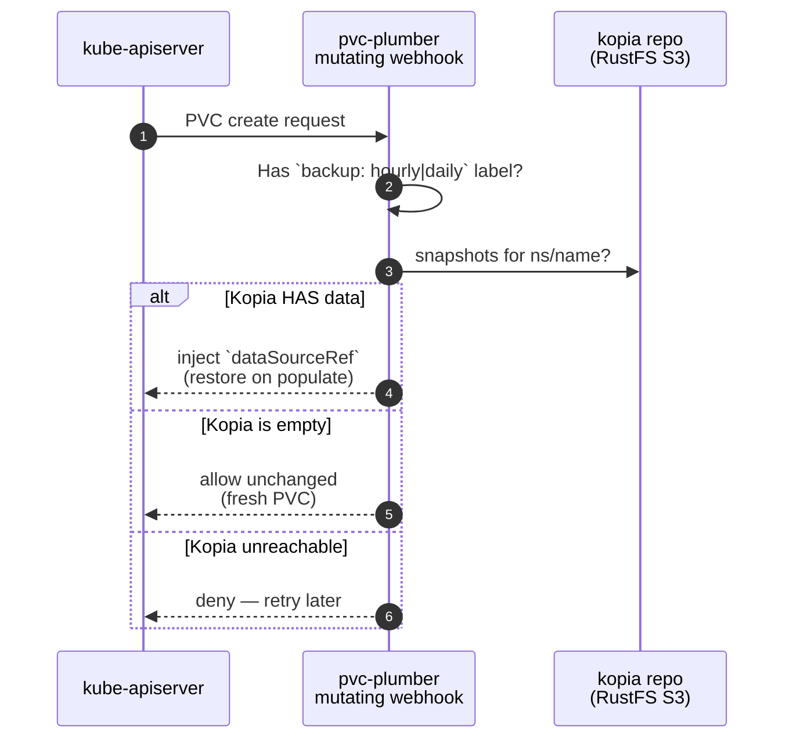
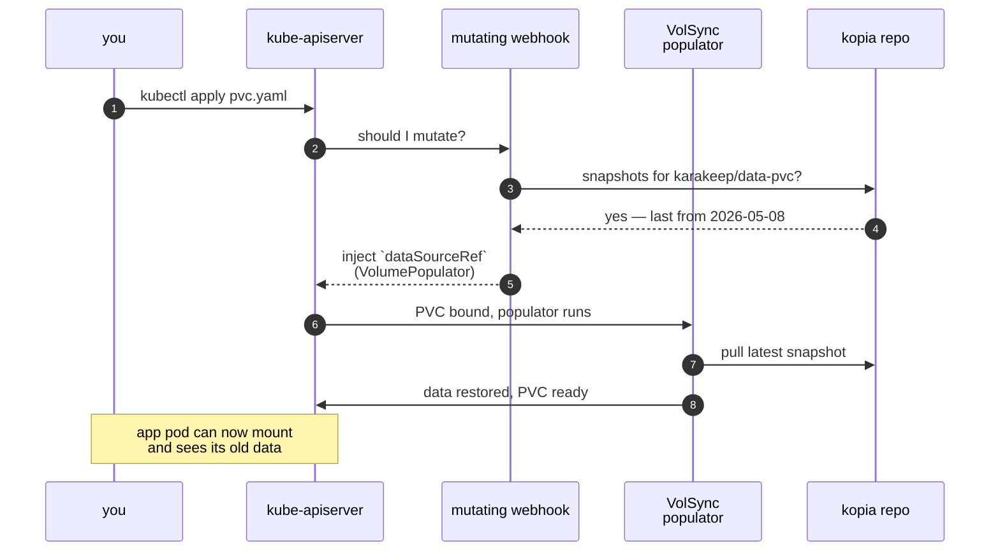
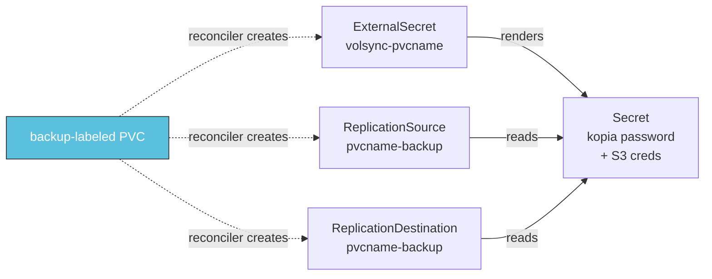
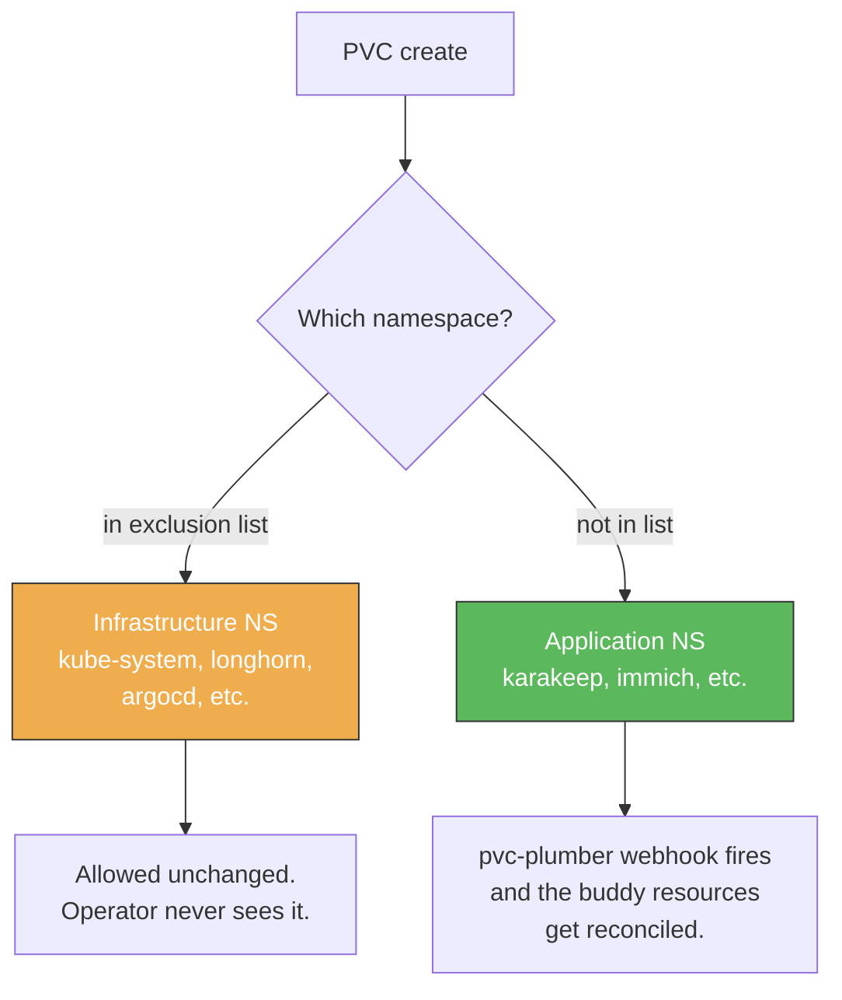
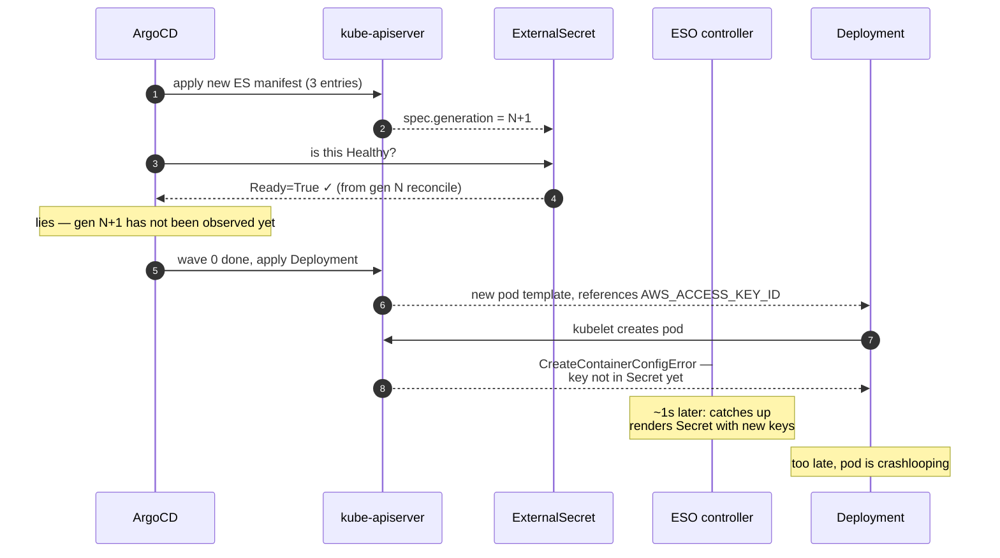

# pvc-plumber, explained for homelabbers

If you've got a Kubernetes cluster at home and you've ever wondered "OK but how do I actually back up my Karakeep bookmarks / Immich photos / Home Assistant config without writing a CronJob from scratch every time," this is the doc that explains how pvc-plumber gets you there. No prior controller-runtime knowledge needed.

The cluster runs **pvc-plumber v3.0.0** as of 2026-05-08.

---

## TL;DR

You add **one label** to a PVC. That's it.

```yaml
metadata:
  labels:
    backup: hourly      # or "daily"
```

The cluster takes care of:
- Snapshotting the volume on schedule
- Encrypting and uploading to your S3 storage (RustFS in this cluster)
- **Restoring the data automatically the next time the PVC is recreated** — even after a full cluster rebuild. This is the killer feature.

If you don't want a PVC backed up (cache, scratch space, media on NAS), leave the label off OR explicitly opt out with `backup-exempt: "true"` plus a reason annotation so future-you knows why.

---

## The pieces in plain English

```
┌──────────────────────────────────────────────────────────┐
│ YOU (or ArgoCD, or a Helm chart)                         │
│                                                          │
│   apiVersion: v1                                         │
│   kind: PersistentVolumeClaim                            │
│   metadata:                                              │
│     name: my-app-data                                    │
│     namespace: my-app                                    │
│     labels:                                              │
│       backup: hourly        ← the entire interface       │
│   spec:                                                  │
│     storageClassName: longhorn                           │
│     ...                                                  │
└──────────────────────────────────────────────────────────┘
                       │
                       │ kubectl apply / argocd sync
                       ▼
┌──────────────────────────────────────────────────────────┐
│ kube-apiserver                                           │
│  "should I let this PVC be created?"                     │
│  "should I add anything to it?"                          │
└──────────────────────────────────────────────────────────┘
                       │
            ┌──────────┴──────────┐
            ▼                     ▼
   ┌─────────────────┐   ┌─────────────────┐
   │ pvc-plumber     │   │ pvc-plumber     │
   │ MUTATING webhook│   │ VALIDATING wh   │
   │  "is there      │   │  "is the intent │
   │   already kopia │   │   coherent?"    │
   │   data for this │   │                 │
   │   PVC?"         │   │                 │
   └─────────────────┘   └─────────────────┘
            │                     │
            └──────────┬──────────┘
                       ▼
                PVC is created
                       │
                       │ a moment later, asynchronously
                       ▼
┌──────────────────────────────────────────────────────────┐
│ pvc-plumber RECONCILER                                   │
│  "I see a new backup-labeled PVC. I need to set up the   │
│   ExternalSecret + ReplicationSource + ReplicationDest"  │
└──────────────────────────────────────────────────────────┘
                       │
                       ▼
              VolSync takes over
              and runs hourly backups
```

That's the whole architecture. Four pieces. Let's walk through each.

---

## What happens when a PVC is created

When you `kubectl apply -f pvc.yaml`, the kube-apiserver asks pvc-plumber two questions before letting the create through.

### Question 1: the mutating webhook (`mutate-pvc.pvc-plumber.io`)

> Hey pvc-plumber, **should I add anything to this PVC?**



The third branch is the safety contract: **if pvc-plumber can't decide, it refuses to let the PVC be created**. Better to make ArgoCD retry than to silently create an empty volume on top of a real backup.

### Question 2: the validating webhook (`validate-pvc.pvc-plumber.io`)

> Hey pvc-plumber, **is the intent coherent?**

This one's the audit-trail check. Mostly fires on `backup-exempt: "true"` PVCs to require a `storage.vanillax.dev/backup-exempt-reason` annotation from a fixed list (`cache`, `scratch`, `external-source`, `media-on-nas`, `database-native`, `test`). Silent exemption is exactly the foot-gun this exists to prevent.

If both webhooks pass, the PVC is created. The webhook chain ends there — kube-apiserver moves on.

---

## The killer feature: re-create after delete

This is the part you cannot do with a simple CronJob. When a PVC with backup data in kopia is **re-created** (because of a cluster rebuild, app re-deploy, or just `kubectl delete pvc && kubectl apply`), pvc-plumber tells Kubernetes to populate the volume from the existing kopia snapshot **before any pod can mount it**.



In plain English: you delete a PVC, you re-apply it, the data shows up like nothing happened. No manual restore step. No "oh wait I forgot to restore the database" the morning after a cluster rebuild.

---

## What happens after the PVC is created (the reconciler)

The webhooks run synchronously — they answer the apiserver's question and they're done. Everything else happens asynchronously through the **reconciler**, which is a separate controller loop watching PVCs.

When the reconciler sees a backup-labeled PVC become Bound, it ensures three buddy resources exist alongside it:



- **ExternalSecret `volsync-<pvcname>`** — pulls the kopia password and S3 credentials from your 1Password vault, materializes them as a Kubernetes Secret. The External Secrets Operator (ESO) does the actual fetch.
- **ReplicationSource `<pvcname>-backup`** — VolSync's "back this up on schedule" CR. Has a cron, has the kopia config, points at the source PVC.
- **ReplicationDestination `<pvcname>-backup`** — VolSync's "ready to populate from kopia if asked" CR. The mutating webhook above injects a `dataSourceRef` that points at this on restore.

Once these exist, **VolSync's controllers own the lifecycle.** Every hour (or day), VolSync spawns a Job that snapshots the PVC, runs kopia, uploads chunks to RustFS S3.

pvc-plumber's reconciler also does **cleanup** — when a backup-labeled PVC is deleted (or its label is removed, or it moves into a system namespace), the three buddy resources get reaped.

---

## The supporting cast

| Component | What it does | Where it lives |
|---|---|---|
| **pvc-plumber** | Decides whether to inject `dataSourceRef`. Creates ES/RS/RD per backup-labeled PVC. | `volsync-system` namespace |
| **VolSync** | Runs the actual backup Jobs on schedule. Handles populate-from-kopia on restore. | `volsync-system` namespace, fork: `ghcr.io/perfectra1n/volsync` |
| **kopia** | The backup format itself. Content-addressed, deduplicated, encrypted client-side. | Inside the VolSync mover Job's container |
| **RustFS** | S3-compatible object storage. The kopia repo lives in bucket `volsync-kopia` on a TrueNAS app. | `192.168.10.133:30293`, external |
| **ESO + 1Password Connect** | Pulls the kopia password + S3 creds from 1Password into Kubernetes Secrets. | `external-secrets`, `1passwordconnect` namespaces |
| **cert-manager** | Issues TLS certs for pvc-plumber's webhooks (port 9443). | `cert-manager` namespace |
| **Longhorn** | The storage class your PVCs actually live on. CSI snapshots are how VolSync grabs a consistent point-in-time copy without freezing the app. | `longhorn-system` namespace |

---

## How a fresh cluster boots (sync waves)

When you bring up the cluster from nothing, Kubernetes itself doesn't know that pvc-plumber needs to be up before any backup-labeled PVC. ArgoCD orchestrates the order with **sync waves** — a number annotation on each resource. ArgoCD applies wave 0 first, waits for everything to be Healthy, applies wave 1, and so on.

```
wave 0 ┃ Cilium (CNI)            ← network must work first
       ┃ ArgoCD itself (bootstrap)
       ┃ 1Password Connect
       ┃ External Secrets Operator
       ┃ AppProjects

wave 1 ┃ Longhorn                 ← storage class for PVCs
       ┃ Volume Snapshot Controller
       ┃ VolSync                  ← backup machinery

wave 2 ┃ pvc-plumber operator     ← from here on, backup-labeled
       ┃ pvc-plumber webhooks       PVCs in app namespaces work
       ┃ pvc-plumber RBAC + ES + Cert

wave 3 ┃ CNPG plugin              ← database backup plumbing

wave 4 ┃ All other controllers + databases (postgres clusters)

wave 5 ┃ kube-prometheus-stack    ← monitoring

wave 6 ┃ my-apps/*/*              ← real workloads finally
```

If pvc-plumber wasn't there in wave 2, every backup-labeled PVC in wave 4+ would be **denied at admission** because the webhook is `failurePolicy: Fail`. That's intentional: it's the same "if I can't tell whether a backup exists, I refuse" safety contract from earlier, applied at the cluster scale.

---

## Why the bootstrap doesn't deadlock itself

Here's a riddle: pvc-plumber's webhook says "deny PVC creation if I'm down." But pvc-plumber itself runs in `volsync-system`, which has its own PVCs and might one day need its own ExternalSecret. If pvc-plumber's webhook fired on its own PVC, the cluster would deadlock during bootstrap (operator can't create its own PVCs because the webhook isn't running yet because the operator hasn't started).

The fix is **infrastructure namespace exclusion**. Both the webhook's `namespaceSelector` and the operator's `SYSTEM_NAMESPACES` env var carry the same list:

```
kube-system
volsync-system
kyverno
argocd
longhorn-system
snapshot-controller
cert-manager
external-secrets
1passwordconnect
```

PVCs created in any of those namespaces **bypass pvc-plumber entirely**. The webhook never fires for them. The reconciler skips them. The bootstrap can come up cleanly because the bootstrap itself is invisible to pvc-plumber.



The list has to stay in sync between `infrastructure/controllers/pvc-plumber/webhooks.yaml` (the namespaceSelector) AND `infrastructure/controllers/pvc-plumber/deployment.yaml` (the operator's `SYSTEM_NAMESPACES` env). Drift between the two is the actual cluster-safety bug. The 2026-04-08 incident (Kyverno crash, full cluster wedge) was triggered by a missing namespace in this list.

---

## The ArgoCD ↔ ESO race (the bug we just fixed)

OK now the war story. During the v3.0.0 cutover (2026-05-08), the cluster hit a race condition that took the operator pod down and required manual intervention to unstick. The fix is now in tree.

### What went wrong

The v3.0.0 commit changed the `pvc-plumber-kopia` ExternalSecret from one entry (`KOPIA_PASSWORD`) to three (added `AWS_ACCESS_KEY_ID` + `AWS_SECRET_ACCESS_KEY`). The Deployment in the same commit referenced those new keys via `secretKeyRef` env vars.

ArgoCD's sync waves had ExternalSecret in wave 0 and the Deployment in wave 1. So in theory: ES first, wait for it to be Healthy, then Deployment.

In practice:



ArgoCD's default health check for ExternalSecret only looks at `status.conditions[Ready].status`. ESO leaves that field set to `True` from the previous generation's reconcile until it gets around to processing the new generation. So ArgoCD declared the ES Healthy on the **stale** Ready, moved to wave 1, and the Deployment rolled into a Secret that hadn't caught up yet.

### Why ESO doesn't expose `observedGeneration`

ESO's `ExternalSecret` CRD status struct has `RefreshTime`, `SyncedResourceVersion`, `Conditions`, `Binding` — but **no `observedGeneration` field**. There's an upstream issue ([argo-cd#22707](https://github.com/argoproj/argo-cd/issues/22707)) acknowledging this gap. No PR yet.

But ESO DOES publish `status.syncedResourceVersion` in the format `"<generation>-<hash>"` — and that's exactly what we need.

### The fix (now in `infrastructure/controllers/argocd/values.yaml`)

A custom Lua health check for ExternalSecret. About 30 lines, mostly comments. It says:

> "Don't declare an ExternalSecret Healthy until ESO has observed the current generation (i.e., `syncedResourceVersion` starts with `<metadata.generation>-`)."

This is **cluster-wide** — every ExternalSecret in the repo gets the gate. The `pvc-plumber-kopia` ES is one of 30+; all of them are now safe against this race for any future schema change.

### Pair fix: tighter refreshInterval

Also lowered `pvc-plumber-kopia` ES `refreshInterval` from `1h` to `1m`. Doesn't affect the spec-change case (ESO observes those via watch, not refresh), but bounds the worst case if ESO ever has to catch up after a controller restart.

### Why one Lua block, not "tons of Lua scripts"

The cluster has had Lua creep before. The general rule is: don't reach for Lua when a sync-wave annotation, sync-options, or upstream fix would do. This case clears a four-bar test:

1. Upstream CRD provably never publishes observedGeneration (it's not in the type struct).
2. ArgoCD upstream hasn't shipped the fix (#22707 is open with no PR).
3. The absence of this check has already caused a production outage (2026-05-08).
4. The block is heavily commented, references the upstream tracker, and links back to this doc.

When upstream ships a real fix, we delete the Lua block. Until then it's the authoritative health check for ExternalSecret in this cluster.

### Pair fix queued: pvc-plumber v3.1.0 lazy creds

The Lua block solves the cluster-wide class. But pvc-plumber specifically should also be made resilient at the operator level — read AWS creds lazily on first kopia call, not at pod startup. That way a half-rendered Secret doesn't crash the operator pod, just delays the first backup decision by a heartbeat. Tracked as a v3.1.0 task. Belt-and-suspenders.

---

## Where we are right now (2026-05-08)

- ✅ pvc-plumber `:3.0.0` running, two pods Ready in `volsync-system`
- ✅ kopia repo on RustFS S3 (`http://192.168.10.133:30293`, bucket `volsync-kopia`, ~600 MiB and growing)
- ✅ All 27 backup-labeled PVCs have ExternalSecrets in the new S3 schema
- ✅ 26 of 27 RSes have fresh post-cutover backups in S3 (the 28th is `kube-system/registry`, which the operator skips because of the namespace exclusion — it carries the label cosmetically)
- ✅ JobMutator deleted permanently (the v2.x admission-time NFS volume injection that caused the 2026-05-08 cluster outage)
- ✅ ArgoCD ↔ ESO race fixed via the cluster-wide Lua block
- ⏳ Karakeep restore-on-create test is the last unproven piece — fresh karakeep snapshot landed at 18:12:50 UTC, ready to do the delete-and-restore drill on demand
- ⏳ pvc-plumber v3.1.0 lazy creds queued

---

## FAQ for homelabbers

### How do I add a new app to backups?

Slap `backup: hourly` (or `daily`) on the PVC label. Push. Done. The reconciler will create the ExternalSecret + ReplicationSource + ReplicationDestination on its own.

### How do I restore?

Delete the PVC. Re-apply the manifest. Data restores automatically (mutating webhook detects existing kopia snapshots and injects `dataSourceRef`). No manual `kopia restore` command needed for the common case.

### What if I want a PVC that's NOT backed up?

Either:
- Don't add the `backup` label (the simplest opt-out — the operator doesn't see it at all)
- Add `backup-exempt: "true"` AND the annotation `storage.vanillax.dev/backup-exempt-reason: cache` (or `scratch`, `external-source`, `media-on-nas`, `database-native`, `test`). This makes the intent explicit and audit-trail-visible.

### What if pvc-plumber is down when I try to create a PVC?

The webhook is `failurePolicy: Fail`. New backup-labeled PVCs will be denied at admission. ArgoCD will retry on backoff. **This is intentional** — the alternative ("create empty over a real backup") is silent data loss, the worst-possible failure mode. PVCs in infrastructure namespaces (kube-system, longhorn-system, argocd, etc.) bypass the webhook entirely and keep working even if pvc-plumber is down — that's what keeps the cluster bootable when it's down.

### What about CNPG databases (Postgres, etc.)?

Different system. CNPG uses Barman Cloud (built into CloudNativePG) to back up Postgres directly to RustFS via the `cnpg-barman-plugin` and per-cluster `ObjectStore` resources. **Don't add the `backup` label to CNPG PVCs** — they're already protected via Barman, and labeling them would create duplicate (and broken) backup machinery. See [docs/cnpg-disaster-recovery.md](cnpg-disaster-recovery.md).

### How do I see what kopia has?

```bash
# the operator pod has the kopia binary; ad-hoc queries work like:
kubectl exec -n volsync-system deploy/pvc-plumber -- \
  kopia snapshot list --all 2>/dev/null | grep -i karakeep
```

Or browse the bucket directly via the RustFS console at `http://192.168.10.133:30293/rustfs/console/buckets/?bucket=volsync-kopia`.

### Where do I look if a backup is broken?

1. `kubectl get rs -A` — check `LAST SYNC` column. Recent (today) = good. Stale = suspect.
2. `kubectl logs -n volsync-system deploy/pvc-plumber` — operator decisions live here.
3. `kubectl logs -n volsync-system deploy/volsync` — VolSync's mover Job orchestration lives here.
4. `kubectl get jobs -A -l app.kubernetes.io/created-by=volsync` — active mover Jobs. If a backup is in progress, you'll see one.
5. `monitoring/prometheus-stack` has alerts for `PVCPlumberDown`, `VolSyncControllerDown`, `VolSyncMissedScheduledBackup`, etc. — those fire to your Alertmanager.

---

## Related docs

- [docs/pvc-plumber-walkthrough.md](pvc-plumber-walkthrough.md) — the original walkthrough (more code-focused than this one)
- [docs/pvc-plumber-presentation.md](pvc-plumber-presentation.md) — YouTube talk outline
- [docs/pvc-plumber-v3-cutover.md](pvc-plumber-v3-cutover.md) — the v3.0.0 cutover runbook
- [docs/volsync-storage-recovery.md](volsync-storage-recovery.md) — the volsync side of the story
- [docs/research/argocd-eso-sync-race-2026-05-08.md](research/argocd-eso-sync-race-2026-05-08.md) — the technical post-mortem on the race
- [docs/research/volsync-fork-vs-upstream-2026-05-08.md](research/volsync-fork-vs-upstream-2026-05-08.md) — why we run the perfectra1n VolSync fork
