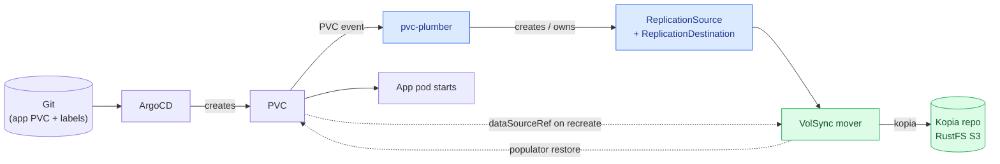
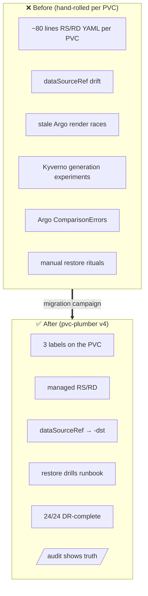
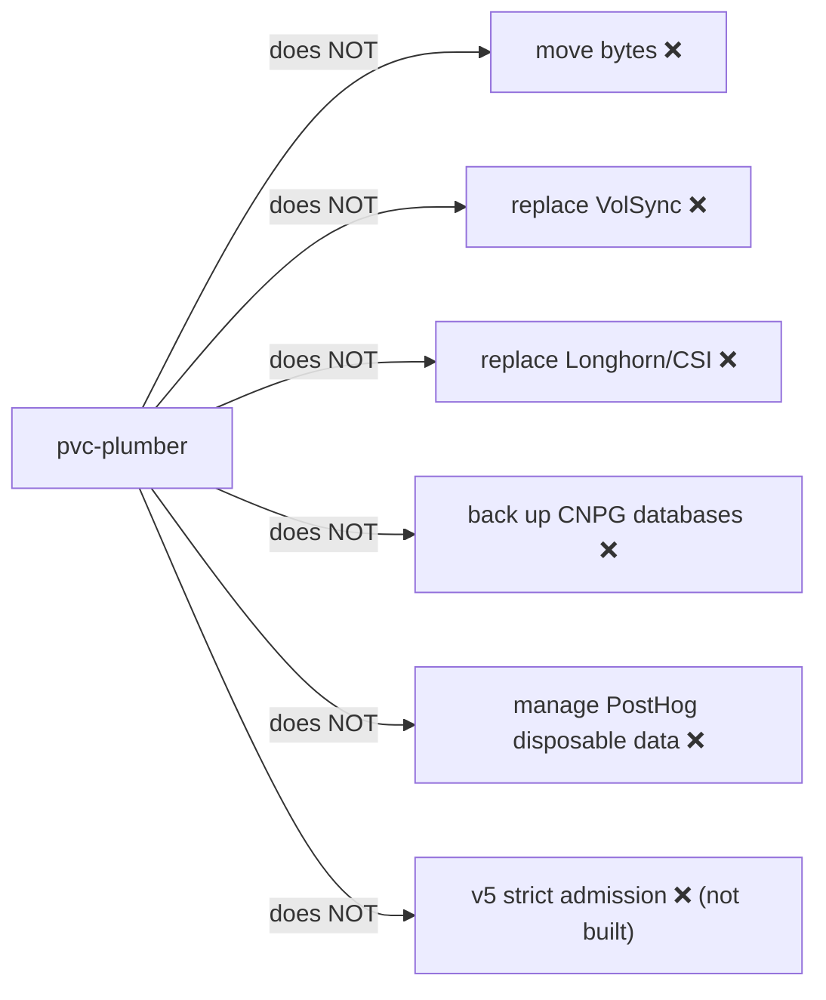

# pvc-plumber — Start Here 🚰

> **One sentence:** *pvc-plumber is the GitOps-native controller that owns the VolSync
> backup/restore wiring for normal app PVCs* — so you label a PVC instead of hand-writing
> ~80 lines of `ReplicationSource`/`ReplicationDestination` YAML per volume.

**Status (2026-06-01):** v4.0.1 live, permissive mode · **24 PVCs / 18 namespaces** managed ·
**24/24 DR_COMPLETE** · 4 restore drills passed · Kyverno fully removed from the path.

If you read nothing else, read this page and the [cheat sheet](pvc-plumber-cheatsheet.md).

---

## 🗺️ The big picture

**Read it as a sentence:** Git → Argo makes the PVC → pvc-plumber wires up backup objects →
VolSync moves the bytes to the Kopia S3 repo. On a *recreate*, the PVC's `dataSourceRef` tells
VolSync to **restore** from the latest backup before the app starts.

---

## 👷 Who does what (responsibility table)

| Layer | Owns | Plain English |
|---|---|---|
| **ArgoCD** | App + PVC desired state | "Git is the truth; make the cluster match it." |
| **Longhorn (CSI)** | Live volume provisioning + replicas | "Give the pod a disk, keep it available." |
| **VolSync** | Data movement (snapshot → kopia) | "Actually copy the bytes to/from the repo." |
| **Kopia / RustFS S3** | The backup repository | "Where the dedup'd, encrypted backups live." |
| **pvc-plumber** | RS/RD wiring + `/audit` | "Own the backup *plumbing* for opted-in PVCs." |
| **CNPG / Barman** | Database-native backup | "Postgres backs itself up to S3 — not VolSync." |
| **External Secrets / 1Password** | Credentials | "Hand the Kopia repo password to each namespace." |
| **Kyverno** | ❌ *historical / removed* | "Used to generate this. Gone since 2026-05. Not in the path." |

> 💡 **The key mental model:** pvc-plumber **does not move bytes**. It only creates and owns the
> *VolSync objects* that tell VolSync what to back up and where to restore from. VolSync + Kopia do
> the actual work.

---

## 🔁 What problem did this solve? (before → after)

| Before | After |
|---|---|
| Every backed-up PVC carried ~80 lines of VolSync YAML you owned forever | A handful of `pvc-plumber.io/*` labels |
| RS/RD drift, orphans, silent data-loss landmines on recreate | Operator-owned RS/RD, `managed-by=pvc-plumber` |
| "Does this PVC even have a backup? will it restore?" — unknown | `/audit` answers it per-PVC |
| Restore was a manual ritual nobody had tested | 4 drills passed byte-identical; **24/24 DR_COMPLETE** |

---

## 🚫 What pvc-plumber does **NOT** do

- **Does not move bytes** — that's VolSync + Kopia.
- **Does not replace VolSync or Longhorn** — it sits *on top* of them.
- **Does not back up CNPG databases** — those use Barman → S3 (native, SQL-aware). Never generic-migrate them.
- **Does not manage PostHog** — those PVCs are `backup-exempt` (disposable/rebuildable).
- **Does not do v5 "strict" admission yet** — no fail-closed webhook, no backup-truth cache. That's a *future* design, **not shipped** (see [v4 vs v5](#-v4-shipped-vs-v5-future)).

---

## 🏷️ The 3 labels that matter

| Label | On | Means |
|---|---|---|
| `pvc-plumber.io/managed-namespace: "true"` | **Namespace** | "Operator may write RS/RD here." (software write-gate) |
| `pvc-plumber.io/enabled: "true"` | **PVC** | "This PVC opts in." |
| `pvc-plumber.io/tier: hourly\|daily` | **PVC** | "Back up at this cadence." |

Plus `pvc-plumber.io/manage-volsync: "true"` on the PVC. **Both gates must be set** — namespace label
*and* PVC fuse labels — or the operator skips the PVC (you'll see `skipped-namespace-not-managed` or
`skipped-not-opted-in` in `/audit`).

---

## 🧭 v4 (shipped) vs v5 (future)

> ⚠️ **Do not treat v5 as shipped.** v4.0.1 is a *reconciler in permissive mode*: it creates/owns
> RS/RD and serves `/audit`, but it does **not** intercept PVC admission and does **not** fail closed.

---

## 📚 Where to go next

1. **[pvc-plumber-dynamic-workflow.md](pvc-plumber-dynamic-workflow.md)** — *how the operator thinks* (decision trees, ownership classes, `/audit` actions).
2. **[talos-argocd-pvc-plumber-integration.md](talos-argocd-pvc-plumber-integration.md)** — *how this repo uses it* (repo map, add-a-PVC checklist, label reference).
3. **[volsync-storage-recovery.md](volsync-storage-recovery.md)** — *restore lifecycle + drill runbook* (the DR source of truth).
4. **[pvc-plumber-cheatsheet.md](pvc-plumber-cheatsheet.md)** — *one-page poster*.
5. **[pvc-plumber-v4-prd.md](pvc-plumber-v4-prd.md)** — *§0 canonical status* + the locked design.
6. **[storage-architecture-future.md](domains/storage/architecture-future.md)** — *Longhorn-vs-restore-DR future idea*.
