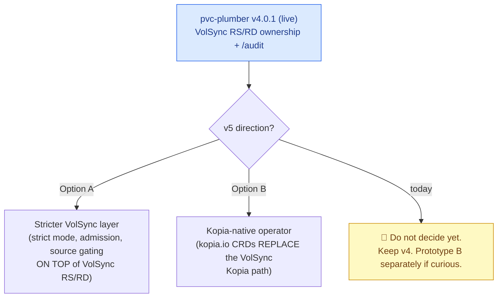
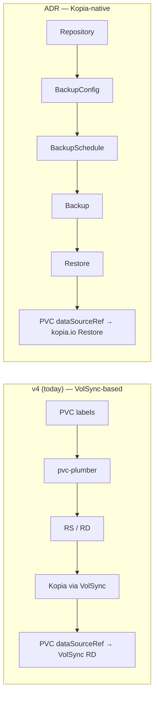
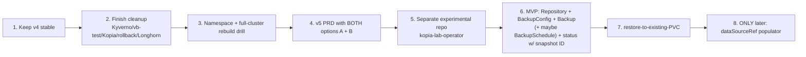

# Future: pvc-plumber v5 — stricter VolSync layer **vs** Kopia-native operator 🔮

> **Status: FUTURE IDEA / DECISION DEFERRED — do not act on this now.** pvc-plumber **v4.0.1 stays**
> as the live, proven backup stack. This doc parks a design fork surfaced by reviewing community
> **ADR-0001 (A Kopia-Native Backup Operator for Kubernetes)** against the real pain from the v4
> migration + DR-completeness campaign. It is a *design reference*, not a plan to execute.
> Companion: [storage-architecture-future.md](storage-architecture-future.md), [pvc-plumber-v4-prd.md](pvc-plumber-v4-prd.md) §0.

## One-line summary

> My pvc-plumber v4 work **proved the pain**; the Kopia Operator ADR describes a cleaner Kopia-native
> API that could eventually remove VolSync for Kopia users — but it is a much larger platform project
> and should be treated as **future v5+/experimental**, not an immediate rewrite.

---

## The fork in the road



| | **A — stricter VolSync layer** | **B — Kopia-native operator** |
|---|---|---|
| Data mover | VolSync (unchanged) | **own it** (Kopia direct) |
| New surface | admission webhooks, backup-truth cache, enforce/strict | `kopia.io` CRDs |
| Risk | re-introduces admission SPOF (the Kyverno lesson) | must reimplement the **volume populator** |
| Effort | weeks–months | **months → full OSS platform** |
| Throws away v4? | no (builds on it) | eventually replaces the VolSync path |

---

## The two pipelines



**Proposed ADR CRDs:** `Repository`, `ClusterRepository`, `BackupConfig`, `BackupSchedule`, `Backup`
(= one real Kopia snapshot), `Restore` (referenceable by PVC `dataSourceRef`), `Maintenance`.

---

## What v4 *proved* (the pains the ADR addresses)

| v4 pain (real, from this campaign) | ADR improvement |
|---|---|
| **Awkward trigger semantics** — had to mutate RS/RD `trigger` strings for drills, then manually restore canonical triggers (v4 won't revert drift) | split into `BackupConfig` (what) / `BackupSchedule` (when) / `Backup` (one run) — no trigger-string hack |
| **Snapshot catalog invisible** — inferred restore state from RD `latestImage` + VolumeSnapshot + VolSync status + kopia logs + sentinels | `kubectl get backup` — each snapshot is a `Backup` CR |
| **Maintenance is an external note** — documented separately after index-blob warnings | first-class `Maintenance` CRD (quick/full schedules, ownership, reclaimed bytes) |
| **No-`dataSourceRef` → silent empty recreate** (the big DR-completeness lesson) | missing-snapshot behavior is **policy**: fail by default, continue only in deploy-or-restore mode |
| **Deploy-or-restore needs Git dsr → VolSync RD** | PVC references a `Restore` CR; `Restore.fromConfig` resolves latest; fresh repo can opt to continue empty |

---

## What the ADR *exposed* (things to weigh before any v5)

- **A. Don't blindly copy v4.** v4 is centered on VolSync RS/RD. v5 must explicitly choose A vs B.
- **B. A `Backup` CR catalog may replace the "backup-truth cache" idea** — materialize CRs from the Kopia catalog instead of inventing a pvc-plumber-only cache.
- **C. Maintenance/retention deserve real ownership** — even staying on v4: `/audit` could *report* maintenance status, warn if stale, surface index-blob warnings, and document retention-vs-snapshot lifecycle.
- **D. Restore drills need a better primitive** — a `restore-drill` annotation, a CLI, or `Backup`/`Restore` CRs; ideally auto-restore canonical triggers afterward.
- **E. ⚠️ Snapshot-deletion semantics are dangerous** — ADR lets `Backup` CR deletion delete the underlying Kopia snapshot by default. If ever implemented, **default to `Retain`** and make the docs *loud*.
- **F. The volume populator is the hard part** — replacing VolSync means owning: `dataSourceRef → Restore` → prime PVC → restore → bind → retries/cleanup. VolSync does this for free today.
- **G. Not a weekend refactor** — tiny homelab MVP: weeks; useful public alpha: months; full ADR platform: many months / an OSS project.

---

## Recommended sequence (when/if revisited)



> Cleanup status (2026-06-01): Kyverno CRDs ✅ removed, vb-test ✅ removed, Kopia maintenance ✅ verified
> healthy, rollback-PV + Longhorn reviews ✅ planned (read-only). The rebuild drill (step 3) is the next
> natural acceptance test.

## The key decision (parked)

```text
Should pvc-plumber v5 be:
  A. a stricter VolSync orchestration/audit/admission layer, or
  B. a migration path toward a Kopia-native operator?

Current answer: Do NOT decide yet.
  - Use the Kopia Operator ADR as a design reference.
  - Do NOT throw away the proven VolSync + pvc-plumber v4 stack.
  - Prototype B in a separate experimental repo if curious.
```
