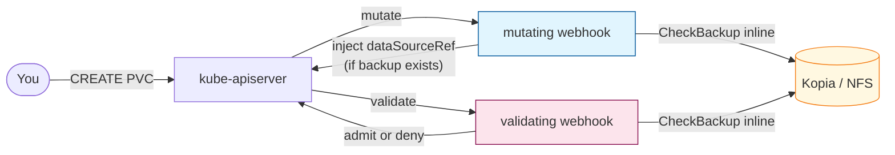
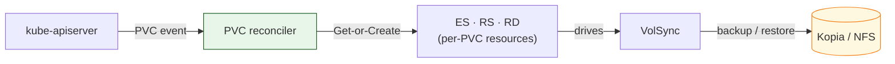
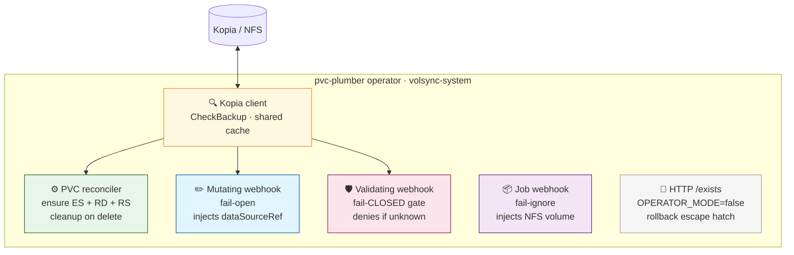
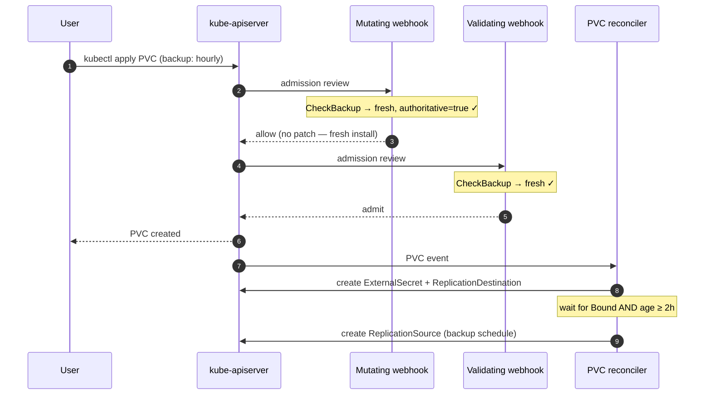
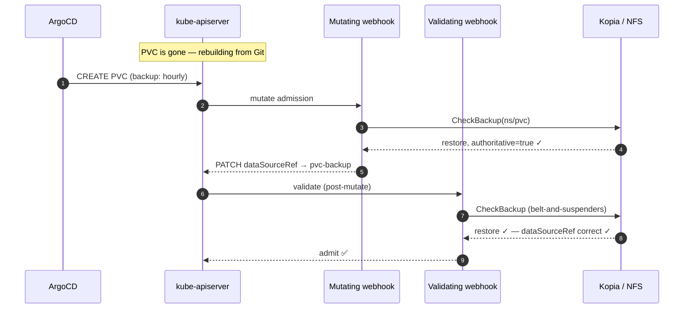
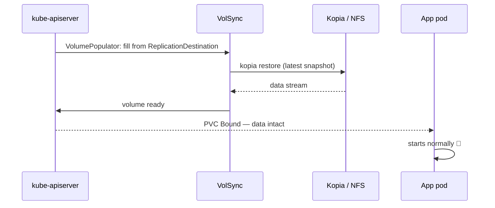
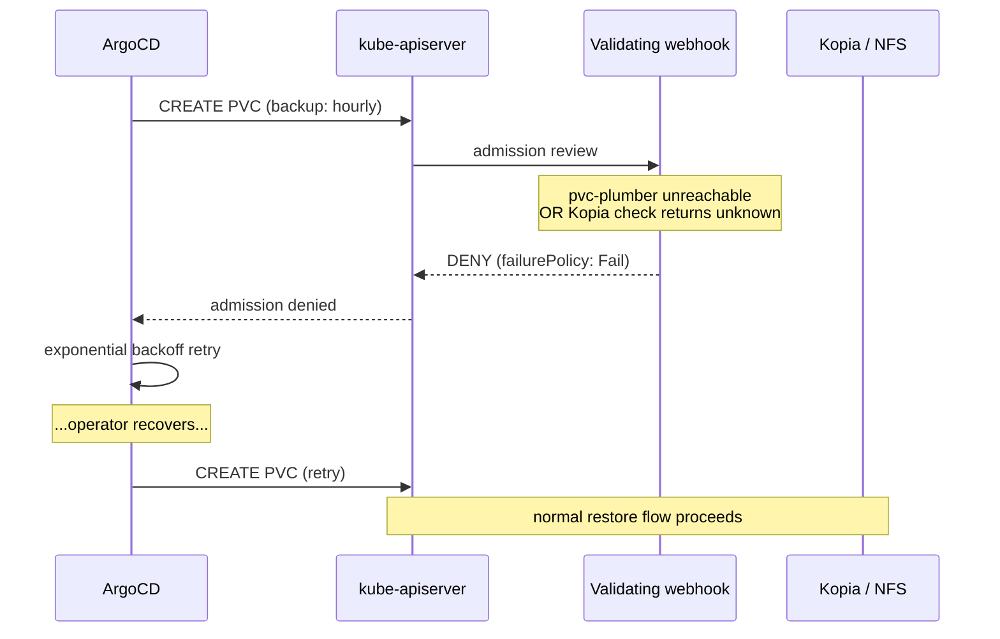
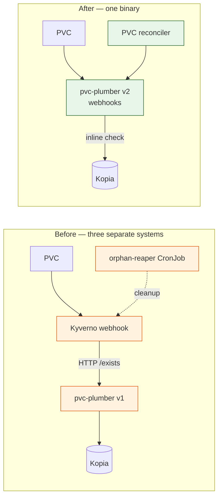

# pvc-plumber: How It Works (Plain English Walkthrough)

**Purpose**: a narrative explanation of what the cluster's PVC backup/restore system does, why it's shaped this way, and what changed when Kyverno was removed.

For the operational reference (tables, troubleshooting, recovery scenarios) see [`volsync-storage-recovery.md`](./volsync-storage-recovery.md). For the architecture decisions and migration history see [`plans/pvc-plumber-operator-design.md`](./plans/pvc-plumber-operator-design.md). For future direction see [`plans/pvc-plumber-v3-roadmap.md`](./plans/pvc-plumber-v3-roadmap.md). For the deep technical internals (webhook code, reconciler logic, Go implementation) see [the pvc-plumber repo docs](https://github.com/mitchross/pvc-plumber/blob/main/docs/).

---

## System at a glance

Two phases happen every time a backup-labeled PVC is created. Here they are separately, then the prose ties them together.

**Phase 1 — Admission** (happens in ~200ms, before the PVC exists):



*Blue = mutating webhook (enriches). Red = validating webhook (the fail-closed gate). If Kopia can't give an authoritative answer, the red webhook denies admission — no empty volumes over real backup data.*

**Phase 2 — Provisioning** (happens after the PVC is admitted):



*Green = PVC reconciler. It creates the ExternalSecret (Kopia password), ReplicationDestination (restore handle), and ReplicationSource (backup schedule). The RS only appears after the PVC has been Bound for ≥ 2 hours — to prevent backing up a freshly-empty volume.*

---

## The user-facing contract

You add a single label to a PVC:

```yaml
metadata:
  labels:
    backup: hourly   # or "daily"
```

Everything else happens automatically. That's the whole user surface — the entire refactor was designed to keep that contract unchanged.

There are two escape hatches if you need them:

- **`volsync.backup/skip-restore: "true"` annotation** — "this PVC has a backup label, but if a backup exists in Kopia, don't restore from it; let me start fresh." Required to be paired with a `volsync.backup/skip-restore-reason` annotation explaining why, otherwise admission denies it. Use this for "nuke and start over" scenarios where you don't want to clear the Kopia repo.
- **`backup-exempt: "true"` label** — "this PVC is intentionally NOT backed up." Required to be paired with `storage.vanillax.dev/backup-exempt-reason: <cache|scratch|external-source|media-on-nas|database-native|test>`. Useful for declaring "I know this isn't backed up and I don't care, here's why."

---

## What used to do this work — Kyverno

Before the 2026-05 refactor, every backup-labeled PVC went through Kyverno:

1. A Kyverno ClusterPolicy read the PVC at admission time, called an HTTP service called `pvc-plumber` to ask "does a backup exist for `<namespace>/<pvcname>` in Kopia?"
2. If yes → Kyverno injected `dataSourceRef` pointing at a `ReplicationDestination` so VolSync would restore the PVC before the app got a Bound volume.
3. If "I don't know" → Kyverno denied the PVC creation (fail-closed: better to make the operator retry than risk an empty volume over restorable data).
4. Other Kyverno policies generated three resources for every backup-labeled PVC: an `ExternalSecret` (Kopia password), a `ReplicationSource` (the backup schedule), a `ReplicationDestination` (the restore handle).
5. Yet another Kyverno policy injected an NFS volume into VolSync's mover Jobs so Kopia could find its repository on the TrueNAS share.
6. A bash CronJob ran every 15 minutes to delete orphaned ES/RS/RD when someone removed a backup label or deleted a PVC, because Kyverno's own cleanup mechanism (`ClusterCleanupPolicy`) was silently broken on Kyverno 1.17/1.18.

This worked but was brittle. Kyverno is a general-purpose policy engine with footguns specific to this use case (`background: false`, `synchronize: false`, `mutateExistingOnPolicyUpdate: false` — any of those set wrong has caused incidents). And on **2026-04-08** a Kyverno admission-controller crash with `failurePolicy: Fail` deadlocked the entire cluster — every Deployment/StatefulSet creation was rejected, including Longhorn's, which meant ArgoCD couldn't mount its PVC, which meant ArgoCD died too. Only manual webhook-config deletion broke the deadlock.

---

## What does this work now — the pvc-plumber v2 operator

`pvc-plumber` used to be just a tiny HTTP service that answered one question: "does a backup exist for this PVC?" It was the oracle Kyverno called.

The v2 refactor turns it into a proper Kubernetes operator: a single Go binary that runs as a Deployment in `volsync-system` (replicas=2, leader-elected) and now does everything Kyverno used to plus the orphan cleanup. The four parts share one process and one Kopia client:



*One Kopia client, shared by all components. The gate is the red box — if it's unreachable, Kubernetes denies backup-labeled PVC creates until it recovers.*

### Part 1 — the existing Kopia client

This didn't change. It's the same code that was already in pvc-plumber v1: a thin Go wrapper around `kopia snapshot list` that connects once to the Kopia repository at startup (mounted at `/repository` via NFS) and answers `CheckBackupExists(ns, pvc)` calls. It returns a `Decision` of `restore`, `fresh`, or `unknown`, plus an `Authoritative` boolean that says "I'm sure about this answer." There's a tiny in-memory cache so repeated questions for the same PVC don't hit Kopia every time.

### Part 2 — the PVC reconciler (controller-runtime)

This watches every `PersistentVolumeClaim` in the cluster. For each one, it asks:

- Is the namespace one of the 9 protected ones (`kube-system`, `volsync-system`, `argocd`, `longhorn-system`, `cert-manager`, `external-secrets`, `1passwordconnect`, `snapshot-controller`, `kyverno`)? → ignore. (`kyverno` stays in the list as a defensive entry even though Kyverno is gone — costs nothing, and if Kyverno is ever reintroduced for an unrelated reason, the deadlock-prevention is already in place.)
- Is the PVC labeled `backup-exempt: "true"`? → reap any operator-managed ES/RS/RD that previously existed, then ignore.
- Has the PVC been deleted, or its `backup` label removed? → same, reap and exit.
- Is it labeled `backup: hourly|daily`? → ensure three resources exist:
  - `ExternalSecret` named `volsync-<pvcname>` that pulls the Kopia password from 1Password.
  - `ReplicationDestination` named `<pvcname>-backup` (the restore handle).
  - `ReplicationSource` named `<pvcname>-backup` (the backup schedule) — but ONLY after the PVC is `Bound` AND at least 2 hours old. The 2-hour wait is to prevent backing up an empty volume right after a restore.

Each "ensure" is **Get-or-Create idempotent**: if the resource exists, the reconciler doesn't touch it. This is the single most important property — it means the operator doesn't fight anybody else who might have created the same resource (Kyverno during the cutover, a human running `kubectl apply`, ArgoCD with a stale state, whatever).

The cleanup uses a label selector — `volsync.backup/pvc=<pvcname>` — which is the same label Kyverno used. So the reconciler can reap Kyverno-generated resources too. That's how the cutover worked without a coexistence phase.

The backup schedule (in v2.1) is `sha256(ns + "/" + pvc) % 60` for the minute field. So `karakeep/data-pvc` lands on some specific minute and stays there forever — deterministic, but with no name-length clustering. Hourly: `<minute> * * * *`. Daily: `<minute> 2 * * *`.

### Part 3 — the three admission webhooks

Same pod, different surface. The operator's webhook server listens on port 9443 with TLS managed by cert-manager.

**`validate-pvc.pvc-plumber.io`** — fail-CLOSED, the safety gate.

When a PVC with a `backup: hourly|daily` label is created, this webhook runs. The logic in priority order:

1. If `backup-exempt: "true"` is on the PVC → require `storage.vanillax.dev/backup-exempt-reason` annotation; otherwise deny.
2. If `volsync.backup/skip-restore: "true"` is on the PVC → require the `skip-restore-reason` annotation; if present, allow without consulting Kopia.
3. Otherwise call Kopia. If Kopia errors, returns `unknown`, or returns "not authoritative" → deny the PVC creation. ArgoCD will retry; meanwhile no empty volume has been created over restorable data.
4. If Kopia returns `restore` (a backup exists) → require the PVC's `dataSourceRef` to be set correctly (`apiGroup: volsync.backube`, `kind: ReplicationDestination`, `name: <pvcname>-backup`). If it isn't, deny.

There's a second registration of this same webhook — `validate-pvc-exempt.pvc-plumber.io` — with a different selector that matches `backup-exempt: "true"` PVCs. Kubernetes LabelSelector can't OR between expressions, and we need the exempt-reason contract enforced whether or not the PVC also carries a `backup` label. Both registrations point at the same handler at `/validate-v1-pvc`; the handler short-circuits cleanly for both paths.

**`mutate-pvc.pvc-plumber.io`** — fail-OPEN.

Runs alongside the validator. If Kopia says "yes a backup exists, decision=restore," it injects the `dataSourceRef` so VolSync will populate the PVC from the backup before the app gets a Bound volume. If Kopia errors or doesn't return an authoritative restore decision, the mutator just allows the PVC unchanged — the validator is the gate, so we don't double-enforce here.

The mutator deliberately doesn't run on `backup-exempt` PVCs (no mutation to do) — that's why there's no `mutate-pvc-exempt` webhook; it would just generate apiserver-to-pod RPCs with no functional effect.

**`mutate-job.pvc-plumber.io`** — fail-IGNORE.

When VolSync creates a mover Job to run a backup or restore, this webhook injects an NFS volume named `repository` (mounted at `/repository`) so the Kopia process inside the mover Job can find the actual backup data on the TrueNAS share. This is `failurePolicy: Ignore` because if NFS injection fails, that one backup degrades — it doesn't endanger the cluster.

### Part 4 — the existing HTTP server

This is still there. The operator binary supports an `OPERATOR_MODE=true` env var. When true (production), the binary runs both the controller-runtime manager and the original HTTP `/exists` server in the same process, sharing one Kopia client + cache. When false, it just runs the HTTP server — drop-in replacement for v1. The flag is a feature gate kept as cheap insurance: if the operator misbehaves in production, you can flip the flag back to `false` without redeploying and the binary just becomes the old oracle service again.

In production we run `OPERATOR_MODE=true` from day one. There's no staged "run in HTTP-only mode first, then flip" rollout — that was deliberately rejected as overcaution for a homelab where rollback is `git revert + argocd sync`.

---

## Lifecycle of a backup-labeled PVC create

**Happy path — first time (no backup exists in Kopia):**



*Kopia runs inside the webhook pod — no separate participant. Steps 1–7: admission takes ~200ms. Steps 8–11: the reconciler provisions the companion resources; the 2h wait prevents backing up an empty volume right after a fresh install.*

---

## Restore on PVC recreate — the killer feature

This is the scenario that justifies everything else. You delete an app (or the cluster dies). When it comes back from Git, the PVC is recreated — and the operator detects the existing Kopia backup, injects the `dataSourceRef`, and VolSync populates the new PVC from the last snapshot **automatically, without any operator intervention**.

**Part 1 — operator decides "restore" at admission time:**



**Part 2 — VolSync populates the volume:**



*The belt-and-suspenders check in Part 1 closes a real race: if the mutate call errors transiently but the validate call succeeds, the PVC would be admitted with no `dataSourceRef` and Longhorn would silently provision an empty volume over restorable data. The validator re-checks and blocks that.*

**What if the operator is down during the restore?**



*The fail-closed design means "unknown = deny + retry." No empty volumes are ever admitted over restorable backup data. The 9-namespace exclusion list ensures infrastructure namespaces (Longhorn, ArgoCD, etc.) never gate on the operator, so an operator crash can't deadlock the cluster.*

---

## What replaced what

Before vs. after — the same function, different implementation:



*Left: three processes, HTTP round-trips between them, a CronJob patching over Kyverno's broken cleanup. Right: one binary, Kopia call inline, reconciler handles cleanup automatically.*

| Old (Kyverno-based) | New (operator-based) |
|---|---|
| `volsync-pvc-backup-restore` ClusterPolicy rule 1 (admission gate) | `validate-pvc.pvc-plumber.io` webhook |
| `volsync-pvc-backup-restore` rule 2 (`dataSourceRef` injection) | `mutate-pvc.pvc-plumber.io` webhook |
| `volsync-pvc-backup-restore` rule 3 (belt-and-suspenders validate) | Same `validate-pvc.pvc-plumber.io` (single re-check) |
| `volsync-pvc-backup-restore` rule 4 (skip-restore reason check) | `validate-pvc.pvc-plumber.io` |
| `volsync-pvc-backup-restore` rules 5, 6, 7 (generate ES, RS, RD) | PVC reconciler `ensureExternalSecret` / `ensureReplicationSource` / `ensureReplicationDestination` |
| `volsync-nfs-inject` ClusterPolicy | `mutate-job.pvc-plumber.io` webhook |
| `volsync-orphan-reaper` bash CronJob | PVC reconciler `cleanup()` (label-selector reap on PVC delete or label remove) |
| `longhorn-pvc-backup-audit` ClusterPolicy (read-only audit) | `LonghornPVCMissingBackupLabel` PrometheusRule |

The whole `infrastructure/controllers/kyverno/` directory is gone. The Kyverno helm chart, its namespace, its rbac patch, its values, even its CLAUDE.md — deleted. The standalone ArgoCD `kyverno` Application is gone. The Lua health check ArgoCD used to track Kyverno's ClusterPolicy readiness is gone. The `kyverno.io` group from the AppSet's resource whitelist is gone.

---

## What still uses VolSync, Kopia, Longhorn — also unchanged

VolSync still does the actual backup/restore mechanics. Kopia is still the backup format on the NFS share at `192.168.10.133:/mnt/BigTank/k8s/volsync-kopia-nfs`. Longhorn is still the source of the volume snapshots VolSync uses as its copy method. The operator just orchestrates: "VolSync, here's a `ReplicationSource` — do your backup thing on this schedule" or "VolSync, here's a `ReplicationDestination` — restore this PVC from the latest snapshot."

---

## What this looks like at boot

Sync wave order:

| Wave | What | Why |
|---|---|---|
| 0 | Cilium, ArgoCD, 1Password Connect, External Secrets | Foundation |
| 1 | Longhorn, VolSync, snapshot-controller, **pvc-plumber operator** | Storage + backup infra |
| 2 | pvc-plumber webhook configurations | Webhook configs only register after the operator pod is healthy |
| 3 | CNPG Barman Plugin | Database-native backup, separate system |
| 4 | Infrastructure AppSet, KEDA, Temporal Worker Controller | Apps with their own controllers |
| 4 | Database AppSet | DR-aware, `selfHeal: false` |
| 5 | OpenTelemetry Operator + Monitoring AppSet | Observability |
| 6 | My-Apps AppSet | All your apps |

When the cluster boots, by the time apps in waves 4-6 try to create backup-labeled PVCs, the operator and its webhooks are already up. If the operator pod is down for any reason, the validating webhook's `failurePolicy: Fail` prevents PVC creation in app namespaces — you get a clear admission error, ArgoCD retries, no empty volumes get created over restorable data. Infrastructure namespaces (the 9 deadlock-prevention ones) are exempt from the webhook entirely so a pvc-plumber crash can't deadlock Longhorn or ArgoCD itself.

---

## What this didn't solve

Two things were considered and explicitly skipped:

- **Catalog model + native CEL `MutatingAdmissionPolicy`** — an external proposal called this the "v3" architecture. It would replace per-request Kopia calls with a periodically refreshed `PVCBackupCatalog` CR that native CEL admission policies read. We saved this as a roadmap doc (`docs/plans/pvc-plumber-v3-roadmap.md`) but didn't build it because (a) `MutatingAdmissionPolicy` is still beta on the k8s versions we're likely running, and (b) the catalog model has a real staleness window — if a backup completes between catalog refresh ticks AND a PVC is recreated in that window, the cached catalog might say "Fresh" and the PVC would start empty over a real backup. The v3 author acknowledged this and agreed the catalog isn't safe without write-through invalidation, which is a bigger redesign.
- **Operator-owned Kopia maintenance + a `PVCProtection` per-PVC status CR** — both are listed as future "v2.2" work. The PVCProtection CR would give you `kubectl get pvcprotection -A` for first-class observability. Operator-owned maintenance would consolidate the existing `kopia-maintenance-cronjob.yaml` into the operator binary. Both are nice-to-haves; deferred until v2 has time in production.

---

## Why the architecture has this shape

A few non-obvious choices that bear explanation:

**Why `failurePolicy: Fail` on the validator?** The validator is the single point that prevents admitting an empty PVC over restorable backup data. If pvc-plumber is unreachable, the safest answer is "deny and let ArgoCD retry." The 9-entry namespaceSelector exclusion makes sure infrastructure namespaces (Longhorn, ArgoCD itself, etc.) are never gated by this, so a pvc-plumber crash can't deadlock the cluster.

**Why `failurePolicy: Ignore` on the job-mutate webhook?** NFS injection failure means a single VolSync mover Job can't reach the Kopia repository — that one backup degrades. It does not put cluster data at risk. Failing closed here would block backups from running during a pvc-plumber blip with no safety benefit.

**Why per-request Kopia calls instead of a catalog?** Real-time truth. The catalog model has a staleness window where a just-completed backup might not be reflected in the cached truth, and a PVC recreate during that window could silently start fresh over the restorable backup. Per-request calls add ~50-200ms of admission latency in exchange for "exists=false is only safe when checked live." The v3 roadmap doc walks through what would have to be true for the catalog model to be equally safe (write-through invalidation from the backup-trigger path).

**Why two `validate-pvc-*` webhook entries with the same handler path?** Kubernetes LabelSelector is AND-only between matchExpressions. We need the validator to fire for both `backup IN (hourly, daily)` AND `backup-exempt = true` PVCs. One webhook entry per selector, both pointing at `/validate-v1-pvc`. The handler short-circuits cleanly for both paths. The mutator is intentionally NOT split — exempt PVCs have no mutation to perform, so a parallel registration would just generate wasted RPCs.

**Why is the schedule formula `sha256(ns + "/" + pvc) % 60`?** The original formula was `len(ns + "-" + pvc) % 60` — a length-based pseudo-hash inherited from the Kyverno policy and explicitly documented as TEMPORARY in the source-of-truth YAML. Length-based hashing clusters PVCs of similar name length onto the same minute (e.g. all PVCs named like `app-data` would hit minute 8). SHA256 distributes uniformly. There's a regression-pin test that asserts variance bounds across 1000 random keys so accidental reversion to length-mod will fail loudly.

**Why is RBAC hand-written in `infrastructure/controllers/pvc-plumber/rbac.yaml` instead of generated from kubebuilder markers?** The hand-written RBAC includes leases (for leader election) and events (for controller-runtime emission) that the kubebuilder markers in `pvc_controller.go` were missing. If anyone runs `controller-gen` on the operator, the regenerated RBAC would silently drop those, and the manager would fail to start with a permissions error. The operator's `pvc_controller.go` has a comment block explicitly forbidding kubebuilder marker re-introduction.

---

## Quick troubleshooting

```bash
# Operator health
kubectl get pods -n volsync-system -l app.kubernetes.io/name=pvc-plumber
kubectl logs -n volsync-system -l app.kubernetes.io/name=pvc-plumber --tail=50

# Webhook configurations registered
kubectl get mutatingwebhookconfiguration pvc-plumber -o yaml
kubectl get validatingwebhookconfiguration pvc-plumber -o yaml

# What did the operator generate for a PVC
kubectl get externalsecret,replicationsource,replicationdestination -n <ns> -l volsync.backup/pvc=<pvcname>

# Why was a PVC creation denied
kubectl describe pvc <pvc> -n <ns>   # look for admission denied messages

# Kopia repository reachable from the operator pod
kubectl exec -n volsync-system deploy/pvc-plumber -- ls -la /repository

# Test the /exists endpoint manually
kubectl run -it --rm curl --image=curlimages/curl --restart=Never -- \
  curl http://pvc-plumber.volsync-system.svc.cluster.local/exists/<ns>/<pvc>
```

For deadlock recovery (operator crashed with `failurePolicy: Fail`, blocking PVC creation cluster-wide): `scripts/emergency-webhook-cleanup.sh` deletes the webhook configurations. ArgoCD will recreate them once the operator is healthy. The script only removes webhook registrations, not the operator deployment or any generated resources.

---

## What's open at the time of writing

Three coordinated PRs:

- **`mitchross/pvc-plumber#3`** — operator binary (controller-runtime + 3 webhooks + shared Kopia client). Must merge first so CI pushes `ghcr.io/mitchross/pvc-plumber:2.0.0-rc1` to GHCR.
- **`mitchross/talos-argocd-proxmox#1270`** — single PR that ships the operator manifests + deletes Kyverno entirely + ships the docs rewrite + ships the `LonghornPVCMissingBackupLabel` PrometheusRule + ships the second `validate-pvc-exempt` webhook. Must merge AFTER pvc-plumber#3 so the image exists when ArgoCD syncs.
- **`mitchross/pvc-plumber#4`** — v2.1 cheap wins (SHA256 schedule + `backup-exempt` contract). Based on `v2`, will auto-rebase to `main` after #3 merges.
