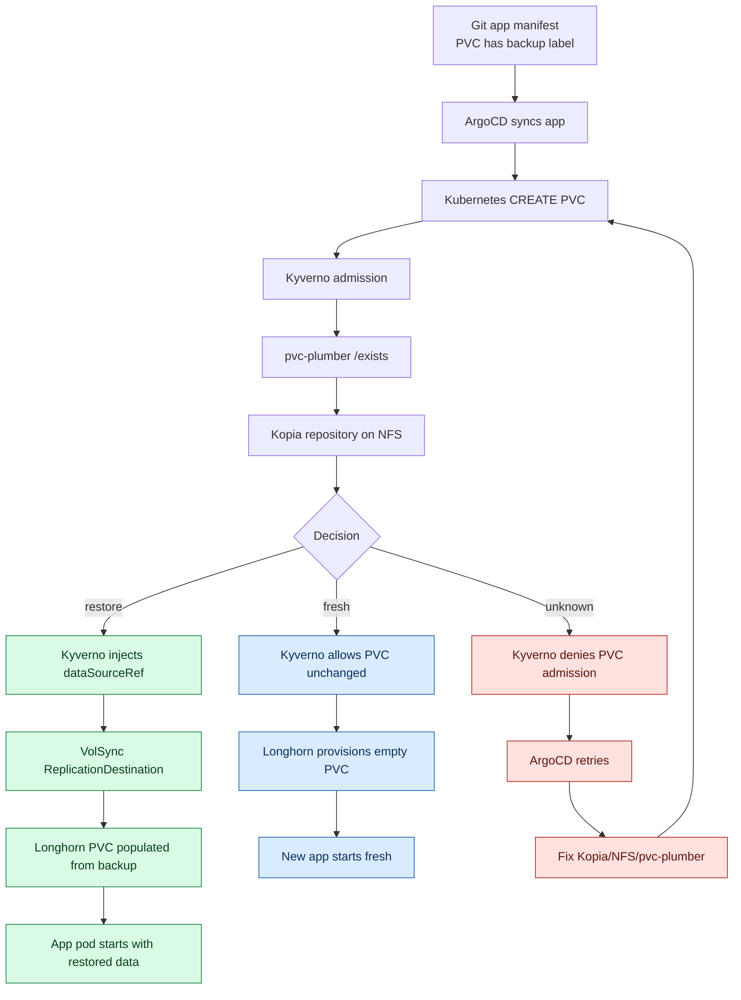
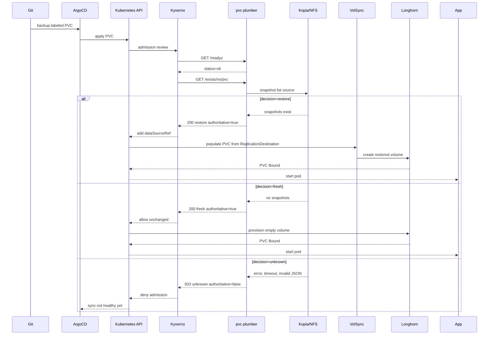
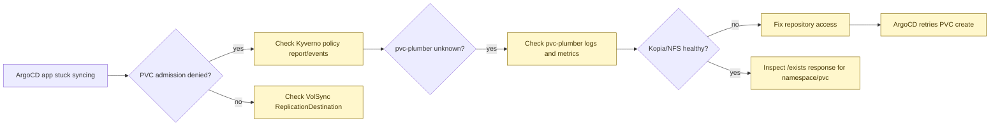

# GitOps PVC Restore Decision Flow

This is the cluster-level picture for backup-labeled PVCs in this repo.

The invariant:

> A PVC labeled `backup: hourly` or `backup: daily` must not be created empty when backup truth is unknown.

## First View

## Swimlane

## What Changed

| Area | Before | Now |
|---|---|---|
| pvc-plumber API | `exists: true/false`; errors looked like `exists: false` | `decision: restore/fresh/unknown` plus `authoritative` |
| Unknown backup truth | Could look like "no backup" | HTTP 503 and `decision: unknown` |
| Kyverno validation | Policy-level `Audit` | Enforced deny for unavailable or non-authoritative checks |
| Kyverno mutation | Mutated on `exists == true` only | Mutates only on authoritative `restore` |
| App startup safety | `/readyz` could pass while `/exists` failed open | `/exists` is the source of per-PVC truth |
| Kopia maintenance | Daily full maintenance with `--safety=none` | Daily safe maintenance off the top of the hour |
| Monitoring | VolSync alerts, no pvc-plumber scrape | pvc-plumber ServiceMonitor and decision/error alerts |

## Design Tradeoffs For Review

| Design | Strengths | Weaknesses | Best use |
|---|---|---|---|
| Hardened Kyverno + pvc-plumber | Minimal app overhead, works with existing PVC labels, keeps restore decision at admission time, small code surface | Kyverno is still doing orchestration-like work; generated resource drift is not continuously reconciled; decision logic is split across policy and service | Good near-term platform hardening |
| Real controller + CRDs | One owner for admission, reconciliation, status, drift repair, metrics, schedule staggering, and cleanup | More code, CRD lifecycle to maintain, webhook certificates/RBAC/controller upgrades become platform responsibilities | Best long-term production shape |
| Manual Longhorn/VolSync restore | Uses existing tools directly, little custom code | Does not scale to many apps, requires human timing, easy for apps to initialize empty state before restore | Emergency manual repair only |
| Per-app restore manifests | Fully declarative per app, no admission oracle | High repetition, easy to forget, hard to know whether a backup exists for first install versus rebuild | Special apps with custom recovery contracts |

Reviewer prompt:

> Judge whether the current hardened design is an acceptable bridge to the controller. The key question is whether the split between Kyverno admission and pvc-plumber decision logic is safe enough now that unknown backup truth fails closed.

## Decision Table

| pvc-plumber response | Kyverno action | Result |
|---|---|---|
| HTTP 200, `decision=restore`, `authoritative=true`, `exists=true` | Allow and mutate `dataSourceRef` | VolSync restore |
| HTTP 200, `decision=fresh`, `authoritative=true`, `exists=false` | Allow unchanged | New empty PVC |
| HTTP 503, `decision=unknown`, `authoritative=false` | Deny | ArgoCD retries |
| pvc-plumber down | Deny | ArgoCD retries |
| Kopia/NFS query error | Deny | ArgoCD retries |

The Kyverno policy also sets an explicit `apiCall.default` for pvc-plumber failures. If the HTTP call itself fails, Kyverno treats the response as `decision=unknown`, `authoritative=false`, and denies the PVC.

## Files In This Repo

| Purpose | File |
|---|---|
| pvc-plumber deployment | `infrastructure/controllers/pvc-plumber/deployment.yaml` |
| Kyverno backup/restore admission and generation | `infrastructure/controllers/kyverno/policies/volsync-pvc-backup-restore.yaml` |
| Kopia maintenance | `infrastructure/storage/volsync/kopia-maintenance-cronjob.yaml` |
| Prometheus scrape config | `monitoring/prometheus-stack/custom-servicemonitors.yaml` |
| Prometheus alerts | `monitoring/prometheus-stack/volsync-alerts.yaml` |

## How To Read A Failure

The desired failure mode is visible waiting, not silent empty initialization.
