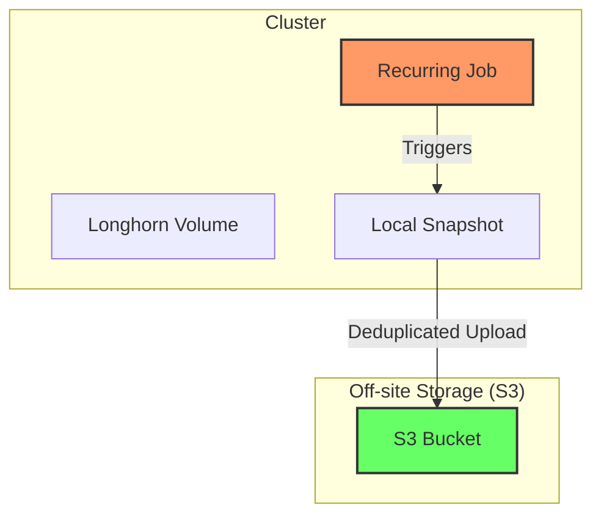
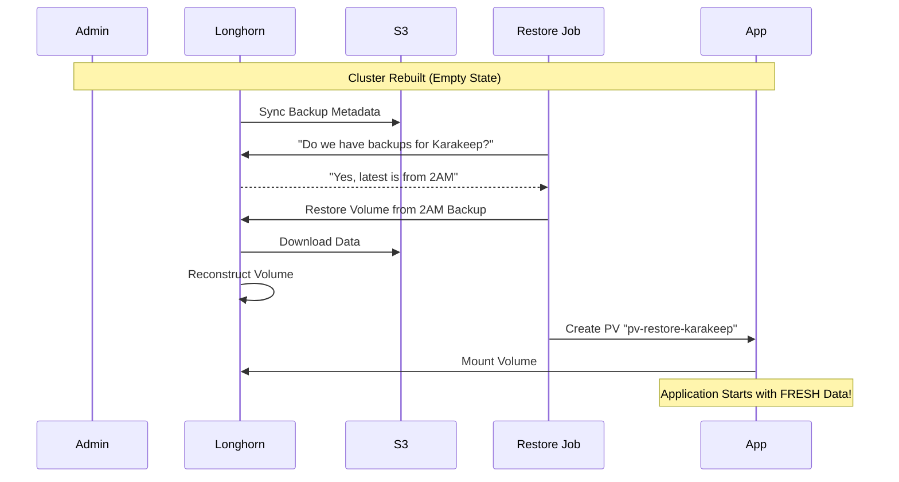

# Storage Architecture & Disaster Recovery

This document outlines the storage architecture for the cluster, focusing on data persistence, backup strategies, and disaster recovery workflows.

## Overview

The cluster uses **Longhorn** as the distributed block storage system. It provides highly available persistent storage for Kubernetes workloads and integrates with S3 for off-site backups.

## 1. Normal Operation (Write Path)

When an application writes data, it flows through the Kubernetes storage stack to Longhorn, which replicates it across nodes.

```mermaid
graph LR
    subgraph "Application Pod"
        App[Application] --> Mount["/data (Mount)"]
    end

    subgraph "Kubernetes Storage"
        Mount --> PVC[PersistentVolumeClaim]
        PVC --> PV[PersistentVolume]
    end

    subgraph "Longhorn Storage Engine"
        PV --> LH_Vol[Longhorn Volume]
        LH_Vol --> Replica1[Replica 1 (Node A)]
        LH_Vol --> Replica2[Replica 2 (Node B)]
    end

    style App fill:#f9f,stroke:#333,stroke-width:2px
    style LH_Vol fill:#bbf,stroke:#333,stroke-width:2px
```

## 2. Backup Strategy (Automatic)

Backups are handled automatically by Longhorn's **Recurring Jobs**.
- **Snapshots**: Local, instant point-in-time copies (kept for hours/days).
- **Backups**: Deduplicated, compressed chunks sent to S3 (kept for days/weeks).

We use `RecurringJob` groups to assign policies:
- **default**: Daily snapshot, Weekly backup (Applied to ALL new volumes).
- **critical**: Hourly snapshot, Daily backup (Applied via `data-tier: critical` label).



## 3. Disaster Recovery (The "Magic" Restore)

When the cluster is destroyed and rebuilt, data is restored from S3.

### The "Magic" Explained
The "magic" is now powered by the **Automated Restore Job** (`restore-job.yaml`). It runs automatically when the cluster starts.

1.  **Nuke & Rebuild**: Cluster is wiped. Longhorn installs.
2.  **Connect S3**: Longhorn connects to S3 and syncs backup metadata.
3.  **Dynamic Discovery**: The Restore Job scans **ALL** backups.
4.  **Match & Restore**: It finds the **LATEST** backup for your critical apps (e.g., `karakeep/data-pvc`) and creates a PV for it.
5.  **Bind**: Your App starts, sees the PV, and binds instantly.



### Why `longhorn-restore-karakeep` was "Out of Norm"
The `longhorn-restore-karakeep` StorageClass contained a hardcoded `fromBackup` parameter.
- **Pros**: Instant restore without scripts.
- **Cons**: It pins the volume to *that specific backup forever*. If you write new data and restart, it might revert to the old backup depending on reclaim policy. It's not meant for general use.

**Best Practice**: Use the standard `longhorn` class. The **Automated Restore Job** will handle the disaster recovery binding for you.
