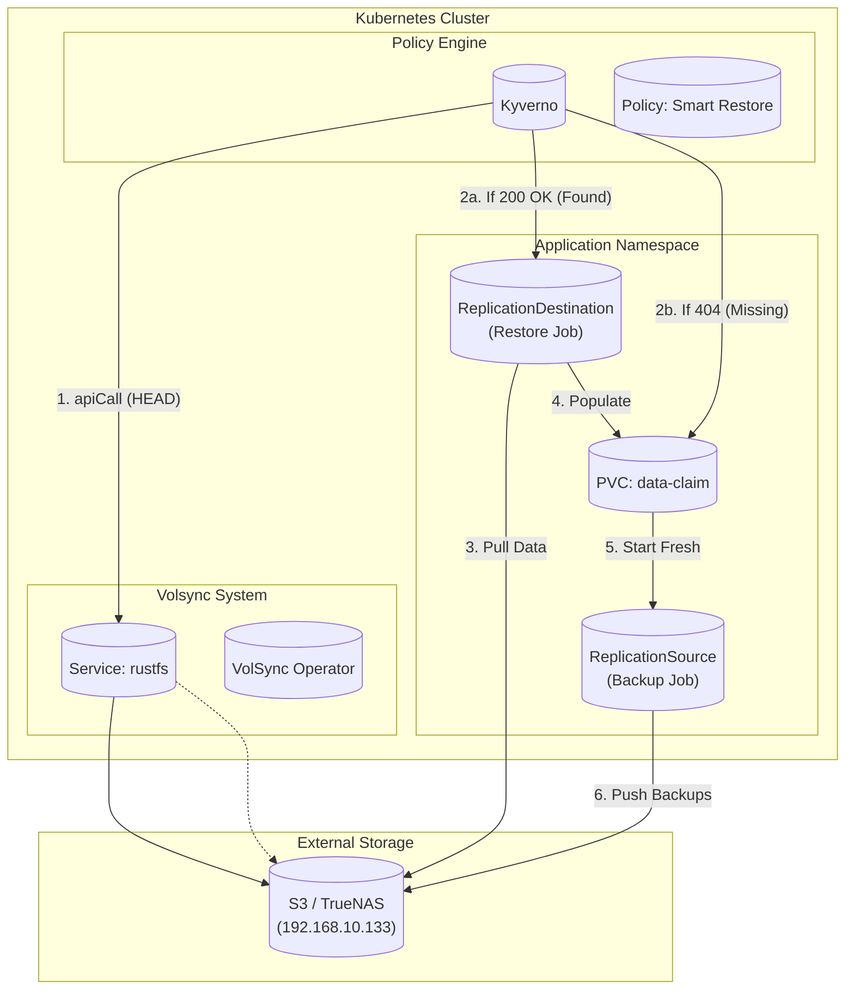

# Storage Architecture & Disaster Recovery

This document outlines the storage architecture for the cluster, focusing on data persistence, backup strategies, and disaster recovery workflows.

## Overview

The cluster uses a layered storage approach with **zero-touch backup and restore**:
- **Longhorn**: Distributed block storage for runtime replication (2 replicas per volume)
- **Snapshot Controller**: Manages VolumeSnapshot lifecycles and CRDs
- **VolSync + Kyverno**: Fully automated backup/restore - just label your PVC!
- **Database-native backups**: CloudNativePG and Crunchy Postgres backup directly to S3

## Zero-Touch Architecture (Smart Restore)

**User only needs to:**
1. Add `backup: "hourly"` or `backup: "daily"` label to PVC
2. Ensure namespace has `volsync.backube/privileged-movers: "true"` **label** (for base credentials)
3. Ensure namespace has `volsync.backube/privileged-movers: "true"` **annotation** (for VolSync movers)

**System automatically provides:**
- **Kyverno** makes a smart decision:
    - If backup exists? -> Creates Restore Job.
    - If new app? -> Creates Backup Job.

```
┌─────────────────────────────────────────────────────────────────────────────────┐
│                           ZERO-TOUCH VOLSYNC ARCHITECTURE                        │
├─────────────────────────────────────────────────────────────────────────────────┤
│                                                                                 │
│   USER PROVIDES:                      SYSTEM AUTO-GENERATES:                    │
│   ┌─────────────────────┐            ┌─────────────────────────────────────┐   │
│   │ PVC                 │            │ volsync-rustfs-base (per namespace) │   │
│   │   labels:           │            │   (ClusterExternalSecret → Secret)  │   │
│   │     backup: hourly  │            │                                     │   │
│   └─────────────────────┘            │ {pvc}-volsync-secret (per PVC)      │   │
│                                      │   (Kyverno apiCall + base64 encode) │   │
│                                      │                                     │   │
│                                      │ ReplicationSource                   │   │
│                                      │   (hourly/daily backups to S3)      │   │
│                                      │                                     │   │
│                                      │ ReplicationDestination              │   │
│                                      │   (Creates ONLY if backup exists)   │   │
│                                      └─────────────────────────────────────┘   │
│                                                                                 │
└─────────────────────────────────────────────────────────────────────────────────┘
```

## Architecture Diagram



## Kyverno Policies

### Smart Restore Policy (`volsync-smart-restore`)
**The "Look Before You Leap" logic.**
- Trigger: PVC creation.
- Check: `apiCall` (HTTP HEAD) to S3 bucket.
- Action:
    - If HTTP 200: Generate `ReplicationDestination`.
    - If HTTP 404: Do nothing (Allow fresh install).

### Generate Policy (`generate-volsync-backup`)
**The "Backup Insurance".**
- Trigger: PVC creation (always).
- Action: Generate `ReplicationSource`.
- Result: Ensures all fresh apps eventually get backed up.

### Mutate Policy (`volsync-auto-restore`)
**The "Connection".**
- Trigger: PVC creation.
- Check: Does `ReplicationDestination` exist?
- Action: If yes, add `dataSourceRef` to PVC.
- Result: PVC waits for VolSync to restore data before binding.

## 4. Disaster Recovery Scenarios

### Scenario 1: New App (First Deployment)
```
1. User creates PVC with backup: hourly label.
2. Kyverno checks S3: 404 Not Found.
3. Kyverno allows PVC creation WITHOUT dataSourceRef.
4. App starts with empty volume.
5. Kyverno generates ReplicationSource.
6. First backup runs.
```

### Scenario 2: Cluster Rebuild (Disaster Recovery)
```
1. Bootstrap new Cluster.
2. ArgoCD syncs app.
3. Kyverno checks S3: 200 OK (Found backup!).
4. Kyverno generates ReplicationDestination.
5. Kyverno mutates PVC to add dataSourceRef.
6. PVC waits (Pending) while VolSync pulls data.
7. Volume restores -> Pod starts.
```

### Scenario 3: Manual Restore (Specific Point in Time)
```bash
# 1. Scale down the application
kubectl scale deployment <app> -n <namespace> --replicas=0

# 2. Delete the PVC
kubectl delete pvc <pvc-name> -n <namespace>

# 3. (Optional) Update ReplicationDestination to point to older snapshot if needed
#    ArgoCD will typically re-sync the latest.

# 4. ArgoCD recreates PVC
#    Kyverno sees backup exists -> generates RD -> restores.
```

## 5. Defense Layers Summary

| Layer | Protects Against | Recovery Time | Manual Intervention |
|-------|------------------|---------------|---------------------|
| Longhorn replicas | Node failure | Instant | None |
| VolSync + Kyverno | Cluster loss | ~5-15 minutes | None (Zero Touch) |

## 8. Configuration Files

| Component | Location |
|-----------|----------|
| VolSync operator | `infrastructure/storage/volsync/` |
| **RustFS Service** | `infrastructure/storage/volsync/rustfs-service.yaml` |
| **Smart Restore Policy** | `infrastructure/controllers/kyverno/volsync-smart-restore.yaml` |
| Generate Policy | `infrastructure/controllers/kyverno/volsync-clusterpolicy.yaml` |
| Mutate Policy | `infrastructure/controllers/kyverno/volsync-auto-restore.yaml` |

## 9. Troubleshooting

### Kyverno apiCall Failed
If Kyverno cannot reach S3, check the Service Bridge:
```bash
kubectl get svc rustfs -n volsync-system
kubectl describe endpoints rustfs -n volsync-system
# Should point to 192.168.10.133:9000
```
