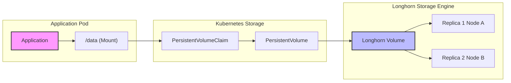

# Storage Architecture & Disaster Recovery

This document outlines the storage architecture for the cluster, focusing on data persistence, backup strategies, and disaster recovery workflows.

## Overview

The cluster uses a layered storage approach:
- **Longhorn**: Distributed block storage for runtime replication (2 replicas per volume)
- **Snapshot Controller**: Manages VolumeSnapshot lifecycles and CRDs
- **VolSync**: Daily backups of all PVCs to S3 using Restic
- **Database-native backups**: CloudNativePG and Crunchy Postgres backup directly to S3

## Architecture Diagram

```
┌─────────────────────────────────────────────────────────────────┐
│                        Talos Cluster                            │
│  ┌──────────────────┐    ┌──────────────────┐                  │
│  │   App PVCs       │    │  Postgres DBs    │                  │
│  │  (Longhorn)      │    │  (CNPG/Crunchy)  │                  │
│  └────────┬─────────┘    └────────┬─────────┘                  │
│           │                       │                             │
│           ▼                       ▼                             │
│  ┌──────────────────┐    ┌──────────────────┐                  │
│  │    VolSync       │    │  Native PG       │                  │
│  │  (Restic daily)  │    │  WAL + Backups   │                  │
│  └────────┬─────────┘    └────────┬─────────┘                  │
│           │                       │                             │
└───────────┼───────────────────────┼─────────────────────────────┘
            │                       │
            ▼                       ▼
     ┌─────────────────────────────────────┐
     │   RustFS (S3) on TrueNAS            │
     │   192.168.10.133:30292              │
     │   └── volsync/<app>/                │
     └─────────────────────────────────────┘
```

## 1. Normal Operation (Write Path)

When an application writes data, it flows through Kubernetes to Longhorn, which maintains 2 replicas:



**Longhorn provides:**
- Runtime replication (survives single node failure)
- Fast replica rebuild
- Automatic rebalancing

**Longhorn does NOT provide:**
- Off-cluster backups (handled by VolSync)
- Point-in-time recovery (handled by VolSync)

## 2. Backup Strategy

### PVC Backups (VolSync)

Application PVCs are backed up using VolSync with Restic, with a tiered schedule:

**Critical Apps (Hourly):**
home-assistant, paperless-ngx, karakeep, meilisearch, n8n, immich, open-webui, khoj

| Setting | Value |
|---------|-------|
| Schedule | `0 * * * *` (hourly) |
| Retention | 24 hourly + 7 daily |

**Non-Critical Apps (Daily):**
container-registry, redis, mqtt, searxng, fizzy, nginx, jellyfin, nestmtx, homepage-dashboard, plex

| Setting | Value |
|---------|-------|
| Schedule | `0 2 * * *` (daily at 2 AM) |
| Retention | 14 days |

**Common Settings:**

| Setting | Value |
|---------|-------|
| Backend | Restic |
| Target | RustFS S3 on TrueNAS (192.168.10.133:30292) |
| Bucket | `volsync` |
| Copy Method | Snapshot |

Each app has:
- `ReplicationSource` - Defines backup schedule and retention
- `ReplicationDestination` - Dormant restore definition (no trigger)
- `PVC` - References ReplicationDestination via `dataSourceRef`
- `ExternalSecret` - Pulls S3 credentials from 1Password

### Database Backups (Native)

PostgreSQL databases use their native backup tools:

**CloudNativePG (khoj, paperless)**
- Barman for WAL archiving
- Daily base backups at 3 AM
- 14-day retention
- Point-in-time recovery capable

**Crunchy Postgres (immich)**
- pgBackRest for backups
- Weekly full + daily differential
- 14-day retention

## 3. Disaster Recovery

### Volume Populator Pattern (Automatic Restore)

PVCs use the **Volume Populator** pattern for automatic restore:

```yaml
# In each app's PVC
spec:
  dataSourceRef:
    kind: ReplicationDestination
    apiGroup: volsync.backube
    name: <app>-restore
```

**How it works:**
1. PVC references a dormant ReplicationDestination (no trigger)
2. When PVC is newly created (no existing Longhorn volume), Kubernetes uses the dataSourceRef
3. VolSync automatically restores from S3 backup to populate the new PVC
4. If Longhorn already has the data, dataSourceRef is ignored

**This enables zero-intervention restore:**
- Deploy app → PVC created → auto-restore from S3 → app starts with data
- Longhorn replication is Layer 1 (node failure)
- S3 backup is Layer 2 (cluster loss)

### Manual Restore (if needed)

For manual restore scenarios, you can trigger the ReplicationDestination:

```bash
# Add manual trigger to force restore
kubectl patch replicationdestination <app>-restore -n <namespace> \
  --type merge \
  -p '{"spec":{"trigger":{"manual":"restore-'$(date +%s)'"}}}'

# Wait for restore to complete
kubectl get replicationdestination <app>-restore -n <namespace> -w
```

### Restoring a Database

**CloudNativePG:**
```yaml
spec:
  bootstrap:
    recovery:
      source: <cluster-name>
      # Optional: recoveryTarget for point-in-time
```

**Crunchy Postgres:**
Use pgBackRest restore commands or recreate cluster with recovery settings.

### Full Cluster Rebuild

After a complete cluster rebuild:

1. Deploy infrastructure (ArgoCD, External Secrets, Longhorn, VolSync)
2. VolSync operator syncs with S3
3. For each app, trigger ReplicationDestination to restore data
4. Deploy applications - they bind to restored PVCs

## 4. What Changed from Longhorn Backups

| Feature | Before (Longhorn) | Now (VolSync) |
|---------|-------------------|---------------|
| Backup tool | Longhorn built-in | VolSync + Restic |
| Backup schedule | RecurringJobs (tiered) | Tiered: hourly (critical) + daily (non-critical) |
| Restore method | Hardcoded restore-job.yaml | Volume Populator (automatic on PVC create) |
| Database backups | PVC snapshots (inconsistent) | Native WAL archiving (consistent) |
| Complexity | Multiple tiers, shell scripts | Declarative YAML per app |

## 5. Monitoring

### Check VolSync Status
```bash
# All ReplicationSources
kubectl get replicationsource -A

# Specific app
kubectl describe replicationsource home-assistant-config-backup -n home-assistant
```

### Check Database Backups
```bash
# CNPG
kubectl get backup -n cloudnative-pg

# Crunchy
kubectl exec -it <postgres-pod> -n postgres-operator -- pgbackrest info
```

### S3 Bucket Contents
```bash
# VolSync backups (RustFS)
mc alias set rustfs http://192.168.10.133:30292 <access_key> <secret_key>
mc ls rustfs/volsync/

# List specific app backup
mc ls rustfs/volsync/home-assistant/
```

## 6. Configuration Files

| Component | Location |
|-----------|----------|
| VolSync operator | `infrastructure/storage/volsync/` |
| Snapshot Controller | `infrastructure/storage/snapshot-controller/` |
| Longhorn (replication only) | `infrastructure/storage/longhorn/` |
| App VolSync configs | `my-apps/<category>/<app>/replicationsource.yaml` |
| CNPG backup config | `infrastructure/database/cloudnative-pg/*/cluster.yaml` |
| Crunchy backup config | `infrastructure/database/crunchy-postgres/*/cluster.yaml` |
| 1Password setup | `docs/secrets/volsync-secrets.md` |
