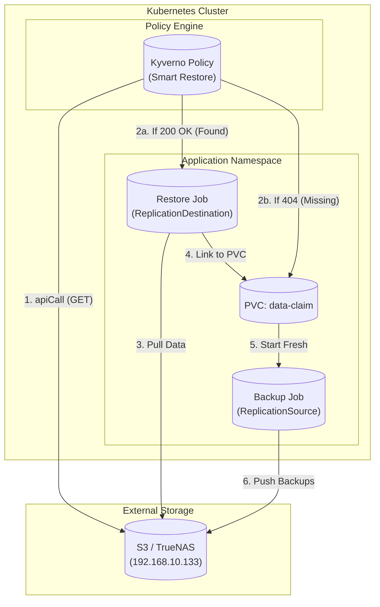

# Storage Architecture & Disaster Recovery

This document outlines the storage architecture for the cluster, focusing on the **Zero-Touch Backup & Restore** system powered by VolSync and Kyverno.

## Overview

The cluster uses a "Smart Restore" strategy. When a PersistentVolumeClaim (PVC) is created, the system checks if a backup *already exists* in the offsite storage (TrueNAS S3) before deciding what to do.

-   **Backup Found?** -> Automatically trigger a Restore.
-   **Backup Missing?** -> Automatically configure a fresh Backup schedule.

## Zero-Touch Architecture (Direct IP Strategy)

To ensure maximum stability and avoid GitOps sync issues, the system connects directly to the offsite storage IP.

**User only needs to:**
1.  Add `backup: "hourly"` (or `daily`) label to any PVC.
2.  That's it. (Credentials are auto-injected).

**System automatically provides:**
1.  **Smart Mutation:** Kyverno checks `http://192.168.10.133:9000/.../config`.
2.  **Conditional Logic:**
    *   **200 OK:** Adds `dataSourceRef` to the PVC (forcing it to wait for restore).
    *   **404 Not Found:** Lets PVC start empty.
3.  **Resource Generation:**
    *   **Backup Job:** Always created (`ReplicationSource`).
    *   **Restore Job:** Created ONLY if data exists (`ReplicationDestination`).

```
┌─────────────────────────────────────────────────────────────────────────────────┐
│                           SMART RESTORE ARCHITECTURE                            │
├─────────────────────────────────────────────────────────────────────────────────┤
│                                                                                 │
│   USER PROVIDES:                      SYSTEM AUTO-GENERATES:                    │
│   ┌─────────────────────┐            ┌─────────────────────────────────────┐   │
│   │ PVC                 │            │ volsync-smart-protection            │   │
│   │   labels:           │            │   (ClusterPolicy)                   │   │
│   │     backup: hourly  │            │                                     │   │
│   └─────────────────────┘            │   1. Checks 192.168.10.133 (GET)    │   │
│                                      │   2. Mutates PVC (if found)         │   │
│                                      │   3. Creates Backup Job (always)    │   │
│                                      │   4. Creates Restore Job (if found) │   │
│                                      └─────────────────────────────────────┘   │
│                                                                                 │
└─────────────────────────────────────────────────────────────────────────────────┘
```

## Architecture Diagram



## Kyverno Policy Details

All logic is consolidated into a single policy: **`infrastructure/controllers/kyverno/volsync-smart-restore.yaml`**.

### Rules
1.  **`link-restore-if-exists` (Mutate)**
    *   **Check:** `GET http://192.168.10.133:9000/.../config`
    *   **Action:** If 200, adds `dataSourceRef: ReplicationDestination` to the PVC.
    *   **Why:** This pauses the PVC binding until VolSync populates the volume.

2.  **`generate-restore-job` (Generate)**
    *   **Check:** Same as above.
    *   **Action:** Creates the `ReplicationDestination` CRD that actually performs the download.

3.  **`generate-backup-job` (Generate)**
    *   **Check:** None (Always runs).
    *   **Action:** Creates `ReplicationSource` to ensure the new data is backed up going forward.

## 4. Disaster Recovery Scenarios

### Scenario 1: New App (First Deployment)
```
1. User creates PVC.
2. Kyverno checks S3 -> 404.
3. PVC created empty (ready immediately).
4. Kyverno creates Backup Job.
5. First backup runs in 1 hour.
```

### Scenario 2: Cluster Rebuild (Total DR)
```
1. Cluster is rebuilt. ArgoCD installs app.
2. Kyverno checks S3 -> 200.
3. Kyverno creates Restore Job.
4. Kyverno Links PVC to Restore Job.
5. Pod waits in Pending...
6. VolSync downloads data...
7. PVC binds. Pod starts.
```

## 5. Configuration Files

| Component | Location |
|-----------|----------|
| **Smart Policy (The Brain)** | `infrastructure/controllers/kyverno/volsync-smart-restore.yaml` |
| **VolSync Kustomization** | `infrastructure/storage/volsync/kustomization.yaml` |
| **Credentials** | `infrastructure/storage/volsync/rustfs-credentials.yaml` |

## 6. Troubleshooting

### "OutOfSync" in ArgoCD?
This is usually cosmetic due to Kyverno status updates.
We have applied `ignoreDifferences` in the AppSet to silence `ClusterPolicy` status fields.
If it persists, verify your local Git matches the API Server.

### Manual Restore
To force a restore to a specific point in time:
```bash
kubectl delete pvc <pvc-name>
# Update the ReplicationDestination spec if needed to point to a specific snapshot ID
# Re-create PVC (ArgoCD will do this).
```
