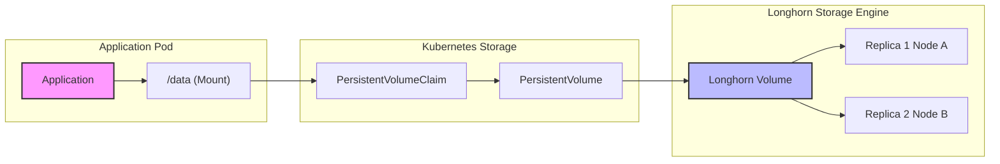

# Storage Architecture & Disaster Recovery

This document outlines the storage architecture for the cluster, focusing on data persistence, backup strategies, and disaster recovery workflows.

## Overview

The cluster uses a layered storage approach:
- **Longhorn**: Distributed block storage for runtime replication (2 replicas per volume)
- **Snapshot Controller**: Manages VolumeSnapshot lifecycles and CRDs
- **VolSync**: Scheduled backups of all PVCs to S3 using Restic + automatic restore via Volume Populator
- **Database-native backups**: CloudNativePG and Crunchy Postgres backup directly to S3

## Architecture Diagram

```
┌─────────────────────────────────────────────────────────────────────────────┐
│                             Talos Cluster                                    │
│                                                                             │
│  ┌────────────────────────────────────────────────────────────────────────┐ │
│  │                         Normal Operation                                │ │
│  │                                                                        │ │
│  │   App PVC ──► ReplicationSource ──► S3 (backup on schedule)           │ │
│  │      ▲              (hourly/daily)                                     │ │
│  │      │                                    │                            │ │
│  │      │         ReplicationDestination ◄───┘                            │ │
│  │      │           (syncs 30 min after backup)                           │ │
│  │      │                    │                                            │ │
│  │      │                    ▼                                            │ │
│  │      │              latestImage                                        │ │
│  │      │            (VolumeSnapshot)                                     │ │
│  │      │                    │                                            │ │
│  │      └────────────────────┘                                            │ │
│  │         (dataSourceRef for auto-restore)                               │ │
│  └────────────────────────────────────────────────────────────────────────┘ │
│                                                                             │
│  ┌────────────────────────────────────────────────────────────────────────┐ │
│  │                      When PVC is Deleted                                │ │
│  │                                                                        │ │
│  │   1. ArgoCD recreates PVC with dataSourceRef                          │ │
│  │   2. Volume Populator sees dataSourceRef → ReplicationDestination     │ │
│  │   3. Creates PVC from latestImage snapshot                            │ │
│  │   4. Data is automatically restored!                                  │ │
│  └────────────────────────────────────────────────────────────────────────┘ │
│                                                                             │
└─────────────────────────────────────────────────────────────────────────────┘
                    │
                    ▼
     ┌─────────────────────────────────┐
     │   RustFS (S3) on TrueNAS        │
     │   192.168.10.133:30292          │
     │   └── volsync/<app>/            │
     └─────────────────────────────────┘
```

## 1. Normal Operation (Write Path)

When an application writes data, it flows through Kubernetes to Longhorn, which maintains 2 replicas:



**Longhorn provides:**
- Runtime replication (survives single node failure)
- Fast replica rebuild
- Automatic rebalancing
- VolumeSnapshots for VolSync

**Longhorn does NOT provide:**
- Off-cluster backups (handled by VolSync)
- Automatic restore on PVC deletion (handled by Volume Populator)

## 2. Backup Strategy

### PVC Backups (VolSync)

Application PVCs are backed up using VolSync with Restic, with a tiered schedule:

**Critical Apps (Hourly):**
home-assistant, paperless-ngx, karakeep, meilisearch, n8n, immich, open-webui, khoj

| Component | Schedule | Purpose |
|-----------|----------|---------|
| ReplicationSource | `0 * * * *` (hourly at :00) | Backup PVC → S3 |
| ReplicationDestination | `30 * * * *` (hourly at :30) | Sync S3 → latestImage |
| Retention | 24 hourly + 7 daily | |

**Non-Critical Apps (Daily):**
container-registry, redis, mqtt, searxng, fizzy, nginx, jellyfin, nestmtx, homepage-dashboard, plex

| Component | Schedule | Purpose |
|-----------|----------|---------|
| ReplicationSource | `0 2 * * *` (daily at 2:00 AM) | Backup PVC → S3 |
| ReplicationDestination | `30 2 * * *` (daily at 2:30 AM) | Sync S3 → latestImage |
| Retention | 14 days | |

**Common Settings:**

| Setting | Value |
|---------|-------|
| Backend | Restic |
| Target | RustFS S3 on TrueNAS (192.168.10.133:30292) |
| Bucket | `volsync` |
| Copy Method | Snapshot |

Each app has:
- `ReplicationSource` - Backs up PVC to S3 on schedule
- `ReplicationDestination` - Syncs from S3, maintains `latestImage` snapshot for auto-restore
- `PVC.dataSourceRef` - Points to ReplicationDestination for Volume Populator
- `ExternalSecret` - Pulls S3 credentials from 1Password

### Database Backups (Native)

PostgreSQL databases use their native backup tools:

**CloudNativePG (khoj, paperless)**
- Barman for WAL archiving
- Daily base backups at 3 AM
- 14-day retention
- Point-in-time recovery capable

**Crunchy Postgres (immich)**
- pgBackRest for backups
- Weekly full + daily differential
- 14-day retention

## 3. Automatic Restore (Volume Populator)

### How It Works

When a PVC is deleted (accidentally or intentionally) and ArgoCD recreates it:

1. **PVC has `dataSourceRef`** pointing to ReplicationDestination
2. **Volume Populator** detects the dataSourceRef
3. **Looks up `latestImage`** from ReplicationDestination (a VolumeSnapshot)
4. **Creates PVC** from that snapshot
5. **Data is restored automatically** - no manual intervention!

### Storage Overhead

For automatic restore to work, each app needs:
- ReplicationDestination cache PVC (~1Gi)
- ReplicationDestination dest PVC (same size as app PVC)
- latestImage VolumeSnapshot

**Total overhead**: ~2Gi + 1x PVC size per app

### ArgoCD Configuration

PVC `spec.dataSourceRef` is immutable after creation. ArgoCD is configured to ignore this field:

```yaml
# In ApplicationSet
ignoreDifferences:
- group: ""
  kind: PersistentVolumeClaim
  jqPathExpressions:
  - .spec.dataSourceRef
  - .spec.dataSource
  - .spec.volumeName
```

This allows:
- Existing PVCs: ArgoCD ignores the dataSourceRef difference
- New PVCs: Created with dataSourceRef, Volume Populator triggers restore

## 4. Disaster Recovery Scenarios

### Scenario 1: App Deleted in ArgoCD UI

1. User deletes app in ArgoCD → PVC is deleted
2. ArgoCD recreates app (auto-sync)
3. New PVC created with `dataSourceRef`
4. Volume Populator restores from `latestImage`
5. **Data restored automatically!**

### Scenario 2: Accidental PVC Deletion

1. `kubectl delete pvc <name> -n <namespace>`
2. ArgoCD detects missing PVC, recreates it
3. Volume Populator restores from `latestImage`
4. **Data restored automatically!**

### Scenario 3: Full Cluster Rebuild

1. Bootstrap new Talos cluster
2. Deploy ArgoCD (GitOps)
3. ArgoCD deploys all apps from Git
4. ReplicationDestinations sync from S3, create `latestImage` snapshots
5. PVCs are created with `dataSourceRef`
6. Volume Populator creates PVCs from snapshots
7. **All data restored automatically!**

### Scenario 4: Manual Restore (Override)

If you need to restore to a specific point in time:

1. Scale down the application:
```bash
kubectl scale deployment <app> -n <namespace> --replicas=0
```

2. Delete the existing PVC:
```bash
kubectl delete pvc <pvc-name> -n <namespace>
```

3. Trigger manual restore (optional - to get latest from S3):
```bash
kubectl patch replicationdestination <app>-restore -n <namespace> \
  --type merge \
  -p '{"spec":{"trigger":{"manual":"restore-'$(date +%s)'"}}}'
```

4. Wait for sync, then let ArgoCD recreate the PVC (or manually create it)

5. Scale up the application:
```bash
kubectl scale deployment <app> -n <namespace> --replicas=1
```

## 5. Defense Layers Summary

| Layer | Protects Against | Recovery Time | Manual Intervention |
|-------|------------------|---------------|---------------------|
| Longhorn replicas | Node failure | Instant | None |
| VolSync + Volume Populator | App/PVC deletion | ~1-2 minutes | None |
| VolSync S3 backups | Cluster loss | ~5-15 minutes | Deploy GitOps |

## 6. Monitoring

### Check VolSync Status
```bash
# All ReplicationSources (backups)
kubectl get replicationsource -A

# All ReplicationDestinations (restore points)
kubectl get replicationdestination -A

# Check if latestImage exists (required for auto-restore)
kubectl get replicationdestination -A -o jsonpath='{range .items[*]}{.metadata.namespace}/{.metadata.name}: {.status.latestImage.name}{"\n"}{end}'
```

### Check Database Backups
```bash
# CNPG
kubectl get backup -n cloudnative-pg

# Crunchy
kubectl exec -it <postgres-pod> -n postgres-operator -- pgbackrest info
```

### S3 Bucket Contents
```bash
# VolSync backups (RustFS)
mc alias set rustfs http://192.168.10.133:30292 <access_key> <secret_key>
mc ls rustfs/volsync/

# List specific app backup
mc ls rustfs/volsync/home-assistant/
```

## 7. Configuration Files

| Component | Location |
|-----------|----------|
| VolSync operator | `infrastructure/storage/volsync/` |
| Snapshot Controller | `infrastructure/storage/snapshot-controller/` |
| Longhorn (replication only) | `infrastructure/storage/longhorn/` |
| App ReplicationSource | `my-apps/<category>/<app>/replicationsource.yaml` |
| App ReplicationDestination | `my-apps/<category>/<app>/replicationdestination.yaml` |
| App PVC (with dataSourceRef) | `my-apps/<category>/<app>/pvc.yaml` |
| ArgoCD ignoreDifferences | `infrastructure/controllers/argocd/apps/*-appset.yaml` |
| CNPG backup config | `infrastructure/database/cloudnative-pg/*/cluster.yaml` |
| Crunchy backup config | `infrastructure/database/crunchy-postgres/*/cluster.yaml` |
| 1Password setup | `docs/secrets/volsync-secrets.md` |
