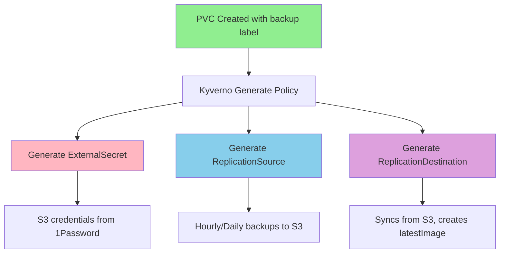
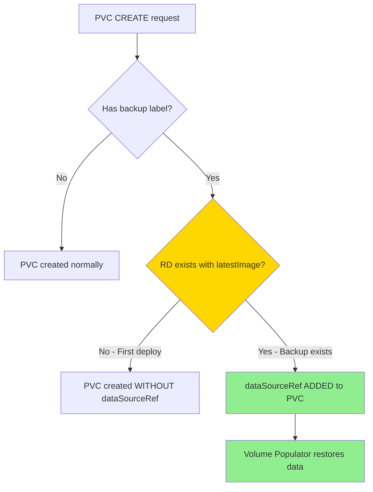
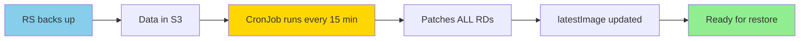
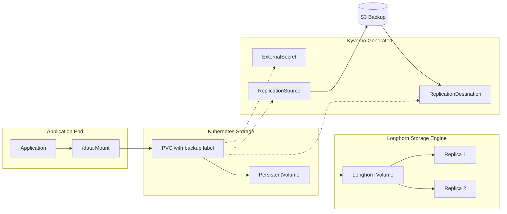
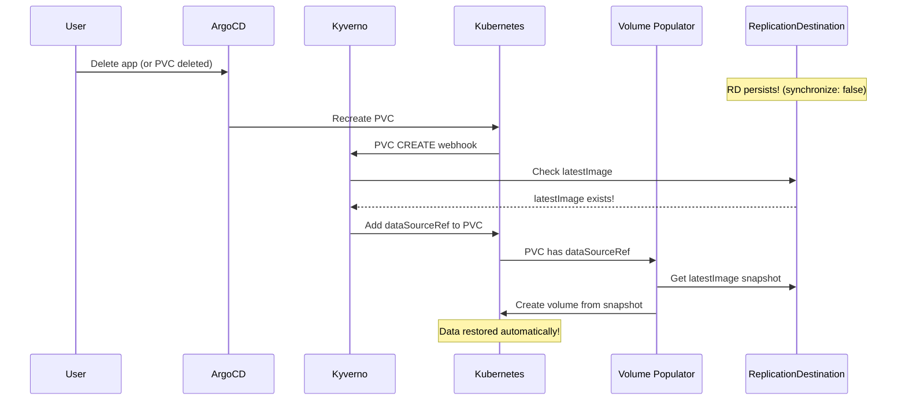

# Storage Architecture & Disaster Recovery

This document outlines the storage architecture for the cluster, focusing on data persistence, backup strategies, and disaster recovery workflows.

## Overview

The cluster uses a layered storage approach with **zero-touch backup and restore**:
- **Longhorn**: Distributed block storage for runtime replication (2 replicas per volume)
- **Snapshot Controller**: Manages VolumeSnapshot lifecycles and CRDs
- **VolSync + Kyverno**: Fully automated backup/restore - just label your PVC!
- **Database-native backups**: CloudNativePG and Crunchy Postgres backup directly to S3

## Zero-Touch Architecture

**User only needs to:**
1. Add `backup: "hourly"` or `backup: "daily"` label to PVC
2. Ensure namespace has `volsync.backube/privileged-movers: "true"` annotation

**Kyverno automatically generates:**
- ExternalSecret (S3 credentials)
- ReplicationSource (backups)
- ReplicationDestination (restore points)
- dataSourceRef on PVC (if backup exists)

```
┌─────────────────────────────────────────────────────────────────────────────────┐
│                           ZERO-TOUCH VOLSYNC ARCHITECTURE                        │
├─────────────────────────────────────────────────────────────────────────────────┤
│                                                                                 │
│   USER PROVIDES:                      KYVERNO AUTO-GENERATES:                   │
│   ┌─────────────────────┐            ┌─────────────────────────────────────┐   │
│   │ PVC                 │            │ ExternalSecret                      │   │
│   │   labels:           │ ────────►  │   (S3 creds from 1Password)         │   │
│   │     backup: hourly  │            │                                     │   │
│   └─────────────────────┘            │ ReplicationSource                   │   │
│                                      │   (hourly backups to S3)            │   │
│   ┌─────────────────────┐            │                                     │   │
│   │ Namespace           │            │ ReplicationDestination              │   │
│   │   annotations:      │            │   (persists for restore)            │   │
│   │     volsync...true  │            │                                     │   │
│   └─────────────────────┘            │ dataSourceRef on PVC                │   │
│                                      │   (only if backup exists)           │   │
│                                      └─────────────────────────────────────┘   │
│                                                                                 │
└─────────────────────────────────────────────────────────────────────────────────┘
```

## Architecture Diagram

```
┌─────────────────────────────────────────────────────────────────────────────────┐
│                              Talos Cluster                                       │
│                                                                                  │
│  ┌────────────────────────────────────────────────────────────────────────────┐ │
│  │                         NEW APP (First Deployment)                          │ │
│  │                                                                             │ │
│  │   PVC created ──► Kyverno generates: ExternalSecret + RS + RD              │ │
│  │       │                                                                     │ │
│  │       │          Kyverno mutate checks: Does RD have latestImage?          │ │
│  │       │                     │                                               │ │
│  │       │                     ▼                                               │ │
│  │       │              NO (first deploy)                                      │ │
│  │       │                     │                                               │ │
│  │       ▼                     ▼                                               │ │
│  │   PVC created WITHOUT dataSourceRef ──► App starts with empty volume       │ │
│  │       │                                                                     │ │
│  │       ▼                                                                     │ │
│  │   Hourly: RS backs up to S3 ──► Sync CronJob triggers RD ──► latestImage   │ │
│  │                                                                             │ │
│  └────────────────────────────────────────────────────────────────────────────┘ │
│                                                                                  │
│  ┌────────────────────────────────────────────────────────────────────────────┐ │
│  │                         APP REINSTALL (Has Backup)                          │ │
│  │                                                                             │ │
│  │   App deleted ──► RS deleted, PVC deleted                                  │ │
│  │                   ★ RD PERSISTS (synchronize: false)                       │ │
│  │                                                                             │ │
│  │   App reinstalled ──► PVC being created                                    │ │
│  │       │                                                                     │ │
│  │       │          Kyverno mutate checks: Does RD have latestImage?          │ │
│  │       │                     │                                               │ │
│  │       │                     ▼                                               │ │
│  │       │              YES! (backup exists)                                   │ │
│  │       │                     │                                               │ │
│  │       ▼                     ▼                                               │ │
│  │   dataSourceRef ADDED ──► Volume Populator ──► RESTORED FROM BACKUP!       │ │
│  │                                                                             │ │
│  └────────────────────────────────────────────────────────────────────────────┘ │
│                                                                                  │
└─────────────────────────────────────────────────────────────────────────────────┘
                    │
                    ▼
     ┌─────────────────────────────────┐
     │   RustFS (S3) on TrueNAS        │
     │   192.168.10.133:30292          │
     │   └── volsync/<ns>-<pvc>/       │
     └─────────────────────────────────┘
```

## Kyverno Policies

### Generate Policy (`generate-volsync-backup`)

When Kyverno sees a PVC with `backup: hourly` or `backup: daily` label:



### Mutate Policy (`volsync-auto-restore`)

When a PVC is being created, Kyverno checks if restore is possible:



### Sync CronJob (Coordinated RD Sync)

A single CronJob syncs ALL ReplicationDestinations every 15 minutes:



**Why a single CronJob instead of per-RD schedules:**
- Single coordinated sync (less cluster load)
- 0-15 min bootstrap window (faster than per-RD schedules)
- All RDs sync together (easier debugging)
- Cleaner architecture

## 1. Normal Operation (Write Path)

When an application writes data, it flows through Kubernetes to Longhorn:



## 2. Backup Strategy

### PVC Backups (VolSync via Kyverno)

**To enable backups, just add a label:**

```yaml
apiVersion: v1
kind: PersistentVolumeClaim
metadata:
  name: my-app-data
  labels:
    backup: "hourly"   # or "daily"
spec:
  accessModes: [ReadWriteOnce]
  resources:
    requests:
      storage: 10Gi
  storageClassName: longhorn
```

**Kyverno generates everything else automatically!**

### Backup Tiers

| Tier | Label | Schedule | Retention | Use Case |
|------|-------|----------|-----------|----------|
| Hourly | `backup: "hourly"` | Every hour at :00 | 24 hourly + 7 daily | Critical apps |
| Daily | `backup: "daily"` | Daily at 2:00 AM | 14 days | Non-critical apps |

### What Kyverno Creates

For each labeled PVC, Kyverno generates:

| Resource | Name Pattern | Purpose |
|----------|--------------|---------|
| ExternalSecret | `{pvc-name}-volsync-secret` | S3 credentials from 1Password |
| ReplicationSource | `{pvc-name}-backup` | Backs up to S3 on schedule |
| ReplicationDestination | `{pvc-name}-restore` | Syncs from S3, maintains latestImage |

**S3 Repository Path:** `s3://volsync/{namespace}-{pvc-name}/`

### Database Backups (Native)

PostgreSQL databases use their native backup tools:

**CloudNativePG (khoj, paperless)**
- Barman for WAL archiving
- Daily base backups at 3 AM
- 14-day retention
- Point-in-time recovery capable

**Crunchy Postgres (immich)**
- pgBackRest for backups
- Weekly full + daily differential
- 14-day retention

## 3. Automatic Restore (Volume Populator)

### How It Works



### Key Design: RD Persistence

- **ReplicationSource**: `synchronize: true` - deleted when PVC is deleted
- **ReplicationDestination**: `synchronize: false` - **persists** for future restores

This ensures backup data is always available for restore, even after app deletion.

## 4. Disaster Recovery Scenarios

### Scenario 1: New App (First Deployment)

```
1. User creates PVC with backup: hourly label
2. Kyverno generates ExternalSecret, RS, RD
3. Kyverno mutate: No latestImage → no dataSourceRef
4. PVC created with empty volume
5. App starts with empty data
6. First backup runs at next :00
7. Sync CronJob runs (every 15 min) → triggers RD → creates latestImage
8. Future restores will work!
```

**Result:** App starts fresh, backups begin automatically.

**Bootstrap Timing:** latestImage is available within 0-15 minutes after first backup completes. This is expected - there's nothing to restore for a brand new app anyway!

### Scenario 2: App Deleted & Reinstalled

```
1. User removes app from Git (or deletes in ArgoCD)
2. ArgoCD prunes: Deployment, PVC, RS deleted
3. RD persists (synchronize: false) with latestImage!
4. User adds app back to Git
5. ArgoCD syncs: creates new PVC
6. Kyverno mutate: latestImage exists → adds dataSourceRef
7. Volume Populator restores from latestImage
8. App starts with RESTORED data!
```

**Result:** Data automatically restored - ZERO manual intervention!

### Scenario 3: Full Cluster Rebuild

```
1. Bootstrap new Talos cluster
2. Deploy ArgoCD (GitOps)
3. ArgoCD deploys all apps
4. Kyverno generates RS + RD for each labeled PVC
5. RD syncs from S3, creates latestImage
6. On first deploy: PVCs created without dataSourceRef (empty)
7. To restore: Delete PVCs, let ArgoCD recreate them
8. Now: latestImage exists → dataSourceRef added → restored!
```

**Alternative for cluster rebuild:**
```bash
# After initial deploy, trigger PVC recreation to restore
for pvc in $(kubectl get pvc -A -l backup -o name); do
  kubectl delete $pvc
done
# ArgoCD will recreate with dataSourceRef → auto-restore
```

### Scenario 4: Manual Restore (Specific Point in Time)

```bash
# 1. Scale down the application
kubectl scale deployment <app> -n <namespace> --replicas=0

# 2. Trigger RD sync to get latest from S3
kubectl patch replicationdestination <pvc>-restore -n <namespace> \
  --type merge \
  -p '{"spec":{"trigger":{"manual":"restore-'$(date +%s)'"}}}'

# 3. Wait for latestImage to be created
kubectl get replicationdestination <pvc>-restore -n <namespace> -w

# 4. Delete the PVC (ArgoCD will recreate with dataSourceRef)
kubectl delete pvc <pvc-name> -n <namespace>

# 5. Wait for restore, then scale up
kubectl scale deployment <app> -n <namespace> --replicas=1
```

## 5. Defense Layers Summary

| Layer | Protects Against | Recovery Time | Manual Intervention |
|-------|------------------|---------------|---------------------|
| Longhorn replicas | Node failure | Instant | None |
| VolSync + Kyverno | App/PVC deletion | ~1-2 minutes | None |
| VolSync S3 backups | Cluster loss | ~5-15 minutes | Delete PVCs to trigger restore |

## 6. Onboarding New Apps

### Step 1: Add namespace annotation (once per namespace)

```yaml
apiVersion: v1
kind: Namespace
metadata:
  name: my-app
  annotations:
    volsync.backube/privileged-movers: "true"
```

### Step 2: Add backup label to PVC

```yaml
apiVersion: v1
kind: PersistentVolumeClaim
metadata:
  name: my-app-data
  labels:
    backup: "hourly"  # That's it!
spec:
  accessModes: [ReadWriteOnce]
  resources:
    requests:
      storage: 10Gi
  storageClassName: longhorn
```

**Done!** Kyverno handles everything else.

## 7. Monitoring

### Check VolSync Status

```bash
# All ReplicationSources (backups)
kubectl get replicationsource -A

# All ReplicationDestinations (restore points)
kubectl get replicationdestination -A

# Check if latestImage exists (required for auto-restore)
kubectl get replicationdestination -A \
  -o custom-columns=\
NAMESPACE:.metadata.namespace,\
NAME:.metadata.name,\
LATEST_IMAGE:.status.latestImage.name

# Check Kyverno-generated ExternalSecrets
kubectl get externalsecret -A | grep volsync
```

### Verify Backups in S3

```bash
# List all backup repositories
mc alias set rustfs http://192.168.10.133:30292 <access_key> <secret_key>
mc ls rustfs/volsync/

# Check specific app backup
mc ls rustfs/volsync/karakeep-data-pvc/
```

## 8. Configuration Files

| Component | Location |
|-----------|----------|
| VolSync operator | `infrastructure/storage/volsync/` |
| Sync CronJob | `infrastructure/storage/volsync/sync-cronjob.yaml` |
| Kyverno generate policy | `infrastructure/controllers/kyverno/volsync-clusterpolicy.yaml` |
| Kyverno mutate policy | `infrastructure/controllers/kyverno/volsync-restore-mutate.yaml` |
| Snapshot Controller | `infrastructure/storage/snapshot-controller/` |
| Longhorn | `infrastructure/storage/longhorn/` |
| ArgoCD ignoreDifferences | `infrastructure/controllers/argocd/apps/*-appset.yaml` |
| 1Password secret (rustfs) | Configured in 1Password vault |

## 9. Troubleshooting

### PVC stuck in Pending after restore

Check if Volume Populator is waiting for latestImage:
```bash
kubectl describe pvc <name> -n <namespace>
kubectl get replicationdestination <name>-restore -n <namespace> -o yaml
```

### ExternalSecret not creating Secret

```bash
kubectl get externalsecret <pvc>-volsync-secret -n <namespace> -o yaml
kubectl describe externalsecret <pvc>-volsync-secret -n <namespace>
```

### ReplicationSource not backing up

```bash
kubectl get replicationsource <pvc>-backup -n <namespace> -o yaml
kubectl logs -n volsync-system -l app.kubernetes.io/name=volsync
```

### Force sync ReplicationDestination

```bash
kubectl patch replicationdestination <pvc>-restore -n <namespace> \
  --type merge \
  -p '{"spec":{"trigger":{"manual":"sync-'$(date +%s)'"}}}'
```
