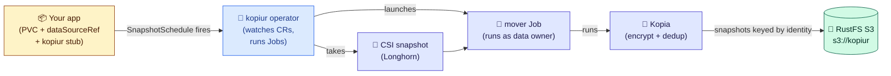
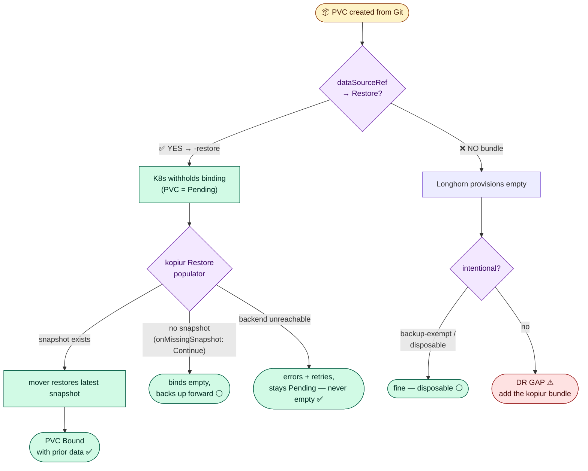
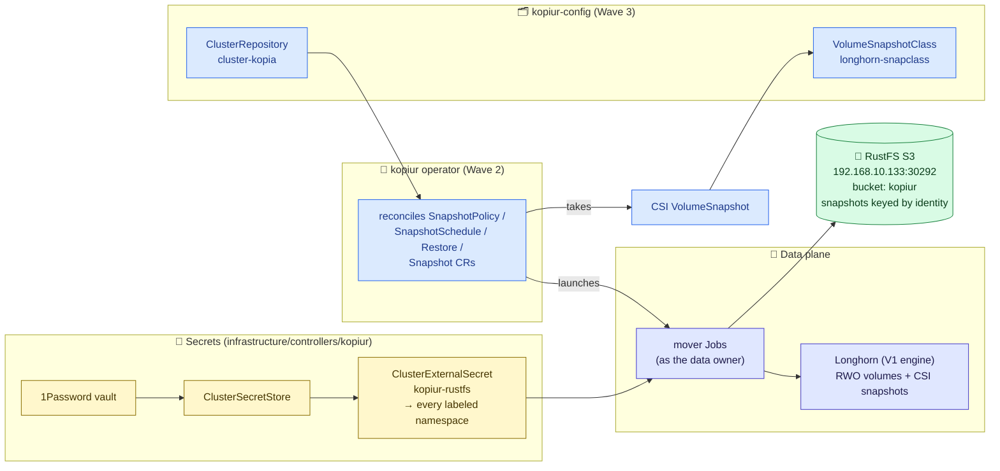
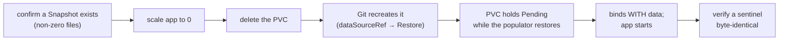

# Storage, Backup & Restore Architecture

The single source of truth for **how application data survives anything** in
this cluster — including the cluster itself ceasing to exist.

> **Scope:** application PVCs (Longhorn → kopiur/Kopia → RustFS S3).
> **Out of scope:** CloudNativePG database backups (Barman → S3).
> See [`cnpg disaster recovery`](domains/cnpg/disaster-recovery.md) — different
> tool, different runbook. The two systems never touch each other.

> **How to read this doc:** it gets more technical as you scroll. The first
> sections are plain English suitable for a whiteboard. The middle has the
> architecture diagrams and the operator's decision tree. The bottom is
> design rationale, portability notes, and honest limitations. Stop reading
> wherever the depth matches what you came for. This is the canonical storage
> page; the [full-cluster rebuild runbook](disaster-recovery.md) is the one
> internal appendix.

> **The mechanism lives in dedicated docs — this page is the "why" and the
> "where".** For the exact CR shapes, the Kustomize-component composition, the
> backup/restore flow diagrams, and the add-a-backup checklist, read these and
> do not duplicate their detail:
> - [`kopiur backup architecture`](domains/storage/kopiur-backup-architecture.md) — the pieces, the component, backup + restore-before-bind flows, the checklist.
> - [`kopiur mover permissions`](domains/storage/kopiur-mover-permissions.md) — why the mover runs as the data owner (and how to pick the UID).
> - [`kopiur evaluation`](domains/storage/kopiur-evaluation.md) — why kopiur, the fit analysis, the verified facts.
> - [`kopiur trial`](kopiur-trial.md) — the migration decision and cutover record.

> **History:** this path used to run **pvc-plumber + VolSync** (3 labels →
> generated `ReplicationSource`/`ReplicationDestination`, a `/audit` ledger, and
> a `wait-for-rustfs` MutatingAdmissionPolicy). Those were **retired
> 2026-06-27** and replaced by **kopiur**, a Kopia-native operator driven by
> explicit per-PVC CRs wrapped in a shared Kustomize component. If you find a
> doc, label, or runbook that still mentions `pvc-plumber.io/*`, VolSync,
> `ReplicationSource`/`ReplicationDestination`, `volsync-kopia-repository`, the
> `/audit` endpoint, or `volsync-mover-backend-availability`, it is stale.

> **Reading from another homelab?** This is internal documentation for one
> specific cluster, not a product. See
> [Adapting this to your cluster](#adapting-this-to-your-cluster) and
> [Known limitations](#known-limitations-and-non-goals) — the *pattern* is
> more portable than the specific stack.

---

## Quick start — a tiny CR bundle, wrapped in a component

Backups are **per-PVC CRs** (a `SnapshotPolicy`, a `SnapshotSchedule`, and a
`Restore`), but you never write the boilerplate. A shared Kustomize component
(`my-apps/common/kopiur-backup`) injects every uniform field, so each PVC needs
only a small **stub** plus three small edits:

```yaml
# 1. namespace.yaml — opt the namespace in (one label)
metadata:
  labels:
    kopiur.home-operations.com/repo: cluster-kopia

# 2. pvc.yaml — restore-before-bind pointer
spec:
  storageClassName: longhorn            # snapshot-capable CSI required
  dataSourceRef:
    apiGroup: kopiur.home-operations.com
    kind: Restore
    name: <pvc>-restore

# 3. kopiur/<pvc>.yaml — the stub (varying bits only):
#    SnapshotPolicy { name, sources.pvc, identity, retention, mover UID:GID }
#    SnapshotSchedule { cron }
#    Restore { fromPolicy, mover UID:GID }

# 4. kustomization.yaml
components:
  - ../../common/kopiur-backup          # injects the uniform fields
resources:
  - kopiur/<pvc>.yaml
```

That's it. Backups run on the stub's cron; delete the PVC (or the whole
cluster) and it comes back **with its data**. The rest of this page is why and
how. Full step-by-step:
[`kopiur backup architecture` §5](domains/storage/kopiur-backup-architecture.md#5-to-add-a-backup-checklist).
*(One-time backend prerequisite: an S3 box + one secret —
[backup repository setup](backup-repository-setup.md).)*

---

## Why this exists

**One sentence:** I can nuke the entire Kubernetes cluster, redeploy from
Git, and every app comes back with its data — no scripts, no manual restore
commands, no ordering choreography. It just happens.

That's the whole point. Per-PVC restore is just the mechanism; **cluster
rebuild is the use case.**


```mermaid
flowchart LR
    subgraph BEFORE["💥 Before: cluster died / I rebuilt it from scratch"]
      B1["🔥 Cluster: gone<br/>Apps: gone<br/>PVCs: gone"]
      B2["💾 RustFS S3: untouched<br/>(Kopia repo intact)"]
      B3["📂 Git: untouched"]
    end

    subgraph DURING["🔄 What I do"]
      D1["./scripts/bootstrap-argocd.sh"]
      D2["☕ wait"]
    end

    subgraph AFTER["✅ After"]
      A1["🟢 90 apps running"]
      A2["🟢 every protected PVC auto-restored<br/>from last backup"]
      A3["🟢 Backups already scheduled"]
    end

    BEFORE --> DURING --> AFTER

    classDef gone fill:#fee2e2,stroke:#991b1b,color:#450a0a;
    classDef kept fill:#d1fae5,stroke:#065f46,color:#022c22;
    classDef action fill:#fef3c7,stroke:#92400e,color:#451a03;
    classDef ok fill:#dbeafe,stroke:#1e40af,color:#0c1f4a;
    class B1 gone;
    class B2,B3 kept;
    class D1,D2 action;
    class A1,A2,A3 ok;
```

The "restore-on-recreate" guarantee is not a hypothesis. The mechanism it
replaced (pvc-plumber + VolSync, same Kubernetes volume-populator contract)
ran a full unattended cluster rebuild **three times** — 2026-06-02 (planned),
2026-06-12 (unplanned, mid storage-engine meltdown), and 2026-06-13 (planned
rebuild onto a different storage engine, ~75 min, zero manual steps). kopiur
uses the **identical populator handshake** (`dataSourceRef → Restore`,
PVC held `Pending` until restored), so the cluster-rebuild path is the same
code path Kubernetes runs — only the operator authoring the `Restore` changed.

**What I do NOT do during a cluster rebuild:**

- ❌ Run a restore script per app
- ❌ Remember which PVC needed which snapshot ID
- ❌ Worry about ordering — "restore Postgres before Immich starts"
- ❌ Manually mount storage, run kopia restore, fix permissions
- ❌ Worry about a PVC binding empty against an unreachable repo (the
  populator errors and holds `Pending` rather than binding empty)

| Without this system | With this system |
|---|---|
| Per-app restore scripts in `scripts/restore-<app>.sh` | A small CR stub + one namespace label + a `dataSourceRef` |
| Remember snapshot IDs / dates / paths | The repo is keyed by the policy **identity** (`hostname`/`username`); offset `0` = latest, found automatically |
| Restart order matters | Doesn't matter — every PVC gates itself on its own `Restore` |
| Forget to restore one app → it boots empty, you notice in a week | The PVC's `dataSourceRef` restores it before the app can start |
| Cluster rebuild = day-long project | Cluster rebuild ≈ bootstrap + restore wave |

Day-zero install and day-N disaster recovery are **the same code path** —
the only difference is whether the repo has a snapshot for that PVC or not
(`onMissingSnapshot: Continue` binds fresh when there isn't one).

---

## In plain English

Apps store their state in PVCs (persistent disks). Disks fail, clusters get
rebuilt, mistakes get made — so every PVC needs a backup somewhere safe, and
on rebuild the PVC needs to come back with its data already in it.

We solved that with a small, declarative **CR bundle** per PVC, kept DRY by a
shared Kustomize component. The system does the rest.

- Opt the namespace in with one label, add a `dataSourceRef` to the PVC, and
  drop a tiny stub for that volume.
- A backup runs on schedule — encrypted, deduplicated, stored on an
  **off-cluster** S3 box.
- If you ever delete the PVC and recreate it (same cluster, new cluster,
  doesn't matter), it comes back **already populated** from the most recent
  backup. No manual restore step.
- If the backup server is unreachable when a PVC is recreated, the restore
  **errors and the PVC stays `Pending`** — it never binds empty over a
  black-holed backend. Empty volumes masquerading as real data is the
  catastrophe we will never accept.

The entire system, as four if/else statements:

```text
when a PVC is created (first install, rebuild, or "oops"):
    if a backup exists for it          →  restore it, then start the app
    else (onMissingSnapshot: Continue) →  start empty, begin backing it up
    if the backend is unreachable      →  error + retry, hold Pending (never empty)

when a backup is due:
    snapshot the volume (CSI) → mover (as the data owner) → encrypt → dedup → store

when a PVC is labeled backup-exempt:
    skip it forever, on purpose, with a written reason

when a PVC has no backup bundle:
    it recreates EMPTY — Git + review is what catches the gap
```

The pieces in plain English:

- **Longhorn** — gives PVCs that can be snapshotted (the CSI VolumeSnapshot).
- **kopiur** — the Kopia-native operator. It watches the per-PVC CRs and runs
  short-lived **mover** Jobs that read your data and move it to S3. The mover
  runs **as the user that owns the data on disk** (see
  [mover permissions](domains/storage/kopiur-mover-permissions.md)).
- **The CRs** — `SnapshotPolicy` (what to back up + retention + mover
  identity), `SnapshotSchedule` (the cron), and `Restore` (the
  restore-before-bind capability the PVC's `dataSourceRef` points at).
- **Kopia** — encrypts, dedupes, and writes to S3 on RustFS.
- **1Password + External Secrets** — delivers the repo credentials to every
  namespace that opts in (via a `ClusterExternalSecret`).

If that's all you wanted, you can stop here.

---

## The picture, simply

**Who does what.** Each piece only knows about its neighbours.


```mermaid
flowchart LR
    APP["📦 Your app<br/>(PVC + dataSourceRef<br/>+ kopiur stub)"]
    OP["🦀 kopiur operator<br/>(watches CRs,<br/>runs Jobs)"]
    SNAP["📸 CSI snapshot<br/>(Longhorn)"]
    MV["🚚 mover Job<br/>(runs as data owner)"]
    KO["🔐 Kopia<br/>(encrypt + dedup)"]
    S3[("💾 RustFS S3<br/>s3://kopiur")]

    APP -->|"SnapshotSchedule fires"| OP
    OP -->|"takes"| SNAP
    OP -->|"launches"| MV
    SNAP --> MV
    MV -->|"runs"| KO
    KO -->|"snapshots keyed by identity"| S3

    classDef app fill:#fef3c7,stroke:#92400e,color:#451a03;
    classDef gate fill:#dbeafe,stroke:#2563eb,color:#1e3a8a;
    classDef worker fill:#e0e7ff,stroke:#4338ca,color:#1e1b4b;
    classDef store fill:#d1fae5,stroke:#065f46,color:#022c22;
    class APP app;
    class OP gate;
    class SNAP,MV,KO worker;
    class S3 store;
```

**What happens when a PVC is (re)created.** The whole story in one diagram
(full version in
[kopiur backup architecture §4](domains/storage/kopiur-backup-architecture.md#4-restore-before-bind-flow-the-dr-magic)):


```mermaid
flowchart TD
    START(["📦 PVC created from Git"]) --> Q{"dataSourceRef<br/>→ Restore?"}

    Q -->|"✅ YES → <pvc>-restore"| HOLD["K8s withholds binding<br/>(PVC = Pending)"]
    HOLD --> R{"kopiur Restore<br/>populator"}
    R -->|"snapshot exists"| RESTORE["mover restores latest snapshot"]
    RESTORE --> RBOUND(["PVC Bound<br/>with prior data ✅"])
    R -->|"no snapshot<br/>(onMissingSnapshot: Continue)"| EMPTYOK(["binds empty,<br/>backs up forward ⚪"])
    R -->|"backend unreachable"| WAIT(["errors + retries,<br/>stays Pending — never empty ✅"])

    Q -->|"❌ NO bundle"| FRESH["Longhorn provisions empty"]
    FRESH --> CHECK{"intentional?"}
    CHECK -->|"backup-exempt /<br/>disposable"| FINE(["fine — disposable ⚪"])
    CHECK -->|"no"| GAP(["DR GAP ⚠️<br/>add the kopiur bundle"])

    classDef start fill:#fef3c7,stroke:#92400e,color:#451a03;
    classDef restore fill:#d1fae5,stroke:#065f46,color:#022c22;
    classDef bad fill:#fee2e2,stroke:#991b1b,color:#450a0a;
    classDef decision fill:#f3e8ff,stroke:#6b21a8,color:#3b0764;
    class START start;
    class Q,CHECK,R decision;
    class HOLD,RESTORE,RBOUND,FINE,EMPTYOK,WAIT restore;
    class GAP bad;
```

> 🔑 **The single most important rule in this whole system:** a PVC with no
> `dataSourceRef → Restore` recreates **EMPTY**. The backup still exists in
> Kopia — but nothing tells Kubernetes to restore it. Git must carry the
> `dataSourceRef` (and the matching `Restore` CR) for a volume to be
> DR-complete. There is no operator-side ledger watching for this gap anymore;
> **Git review and the worked examples are the guardrail.**

---

## If this, then that

The whole behaviour as a flat lookup table:

| You do this | What happens |
|---|---|
| Add the namespace label + the kopiur stub + a `dataSourceRef → <pvc>-restore` | kopiur reconciles the `SnapshotPolicy`/`SnapshotSchedule`/`Restore`. Backups run on the stub's cron. |
| Recreate that PVC — same cluster or a brand-new one | The `Restore` populator restores it from the latest snapshot **before the app starts**. No human action. |
| Delete the app from Git, re-add it next month | Same as above. Your "oops" undoes itself. |
| Whole cluster gets nuked | Every PVC carrying a `dataSourceRef` auto-restores during bootstrap, in parallel. |
| Recreate a PVC that has **no snapshot yet** | `onMissingSnapshot: Continue` → binds empty and starts backing up forward. (No day-one "ship without the ref first" dance — kopiur handles the empty repo cleanly.) |
| RustFS/S3 is down when a PVC is recreated | The `Restore` populator errors and retries; the PVC holds `Pending`. **It never binds empty against a black-holed repo.** |
| Label a PVC `backup-exempt: "true"` + a fully-qualified reason annotation | You deliberately ship no kopiur bundle. It recreates empty, **by recorded decision**. |
| Use the bare `backup-exempt-reason` key instead of the fully-qualified one | CI (`backup-exempt-contract`) fails the PR. The bare key is silently ignored — invisible until DR. We learned this the hard way. |
| Add the kopiur label/stub to a system namespace (`kube-system`, `argocd`, `longhorn-system`) | Don't. System namespaces are not opted in. |
| Add a kopiur bundle to a CNPG database PVC | Don't. Postgres needs SQL-aware backups (Barman → S3), not filesystem snapshots. [Separate system, separate runbook](domains/cnpg/disaster-recovery.md). |
| Mover fails with `PermissionDenied` | Its `securityContext` UID isn't the data owner. Fix the stub's `mover` UID:GID — [mover permissions](domains/storage/kopiur-mover-permissions.md). |

---

## The bundle (TL;DR)

```yaml
# namespace.yaml
metadata:
  labels:
    kopiur.home-operations.com/repo: cluster-kopia   # ← creds fanout + repo tenancy
  annotations:
    kopiur.home-operations.com/privileged-movers: "true"  # ← ONLY if the mover runs as root (uid 0)

# pvc.yaml
apiVersion: v1
kind: PersistentVolumeClaim
metadata:
  name: storage
  namespace: my-app
  annotations:
    argocd.argoproj.io/compare-options: ServerSideDiff=false   # immutable dataSourceRef diff mask
    argocd.argoproj.io/sync-options: ServerSideApply=false
spec:
  accessModes: [ReadWriteOnce]
  storageClassName: longhorn            # snapshot-capable CSI required
  resources: { requests: { storage: 10Gi } }
  dataSourceRef:                        # ← the line that makes DR automatic
    apiGroup: kopiur.home-operations.com
    kind: Restore
    name: storage-restore

# kopiur/storage.yaml (stub — varying bits only; uniform fields come from the component)
# SnapshotPolicy { sources.pvc, identity{username,hostname}, retention, mover SC = DATA OWNER }
# SnapshotSchedule { schedule.cron }
# Restore { source.fromPolicy, mover SC = DATA OWNER }

# kustomization.yaml
components: [ ../../common/kopiur-backup ]
resources:  [ kopiur/storage.yaml ]
```

The single non-obvious field is the **mover `securityContext`**: it must be the
UID:GID that owns the data on disk (the component cannot set it — ownership
varies per PVC). The full explanation is in
[mover permissions](domains/storage/kopiur-mover-permissions.md).

---

## Contents

- [Why this exists](#why-this-exists) · [In plain English](#in-plain-english) · [The picture, simply](#the-picture-simply)
- [If this, then that](#if-this-then-that) · [The bundle (TL;DR)](#the-bundle-tldr)
- [Architecture at a glance](#architecture-at-a-glance) · [The scenarios](#the-scenarios) · [A worked example: open-webui](#a-worked-example-open-webui)
- [Schedules & repository](#backup-schedules-retention-repository)
- **Operations:** [enable](#enable-a-backup) · [exempt](#exempt-a-pvc-deliberate-non-backup) · [restore drill](#restore-drill-prove-it)
- [Troubleshooting](#troubleshooting) · [Adapting this to your cluster](#adapting-this-to-your-cluster) · [Known limitations](#known-limitations-and-non-goals)

---

## Architecture at a glance


```mermaid
flowchart LR
    subgraph Secrets["🔑 Secrets (infrastructure/controllers/kopiur)"]
      OP1[1Password vault] --> CSS[ClusterSecretStore] --> CES["ClusterExternalSecret<br/>kopiur-rustfs<br/>→ every labeled namespace"]
    end
    subgraph Operator["🦀 kopiur operator (Wave 2)"]
      REC["reconciles SnapshotPolicy /<br/>SnapshotSchedule / Restore /<br/>Snapshot CRs"]
    end
    subgraph Config["🗂️ kopiur-config (Wave 3)"]
      CR["ClusterRepository<br/>cluster-kopia"]
      VSC["VolumeSnapshotClass<br/>longhorn-snapclass"]
    end
    subgraph Data["🚚 Data plane"]
      LH["Longhorn (V1 engine)<br/>RWO volumes + CSI snapshots"]
      MV["mover Jobs<br/>(as the data owner)"]
    end
    S3[("💾 RustFS S3<br/>192.168.10.133:30292<br/>bucket: kopiur<br/>snapshots keyed by identity")]

    REC -- takes --> SN[CSI VolumeSnapshot]
    SN --> VSC
    REC -- launches --> MV
    CR --> REC
    CES --> MV
    MV --> LH
    MV --> S3

    classDef secret fill:#fff7cc,stroke:#8a6d00,color:#453500;
    classDef own fill:#dbeafe,stroke:#2563eb,color:#1e3a8a;
    classDef data fill:#e0e7ff,stroke:#4338ca,color:#1e1b4b;
    classDef store fill:#d9fbe5,stroke:#16803c,color:#0b3d1b;
    class OP1,CSS,CES secret;
    class REC,CR,VSC,SN own;
    class LH,MV data;
    class S3 store;
```

### Who provides what

| Piece | Scope | Role |
|---|---|---|
| `ClusterRepository cluster-kopia` | cluster | the Kopia repo definition → RustFS `s3://kopiur` (dedicated bucket). `allowedNamespaces` selector grants any namespace labeled `kopiur.home-operations.com/repo=cluster-kopia`. |
| `ClusterExternalSecret kopiur-rustfs` | cluster | fans the repo creds (`AWS_ACCESS_KEY_ID`/`AWS_SECRET_ACCESS_KEY`/`KOPIA_PASSWORD`) into every labeled namespace, so the in-namespace mover can reach the repo. |
| `VolumeSnapshotClass longhorn-snapclass` | cluster | how CSI snapshots are taken (Longhorn); `copyMethod: Snapshot` references it. Lives in `infrastructure/controllers/kopiur/` (relocated from the retired VolSync dir — every kopiur backup depends on it). |
| kopiur operator | cluster | reconciles the per-PVC CRs; launches Snapshot + Restore mover Jobs. |
| `common/kopiur-backup` component | shared | injects the uniform fields by `kind` (repository, copyMethod, snapclass, schedule defaults, populator + `onMissingSnapshot: Continue`). |
| per-PVC stub | per-PVC | the varying bits: name, identity, retention, cron, and the **mover UID:GID** (= data owner). |
| namespace label | per-app | one label turns on both the creds fanout and repo tenancy. |
| PVC `dataSourceRef` | per-PVC | wires restore-before-bind to the `Restore` CR. |

### Design note — why a permissive engine, and where the only blocking gate lives

The retired pvc-plumber/VolSync design split responsibilities to keep any
failure's blast radius small, and kopiur preserves that posture:

- **No fail-closed PVC admission webhook.** An earlier generation ran
  validating+mutating webhooks on every PVC create with `failurePolicy: Fail` —
  a beautiful guarantee, and a platform-wide single point of failure (a webhook
  deadlock once took the whole cluster down). kopiur's webhook is scoped to its
  **own CRDs only**, never PVCs or Pods, so an operator outage cannot block app
  deployment. A missing `dataSourceRef` is caught by Git review, not blocked at
  create time.
- **The one safety interlock that survived** is the "never bind empty over a
  black-holed backend" guarantee. The old system enforced it with a
  `wait-for-rustfs` MutatingAdmissionPolicy injected into mover Jobs. kopiur
  gives it **for free**: the `Restore` populator raises a backend error
  *before* the "no snapshot → empty" decision, so an outage holds the PVC
  `Pending` instead of binding empty (source-verified:
  `crates/controller/src/restore/mod.rs` `resolve_snapshot` —
  see [kopiur backup architecture §4](domains/storage/kopiur-backup-architecture.md#4-restore-before-bind-flow-the-dr-magic)).

### The GitOps dependency — ArgoCD is in the loop, on purpose

Two things quietly depend on the GitOps engine, and the magic doesn't happen
without them:

1. **Something must recreate the PVC from Git.** "Restore-on-recreate" is
   literally that — the restore fires when a PVC carrying a `dataSourceRef` is
   *created*. On a rebuild, ArgoCD is the thing doing the creating, for every
   app, in parallel, with no human typing `kubectl apply`. No GitOps engine =
   you become the recreate step (the pattern still works; the "unattended" part
   is ArgoCD's contribution).
2. **Sync waves make the rebuild deterministic.** The backup machinery must
   exist *before* the first protected PVC does:

```
┌──────────────────────────────────────────────────────────────────────────┐
│  Bootstrap (manual, once): Talos → Cilium → ArgoCD → root.yaml            │
│  After this every wave below is automatic.                                │
└──────────────────────────────────────────────────────────────────────────┘
        ▼
│  Wave 0 — Foundation: 1Password Connect • External Secrets • AppProjects  │
        ▼
│  Wave 1 — Storage: Longhorn • Snapshot Controller • cert-manager          │
        ▼
│  Wave 2 — kopiur OPERATOR + CRDs (serves the volume populator)            │
        ▼
│  Wave 3 — kopiur-config: ClusterRepository • kopiur-rustfs ClusterES •    │
│           VolumeSnapshotClass   ← repo + creds + snapclass must be live   │
        ▼
│  Wave 4 — infrastructure + databases (CNPG: Barman, NOT kopiur)           │
        ▼
│  Wave 5 — monitoring   •   Wave 6 — my-apps (per-PVC kopiur bundles live  │
│           here; on a rebuild, every one restores in parallel)             │
```

   Without wave ordering you'd get retry soup: PVCs `Pending` on a populator
   whose `Restore` CR or `ClusterRepository` doesn't exist yet, movers failing
   on credentials that haven't fanned out. Kubernetes would *eventually*
   converge it, but "eventually" is not what you want to watch during disaster
   recovery. The waves turn the rebuild into a script.

---

## The scenarios

1. **Fresh cluster, brand new app.** No snapshot in the repo →
   `onMissingSnapshot: Continue` binds the PVC empty → backups begin on
   schedule. (Unlike the old VolSync path, there is no "ship without the
   `dataSourceRef` first" caveat — kopiur restores cleanly from an empty repo.)
2. **Disaster recovery — cluster nuked, repo preserved.** Same Git, new
   cluster. Every protected PVC carries its `dataSourceRef`; the populator
   restores each one from its latest snapshot before its app starts, in
   parallel, unattended.
3. **Oops, I deleted the app.** Re-add it to Git → identical to scenario 2.
   The mistake fixes itself.
4. **New app added to an existing cluster.** Same as scenario 1 — day-zero
   and day-N are the same code path.
5. **Backup backend down at recreate time.** The `Restore` populator errors
   and retries; the PVC holds `Pending`. Apps already running keep running;
   nothing binds empty. When RustFS returns, the populator completes.

---

## A worked example: open-webui

Theory is nice; here is a real app from this cluster, end to end. **open-webui**
has one protected volume, `storage` (the chat history + config), backed up
daily. Everything below is the actual production config.

### 1. What I wrote (Git)

The namespace opts in once — `my-apps/ai/open-webui/namespace.yaml`:

```yaml
apiVersion: v1
kind: Namespace
metadata:
  name: open-webui
  labels:
    kopiur.home-operations.com/repo: cluster-kopia   # creds fanout + repo tenancy
  annotations:
    kopiur.home-operations.com/privileged-movers: "true"   # root-mover gate (see note)
```

The PVC carries the restore pointer — `my-apps/ai/open-webui/pvc.yaml`
(trimmed):

```yaml
apiVersion: v1
kind: PersistentVolumeClaim
metadata:
  name: storage
  namespace: open-webui
  annotations:
    argocd.argoproj.io/compare-options: ServerSideDiff=false
    argocd.argoproj.io/sync-options: ServerSideApply=false
spec:
  accessModes: [ReadWriteOnce]
  resources: { requests: { storage: 10Gi } }
  storageClassName: longhorn
  dataSourceRef:                       # restore-before-bind
    apiGroup: kopiur.home-operations.com
    kind: Restore
    name: storage-restore
```

The stub — `my-apps/ai/open-webui/kopiur/storage.yaml` — carries only the
varying bits (uniform fields come from the component):

```yaml
apiVersion: kopiur.home-operations.com/v1alpha1
kind: SnapshotPolicy
metadata: { name: storage, namespace: open-webui }
spec:
  sources: [ { pvc: { name: storage } } ]
  identity: { username: storage, hostname: open-webui }   # repo identity
  retention: { keepDaily: 14, keepWeekly: 6, keepMonthly: 3 }
  mover:                                                   # = the DATA owner (uid 568)
    securityContext: { runAsUser: 568, runAsGroup: 568, runAsNonRoot: true }
    podSecurityContext: { fsGroup: 568, supplementalGroups: [568] }
---
apiVersion: kopiur.home-operations.com/v1alpha1
kind: SnapshotSchedule
metadata: { name: storage-daily, namespace: open-webui }
spec:
  policyRef: { name: storage }
  schedule: { cron: "5 3 * * *" }
---
apiVersion: kopiur.home-operations.com/v1alpha1
kind: Restore
metadata: { name: storage-restore, namespace: open-webui }
spec:
  source: { fromPolicy: { name: storage, offset: 0 } }   # 0 = latest
  mover:                                                  # = the DATA owner (uid 568)
    securityContext: { runAsUser: 568, runAsGroup: 568, runAsNonRoot: true }
    podSecurityContext: { fsGroup: 568, supplementalGroups: [568] }
```

And `kustomization.yaml` pulls in the component and lists the stub:

```yaml
components: [ ../../common/kopiur-backup ]
resources:  [ kopiur/storage.yaml ]   # (plus pvc.yaml, namespace.yaml, the app)
```

That is the **entire** backup configuration I maintain for this volume.

> **Note on `privileged-movers`:** the annotation is only strictly required when
> a mover runs as **root** (uid `0`) — see
> [mover permissions](domains/storage/kopiur-mover-permissions.md). Some
> namespaces carry it defensively even for non-root movers.

### 2. What the component injects (build time)

`kubectl kustomize my-apps/ai/open-webui` renders full CRs: your stub fields
**plus** the component's uniform fields — `repository: {kind: ClusterRepository,
name: cluster-kopia}`, `copyMethod: Snapshot`, `volumeSnapshotClassName:
longhorn-snapclass` on the policy; `concurrencyPolicy: Forbid` + `runOnCreate:
false` on the schedule; `repository`, `target.populator: {}`, and
`onMissingSnapshot: Continue` on the `Restore`.

### 3. Verifying it (any time)

```bash
kubectl -n open-webui get snapshotpolicy,snapshotschedule,restore,snapshot,pvc
kubectl -n open-webui get secret kopiur-rustfs    # fanned out by the ClusterExternalSecret
```

Expect the `SnapshotPolicy`/`SnapshotSchedule`/`Restore` present, recent
`Snapshot` objects `Completed` with non-zero files, and the PVC `Bound`.

---

## Backup schedules, retention, repository

There is **no tier abstraction** anymore. Each stub carries its own
`SnapshotSchedule.spec.schedule.cron` and its own
`SnapshotPolicy.spec.retention` (`keepHourly`/`keepDaily`/`keepWeekly`/
`keepMonthly` as needed). Pick a distinct cron minute per PVC to avoid a
backup stampede on the same node.

| Field | Where | Example |
|---|---|---|
| cadence | stub `SnapshotSchedule.spec.schedule.cron` | `"5 3 * * *"` (daily 03:05), `"10 * * * *"` (hourly :10) |
| retention | stub `SnapshotPolicy.spec.retention` | `{ keepDaily: 14, keepWeekly: 6, keepMonthly: 3 }` |
| concurrency | component → `concurrencyPolicy: Forbid` | no overlapping snapshot Jobs |

**One shared Kopia repository for the whole cluster** (`ClusterRepository
cluster-kopia` → RustFS `s3://kopiur`), snapshots keyed by each policy's
**identity** (`hostname`/`username`). Kopia's content-defined chunking means:
recreate an app and the next backup finds every chunk already present
(near-instant, near-zero new storage); common files across apps are stored
once; storage grows with unique data, not PVC count.

The repo lives **off-cluster** on RustFS (S3) — the one piece of state that
must outlive any cluster. It's a **dedicated `kopiur` bucket**, isolated from
the CNPG/Barman database backups (a different bucket, a different pipeline).

---

## Operations

### Enable a backup

Five steps, all in Git (full annotated checklist in
[kopiur backup architecture §5](domains/storage/kopiur-backup-architecture.md#5-to-add-a-backup-checklist),
or the [`/project:add-backup`](../.claude/commands/add-backup.md) command):

1. **Find the data owner:** `kubectl -n <ns> exec <pod> -- stat -c '%u:%g' <data-mountpath>`.
2. **Namespace:** add label `kopiur.home-operations.com/repo: cluster-kopia`
   (plus the `privileged-movers` annotation only if the owner is `0`).
3. **Stub:** add `kopiur/<pvc>.yaml` (`SnapshotPolicy` + `SnapshotSchedule` +
   `Restore`) with the mover `securityContext` set to that UID:GID and a
   distinct cron minute.
4. **PVC:** add `dataSourceRef → Restore/<pvc>-restore` + the two `ServerSide*`
   annotations (the immutable-`dataSourceRef` diff mask).
5. **Kustomization:** add the stub to `resources:` and
   `../../common/kopiur-backup` to `components:`.

Then commit, sync, and verify:

```bash
kubectl -n <ns> get snapshotpolicy,snapshotschedule,restore,snapshot,secret
```

Copy from a canonical example: `my-apps/ai/open-webui/` (simple, single-UID
`568`), `my-apps/home/project-nomad/mysql/` (daemon-drop `999:568`), or
`my-apps/home/home-assistant/kopiur/` (root-owned, uid `0` + the
`privileged-movers` annotation). Helm-rendered PVCs get the `dataSourceRef`
injected via Kustomize `patches:`.

### Exempt a PVC (deliberate non-backup)

An exempt PVC ships **no kopiur bundle** at all — it is simply not protected,
on purpose, with a written reason:

```yaml
metadata:
  labels:
    backup-exempt: "true"
  annotations:
    storage.vanillax.dev/backup-exempt-reason: "<why, dated>"
```

- The reason key **must be fully qualified** — the bare `backup-exempt-reason`
  is silently ignored at runtime and the PVC is **denied on CREATE**, invisible
  until recreate/DR. CI (`backup-exempt-contract`) fails the PR if you use the
  bare key.
- An exempt PVC has no `Restore` CR, so **do not add a `dataSourceRef`** — a
  dangling one deadlocks the recreated PVC `Pending` forever.
- An exempt PVC recreates **empty** after DR. That is the contract — write the
  reason like you're explaining it to yourself during an outage.

**Back up:** user content, non-CNPG databases, hard-to-recreate config.
**Exempt:** caches, brokers, externally-synced data, disposable analytics
(PostHog and Redis are exempt here; CNPG uses native Barman/S3).
**Never put a kopiur bundle on:** CNPG database PVCs — Barman owns those.

### Restore drill (prove it)

A backup that has never been restored is a hypothesis, not a recovery plan.


```mermaid
flowchart LR
    D1["confirm a Snapshot exists\n(non-zero files)"] --> D2["scale app to 0"]
    D2 --> D3["delete the PVC"]
    D3 --> D4["Git recreates it\n(dataSourceRef → Restore)"]
    D4 --> D5["PVC holds Pending\nwhile the populator restores"]
    D5 --> D6["binds WITH data;\napp starts"]
    D6 --> D7["verify a sentinel\nbyte-identical"]
```

⚠️ Before deleting, **wait until ArgoCD's synced revision contains the
`dataSourceRef`** — deleting against a stale render recreates the PVC empty.

This loop runs continuously against a dedicated test PVC — the
[restore canary](disaster-recovery.md#the-restore-canary)
(`my-apps/system/restore-canary/`) — so "restores work" stays a measured fact
between disasters.

---

## Troubleshooting

### The debugging questions, in order

1. **Is the namespace opted in?** Label `kopiur.home-operations.com/repo=cluster-kopia` present?
2. **Did the creds fan out?** `kubectl -n <ns> get secret kopiur-rustfs`.
3. **Do the CRs exist?** `SnapshotPolicy`, `SnapshotSchedule`, and `Restore` all present and reconciled?
4. **Does the PVC carry `dataSourceRef → <pvc>-restore`?** (No = recreates empty.)
5. **Did the last `Snapshot` complete** with non-zero files?

### Common failure modes

| Symptom | Cause / fix |
|---|---|
| Mover fails `PermissionDenied` / "unable to open file … permission denied" | The mover `securityContext` UID isn't the data owner. `stat -c '%u:%g'` the data, set the stub's `mover` UID:GID to match. [Mover permissions](domains/storage/kopiur-mover-permissions.md). |
| Mover for a root-owned volume blocked (`MoverPermitted=False`) | Namespace missing `kopiur.home-operations.com/privileged-movers: "true"`. |
| PVC recreates **empty** | no `dataSourceRef → Restore` in Git → add the bundle (or mark exempt deliberately). |
| New PVC `Pending` forever, no progress | `dataSourceRef` points at a `Restore` that doesn't exist (or a wrong name). Add the `Restore` CR / fix the name. |
| New PVC `Pending`, populator erroring | backend unreachable — RustFS down, wrong endpoint/creds, or the workload key lacks read/write on the `kopiur` bucket. This is the safe state (never binds empty); fix the backend. |
| `PVC is invalid: Forbidden` ComparisonError | `dataSourceRef` added to a **Bound** PVC (immutable) — harmless; applies on next recreate. The `ServerSide*` annotations + AppSet `ignoreDifferences` mask the live diff. |
| Mover stuck `Init`/`Pending`, "volume hasn't been attached" with an old VolumeAttachment | stale CSI state — delete the mover pod; its Job retries with a fresh attach. |
| Pod crashloops on `read-only file system` after a storage disruption | the volume must FULLY detach to drop the stale mount: scale to 0 → wait for Longhorn volume `detached` → scale up (CNPG: `cnpg.io/hibernation=on` → wait → `off`). |
| Restored volume `degraded` briefly | Longhorn rebuilding its second replica — wait, don't touch. |

### Quick health commands

```bash
kubectl -n kopiur-system get pods,clusterrepository      # the operator + repo
kubectl get snapshotpolicy,snapshotschedule,restore -A   # all per-PVC wiring
kubectl get snapshot -A                                  # backup runs
kubectl -n <ns> get secret kopiur-rustfs                 # creds fanned out?
```

---

## Adapting this to your cluster

**You need:**

1. **A CSI with VolumeSnapshot support** (`kubectl get volumesnapshotclass`
   must return something). Longhorn here; Rook/Ceph, OpenEBS, TopoLVM all
   work. local-path-provisioner does not.
2. **[kopiur](https://github.com/home-operations/kopiur)** — the Kopia-native
   operator (the `Restore` populator is the load-bearing piece for
   restore-before-bind).
3. **An S3 (or filesystem) target for Kopia** that lives outside the cluster,
   and a way to deliver its password as a Secret (ESO + anything,
   sealed-secrets, or a plain Secret). The one-time backend setup is in
   [backup-repository-setup.md](backup-repository-setup.md).
4. A GitOps engine helps (the restore-on-recreate flow leans on "Git recreates
   the PVC"), but `kubectl apply` works too.
5. Optionally, a thin DRY layer over the per-PVC CRs — here, the
   `my-apps/common/kopiur-backup` Kustomize component (the Flux analog is a
   reusable `components/` bundle).

**Swappable:** everything else. Talos→any k8s, Cilium→any CNI, ArgoCD→Flux,
Longhorn→any snapshot CSI, RustFS→MinIO/TrueNAS/B2, 1Password→any secret
backend.

---

## Known limitations and non-goals

This is a working homelab system, not a hardened product.

**Trust model.** Single-operator homelab. Threat model is "I might fat-finger a
delete," not "an attacker is in my cluster." One shared Kopia password = full
blast radius if leaked; acceptable because backups never leave the LAN.

**3-2-1 compliance: no.** RustFS is the only copy. A box-level disaster (fire,
ransomware on the NAS) loses the backups. Add a second destination (rclone to
B2, ZFS replication) if you need real off-site coverage.

**No coverage ledger.** kopiur reports on its *own* resources, not the negative
space. There is no `/audit` map of "which PVCs lack a bundle" and no
`needs-human-review` parking — a PVC missing its `dataSourceRef`/`Restore` is
silent until a rebuild. Git review and the worked examples are the guardrail;
the `backup-exempt-contract` CI check is the only automated gate.

**Pre-1.0 engine.** kopiur is alpha (`0.4.x`); CRD fields can churn. Pin the
chart version and re-check `kubectl explain` after upgrades.

**RPO is the schedule cadence.** Hourly at best. Anything needing tighter RPO
or application-consistent quiescing (databases!) uses native tooling — CNPG
does here.

**Restore proof is continuous but narrow.** The
[restore canary](disaster-recovery.md#the-restore-canary) re-proves the
delete→recreate→populate→byte-verify loop on a dedicated PVC; it does not prove
app-level semantics (a SQLite file can restore byte-perfect and still be
mid-transaction garbage — which is why databases don't use this path).

---

## Files reference

| Concern | Path |
|---|---|
| kopiur operator (Helm chart Application) | `infrastructure/controllers/argocd/apps/core-dependencies/kopiur-operator-app.yaml` → `infrastructure/controllers/kopiur-operator/` |
| kopiur config (ClusterRepository, creds ClusterES, snapclass) | `infrastructure/controllers/kopiur/` + `…/core-dependencies/kopiur-config-app.yaml` |
| Shared backup component (uniform fields) | `my-apps/common/kopiur-backup/` |
| Longhorn + rebuild throttle | `infrastructure/storage/longhorn/` (`node-failure-settings.yaml`) |
| App PVCs + per-PVC stubs | `my-apps/<category>/<app>/pvc.yaml` + `…/kopiur/<pvc>.yaml` |
| Simple example (single UID 568) | `my-apps/ai/open-webui/` |
| Daemon-drop example (uid 999:568) | `my-apps/home/project-nomad/mysql/` |
| Root-owned example (uid 0) | `my-apps/home/home-assistant/kopiur/` |
| Restore canary | `my-apps/system/restore-canary/` |
| CNPG databases (separate system) | `infrastructure/database/cloudnative-pg/` |
| Operator source | [`home-operations/kopiur`](https://github.com/home-operations/kopiur) |
| Mechanism docs | [`kopiur backup architecture`](domains/storage/kopiur-backup-architecture.md) · [`mover permissions`](domains/storage/kopiur-mover-permissions.md) · [`evaluation`](domains/storage/kopiur-evaluation.md) · [`trial`](kopiur-trial.md) |
