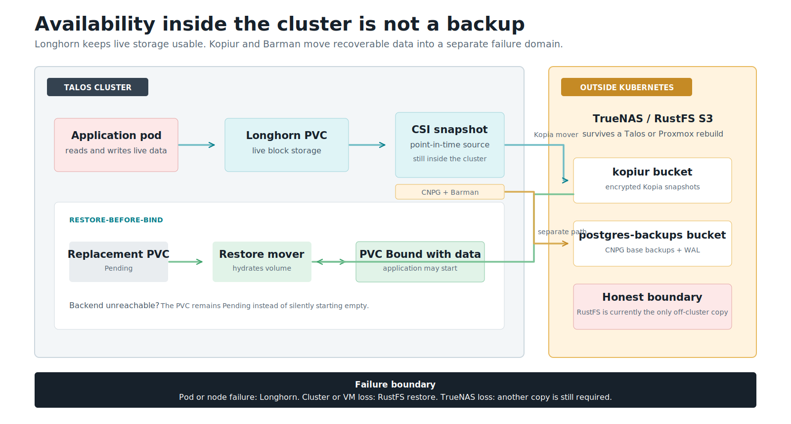

# Storage, Backup & Restore Architecture

The **operator's reference** for how application data survives anything in
this cluster — including the cluster itself ceasing to exist.



*Longhorn provides live availability inside Kubernetes; RustFS provides the
recoverable copy outside it. [Open the full-size storage diagram](assets/storage-failure-domains.svg).*

!!! abstract "Scope"
    Application PVCs (Longhorn → kopiur/Kopia → RustFS S3). **Out of scope:**
    CloudNativePG database backups (Barman → S3) — see
    [CNPG disaster recovery](domains/cnpg/disaster-recovery.md). Different
    tool, different runbook; the two systems never touch each other.

!!! info "Related pages"
    - **The story, from zero** — pitch, plain English, talk tracks, the
      adoption ladder, FAQ: [the easy guide](easy-guide.md).
    - **The mechanism** — CR shapes, component composition, flow diagrams,
      add-a-backup checklist:
      [kopiur backup architecture](domains/storage/kopiur-backup-architecture.md).
    - **The #1 gotcha** — why the mover runs as the data owner:
      [mover permissions](domains/storage/kopiur-mover-permissions.md).
    - **The backend** — S3 box, bucket, credentials, `ClusterRepository`:
      [backup repository setup](backup-repository-setup.md).
    - **Full-cluster rebuild** — [disaster recovery](disaster-recovery.md).
    - **This page** — the reference: what exists, the design decisions,
      day-2 operations, troubleshooting, portability, honest limitations.

---

## Contents

- [The bundle (quick start)](#the-bundle-quick-start) · [Why this exists](#why-this-exists-one-paragraph)
- [What happens when a PVC is created](#what-happens-when-a-pvc-is-created) · [If this, then that](#if-this-then-that)
- [Architecture at a glance](#architecture-at-a-glance) · [Design decisions](#design-decisions) · [The scenarios](#the-scenarios)
- [Schedules & repository](#backup-schedules-retention-repository)
- **Operations:** [enable](#enable-a-backup) · [exempt](#exempt-a-pvc-deliberate-non-backup) · [restore drill](#restore-drill-prove-it)
- [Troubleshooting](#troubleshooting) · [Adapting this to your cluster](#adapting-this-to-your-cluster) · [Known limitations](#known-limitations-and-non-goals)
- [Files reference](#files-reference)

---

## The bundle (quick start)

Backups are **per-PVC CRs** (`SnapshotPolicy` + `SnapshotSchedule` +
`Restore`), kept DRY by the shared Kustomize component
(`my-apps/common/kopiur-backup`) that injects every uniform field. Each PVC
needs a small **stub** plus three one-line edits:

```yaml
# namespace.yaml — opt the namespace in (creds fanout + repo tenancy)
metadata:
  labels:
    kopiur.home-operations.com/repo: cluster-kopia
  annotations:
    kopiur.home-operations.com/privileged-movers: "true"  # ONLY if the mover runs as root (uid 0)

# pvc.yaml — restore-before-bind pointer
apiVersion: v1
kind: PersistentVolumeClaim
metadata:
  name: storage
  namespace: my-app
  annotations:
    argocd.argoproj.io/compare-options: ServerSideDiff=false   # immutable dataSourceRef diff mask
    argocd.argoproj.io/sync-options: ServerSideApply=false
spec:
  accessModes: [ReadWriteOnce]
  storageClassName: longhorn            # snapshot-capable CSI required
  resources: { requests: { storage: 10Gi } }
  dataSourceRef:                        # ← the line that makes DR automatic
    apiGroup: kopiur.home-operations.com
    kind: Restore
    name: storage-restore

# kopiur/storage.yaml — the stub (varying bits ONLY; the component injects the rest):
#   SnapshotPolicy   { name, sources.pvc, identity{username,hostname}, retention, mover SC = DATA OWNER }
#   SnapshotSchedule { schedule.cron }
#   Restore          { source.fromPolicy, mover SC = DATA OWNER }

# kustomization.yaml
components: [ ../../common/kopiur-backup ]
resources:  [ kopiur/storage.yaml ]
```

Backups run on the stub's cron; delete the PVC (or the whole cluster) and it
comes back **with its data**.

!!! tip "The single non-obvious field"
    The **mover `securityContext`** must be the UID:GID that owns the data on
    disk — the component cannot set it because ownership varies per PVC. Full
    explanation: [mover permissions](domains/storage/kopiur-mover-permissions.md).
    Full annotated checklist:
    [kopiur backup architecture §5](domains/storage/kopiur-backup-architecture.md#5-to-add-a-backup-checklist).
    One-time backend prerequisite:
    [backup repository setup](backup-repository-setup.md).

---

## Why this exists (one paragraph)

Nuke the entire cluster, redeploy from Git, and every app comes back with its
data — no restore scripts, no snapshot IDs, no ordering choreography. Per-PVC
restore is the mechanism; **cluster rebuild is the use case.** Day-zero install
and day-N disaster recovery are the **same code path**; the only difference is
whether the repo has a snapshot for that PVC (`onMissingSnapshot: Continue`
binds fresh when there isn't one). Scheduled backup verification plus explicit
[restore canary](disaster-recovery.md#the-restore-canary) drills keep "restores
work" a measured fact between disasters. For the full narrative, read
[the easy guide](easy-guide.md).

---

## What happens when a PVC is created

The whole behavior, first install or rebuild or "oops", in one diagram:

```text
  PVC created from Git
    |
    +-- dataSourceRef -> Restore ?
        |
        +-- YES (-> <pvc>-restore)
        |     K8s withholds binding (PVC = Pending)
        |       -> kopiur Restore populator:
        |            - snapshot exists        -> mover restores latest
        |            |                           -> PVC Bound with prior data
        |            - no snapshot             -> binds empty, backs up forward
        |            |   (onMissingSnapshot:      (disposable)
        |            |    Continue)
        |            - backend unreachable     -> errors + retries, stays
        |                                         Pending -- never empty
        |
        +-- NO bundle
              Longhorn provisions empty
                -> intentional?
                     - backup-exempt / disposable -> fine, disposable
                     - no                          -> DR GAP: add the
                                                       kopiur bundle
```

!!! danger "The single most important rule in this whole system"
    A PVC with no `dataSourceRef → Restore` recreates **EMPTY**. The backup
    still exists in Kopia — but nothing tells Kubernetes to restore it. Git
    must carry the `dataSourceRef` (and the matching `Restore` CR) for a
    volume to be DR-complete. There is no operator-side ledger watching for
    this gap; CI hard-fails the *wired-but-broken* case (see
    [limitations](#known-limitations-and-non-goals)), and **Git review is the
    guardrail** for the no-bundle-at-all case.

---

## If this, then that

The whole behaviour as a flat lookup table:

| You do this | What happens |
|---|---|
| Add the namespace label + the kopiur stub + a `dataSourceRef → <pvc>-restore` | kopiur reconciles the `SnapshotPolicy`/`SnapshotSchedule`/`Restore`. Backups run on the stub's cron. |
| Recreate that PVC — same cluster or a brand-new one | The `Restore` populator restores it from the latest snapshot **before the app starts**. No human action. |
| Delete the app from Git, re-add it next month | Same as above. Your "oops" undoes itself. |
| Whole cluster gets nuked | Every PVC carrying a `dataSourceRef` auto-restores during bootstrap, in parallel. |
| Recreate a PVC that has **no snapshot yet** | `onMissingSnapshot: Continue` → binds empty and starts backing up forward. |
| RustFS/S3 is down when a PVC is recreated | The `Restore` populator errors and retries; the PVC holds `Pending`. **It never binds empty against a black-holed repo.** |
| Label a PVC `backup-exempt: "true"` + a fully-qualified reason annotation | You deliberately ship no kopiur bundle. It recreates empty, **by recorded decision**. |
| Use the bare `backup-exempt-reason` key instead of the fully-qualified one | The bare key records nothing and nothing at runtime enforces it. CI (`validate-kopiur-coverage.py`) **warns** on it. Always use the fully-qualified `storage.vanillax.dev/backup-exempt-reason`. |
| Add the kopiur label/stub to a system namespace (`kube-system`, `argocd`, `longhorn-system`, `kopiur-system`) | Don't. System namespaces are not opted in. |
| Add a kopiur bundle to a CNPG database PVC | Don't. Postgres needs SQL-aware backups (Barman → S3), not filesystem snapshots. [Separate system, separate runbook](domains/cnpg/disaster-recovery.md). |
| Mover fails with `PermissionDenied` | Its `securityContext` UID isn't the data owner. Fix the stub's `mover` UID:GID — [mover permissions](domains/storage/kopiur-mover-permissions.md). |

---

## Architecture at a glance

```text
  Secrets (infrastructure/controllers/kopiur)
    1Password vault -> ClusterSecretStore -> ClusterExternalSecret
                                             (kopiur-rustfs -> every
                                              labeled namespace)
                                                    |
                                                    v
  kopiur-config (Wave 3)                       mover Jobs (as the data owner)
    ClusterRepository cluster-kopia                 |  ^
       |                                            |  | (creds)
       v                                            v  |
  kopiur operator (Wave 2)  --launches-->  ---------+  |
    reconciles SnapshotPolicy /                     |  |
    SnapshotSchedule / Restore /                    |  |
    Snapshot CRs                                     |  |
       |                                             |  |
       | takes                                       |  +-- Longhorn (V1 engine)
       v                                             |         RWO volumes +
  CSI VolumeSnapshot -> VolumeSnapshotClass          |         CSI snapshots
                        longhorn-snapclass           |
                        (Wave 3)                      v
                                          RustFS S3 (192.168.10.133:30292)
                                            bucket: kopiur
                                            snapshots keyed by identity
```

### Who provides what

| Piece | Scope | Role |
|---|---|---|
| `ClusterRepository cluster-kopia` | cluster | the Kopia repo definition → RustFS `s3://kopiur` (dedicated bucket). `allowedNamespaces` selector grants any namespace labeled `kopiur.home-operations.com/repo=cluster-kopia`. |
| `ClusterExternalSecret kopiur-rustfs` | cluster | fans the repo creds (`AWS_ACCESS_KEY_ID`/`AWS_SECRET_ACCESS_KEY`/`KOPIA_PASSWORD`) into every labeled namespace, so the in-namespace mover can reach the repo. |
| `VolumeSnapshotClass longhorn-snapclass` | cluster | how CSI snapshots are taken (Longhorn); `copyMethod: Snapshot` references it. Lives in `infrastructure/controllers/kopiur/`. |
| kopiur operator | cluster | reconciles the per-PVC CRs; launches Snapshot + Restore mover Jobs. |
| `common/kopiur-backup` component | shared | injects the uniform fields by `kind` (repository, copyMethod, snapclass, schedule defaults, populator + `onMissingSnapshot: Continue`). |
| per-PVC stub | per-PVC | the varying bits: name, identity, retention, cron, and the **mover UID:GID** (= data owner). |
| namespace label | per-app | one label turns on both the creds fanout and repo tenancy. |
| PVC `dataSourceRef` | per-PVC | wires restore-before-bind to the `Restore` CR. |

## Design decisions

**No fail-closed PVC admission webhook.** kopiur's webhook is scoped to its
**own CRDs only**, never PVCs or Pods, so an operator outage cannot block app
deployment. A missing `dataSourceRef` is caught by CI + Git review, not
blocked at create time. Do not add a validating/mutating webhook on PVC create
with `failurePolicy: Fail` — a webhook deadlock is a platform-wide single point
of failure.

**Never bind empty over a black-holed backend.** kopiur gives this **for
free**: the `Restore` populator raises a backend error *before* the "no
snapshot → empty" decision, so an outage holds the PVC `Pending` instead of
binding empty (source-verified: `crates/controller/src/restore/mod.rs`
`resolve_snapshot` — see
[kopiur backup architecture §4](domains/storage/kopiur-backup-architecture.md#4-restore-before-bind-flow-the-dr-magic)).

**ArgoCD is in the loop, on purpose.** Two things depend on the GitOps engine:
(1) *something must recreate the PVC from Git* — on a rebuild ArgoCD is the
thing doing the creating, for every app, in parallel; and (2) *sync waves make
the rebuild deterministic* — the backup machinery (Longhorn W1 → kopiur
operator W2 → repo config W3) exists **before** the first protected PVC does
(W4–6). Without wave ordering you get retry soup: populators waiting on CRs
that don't exist, movers failing on creds that haven't fanned out. Wave table
and gating mechanics: [entrypoints](domains/argocd/entrypoints.md) ·
[how Argo waits](easy-guide.md#part-2-how-argo-waits-sync-waves).

---

## The scenarios

1. **Fresh cluster, brand new app.** No snapshot in the repo →
   `onMissingSnapshot: Continue` binds the PVC empty → backups begin on
   schedule.
2. **Disaster recovery — cluster nuked, repo preserved.** Same Git, new
   cluster. Every protected PVC carries its `dataSourceRef`; the populator
   restores each one from its latest snapshot before its app starts, in
   parallel, unattended.
3. **Oops, I deleted the app.** Re-add it to Git → identical to scenario 2.
   The mistake fixes itself.
4. **New app added to an existing cluster.** Same as scenario 1 — day-zero
   and day-N are the same code path.
5. **Backup backend down at recreate time.** The `Restore` populator errors
   and retries; the PVC holds `Pending`. Apps already running keep running;
   nothing binds empty. When RustFS returns, the populator completes.

**Worked example:** the complete open-webui config (all four pieces, real
production YAML, tabbed) lives in
[the easy guide, Part 4](easy-guide.md#part-4-kopiur-the-backup-operator);
copyable reference apps are listed in
[files reference](#files-reference). Verify any backed-up app any time:

```bash
kubectl -n <ns> get snapshotpolicy,snapshotschedule,restore,snapshot,pvc
kubectl -n <ns> get secret kopiur-rustfs    # fanned out by the ClusterExternalSecret
```

Expect the three CRs present, recent `Snapshot` objects `Succeeded` with
non-zero files, and the PVC `Bound`.

---

## Backup schedules, retention, repository

There is **no tier abstraction**. Each stub carries its own
`SnapshotSchedule.spec.schedule.cron` and its own
`SnapshotPolicy.spec.retention` (`keepHourly`/`keepDaily`/`keepWeekly`/
`keepMonthly` as needed). Pick a distinct cron minute per PVC to avoid a
backup stampede on the same node.

| Field | Where | Example |
|---|---|---|
| cadence | stub `SnapshotSchedule.spec.schedule.cron` | `"5 3 * * *"` (daily 03:05), `"10 * * * *"` (hourly :10) |
| retention | stub `SnapshotPolicy.spec.retention` | `{ keepDaily: 14, keepWeekly: 6, keepMonthly: 3 }` |
| concurrency | component → `concurrencyPolicy: Forbid` | no overlapping snapshot Jobs |

**One shared Kopia repository for the whole cluster** (`ClusterRepository
cluster-kopia` → RustFS `s3://kopiur`), snapshots keyed by each policy's
**identity** (`hostname`/`username`). Kopia's content-defined chunking means:
recreate an app and the next backup finds every chunk already present
(near-instant, near-zero new storage); common files across apps are stored
once; storage grows with unique data, not PVC count.

The repo lives **off-cluster** on RustFS (S3) — the one piece of state that
must outlive any cluster. It's a **dedicated `kopiur` bucket**, isolated from
the CNPG/Barman database backups (a different bucket, a different pipeline).

---

## Operations

### Enable a backup

Five steps, all in Git (full annotated checklist in
[kopiur backup architecture §5](domains/storage/kopiur-backup-architecture.md#5-to-add-a-backup-checklist),
or the [`/project:add-backup`](https://github.com/mitchross/talos-argocd-proxmox/blob/main/.claude/commands/add-backup.md) command):

1. **Find the data owner:** `kubectl -n <ns> exec <pod> -- stat -c '%u:%g' <data-mountpath>`.
2. **Namespace:** add label `kopiur.home-operations.com/repo: cluster-kopia`
   (plus the `privileged-movers` annotation only if the owner is `0`).
3. **Stub:** add `kopiur/<pvc>.yaml` (`SnapshotPolicy` + `SnapshotSchedule` +
   `Restore`) with the mover `securityContext` set to that UID:GID and a
   distinct cron minute.
4. **PVC:** add `dataSourceRef → Restore/<pvc>-restore` + the two `ServerSide*`
   annotations (the immutable-`dataSourceRef` diff mask). On an already-Bound
   PVC expect the harmless `Forbidden` ComparisonError (see
   [Troubleshooting](#common-failure-modes)) — backups start now, the
   `dataSourceRef` arms on next recreate.
5. **Kustomization:** add the stub to `resources:` and
   `../../common/kopiur-backup` to `components:`.

Then commit, sync, and verify:

```bash
kubectl -n <ns> get snapshotpolicy,snapshotschedule,restore,snapshot,secret
```

Copy from a canonical example: `my-apps/ai/open-webui/` (simple, single-UID
`568`), `my-apps/home/project-nomad/mysql/` (daemon-drop `999:568`), or
`my-apps/home/home-assistant/kopiur/` (root-owned, uid `0` + the
`privileged-movers` annotation). Helm-rendered PVCs get the `dataSourceRef`
injected via Kustomize `patches:`.

### Exempt a PVC (deliberate non-backup)

An exempt PVC ships **no kopiur bundle** at all — it is simply not protected,
on purpose, with a written reason:

```yaml
metadata:
  labels:
    backup-exempt: "true"
  annotations:
    storage.vanillax.dev/backup-exempt-reason: "<why>"
```

- The reason key **must be fully qualified** — the bare `backup-exempt-reason`
  records nothing, and there is **no runtime admission gate**. CI
  (`validate-kopiur-coverage.py`) **warns** on missing/unqualified reason keys;
  it does not block.
- An exempt PVC has no `Restore` CR, so **do not add a `dataSourceRef`** — a
  dangling one deadlocks the recreated PVC `Pending` forever.
- An exempt PVC recreates **empty** after DR. That is the contract — write the
  reason like you're explaining it to yourself during an outage.

**Back up:** user content, non-CNPG databases, hard-to-recreate config.
**Exempt:** caches, brokers, externally-synced data, disposable analytics
(PostHog and Redis are exempt here; CNPG uses native Barman/S3).
**Never put a kopiur bundle on:** CNPG database PVCs — Barman owns those.

### Restore drill (prove it)

A backup that has never been restored is a hypothesis, not a recovery plan.

```text
  confirm a Snapshot exists (non-zero files)
    -> scale app to 0
    -> delete the PVC
    -> Git recreates it (dataSourceRef -> Restore)
    -> PVC holds Pending while the populator restores
    -> binds WITH data; app starts
    -> verify a sentinel byte-identical
```

!!! warning
    Before deleting, **wait until ArgoCD's synced revision contains the
    `dataSourceRef`** — deleting against a stale render recreates the PVC empty.

This drill runs on demand against a dedicated test PVC — the
[restore canary](disaster-recovery.md#the-restore-canary)
(`my-apps/system/restore-canary/`). Its backup and quick-verification schedules
run continuously; the destructive restore remains deliberate.

---

## Troubleshooting

### The debugging questions, in order

1. **Is the namespace opted in?** Label `kopiur.home-operations.com/repo=cluster-kopia` present?
2. **Did the creds fan out?** `kubectl -n <ns> get secret kopiur-rustfs`.
3. **Do the CRs exist?** `SnapshotPolicy`, `SnapshotSchedule`, and `Restore` all present and reconciled?
4. **Does the PVC carry `dataSourceRef → <pvc>-restore`?** (No = recreates empty.)
5. **Did the last `Snapshot` complete** with non-zero files?

### Common failure modes

| Symptom | Cause / fix |
|---|---|
| Mover fails `PermissionDenied` / "unable to open file … permission denied" | The mover `securityContext` UID isn't the data owner. `stat -c '%u:%g'` the data, set the stub's `mover` UID:GID to match. [Mover permissions](domains/storage/kopiur-mover-permissions.md). |
| Mover for a root-owned volume blocked (`MoverPermitted=False`) | Namespace missing `kopiur.home-operations.com/privileged-movers: "true"`. |
| PVC recreates **empty** | no `dataSourceRef → Restore` in Git → add the bundle (or mark exempt deliberately). |
| New PVC `Pending` forever, no progress | `dataSourceRef` points at a `Restore` that doesn't exist (or a wrong name). Add the `Restore` CR / fix the name. |
| New PVC `Pending`, populator erroring | backend unreachable — RustFS down, wrong endpoint/creds, or the workload key lacks read/write on the `kopiur` bucket. This is the safe state (never binds empty); fix the backend. |
| `PVC is invalid: Forbidden` ComparisonError | `dataSourceRef` added to a **Bound** PVC (immutable) — harmless; applies on next recreate. The `ServerSide*` annotations + AppSet `ignoreDifferences` mask the live diff. |
| Mover stuck `Init`/`Pending`, "volume hasn't been attached" with an old VolumeAttachment | stale CSI state — delete the mover pod; its Job retries with a fresh attach. |
| Pod crashloops on `read-only file system` after a storage disruption | the volume must FULLY detach to drop the stale mount: scale to 0 → wait for Longhorn volume `detached` → scale up (CNPG: `cnpg.io/hibernation=on` → wait → `off`). |
| Restored volume `degraded` briefly | Longhorn rebuilding its second replica — wait, don't touch. |

### Quick health commands

```bash
kubectl -n kopiur-system get pods,clusterrepository      # the operator + repo
kubectl get snapshotpolicy,snapshotschedule,restore -A   # all per-PVC wiring
kubectl get snapshot -A                                  # backup runs
kubectl -n <ns> get secret kopiur-rustfs                 # creds fanned out?
```

---

## Adapting this to your cluster

*(For the gradual version — "try kopiur without adopting this whole stack" —
see the [adoption ladder](easy-guide.md#part-8-i-just-want-to-try-kopiur-the-adoption-ladder).)*

**You need:**

1. **A CSI with VolumeSnapshot support** (`kubectl get volumesnapshotclass`
   must return something). Longhorn here; Rook/Ceph, OpenEBS, TopoLVM all
   work. local-path-provisioner does not.
2. **[kopiur](https://github.com/home-operations/kopiur)** — the Kopia-native
   operator (the `Restore` populator is the load-bearing piece for
   restore-before-bind).
3. **An S3 (or filesystem) target for Kopia** that lives outside the cluster,
   and a way to deliver its password as a Secret (ESO + anything,
   sealed-secrets, or a plain Secret). The one-time backend setup is in
   [backup-repository-setup.md](backup-repository-setup.md).
4. A GitOps engine helps (the restore-on-recreate flow leans on "Git recreates
   the PVC"), but `kubectl apply` works too.
5. Optionally, a thin DRY layer over the per-PVC CRs — here, the
   `my-apps/common/kopiur-backup` Kustomize component (the Flux analog is a
   reusable `components/` bundle).

**Swappable:** everything else. Talos→any k8s, Cilium→any CNI, ArgoCD→Flux,
Longhorn→any snapshot CSI, RustFS→MinIO/TrueNAS/B2, 1Password→any secret
backend.

---

## Known limitations and non-goals

This is a working homelab system, not a hardened product.

**Trust model.** Single-operator homelab. Threat model is "I might fat-finger a
delete," not "an attacker is in my cluster." One shared Kopia password = full
blast radius if leaked; acceptable because backups never leave the LAN.

**3-2-1 compliance: no.** RustFS is the only copy. A box-level disaster (fire,
ransomware on the NAS) loses the backups. Add a second destination (rclone to
B2, ZFS replication) if you need real off-site coverage.

**No coverage ledger.** kopiur reports on its *own* resources, not the negative
space. There is no map of "which PVCs lack a bundle" and no `needs-human-review`
parking. The automated gate is the `validate-kopiur-coverage.py` CI check (run
on the rendered manifest stream): it **hard-fails** a PR where a backed-up PVC
is missing its `dataSourceRef` or a backed-up namespace lacks the repo label,
and **warns** on uncovered+unexempt PVCs, missing mover securityContexts, and
unqualified exempt reasons. A PVC with *no bundle at all* is therefore only a
warning — Git review and the worked examples remain the guardrail for the
negative space.

**Pre-1.0 engine.** kopiur is pre-1.0 (`0.5.x` since 2026-07-04); CRD fields
can churn. Pin the chart version and re-check `kubectl explain` after upgrades.
The 0.5.0 breaking changes (copyMethod default flip, `verification.quick`
reshape, metrics rename) were assessed 2026-07-04 — none affected this repo;
see the note beside the pin in `infrastructure/controllers/kopiur-operator/kustomization.yaml`.

**RPO is the schedule cadence.** Hourly at best. Anything needing tighter RPO
or application-consistent quiescing (databases!) uses native tooling — CNPG
does here.

**Restore proof is continuous but narrow.** The
[restore canary](disaster-recovery.md#the-restore-canary) re-proves the
delete→recreate→populate→byte-verify loop on a dedicated PVC; it does not prove
app-level semantics (a SQLite file can restore byte-perfect and still be
mid-transaction garbage — which is why databases don't use this path).

---

## Files reference

| Concern | Path |
|---|---|
| kopiur operator (Helm chart Application) | `infrastructure/controllers/argocd/apps/core-dependencies/kopiur-operator-app.yaml` → `infrastructure/controllers/kopiur-operator/` |
| kopiur config (ClusterRepository, creds ClusterES, snapclass) | `infrastructure/controllers/kopiur/` + `…/core-dependencies/kopiur-config-app.yaml` |
| Shared backup component (uniform fields) | `my-apps/common/kopiur-backup/` |
| Longhorn + rebuild throttle | `infrastructure/storage/longhorn/` (`node-failure-settings.yaml`) |
| App PVCs + per-PVC stubs | `my-apps/<category>/<app>/pvc.yaml` + `…/kopiur/<pvc>.yaml` |
| Simple example (single UID 568) | `my-apps/ai/open-webui/` |
| Daemon-drop example (uid 999:568) | `my-apps/home/project-nomad/mysql/` |
| Root-owned example (uid 0) | `my-apps/home/home-assistant/kopiur/` |
| Restore canary | `my-apps/system/restore-canary/` |
| CNPG databases (separate system) | `infrastructure/database/cloudnative-pg/` |
| Operator source | [`home-operations/kopiur`](https://github.com/home-operations/kopiur) |
| Mechanism docs | [`kopiur backup architecture`](domains/storage/kopiur-backup-architecture.md) · [`mover permissions`](domains/storage/kopiur-mover-permissions.md) · [`evaluation`](domains/storage/kopiur-evaluation.md) · [`trial`](kopiur-trial.md) |
