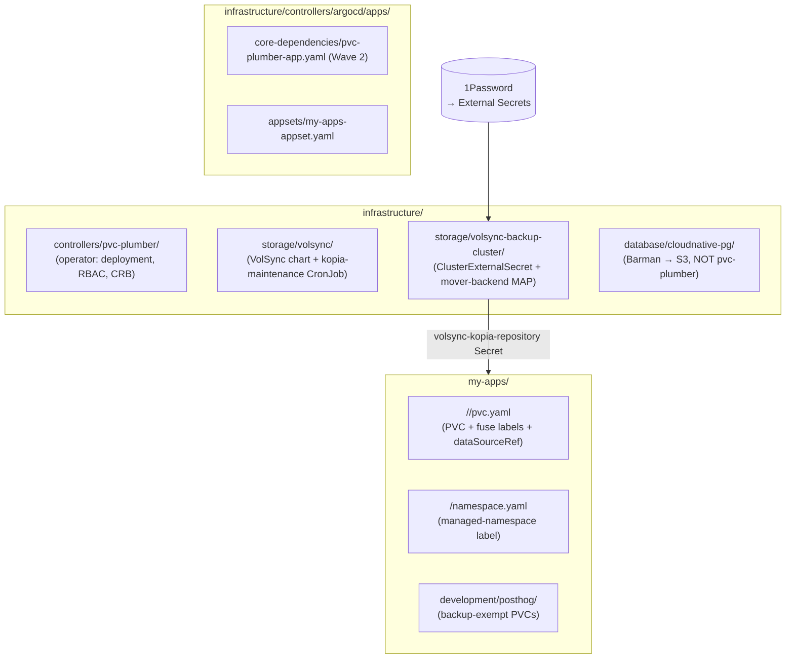
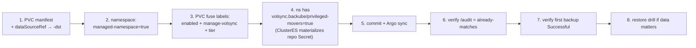
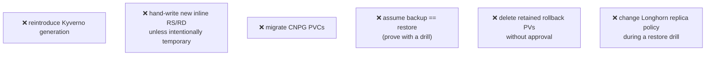

# How this repo uses pvc-plumber 🧩

> **Audience:** someone working in `talos-argocd-proxmox` who needs to add, classify, or debug a
> backed-up PVC. Start with [pvc-plumber-start-here.md](pvc-plumber-start-here.md) for the concepts.

---

## 🗂️ Repository map (where everything lives)



| Thing | Path |
|---|---|
| **pvc-plumber operator** | `infrastructure/controllers/pvc-plumber/` (Deployment, `rbac-volsync-writer.yaml` = the cluster-wide CRB) |
| **VolSync + Kopia maintenance** | `infrastructure/storage/volsync/` |
| **Shared repo Secret + mover gate** | `infrastructure/storage/volsync-backup-cluster/` (`ClusterExternalSecret`, mover-backend MAP) |
| **App PVCs** | `my-apps/<category>/<app>/pvc.yaml` |
| **Argo entrypoint** | `infrastructure/controllers/argocd/apps/core-dependencies/pvc-plumber-app.yaml` (Wave 2) |
| **CNPG databases** | `infrastructure/database/cloudnative-pg/` (Barman → S3 — never pvc-plumber) |
| **PostHog exemption** | `my-apps/development/posthog/` (`backup-exempt` PVCs) |
| **Docs** | `docs/` |

---

## ✅ How to add a new protected PVC (checklist)



1. **PVC manifest** — `storageClassName: longhorn`, `argocd.argoproj.io/compare-options: ServerSideDiff=false`, and **`dataSourceRef → ReplicationDestination/<pvc>-dst`** *if you want restore-on-recreate* (you almost always do).
2. **Namespace** — add `pvc-plumber.io/managed-namespace: "true"` **and** `volsync.backube/privileged-movers: "true"`.
3. **PVC fuse labels** — `pvc-plumber.io/enabled: "true"`, `pvc-plumber.io/manage-volsync: "true"`, `pvc-plumber.io/tier: hourly|daily`.
4. **Repo Secret** — the `volsync.backube/privileged-movers` label makes `ClusterExternalSecret/volsync-kopia-repository` materialize `volsync-kopia-repository` in the namespace. Verify it exists.
5. **Commit + sync.**
6. **Verify** `/audit` shows `already-matches` / `managed-by-pvc-plumber` / `stale=false`.
7. **Verify** the first operator backup is `Successful` (or `nextSyncTime` is set).
8. **Restore drill** if the data matters — see [volsync-storage-recovery.md](volsync-storage-recovery.md).

> Canonical example to copy: `my-apps/ai/open-webui/pvc.yaml`. Helm-chart PVCs inject the dsr/labels via
> Kustomize `patches:` (see `my-apps/development/gitea/`).

---

## 🧮 How to classify a PVC

```mermaid
flowchart TD
    P[New PVC] --> Q1{CNPG database\nvolume?}
    Q1 -->|yes| CNPG[[Barman → S3\nNEVER pvc-plumber]]
    Q1 -->|no| Q2{PostHog /\ndisposable?}
    Q2 -->|yes| EX[[backup-exempt]]
    Q2 -->|no| Q3{Redis / cache /\nbroker?}
    Q3 -->|yes| DEC[[backup-exempt\n(disposable)]]
    Q3 -->|no| Q4{NFS / static\nexternal media?}
    Q4 -->|yes| EXT[[usually exempt /\nbacked separately]]
    Q4 -->|no| Q5{Regenerable cache\nthat's fine empty?}
    Q5 -->|yes| EBD[[EMPTY_BY_DESIGN possible]]
    Q5 -->|no| NORM[[normal app PVC →\npvc-plumber managed]]
```

| PVC kind | Decision |
|---|---|
| Normal app data (config, docs, uploads, SQLite) | **pvc-plumber managed** + dsr |
| CNPG database PVC | **Barman → S3** — never pvc-plumber |
| PostHog (clickhouse/postgres/redis/kafka) | **backup-exempt** (disposable/rebuildable) |
| Redis / cache / broker | **backup-exempt** — Redis is disposable |
| NFS / static media (immich originals, tubesync media) | usually **exempt** or backed separately |
| Pure regenerable cache | **EMPTY_BY_DESIGN** acceptable (no dsr) |

---

## 🏷️ What the labels/annotations mean

| Key | On | Meaning |
|---|---|---|
| `pvc-plumber.io/managed-namespace: "true"` | namespace | software write-gate — operator may write RS/RD here |
| `pvc-plumber.io/enabled: "true"` | PVC | PVC opts in |
| `pvc-plumber.io/manage-volsync: "true"` | PVC | operator manages this PVC's VolSync objects |
| `pvc-plumber.io/tier: hourly\|daily` | PVC | backup cadence |
| `volsync.backube/privileged-movers: "true"` | namespace | ClusterES materializes the repo Secret here |
| `restore-policy: strict\|best-effort` | PVC | restore strictness convention |
| `backup-exempt: "true"` | PVC | deliberately not backed up |
| `storage.vanillax.dev/backup-exempt-reason: "<why>"` | PVC | **FQ key required** (bare key is silently ignored + CI-enforced) |

---

## ⛔ What NOT to do



- **No Kyverno** — it was removed 2026-05; the operator's reconciler does that job now.
- **No new inline RS/RD** unless it's a deliberate, temporary bridge (the operator pattern is the default).
- **Never migrate CNPG PVCs** — Barman owns them.
- **Backup ≠ restore** — a backup you've never restored is a hypothesis. Run a drill for anything important.
- **Don't delete the 7 retained rollback PVs** without per-PV approval.
- **Don't change Longhorn replicas/StorageClass mid-drill** — restore volumes come up `degraded` while rebuilding; that's expected.
