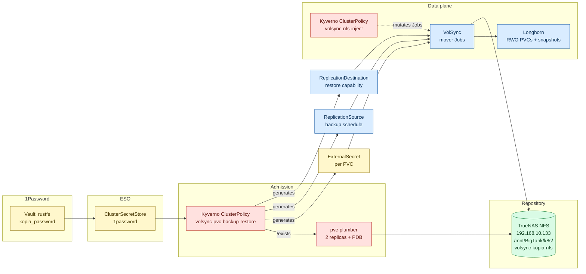
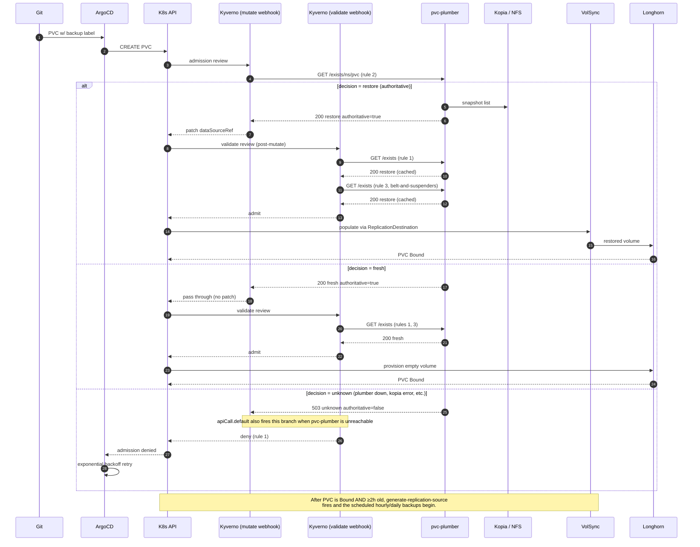
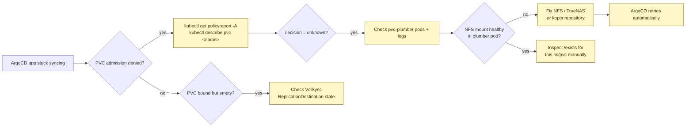

# VolSync Storage & Recovery

The single source of truth for **PVC backup and restore** in this cluster.

> **Scope:** application PVCs (Longhorn → Kopia → NFS).
> **Out of scope:** CloudNativePG database backups (Barman → S3).
> See [`cnpg-disaster-recovery.md`](cnpg-disaster-recovery.md) — different tool,
> different storage, different runbook. The two systems never touch each other.

> **How to read this doc:** it gets more technical as you scroll. The first
> couple of sections are plain English suitable for a whiteboard explanation.
> The middle has the architecture diagrams and the admission flow. The bottom
> is operations, troubleshooting, and the file index. Stop reading wherever
> the depth matches what you came for.

---

## In plain English

We have a homelab Kubernetes cluster. Apps store their state in PVCs
(persistent disks). Disks fail, clusters get rebuilt, mistakes get made — so
every PVC needs a backup somewhere safe, and on rebuild the PVC needs to come
back with its data already in it.

We solved that with **one label** on the PVC. The system does the rest.

- Add `backup: "hourly"` or `backup: "daily"` to a PVC.
- A backup runs on schedule, encrypted, deduplicated, stored on a NAS.
- If you ever delete the PVC and recreate it (anywhere — same cluster, new
  cluster, doesn't matter), it comes back **already populated** from the most
  recent backup. No manual restore step.
- If anything is wrong with the backup system at the moment you try to create
  a PVC, **Kubernetes refuses to create the PVC at all** rather than risk
  giving you an empty one. ArgoCD keeps retrying until it works.

That last bullet is the whole reason this is more than just "schedule a
backup job." Empty PVCs over real backup data is the catastrophe we will
never accept.

The pieces in plain English:

- **Longhorn** — gives PVCs that can be snapshotted.
- **VolSync** — schedules backup/restore jobs that run a tool called Kopia.
- **Kopia** — encrypts, dedupes, and writes to NFS on TrueNAS.
- **pvc-plumber** — a tiny HTTP service we wrote that answers one question:
  *"is there an existing backup for `<namespace>/<pvc>` in the Kopia repo?"*
- **Kyverno** — Kubernetes admission policies. Every PVC create with a
  `backup` label is intercepted; Kyverno calls pvc-plumber, then either:
  decorates the PVC so it auto-restores from backup, lets it through as a
  fresh empty PVC, or **denies it** if the answer is unknown.
- **1Password + External Secrets Operator** — supplies the Kopia encryption
  password to anything that needs it.

If that's all you wanted, you can stop here.

---

## If this, then that

The whole behaviour, as a flat lookup table:

| You do this | What happens |
|---|---|
| Add `backup: "hourly"` to a PVC, no backup exists yet | Kyverno creates an ExternalSecret + ReplicationSource + ReplicationDestination. Empty PVC binds. After PVC has been Bound for ≥ 2 h, scheduled backups begin. |
| Add `backup: "hourly"` to a PVC, **backup already exists** in Kopia | Kyverno injects `dataSourceRef` on the PVC. VolSync populates it from the Kopia snapshot. PVC binds **with your prior data**. Backups continue on schedule. |
| Add `backup: "daily"` instead of `"hourly"` | Same as above, but schedule is `<minute> 2 * * *` (daily at 2 a.m.) instead of hourly. Retention is identical. |
| Remove the `backup` label from a PVC | Backups stop. Existing snapshots on NFS are kept. Within 15 min the orphan-reaper deletes the helper resources. Re-adding the label later resumes backups *and* makes the preserved snapshots auto-restore on next PVC recreate. |
| Delete the app from Git, re-add it later | New PVC is created → pvc-plumber finds the old snapshot → PVC auto-restores. Your "oops" undoes itself. |
| Whole cluster gets nuked, you rebuild it | Same Git repo, same NFS, every backup-labeled PVC auto-restores on first create. No manual restore commands. |
| pvc-plumber is unreachable when an app tries to create a backup-labeled PVC | Kubernetes **denies** the PVC. ArgoCD retries with exponential backoff until pvc-plumber recovers. Apps without backup labels deploy normally. |
| You really want to start fresh on a labeled PVC, even though a backup exists | Annotate the PVC `volsync.backup/skip-restore: "true"` *and* `volsync.backup/skip-restore-reason: "<why>"`. Kyverno bypasses the restore but still sets up backups going forward. A 24 h Prometheus alert fires until you remove the annotation. |
| Someone forgets the reason annotation | PVC creation is denied. The reason is mandatory specifically because a stale `skip-restore=true` in Git would silently disable restore forever. |
| You add a backup label to a PVC in `kube-system`, `volsync-system`, or `kyverno` | The policies skip those namespaces by design. No backup, no restore. |
| You add a backup label to a CNPG database PVC | Don't. Postgres needs SQL-aware backups (Barman → S3), not filesystem snapshots. CNPG manages its own PVCs and uses a [completely separate runbook](cnpg-disaster-recovery.md). |

The rest of this document is *how* this works.

---

## TL;DR — the magic label

```yaml
apiVersion: v1
kind: PersistentVolumeClaim
metadata:
  name: app-data
  namespace: my-app
  labels:
    backup: "hourly"          # or "daily"
spec:
  accessModes: [ReadWriteOnce]
  storageClassName: longhorn  # required — VolumeSnapshot capable
  resources:
    requests:
      storage: 10Gi
```

---

## Contents

- [Architecture at a glance](#architecture-at-a-glance)
- [Sync-wave timeline (bare metal → automatic DR)](#sync-wave-timeline)
- [Admission flow (the decision diagram)](#admission-flow)
- [Decision table](#decision-table)
- [The five scenarios](#the-five-scenarios)
- [Components](#components)
- [Backup schedules & retention](#backup-schedules--retention)
- [Operations](#operations)
  - [Enable backup](#enable-backup)
  - [Disable backup](#disable-backup)
  - [Skip restore (escape hatch)](#skip-restore-escape-hatch)
  - [Manual restore](#manual-restore)
- [NFS repository layout & deduplication](#nfs-repository-layout--deduplication)
- [Troubleshooting](#troubleshooting)
- [Why two backup systems (PVCs vs databases)](#why-two-backup-systems-pvcs-vs-databases)
- [Files reference](#files-reference)

---

## Architecture at a glance



Two independent ClusterPolicies do the work:

| Policy | What it does |
|---|---|
| `volsync-pvc-backup-restore` | Admission gate (3 validate + 1 mutate rule) and 3 generate rules. Decides restore vs fresh, denies on unknown, generates the per-PVC ExternalSecret + ReplicationSource + ReplicationDestination. |
| `volsync-nfs-inject` | Mutates every VolSync mover `Job` to add the NFS volume + `/repository` mount. Apps don't carry NFS config — Kyverno injects it. |

---

## Sync-wave timeline

ASCII because the wave order is more legible as a stack than as a Mermaid box-and-arrow:

```
┌──────────────────────────────────────────────────────────────────────────────┐
│  Bootstrap (manual, once)                                                    │
│    Talos OS  →  Cilium CNI  →  ArgoCD  →  root.yaml                          │
│  After this: GitOps loop runs, every wave below is automatic.                │
└──────────────────────────────────────────────────────────────────────────────┘
                                     │
                                     ▼
┌──────────────────────────────────────────────────────────────────────────────┐
│  Wave 0 — Foundation                                                         │
│    1Password Connect • External Secrets Operator • AppProjects               │
└──────────────────────────────────────────────────────────────────────────────┘
                                     │
                                     ▼
┌──────────────────────────────────────────────────────────────────────────────┐
│  Wave 1 — Storage                                                            │
│    Longhorn (block storage) • Snapshot Controller • VolSync (operator only)  │
└──────────────────────────────────────────────────────────────────────────────┘
                                     │
                                     ▼
┌──────────────────────────────────────────────────────────────────────────────┐
│  Wave 2 — pvc-plumber  ← FAIL-CLOSED gate must be Ready before Kyverno       │
│    2 replicas, PDB minAvailable=1, NFS-mounted /repository                   │
│    HTTP API: GET /exists/{ns}/{pvc}, /healthz, /readyz                       │
└──────────────────────────────────────────────────────────────────────────────┘
                                     │
                                     ▼
┌──────────────────────────────────────────────────────────────────────────────┐
│  Wave 3 — Kyverno (standalone Application, NOT in an AppSet)                 │
│    Standalone so webhooks register before any app PVCs hit the API server.   │
│    AppSets report "healthy" the instant they create their child Apps, which  │
│    is too early — child PVCs would race the webhook registration.            │
└──────────────────────────────────────────────────────────────────────────────┘
                                     │
                                     ▼
┌──────────────────────────────────────────────────────────────────────────────┐
│  Wave 4 — Infrastructure AppSet  +  Kyverno policies                         │
│    cert-manager, external-dns, gateway, CNPG operator, GPU operator, etc.    │
│    volsync-pvc-backup-restore + volsync-nfs-inject ClusterPolicies           │
└──────────────────────────────────────────────────────────────────────────────┘
                                     │
                                     ▼
┌──────────────────────────────────────────────────────────────────────────────┐
│  Wave 5 — Monitoring AppSet  •  Wave 6 — My-Apps AppSet                      │
│    PVCs with `backup: hourly|daily` start being created here.                │
│    Every CREATE goes through the admission flow below.                       │
└──────────────────────────────────────────────────────────────────────────────┘
```

**Why pvc-plumber lives at Wave 2, before Kyverno at Wave 3:** Kyverno's
admission rules call `pvc-plumber/exists` synchronously. If pvc-plumber isn't
Ready when Kyverno's policies activate, the apiCall returns the configured
default (`decision=unknown`), Kyverno denies the PVC, ArgoCD retries — the
fail-closed gate. Wave 2 → Wave 3 ordering means that on a fresh boot
pvc-plumber is up _before_ the policies that depend on it, so app PVCs in
Waves 4–6 hit a working oracle on first try.

---

## Admission flow

What happens when the Kubernetes API server sees `kubectl apply` on a
backup-labeled PVC. The Kyverno policy issues **three independent `/exists`
calls** per admission (mutate webhook + 2 validate webhook rules) — pvc-plumber's
in-memory catalog (5 min TTL, 90 s re-warm) keeps them consistent in practice,
and the v1.7+ singleflight wrapper dedupes concurrent identical lookups.



The "validate post-mutation" rule (rule 3) closes a real race: the mutate
call could return `unknown` under transient flakiness while a parallel
validate call returns `restore` — without rule 3, the PVC would be admitted
without `dataSourceRef` and Longhorn would silently provision an empty
volume on top of restorable backup data. Rule 3 explicitly denies admission
when `/exists` says `restore` but the admitted object's `dataSourceRef`
doesn't point at `<pvc>-backup`/`ReplicationDestination`/`volsync.backube`.

---

## Decision table

| pvc-plumber response | Kyverno action | Outcome |
|---|---|---|
| `200 decision=restore authoritative=true exists=true` | Mutate `dataSourceRef` → `<pvc>-backup`; admit | VolSync restore, PVC bound with prior data |
| `200 decision=fresh authoritative=true exists=false` | Admit unchanged | Empty PVC, app starts fresh |
| `503 decision=unknown authoritative=false` | Deny (rule 1) | ArgoCD retries with backoff |
| HTTP failure / timeout / unreachable | Deny via `apiCall.default` | ArgoCD retries with backoff |
| `200 decision=restore` but post-mutate PVC is missing `dataSourceRef` | Deny (rule 3) | ArgoCD retries; investigate plumber logs |
| `volsync.backup/skip-restore=true` + non-empty reason | Bypass rules 1–3 | Empty PVC despite backup existing (deliberate) |
| `volsync.backup/skip-restore=true` + missing reason | Deny (rule 4) | Operator must explain why |

The **invariant** the entire system protects:

> A PVC labeled `backup: hourly|daily` must never bind to an empty volume
> when backup truth is unknown.

---

## The five scenarios

1. **Fresh cluster, brand new app.** Kopia repo empty → `decision=fresh` →
   empty PVC → backups begin once PVC is Bound + 2 h old.
2. **Disaster recovery (cluster nuked, NFS preserved).** Same Git, new
   cluster. Kopia repo intact → `decision=restore` → Kyverno injects
   `dataSourceRef` → VolSync restores → app comes up with all prior data.
   No human action.
3. **Oops, I deleted the app.** Re-add to Git → identical to scenario 2 →
   data restored automatically. The mistake fixes itself.
4. **New app added to existing cluster.** No prior backup → `decision=fresh`
   → empty PVC → backups begin (same as scenario 1).
5. **pvc-plumber down during DR (FAIL-CLOSED).** Kyverno denies all
   backup-labeled PVCs. Apps with backup labels stay Pending; apps
   _without_ backup labels deploy normally. ArgoCD retries forever
   (exponential backoff capped at 3 min). Operator fixes plumber → ArgoCD
   retries → restore proceeds. **The alternative would be empty PVCs over
   restorable data, and Kyverno only checks on PVC CREATE — so the restore
   window would close permanently.**

---

## Components

| Component | Where | Wave | Notes |
|---|---|---|---|
| **Longhorn** | `infrastructure/storage/longhorn/` | 1 | RWO block storage, VolumeSnapshot capable. The `longhorn` StorageClass is required for any backup-labeled PVC. |
| **VolSync operator** | `infrastructure/storage/volsync/` | 1 | Watches `ReplicationSource` / `ReplicationDestination` and runs Kopia mover Jobs. |
| **pvc-plumber** | `infrastructure/controllers/pvc-plumber/` | 2 | `ghcr.io/mitchross/pvc-plumber:1.7.0`, 2 replicas + podAntiAffinity + PDB minAvailable=1. Mounts NFS read-write at `/repository`, runs Kopia CLI, exposes `GET /exists/{ns}/{pvc}`, `/healthz`, `/readyz`. Cache TTL 5 min, re-warm 90 s, HTTP timeout 7 s, singleflight on identical concurrent lookups. |
| **Kyverno** | `infrastructure/controllers/kyverno/` | 3 | Standalone Application. Webhooks register before app PVCs are created. Infrastructure namespaces (longhorn-system, argocd, volsync-system, etc.) are excluded from the webhook namespaceSelector — see `infrastructure/controllers/kyverno/CLAUDE.md` for why. |
| **`volsync-pvc-backup-restore` ClusterPolicy** | `infrastructure/controllers/kyverno/policies/volsync-pvc-backup-restore.yaml` | 4 | Seven rules. See [policy rules](#policy-rules) below. Enforce mode (this is the admission-safety policy). |
| **`volsync-nfs-inject` ClusterPolicy** | `infrastructure/controllers/kyverno/policies/volsync-nfs-inject.yaml` | 4 | Mutates `Job` resources labeled `app.kubernetes.io/created-by: volsync` to add the NFS volume + `/repository` mount. App namespaces never touch NFS config. |
| **`volsync-orphan-reaper` CronJob** | `infrastructure/storage/volsync/orphan-reaper.yaml` | 1 | Bash CronJob, runs every 15 min. Walks every kyverno-managed `ReplicationSource`/`ReplicationDestination`/`ExternalSecret`, deletes any whose parent PVC's `backup` label is missing or not `hourly`/`daily`. Replaces a Kyverno `ClusterCleanupPolicy` that was silently broken on Kyverno 1.17.x/1.18.x (apiCall context evaluation never reaped). Restore from git history when upstream fixes it. |
| **Kopia maintenance** | `infrastructure/storage/volsync/kopia-maintenance-cronjob.yaml` | 1 | Daily safe maintenance off the top of the hour. |
| **Kopia UI** (optional) | `infrastructure/storage/kopia-ui/` | — | Web browser for the repo at `kopia-ui.{domain}`. Mounts the same NFS share. |
| **Prometheus alerts** | `monitoring/prometheus-stack/volsync-alerts.yaml` | 5 | VolSync backup age, pvc-plumber decision/error rate, `ProtectedPVCSkipRestoreStale` 24h watchdog. |
| **TrueNAS NFS** | `192.168.10.133:/mnt/BigTank/k8s/volsync-kopia-nfs` | — | 10 Gbps to Proxmox. One shared Kopia repository for the whole cluster (see [dedup](#nfs-repository-layout--deduplication)). |
| **1Password** | item `rustfs`, field `kopia_password` | — | Single source of truth for the Kopia repository encryption password. |

### Policy rules

`volsync-pvc-backup-restore` has seven rules; remembering which one denies
what saves debugging time:

| # | Rule | Type | What it does |
|---|---|---|---|
| 1 | `require-authoritative-backup-decision` | validate (deny) | Calls `/exists`. **Deny** if `authoritative=false` or `decision=unknown` or response carries a non-empty `error`. apiCall default `decision=unknown` makes this fail closed when plumber is unreachable. |
| 2 | `add-datasource-if-backup-exists` | mutate | Calls `/exists`. If `decision=restore authoritative=true exists=true`, patch `spec.dataSourceRef` to point at `<pvc>-backup`/`ReplicationDestination`/`volsync.backube`. |
| 3 | `require-datasource-when-restore` | validate (deny, post-mutate) | Calls `/exists` from the validate webhook. **Deny** if response says `restore` but the admitted PVC's `dataSourceRef` doesn't match. Closes the validate/mutate race. |
| 4 | `require-skip-restore-reason` | validate (deny) | If `volsync.backup/skip-restore=true`, **deny** unless `volsync.backup/skip-restore-reason` is non-empty. Stops one-character escape-hatch annotations from sitting in Git permanently. |
| 5 | `generate-kopia-secret` | generate | Creates `volsync-<pvc>` `ExternalSecret` pulling `KOPIA_PASSWORD` from 1Password (item `rustfs`). |
| 6 | `generate-replication-source` | generate | Creates `<pvc>-backup` `ReplicationSource` (the schedule). Preconditions: PVC is `Bound` AND ≥ 2 h old — keeps the schedule from racing the restore and from immediately backing up an empty volume. |
| 7 | `generate-replication-destination` | generate | Creates `<pvc>-backup` `ReplicationDestination` (the restore capability). Same name as the RS, different `kind`. |

> **The `<pvc>-backup` name is shared by RS and RD.** They're different
> resources (`ReplicationSource` vs `ReplicationDestination`) with the same
> name. When patching one, always include `--type` and the kind, never
> shorthand by name alone.

---

## Backup schedules & retention

| Label | Cron | Retention |
|---|---|---|
| `backup: "hourly"` | `<minute> * * * *` | 24 hourly · 7 daily · 4 weekly · 2 monthly |
| `backup: "daily"`  | `<minute> 2 * * *` | 24 hourly · 7 daily · 4 weekly · 2 monthly |

`<minute>` is `length(namespace-name) modulo 60` — a deliberately temporary
deterministic spread. Better than every PVC firing at `:00`, but PVC names
share length ranges, so this clusters slightly. Replace with a sha256-derived
minute (or move scheduling into a controller) when inventory grows past
~50 backup-labeled PVCs. Existing `ReplicationSource`s keep whatever minute
Kyverno generated at admission (`synchronize: false`); the new minute only
takes effect when a PVC is recreated.

The on-disk Kopia format uses `compression: zstd-fastest`, `parallelism: 2`,
`cacheCapacity: 2Gi`, mover security `runAsUser/Group/fsGroup: 568`.

---

## Operations

### Enable backup

Add the label. Verify Kyverno generated the helpers:

```bash
kubectl get externalsecret,replicationsource,replicationdestination \
  -n <ns> -l app.kubernetes.io/managed-by=kyverno
```

The first backup runs on the next scheduled tick after the PVC is Bound + ≥ 2 h old.

### Disable backup

Remove the `backup` label. **Existing snapshots are NOT deleted** — Kopia
retains them on NFS. Re-adding the label later resumes backups _and_
re-enables restore-on-create from those preserved snapshots.

`volsync-orphan-reaper` will delete the orphaned `ReplicationSource`,
`ReplicationDestination`, and `ExternalSecret` within 15 min. No manual
cleanup needed.

### Skip restore (escape hatch)

Sometimes you want to nuke an app and start fresh _without_ clearing the
Kopia repo first. Annotate the PVC:

```yaml
metadata:
  annotations:
    volsync.backup/skip-restore: "true"
    volsync.backup/skip-restore-reason: "posthog data wipe — drill 2026-05-01"
```

- Rules 1–3 are bypassed → no `dataSourceRef` injected → empty PVC.
- Rule 4 still applies → `skip-restore-reason` must be non-empty (admission denied otherwise).
- Rules 5–7 still fire → going-forward backups still happen.
- The `ProtectedPVCSkipRestoreStale` Prometheus alert fires after 24 h to
  stop the annotation from sitting in Git as a primed footgun.

### Manual restore

Either (a) delete the PVC and let restore-on-create take over, or (b) trigger
the existing `ReplicationDestination` directly:

```bash
# Note: the RD is named <pvc>-backup (same suffix as the RS).
kubectl patch replicationdestination <pvc>-backup -n <ns> \
  --type merge -p '{"spec":{"trigger":{"manual":"restore-'"$(date +%s)"'"}}}'
```

---

## NFS repository layout & deduplication

```
/mnt/BigTank/k8s/volsync-kopia-nfs/
├── kopia.repository    # repository config
├── kopia.blobcfg       # blob storage config
├── p/                  # pack files (deduplicated content from ALL PVCs)
├── q/                  # index blobs
├── n/                  # manifest blobs (snapshots tagged by ns/pvc)
└── x/                  # session blobs
```

**One shared Kopia repository for the entire cluster, snapshots tagged by
`namespace/pvc-name`.** This is deliberate. Kopia uses content-defined
chunking — files are split into variable-size chunks based on content
boundaries, and each chunk is stored once by its hash. The practical wins:

- Delete and recreate an app → new PVC backs up → Kopia finds every chunk
  already present → near-instant backup, almost zero new storage.
- Multiple apps with shared files (configs, timezone data, libraries) →
  one copy of each chunk.
- Incremental backups only store changed chunks, not changed files.
- Storage grows by unique data, not by number of PVCs.

**Why this beats S3 + Restic.** VolSync also supports Restic to S3, but
Restic gives each PVC its own repository — zero cross-PVC dedup. Delete
and recreate = full backup from scratch. More storage, more bandwidth,
slower.

**Why NFS over S3 for this layer.**
- VolSync's Kopia mover wants filesystem access (CDC + dedup).
- Direct NFS gives 10 Gbps to TrueNAS with no HTTP overhead.
- No per-namespace S3 credentials to manage — Kyverno injects the NFS mount.
- Same approach as the home-ops reference implementation we cribbed from.

### Generated per-PVC secret

Kyverno's rule 5 generates an `ExternalSecret` that produces a Secret named
`volsync-<pvc>` in the app's namespace with:

| Key | Value | Source |
|---|---|---|
| `KOPIA_REPOSITORY` | `filesystem:///repository` | hard-coded in policy |
| `KOPIA_FS_PATH` | `/repository` | hard-coded in policy |
| `KOPIA_PASSWORD` | (encrypted) | 1Password item `rustfs`, field `kopia_password` |

---

## Troubleshooting

```bash
# Quick health pass
kubectl get pods -n volsync-system -l app.kubernetes.io/name=pvc-plumber
kubectl get clusterpolicy volsync-pvc-backup-restore
kubectl get replicationsource,replicationdestination -A
kubectl get externalsecret -A | grep volsync-

# Test pvc-plumber for a specific PVC
kubectl run -it --rm curl --image=curlimages/curl --restart=Never -- \
  curl http://pvc-plumber.volsync-system.svc.cluster.local/exists/<ns>/<pvc>
# Expected: {"decision":"restore|fresh|unknown","authoritative":true|false,"exists":true|false,...}

# View the actual NFS contents from inside the cluster
kubectl exec -it -n volsync-system deploy/pvc-plumber -- ls -la /repository

# Mover pod logs (the actual Kopia run)
kubectl logs -n <ns> -l app.kubernetes.io/created-by=volsync -c kopia --tail=200

# Force a backup tick (debug-only — leave the schedule alone in Git)
kubectl patch replicationsource <pvc>-backup -n <ns> \
  --type merge -p '{"spec":{"trigger":{"schedule":"*/5 * * * *"}}}'
```



The desired failure mode is **visible waiting**, not silent empty
initialization.

### Common symptoms

| Symptom | Likely cause | Fix |
|---|---|---|
| PVC stuck Pending, ArgoCD app OutOfSync | pvc-plumber pods unhealthy or NFS unreachable | `kubectl logs -n volsync-system -l app.kubernetes.io/name=pvc-plumber` and `kubectl exec ... -- ls /repository` |
| Admission denied with rule-1 message | `decision=unknown` from plumber | Same as above — fix plumber or its NFS |
| Admission denied with rule-3 message | Mutate vs validate `/exists` calls disagreed under flakiness | Wait for plumber to settle; ArgoCD retries. If persistent, check plumber pod restart count and look for kopia errors |
| Admission denied with rule-4 message | `skip-restore=true` without a reason annotation | Add `volsync.backup/skip-restore-reason: "..."` to the PVC |
| PVC bound, no `ReplicationSource` after several minutes | PVC younger than 2 h, or not yet `Bound` | Expected — generate-RS rule waits. Verify `kubectl get pvc` shows `Bound` and check creationTimestamp |
| Mover Job exists but has no NFS mount | `volsync-nfs-inject` policy didn't fire | Job must carry label `app.kubernetes.io/created-by: volsync`; check Kyverno logs and that the policy is `Ready` |
| Removed backup label, helpers still present | Orphan reaper hasn't run yet | Wait up to 15 min, or manually `kubectl create job --from=cronjob/volsync-orphan-reaper run-now -n volsync-system` |

### Excluded namespaces

Auto-excluded from all backup/restore policies:

- `kube-system`
- `volsync-system`
- `kyverno`

Do not add backup labels to PVCs in these namespaces; they would be denied
by webhook exclusions and would never get any of the generated helpers
anyway.

---

## Why two backup systems (PVCs vs databases)

| | PVC backups | Database backups |
|---|---|---|
| **Tool** | VolSync + Kopia | CNPG + Barman |
| **Trigger** | Kyverno auto-generates on PVC label | CNPG `ScheduledBackup` resource |
| **Destination** | TrueNAS NFS | RustFS S3 (`s3://postgres-backups/cnpg/`) |
| **Auto-restore** | Yes (pvc-plumber + Kyverno admission) | **No** — manual recovery, see runbook |
| **Schedule** | Hourly or daily per PVC label | Hourly base + continuous WAL archiving |
| **Granularity** | Filesystem snapshots | SQL-aware (`pg_basebackup` + WAL replay, PITR) |

The two systems share nothing. CNPG-managed PVCs **must not** carry the
`backup: hourly|daily` label — Postgres data on a running cluster is
inconsistent at filesystem level without the WAL stream, and CNPG
auto-generates PVC names so you can't reliably attach Kyverno labels at
declaration time.

For database recovery — including the `serverName -v1/-v2/-vN` lineage
model and the recovery-overlay feature flag — see
**[`cnpg-disaster-recovery.md`](cnpg-disaster-recovery.md)**.

The RustFS bucket lifecycle policy for **abandoned database backup
prefixes** lives at `infrastructure/storage/rustfs-lifecycle/`. That
controller owns the entire `postgres-backups` bucket lifecycle config (the
S3 PUT replaces the whole policy, so every rule lives in one ConfigMap).
Add abandoned `serverName` prefixes there only — active CNPG retention
belongs in the CNPG backup config.

---

## Files reference

| Concern | Path |
|---|---|
| pvc-plumber Deployment + Service + PDB | `infrastructure/controllers/pvc-plumber/deployment.yaml` |
| pvc-plumber 1Password ExternalSecret | `infrastructure/controllers/pvc-plumber/externalsecret.yaml` |
| Backup/restore admission policy | `infrastructure/controllers/kyverno/policies/volsync-pvc-backup-restore.yaml` |
| NFS mount injection policy | `infrastructure/controllers/kyverno/policies/volsync-nfs-inject.yaml` |
| Longhorn PVC backup audit (advisory) | `infrastructure/controllers/kyverno/policies/longhorn-pvc-backup-audit.yaml` |
| VolSync operator Helm values | `infrastructure/storage/volsync/values.yaml` |
| Orphan reaper CronJob | `infrastructure/storage/volsync/orphan-reaper.yaml` |
| Kopia maintenance CronJob | `infrastructure/storage/volsync/kopia-maintenance-cronjob.yaml` |
| Longhorn VolumeSnapshotClass | `infrastructure/storage/volsync/volumesnapshotclass.yaml` |
| Kopia UI | `infrastructure/storage/kopia-ui/` |
| RustFS lifecycle (abandoned DB lineages) | `infrastructure/storage/rustfs-lifecycle/` |
| VolSync + pvc-plumber Prometheus alerts | `monitoring/prometheus-stack/volsync-alerts.yaml` |
| ServiceMonitors (incl. pvc-plumber scrape) | `monitoring/prometheus-stack/custom-servicemonitors.yaml` |
| Database disaster recovery (separate system) | `docs/cnpg-disaster-recovery.md` |
| Emergency Kyverno webhook recovery | `scripts/emergency-webhook-cleanup.sh` |
