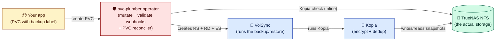
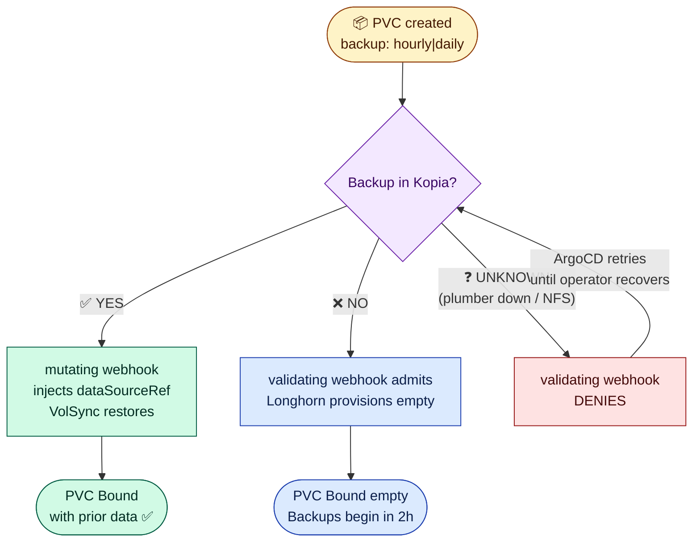
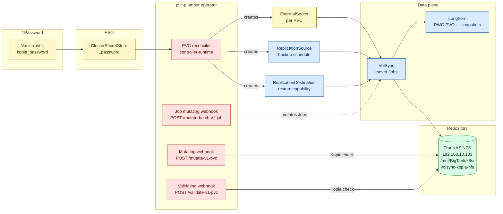
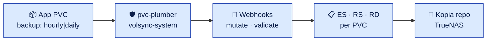
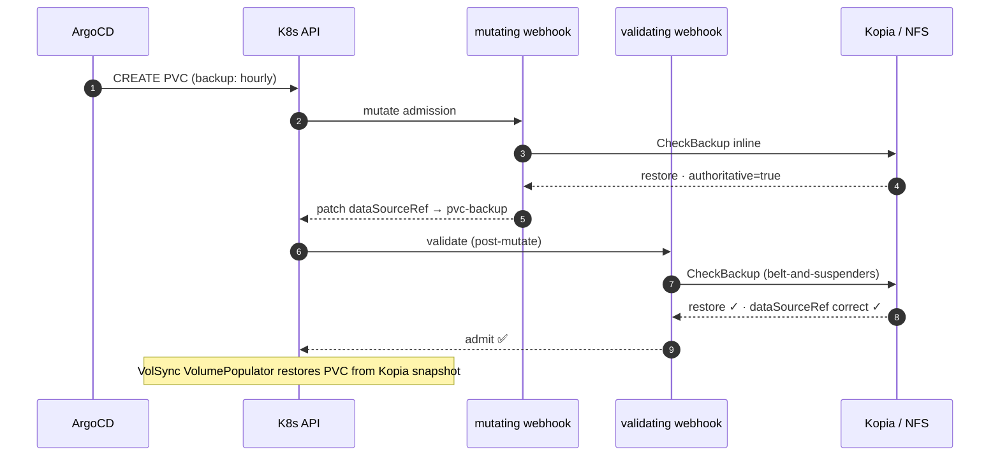
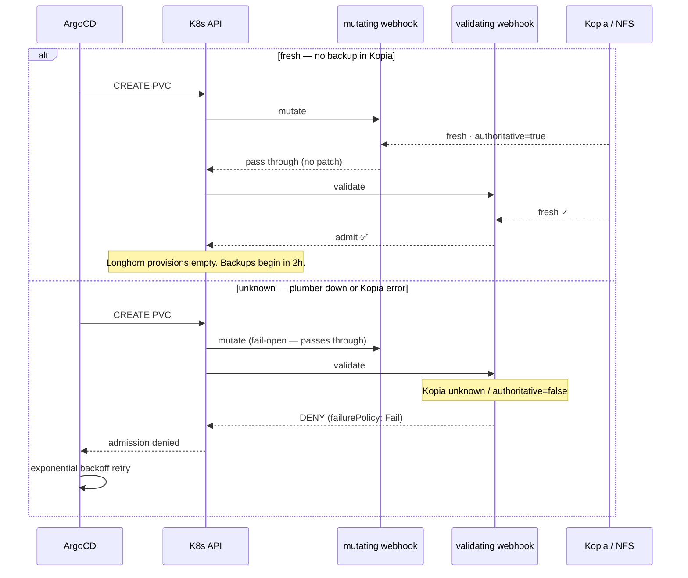
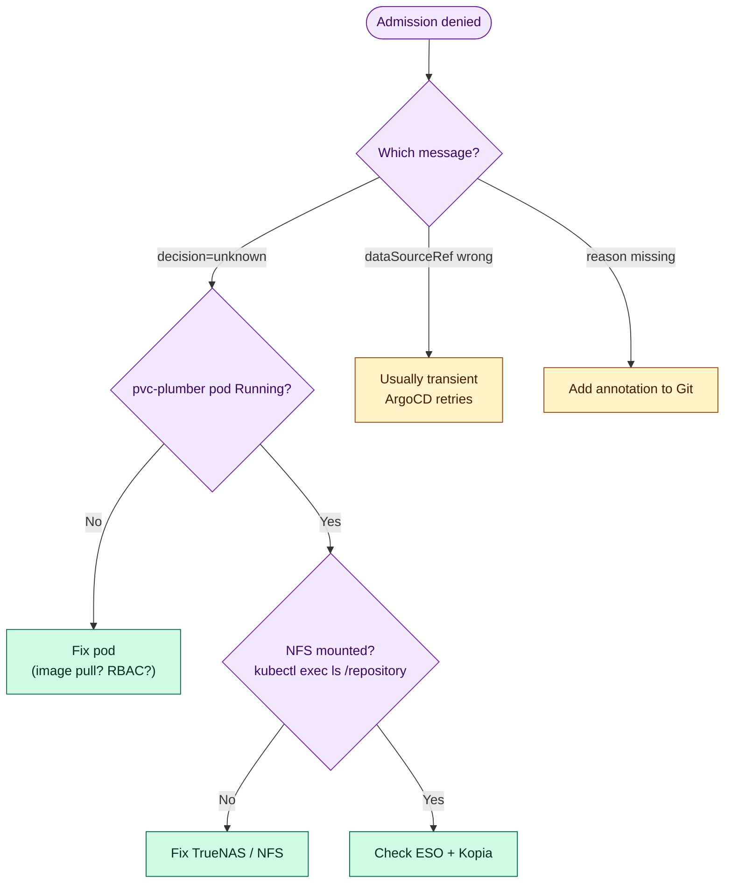
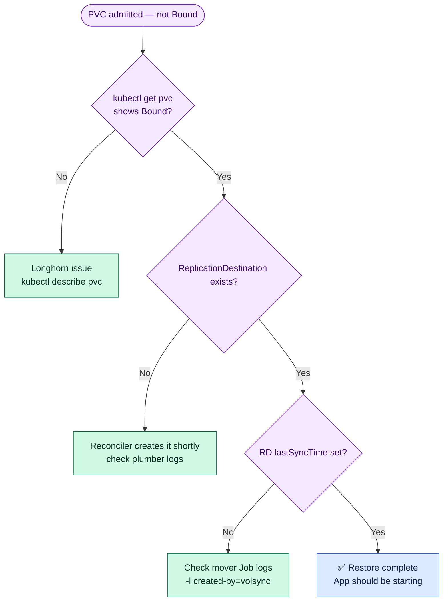
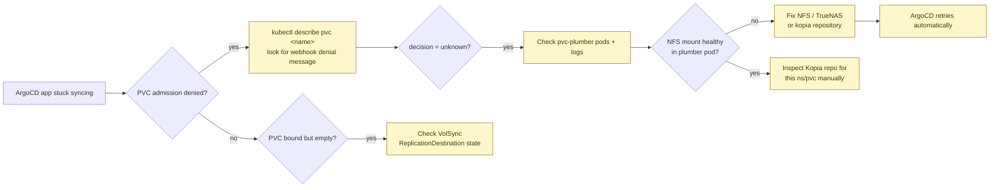

# VolSync Storage & Recovery

The single source of truth for **PVC backup and restore** in this cluster.

> **Scope:** application PVCs (Longhorn → Kopia → NFS).
> **Out of scope:** CloudNativePG database backups (Barman → S3).
> See [`cnpg-disaster-recovery.md`](cnpg-disaster-recovery.md) — different tool,
> different storage, different runbook. The two systems never touch each other.

> **How to read this doc:** it gets more technical as you scroll. The first
> couple of sections are plain English suitable for a whiteboard explanation.
> The middle has the architecture diagrams and the admission flow. The bottom
> is operations, troubleshooting, and the file index. Stop reading wherever
> the depth matches what you came for.

> **Reading from another homelab?** This is internal documentation for one
> specific cluster, not a product. It works on my hardware with my choices.
> See [Adapting this to your cluster](#adapting-this-to-your-cluster) and
> [Known limitations](#known-limitations-and-non-goals) before adopting any of
> this — the *pattern* is more portable than the specific stack.

---

## Stack at a glance — required vs swappable

This doc references specific tools because that's what this cluster runs.
Most of them are swappable; only a few are actually required for the pattern
to work.

| Layer | This cluster uses | What's actually required | Common swaps |
|---|---|---|---|
| OS / K8s | Talos OS | Any Kubernetes ≥ 1.27 | k3s, k0s, kubeadm, EKS/GKE/AKS |
| CNI | Cilium | Any CNI | Flannel, Calico, Antrea |
| GitOps | ArgoCD + ApplicationSets | None — `kubectl apply` is fine | FluxCD, raw kustomize, Helm |
| Storage CSI | Longhorn | **CSI driver with [VolumeSnapshot](https://kubernetes.io/docs/concepts/storage/volume-snapshots/) support** (required for VolSync's `copyMethod: Snapshot`) | OpenEBS Mayastor, Rook/Ceph, Portworx, TopoLVM, Linstor |
| Backup mover | VolSync | **VolSync** (the whole `ReplicationSource`/`ReplicationDestination`/VolumePopulator dance is VolSync-specific) | — none, this is the load-bearing piece |
| Backup format | Kopia (filesystem repo) | Any [VolSync mover](https://volsync.readthedocs.io/) | Restic (S3, no cross-PVC dedup), Rclone, Rsync, Syncthing |
| Backup destination | TrueNAS NFS | Anywhere VolSync's mover can write | Synology / Unraid / pi-with-USB-drive NFS, S3 (Restic mover), MinIO/RustFS, SMB |
| Admission engine | pvc-plumber v2 operator | **pvc-plumber v2** (purpose-built Go operator: mutating webhook + validating webhook + PVC reconciler) | — the operator IS the custom controller; no Kyverno involvement |
| Backup-existence oracle | [pvc-plumber](https://github.com/mitchross/pvc-plumber) | Kopia check integrated directly into the webhook handlers | Roll your own Go operator; the Kopia client is the core |
| Secret store | 1Password Connect + ESO | Anything that produces a Secret | Bitwarden via ESO, HashiCorp Vault, AWS/GCP Secret Manager, sealed-secrets, plain `Secret` |
| Snapshot scheduling spread | `(len(ns) + len(pvcName)) % 60` (v2; SHA256-derived in v2.1) | Anything that doesn't all fire at `:00` | controller-driven schedule |

If you only have a single-node k3s cluster with local-path-provisioner, this
pattern doesn't apply directly — you need a CSI with snapshot support.
[OpenEBS LVM-LocalPV](https://openebs.io/docs/concepts/lvmlocalpv) or
[TopoLVM](https://github.com/topolvm/topolvm) are the usual single-node
replacements for Longhorn.

---

## Why this exists

**One sentence:** I can nuke the entire Kubernetes cluster, redeploy from
Git, and every app comes back with its data — no scripts, no manual restore
commands, no ordering choreography. It just happens.

That's the whole point. Per-PVC restore is just the mechanism; **cluster
rebuild is the use case.**

```mermaid
flowchart LR
    subgraph BEFORE["💥 Before: cluster died / I rebuilt it from scratch"]
      B1["🔥 Cluster: gone<br/>Apps: gone<br/>PVCs: gone"]
      B2["💾 TrueNAS NFS: untouched<br/>(Kopia repo intact)"]
      B3["📂 Git: untouched"]
    end

    subgraph DURING["🔄 What I do"]
      D1["./scripts/bootstrap-argocd.sh"]
      D2["☕ wait"]
    end

    subgraph AFTER["✅ After: ~10 minutes later"]
      A1["🟢 30+ apps running"]
      A2["🟢 All PVCs auto-restored<br/>from last backup"]
      A3["🟢 Backups already running<br/>on schedule"]
    end

    BEFORE --> DURING --> AFTER

    classDef gone fill:#fee2e2,stroke:#991b1b,color:#450a0a;
    classDef kept fill:#d1fae5,stroke:#065f46,color:#022c22;
    classDef action fill:#fef3c7,stroke:#92400e,color:#451a03;
    classDef ok fill:#dbeafe,stroke:#1e40af,color:#0c1f4a;
    class B1 gone;
    class B2,B3 kept;
    class D1,D2 action;
    class A1,A2,A3 ok;
```



**What I do NOT do during a cluster rebuild:**

- ❌ Run a restore script per app
- ❌ Remember which PVC needed which snapshot ID
- ❌ Worry about ordering — "restore Postgres before Immich starts"
- ❌ Manually mount NFS, run kopia restore, fix permissions, etc.
- ❌ Worry about an app starting fresh and overwriting good backup data
  (pvc-plumber's validating webhook blocks that — see the fail-closed branch in the next section)

**What's the alternative I'd be doing without this?**

| Without this system | With this system |
|---|---|
| Per-app restore scripts in `scripts/restore-<app>.sh` | One label on the PVC |
| Remember snapshot IDs / dates / paths | The system finds the latest snapshot for `<namespace>/<pvc>` automatically |
| Restart order matters (Postgres before Immich, etc.) | Doesn't matter — every PVC gates itself on its own restore |
| If you forget to restore one app, it boots empty | pvc-plumber's validating webhook **denies** the PVC when a backup exists; can't forget |
| New apps need a fresh-vs-restore decision baked into a script | Same one label handles both fresh-install and rebuild |
| Cluster rebuild = day-long project | Cluster rebuild ≈ ArgoCD sync time + ~10 min for VolSync to populate volumes |

So while the rest of this doc reads like "here's how a single PVC create
works", remember the leverage: **that one admission flow runs across every
backup-labeled PVC during a rebuild, in parallel, with no human in the
loop.** Day-zero install and day-N disaster recovery are literally the
same code path — the only difference is whether pvc-plumber finds a
snapshot or not.

---

## In plain English

We have a homelab Kubernetes cluster. Apps store their state in PVCs
(persistent disks). Disks fail, clusters get rebuilt, mistakes get made — so
every PVC needs a backup somewhere safe, and on rebuild the PVC needs to come
back with its data already in it.

We solved that with **one label** on the PVC. The system does the rest.

- Add `backup: "hourly"` or `backup: "daily"` to a PVC.
- A backup runs on schedule, encrypted, deduplicated, stored on a NAS.
- If you ever delete the PVC and recreate it (anywhere — same cluster, new
  cluster, doesn't matter), it comes back **already populated** from the most
  recent backup. No manual restore step.
- If anything is wrong with the backup system at the moment you try to create
  a PVC, **Kubernetes refuses to create the PVC at all** rather than risk
  giving you an empty one. ArgoCD keeps retrying until it works.

That last bullet is the whole reason this is more than just "schedule a
backup job." Empty PVCs over real backup data is the catastrophe we will
never accept.

The pieces in plain English:

- **Longhorn** — gives PVCs that can be snapshotted.
- **VolSync** — schedules backup/restore jobs that run a tool called Kopia.
- **Kopia** — encrypts, dedupes, and writes to NFS on TrueNAS.
- **pvc-plumber v2 operator** — the Go operator that owns the entire PVC
  backup lifecycle. Its mutating webhook checks the Kopia repo inline and
  injects `dataSourceRef` when a restore is needed; its validating webhook
  is the fail-closed gate (deny if the answer is unknown); its PVC reconciler
  creates and cleans up the per-PVC ExternalSecret, ReplicationSource, and
  ReplicationDestination.
- **1Password + External Secrets Operator** — supplies the Kopia encryption
  password to anything that needs it.

If that's all you wanted, you can stop here.

---

## The picture, simply

**Who does what.** Five pieces, left to right. Each one only knows about its
neighbours.



**What happens when a PVC is created.** The whole decision in one diagram.



The third branch — `UNKNOWN → DENY → retry` — is the part that makes this a
**fail-closed** system. When in doubt, refuse to create the PVC. Empty
volumes over real backup data is the catastrophe we will never accept.

---

## If this, then that

The whole behaviour, as a flat lookup table:

| You do this | What happens |
|---|---|
| Add `backup: "hourly"` to a PVC, no backup exists yet | pvc-plumber operator creates an ExternalSecret + ReplicationSource + ReplicationDestination. Empty PVC binds. After PVC has been Bound for ≥ 2 h, scheduled backups begin. |
| Add `backup: "hourly"` to a PVC, **backup already exists** in Kopia | pvc-plumber's mutating webhook injects `dataSourceRef` on the PVC. VolSync populates it from the Kopia snapshot. PVC binds **with your prior data**. Backups continue on schedule. |
| Add `backup: "daily"` instead of `"hourly"` | Same as above, but schedule is `<minute> 2 * * *` (daily at 2 a.m.) instead of hourly. Retention is identical. |
| Remove the `backup` label from a PVC | Backups stop. Existing snapshots on NFS are kept. pvc-plumber's PVC reconciler deletes the helper resources on the next reconcile. Re-adding the label later resumes backups *and* makes the preserved snapshots auto-restore on next PVC recreate. |
| Delete the app from Git, re-add it later | New PVC is created → pvc-plumber finds the old snapshot → PVC auto-restores. Your "oops" undoes itself. |
| Whole cluster gets nuked, you rebuild it | Same Git repo, same NFS, every backup-labeled PVC auto-restores on first create. No manual restore commands. |
| pvc-plumber operator's webhook is unreachable (or the Kopia check times out) | Kubernetes **denies** the PVC (failurePolicy: Fail). ArgoCD retries with exponential backoff until pvc-plumber recovers. Apps without backup labels deploy normally. |
| You really want to start fresh on a labeled PVC, even though a backup exists | Annotate the PVC `volsync.backup/skip-restore: "true"` *and* `volsync.backup/skip-restore-reason: "<why>"`. The pvc-plumber webhook bypasses the restore but still sets up backups going forward. A 24 h Prometheus alert fires until you remove the annotation. |
| Someone forgets the reason annotation | PVC creation is denied. The reason is mandatory specifically because a stale `skip-restore=true` in Git would silently disable restore forever. |
| You add a backup label to a PVC in `kube-system`, `volsync-system`, or `argocd` | The webhooks skip those namespaces by design. No backup, no restore. |
| You add a backup label to a CNPG database PVC | Don't. Postgres needs SQL-aware backups (Barman → S3), not filesystem snapshots. CNPG manages its own PVCs and uses a [completely separate runbook](cnpg-disaster-recovery.md). |

The rest of this document is *how* this works.

---

## TL;DR — the magic label

```yaml
apiVersion: v1
kind: PersistentVolumeClaim
metadata:
  name: app-data
  namespace: my-app
  labels:
    backup: "hourly"          # or "daily"
spec:
  accessModes: [ReadWriteOnce]
  storageClassName: longhorn  # required — VolumeSnapshot capable
  resources:
    requests:
      storage: 10Gi
```

---

## Contents

- [Architecture at a glance](#architecture-at-a-glance)
- [Sync-wave timeline (bare metal → automatic DR)](#sync-wave-timeline)
- [Admission flow (the decision diagram)](#admission-flow)
- [Decision table](#decision-table)
- [The five scenarios](#the-five-scenarios)
- [Components](#components)
- [Backup schedules & retention](#backup-schedules-and-retention)
- [Operations](#operations)
  - [Enable backup](#enable-backup)
  - [Disable backup](#disable-backup)
  - [Skip restore (escape hatch)](#skip-restore-escape-hatch)
  - [Manual restore](#manual-restore)
- [NFS repository layout & deduplication](#nfs-repository-layout-and-deduplication)
- [Troubleshooting](#troubleshooting)
- [Why two backup systems (PVCs vs databases)](#why-two-backup-systems-pvcs-vs-databases)
- [Files reference](#files-reference)

---

## Architecture at a glance



### 🔍 Inspect each layer — where to look when something breaks

When something goes wrong, work top-to-bottom through these five layers. Most failures live at the operator pod or NFS layer.



| Layer | Check with |
|---|---|
| **App PVC** | `kubectl describe pvc NAME -n NS` — look at Events at the bottom |
| **pvc-plumber operator** | `kubectl get pods -n volsync-system` · `kubectl logs -n volsync-system -l app.kubernetes.io/name=pvc-plumber --tail=50` |
| **Webhooks** | `kubectl get mutatingwebhookconfiguration pvc-plumber` · `kubectl get validatingwebhookconfiguration pvc-plumber` |
| **Generated resources** | `kubectl get externalsecret,replicationsource,replicationdestination -n NS -l managed-by=pvc-plumber` |
| **NFS / Kopia repo** | `kubectl exec -n volsync-system deploy/pvc-plumber -- ls -la /repository` |

Four components in the pvc-plumber operator do the work:

| Component | What it does |
|---|---|
| Mutating webhook (`/mutate-v1-pvc`) | Runs the Kopia check inline. If `decision=restore authoritative=true`, patches `spec.dataSourceRef` to point at `<pvc>-backup` ReplicationDestination. |
| Validating webhook (`/validate-v1-pvc`) | Fail-closed gate. Denies if the Kopia check is non-authoritative or unknown; denies if `decision=restore` but `dataSourceRef` is missing/wrong; denies `skip-restore=true` without a reason annotation. |
| PVC reconciler | Creates ExternalSecret + ReplicationDestination immediately on label add; creates ReplicationSource after PVC is Bound + ≥ 2 h. Deletes all three on label removal or PVC deletion. |
| Job mutating webhook (`/mutate-batch-v1-job`) | Mutates every VolSync mover `Job` to add the NFS volume + `/repository` mount. Apps don't carry NFS config — the operator injects it. |

---

## Sync-wave timeline

ASCII because the wave order is more legible as a stack than as a Mermaid box-and-arrow:

```
┌──────────────────────────────────────────────────────────────────────────────┐
│  Bootstrap (manual, once)                                                    │
│    Talos OS  →  Cilium CNI  →  ArgoCD  →  root.yaml                          │
│  After this: GitOps loop runs, every wave below is automatic.                │
└──────────────────────────────────────────────────────────────────────────────┘
                                     │
                                     ▼
┌──────────────────────────────────────────────────────────────────────────────┐
│  Wave 0 — Foundation                                                         │
│    1Password Connect • External Secrets Operator • AppProjects               │
└──────────────────────────────────────────────────────────────────────────────┘
                                     │
                                     ▼
┌──────────────────────────────────────────────────────────────────────────────┐
│  Wave 1 — Storage                                                            │
│    Longhorn (block storage) • Snapshot Controller • VolSync (operator only)  │
└──────────────────────────────────────────────────────────────────────────────┘
                                     │
                                     ▼
┌──────────────────────────────────────────────────────────────────────────────┐
│  Wave 2 — pvc-plumber operator  ← FAIL-CLOSED gate must be Ready before      │
│    apps create PVCs                                                           │
│    2 replicas, PDB minAvailable=1, NFS-mounted /repository                   │
│    Mutating + Validating webhooks (port 9443), PVC reconciler, /healthz      │
└──────────────────────────────────────────────────────────────────────────────┘
                                     │
                                     ▼
┌──────────────────────────────────────────────────────────────────────────────┐
│  Wave 4 — Infrastructure AppSet                                               │
│    cert-manager, external-dns, gateway, CNPG operator, GPU operator, etc.    │
└──────────────────────────────────────────────────────────────────────────────┘
                                     │
                                     ▼
┌──────────────────────────────────────────────────────────────────────────────┐
│  Wave 5 — Monitoring AppSet  •  Wave 6 — My-Apps AppSet                      │
│    PVCs with `backup: hourly|daily` start being created here.                │
│    Every CREATE goes through the admission flow below.                       │
└──────────────────────────────────────────────────────────────────────────────┘
```

**Why pvc-plumber lives at Wave 2:** The operator's admission webhooks must be
registered and healthy before any app PVCs are created. Wave 2 → Wave 4/5/6
ordering ensures that on a fresh boot the pvc-plumber webhooks are registered
before any backup-labeled PVCs hit the API server. The cert-manager Certificate
for webhook TLS is at Wave 0/1 (cert-manager itself), so by Wave 2 the TLS
secret is available.

---

## Admission flow

What happens when the Kubernetes API server sees `kubectl apply` on a
backup-labeled PVC. The operator runs one Kopia check per webhook call (mutate
and validate each call Kopia independently, with singleflight dedup on
identical concurrent lookups).

**Path A — backup exists (restore):**



**Path B — no backup (fresh) or operator down (deny):**



The belt-and-suspenders validate check (Path A, steps 6–8) closes a real race: the mutate
call could fail transiently while the validate call succeeds — without the
post-mutate check, the PVC would be admitted without `dataSourceRef` and
Longhorn would silently provision an empty volume on top of restorable backup
data. The validating webhook explicitly denies admission when Kopia reports
`restore` but the admitted PVC's `dataSourceRef` doesn't point at
`<pvc>-backup`/`ReplicationDestination`/`volsync.backube`.

---

## Decision table

| Kopia check result | pvc-plumber action | Outcome |
|---|---|---|
| `decision=restore authoritative=true` | Mutating webhook patches `dataSourceRef` → `<pvc>-backup`; validating webhook admits | VolSync restore, PVC bound with prior data |
| `decision=fresh authoritative=true` | Mutating webhook passes through; validating webhook admits | Empty PVC, app starts fresh |
| `decision=unknown` or `authoritative=false` | Validating webhook denies | ArgoCD retries with backoff |
| pvc-plumber unreachable / webhook timeout | Kubernetes denies (failurePolicy: Fail) | ArgoCD retries with backoff |
| `decision=restore` but PVC missing `dataSourceRef` after mutate | Validating webhook denies (belt-and-suspenders) | ArgoCD retries; investigate plumber logs |
| `volsync.backup/skip-restore=true` + non-empty reason | Validating webhook bypasses restore check | Empty PVC despite backup existing (deliberate) |
| `volsync.backup/skip-restore=true` + missing reason | Validating webhook denies | Operator must explain why |

The **invariant** the entire system protects:

> A PVC labeled `backup: hourly|daily` must never bind to an empty volume
> when backup truth is unknown.

---

## The five scenarios

1. **Fresh cluster, brand new app.** Kopia repo empty → `decision=fresh` →
   empty PVC → backups begin once PVC is Bound + 2 h old.
2. **Disaster recovery (cluster nuked, NFS preserved).** Same Git, new
   cluster. Kopia repo intact → `decision=restore` → pvc-plumber mutating
   webhook injects `dataSourceRef` → VolSync restores → app comes up with
   all prior data. No human action.

   Here's exactly what happens when ArgoCD recreates the PVC. Two phases:

   **Phase 1 — the operator decides "restore"** (admission time, ~200ms):

   ```mermaid
   sequenceDiagram
       autonumber
       participant Argo as ArgoCD
       participant API as K8s API
       participant Mut as Mutating webhook
       participant Val as Validating webhook
       participant Kopia as Kopia / NFS

       Note over API: 💥 PVC is gone (rebuild or delete)
       Argo->>API: CREATE PVC (from Git)
       API->>Mut: mutate admission
       Mut->>Kopia: CheckBackup("ns/pvc")
       Kopia-->>Mut: restore · authoritative=true ✓
       Mut-->>API: patch dataSourceRef → pvc-backup
       API->>Val: validate (post-mutate)
       Val->>Kopia: CheckBackup (independent check)
       Kopia-->>Val: restore ✓ · dataSourceRef correct ✓
       Val-->>API: admit ✅
   ```

   **Phase 2 — VolSync populates the volume** (restore, seconds to minutes):

   ```mermaid
   sequenceDiagram
       participant API as K8s API
       participant VS as VolSync
       participant Kopia as Kopia / NFS
       participant App as App pod

       API->>VS: VolumePopulator (ReplicationDestination)
       VS->>Kopia: kopia restore — latest snapshot for ns/pvc
       Kopia-->>VS: data stream
       VS->>API: volume ready
       API-->>App: PVC Bound · data intact
       App->>App: starts normally 🎉

       Note over VS,App: Runs in parallel for every backup-labeled PVC.<br/>No human action needed.
   ```

3. **Oops, I deleted the app.** Re-add to Git → identical to scenario 2 →
   data restored automatically. The mistake fixes itself.
4. **New app added to existing cluster.** No prior backup → `decision=fresh`
   → empty PVC → backups begin (same as scenario 1).
5. **pvc-plumber down during DR (FAIL-CLOSED).** pvc-plumber's validating
   webhook (failurePolicy: Fail) causes Kubernetes to deny all backup-labeled
   PVCs. Apps with backup labels stay Pending; apps _without_ backup labels
   deploy normally. ArgoCD retries forever (exponential backoff capped at
   3 min). Operator fixes plumber → ArgoCD retries → restore proceeds.
   **The alternative would be empty PVCs over restorable data, and the
   webhook only checks on PVC CREATE — so the restore window would close
   permanently.**

---

## Components

| Component | Where | Wave | Notes |
|---|---|---|---|
| **Longhorn** | `infrastructure/storage/longhorn/` | 1 | RWO block storage, VolumeSnapshot capable. The `longhorn` StorageClass is required for any backup-labeled PVC. |
| **VolSync operator** | `infrastructure/storage/volsync/` | 1 | Watches `ReplicationSource` / `ReplicationDestination` and runs Kopia mover Jobs. |
| **[pvc-plumber v2 operator](https://github.com/mitchross/pvc-plumber)** | `infrastructure/controllers/pvc-plumber/` | 2 | Source: [`mitchross/pvc-plumber`](https://github.com/mitchross/pvc-plumber). Image `ghcr.io/mitchross/pvc-plumber:2.x`, 2 replicas + podAntiAffinity + PDB minAvailable=1. Runs mutating webhook (port 9443), validating webhook (port 9443), Job mutating webhook, and PVC reconciler in a single binary. Mounts NFS read-write at `/repository`. Infrastructure namespaces excluded via `namespaceSelector.NotIn` — see `infrastructure/controllers/pvc-plumber/webhooks.yaml`. |
| **Kopia maintenance** | `infrastructure/storage/volsync/kopia-maintenance-cronjob.yaml` | 1 | Daily safe maintenance off the top of the hour. |
| **Kopia UI** (optional) | `infrastructure/storage/kopia-ui/` | — | Web browser for the repo at `kopia-ui.{domain}`. Mounts the same NFS share. |
| **Prometheus alerts** | `monitoring/prometheus-stack/volsync-alerts.yaml` | 5 | VolSync backup age, pvc-plumber decision/error rate, `ProtectedPVCSkipRestoreStale` 24h watchdog. |
| **TrueNAS NFS** | `192.168.10.133:/mnt/BigTank/k8s/volsync-kopia-nfs` | — | 10 Gbps to Proxmox. One shared Kopia repository for the whole cluster (see [dedup](#nfs-repository-layout-and-deduplication)). |
| **1Password** | item `rustfs`, field `kopia_password` | — | Single source of truth for the Kopia repository encryption password. |

### Operator webhook and reconciler rules

Remembering which component enforces which rule saves debugging time:

| # | Enforced by | What it does |
|---|---|---|
| 1 | Validating webhook | **Deny** if Kopia check returns `authoritative=false` or `decision=unknown`. Fail-closed: if pvc-plumber is unreachable, Kubernetes denies the PVC (failurePolicy: Fail). |
| 2 | Mutating webhook | If `decision=restore authoritative=true`, patch `spec.dataSourceRef` → `<pvc>-backup`/`ReplicationDestination`/`volsync.backube`. Fail-open: if Kopia check fails here, the PVC passes through (the validating webhook catches it). |
| 3 | Validating webhook (post-mutate) | **Deny** if Kopia reports `restore` but the admitted PVC's `dataSourceRef` doesn't match `<pvc>-backup`/`ReplicationDestination`/`volsync.backube`. Closes the mutate/validate race. |
| 4 | Validating webhook | If `volsync.backup/skip-restore=true`, **deny** unless `volsync.backup/skip-restore-reason` is non-empty. Stops one-character escape-hatch annotations from sitting in Git permanently. |
| 5 | PVC reconciler | Creates `volsync-<pvc>` `ExternalSecret` pulling `KOPIA_PASSWORD` from 1Password (item `rustfs`). |
| 6 | PVC reconciler | Creates `<pvc>-backup` `ReplicationSource` (the schedule). Preconditions: PVC is `Bound` AND ≥ 2 h old — prevents backing up an empty volume immediately after creation. |
| 7 | PVC reconciler | Creates `<pvc>-backup` `ReplicationDestination` (the restore capability). Created immediately (before PVC binds) so it's ready for VolSync to populate. |
| 8 | Job mutating webhook | Mutates every VolSync mover Job (label `app.kubernetes.io/created-by: volsync`) to add the NFS volume + `/repository` mount. failurePolicy: Ignore (NFS inject failure = backup fails, not a cluster stopper). |

> **The `<pvc>-backup` name is shared by RS and RD.** They're different
> resources (`ReplicationSource` vs `ReplicationDestination`) with the same
> name. When patching one, always include `--type` and the kind, never
> shorthand by name alone.

---

## Backup schedules and retention

| Label | Cron | Retention |
|---|---|---|
| `backup: "hourly"` | `<minute> * * * *` | 24 hourly · 7 daily · 4 weekly · 2 monthly |
| `backup: "daily"`  | `<minute> 2 * * *` | 24 hourly · 7 daily · 4 weekly · 2 monthly |

`<minute>` is `(len(namespace) + len(pvcName)) % 60` — a deliberately temporary
deterministic spread. Better than every PVC firing at `:00`, but PVC names
share length ranges, so this clusters slightly. v2.1 will replace this with a
SHA256-derived minute. Existing `ReplicationSource`s keep whatever minute was
set at creation; the new minute only takes effect when a PVC is recreated.

The on-disk Kopia format uses `compression: zstd-fastest`, `parallelism: 2`,
`cacheCapacity: 2Gi`, mover security `runAsUser/Group/fsGroup: 568`.

---

## Operations

### Enable backup

Add the label. Verify pvc-plumber created the helpers:

```bash
kubectl get externalsecret,replicationsource,replicationdestination \
  -n <ns> -l app.kubernetes.io/managed-by=pvc-plumber
```

The first backup runs on the next scheduled tick after the PVC is Bound + ≥ 2 h old.

### Disable backup

Remove the `backup` label. **Existing snapshots are NOT deleted** — Kopia
retains them on NFS. Re-adding the label later resumes backups _and_
re-enables restore-on-create from those preserved snapshots.

The pvc-plumber PVC reconciler deletes the orphaned `ReplicationSource`,
`ReplicationDestination`, and `ExternalSecret` on the next reconcile cycle.
No manual cleanup needed.

### Skip restore (escape hatch)

Sometimes you want to nuke an app and start fresh _without_ clearing the
Kopia repo first. Annotate the PVC:

```yaml
metadata:
  annotations:
    volsync.backup/skip-restore: "true"
    volsync.backup/skip-restore-reason: "posthog data wipe — drill 2026-05-01"
```

- The mutating webhook skips the `dataSourceRef` injection → empty PVC.
- The validating webhook still checks for a `skip-restore-reason` → admission denied if missing.
- The PVC reconciler still creates ES/RS/RD → going-forward backups still happen.
- The `ProtectedPVCSkipRestoreStale` Prometheus alert fires after 24 h to
  stop the annotation from sitting in Git as a primed footgun.

### Manual restore

Either (a) delete the PVC and let restore-on-create take over, or (b) trigger
the existing `ReplicationDestination` directly:

```bash
# Note: the RD is named <pvc>-backup (same suffix as the RS).
kubectl patch replicationdestination <pvc>-backup -n <ns> \
  --type merge -p '{"spec":{"trigger":{"manual":"restore-'"$(date +%s)"'"}}}'
```

---

## NFS repository layout and deduplication

```
/mnt/BigTank/k8s/volsync-kopia-nfs/
├── kopia.repository    # repository config
├── kopia.blobcfg       # blob storage config
├── p/                  # pack files (deduplicated content from ALL PVCs)
├── q/                  # index blobs
├── n/                  # manifest blobs (snapshots tagged by ns/pvc)
└── x/                  # session blobs
```

**One shared Kopia repository for the entire cluster, snapshots tagged by
`namespace/pvc-name`.** This is deliberate. Kopia uses content-defined
chunking — files are split into variable-size chunks based on content
boundaries, and each chunk is stored once by its hash. The practical wins:

- Delete and recreate an app → new PVC backs up → Kopia finds every chunk
  already present → near-instant backup, almost zero new storage.
- Multiple apps with shared files (configs, timezone data, libraries) →
  one copy of each chunk.
- Incremental backups only store changed chunks, not changed files.
- Storage grows by unique data, not by number of PVCs.

**Why this beats S3 + Restic.** VolSync also supports Restic to S3, but
Restic gives each PVC its own repository — zero cross-PVC dedup. Delete
and recreate = full backup from scratch. More storage, more bandwidth,
slower.

**Why NFS over S3 for this layer.**
- VolSync's Kopia mover wants filesystem access (CDC + dedup).
- Direct NFS gives 10 Gbps to TrueNAS with no HTTP overhead.
- No per-namespace S3 credentials to manage — the operator injects the NFS mount.
- Same approach as the home-ops reference implementation we cribbed from.

### Generated per-PVC secret

The operator's PVC reconciler creates an `ExternalSecret` that produces a Secret named
`volsync-<pvc>` in the app's namespace with:

| Key | Value | Source |
|---|---|---|
| `KOPIA_REPOSITORY` | `filesystem:///repository` | hard-coded in policy |
| `KOPIA_FS_PATH` | `/repository` | hard-coded in policy |
| `KOPIA_PASSWORD` | (encrypted) | 1Password item `rustfs`, field `kopia_password` |

---

## Restore drill runbook (validating DR-completeness)

A backup that has never been restored is a hypothesis, not a recovery plan. This runbook
proves a managed PVC actually restores end-to-end. Validated on copyparty (2026-05-31),
paperless/data (2026-05-31), and paperless/media (2026-05-31).

### DR-completeness depends on `dataSourceRef`

On PVC delete/recreate, Argo recreates the PVC from **Git**, and the VolSync volume
populator restores **only if the PVC carries `dataSourceRef → ReplicationDestination/<pvc>-dst`**.

- **PVC with dsr → restores** from the RD's `latestImage` on recreate. **DR_COMPLETE.**
- **PVC with NO dsr → recreates EMPTY.** This is the empty-reset state (paperless/data+media,
  immich/library were reset this way). To make such a PVC DR-complete, **add the dsr to Git**.

As of 2026-05-31, 23/24 operator-managed PVCs are DR_COMPLETE; only `immich/library` remains
no-dsr (optional — derivatives regenerable from exempt NFS).

### Adding a `dataSourceRef` to a previously-no-dsr PVC — the stale-render race

This is the dangerous part. Two gotchas, both observed live:

1. **manifest-generate-paths stale-render race.** After committing the dsr, if you delete the
   PVC too soon, Argo's `selfHeal` recreates it from the **cached pre-dsr manifest** → the PVC
   comes back **EMPTY, no dsr** (paperless/data hit this — a forced double-recreate).
   **Mitigation:** after the dsr commit, `argocd refresh=hard` and **wait until
   `application.status.sync.revision == <dsr commit SHA>`** AND `kubectl kustomize <app>` shows
   the dsr, *before* deleting the PVC. paperless/media followed this and needed **no double-recreate**.
   If the first recreate still binds empty: hard-refresh again, re-verify the rev, delete the empty
   PVC again, re-sync. Be ready for the double-recreate.

2. **Bound-PVC ComparisonError (if dsr added before quiesce).** Adding the dsr to Git while the
   old PVC is still Bound makes Argo's SSA dry-run try to set the immutable `dataSourceRef` on a
   Bound PVC → `ComparisonError ... PersistentVolumeClaim is invalid: spec: Forbidden`. This is
   **expected and harmless** once the dsr commit is confirmed reconciled — it clears the moment the
   PVC is deleted (a fresh create has no immutable violation). Scale-down via GitOps still succeeds
   through the ComparisonError.

### The drill, step by step

```
0. Preflight: pod ready/0-restarts; /audit already-matches/managed-by-pvc-plumber/stale=false;
   PVC Bound; RS/RD managed-by=pvc-plumber; last backup Successful; RD latestImage present;
   Longhorn faulted=0/rebuilding=0; rollback PV (if any) intact.
1. (no-dsr PVCs only) Add dataSourceRef → <pvc>-dst to Git PVC. Commit, push.
   Hard-refresh; WAIT until app sync.revision == dsr commit; verify kustomize renders the dsr.
2. Sentinel: write a small file with timestamp + OLD PVC uid + random token; record sha256.
3. Manual backup: patch RS spec.trigger -> {"manual":"<val>","schedule":null}. Wait result=Successful,
   lastSync AFTER sentinel. (Kopia log shows the small "N hashed (… B)" new file.)
4. RD refresh: patch RD spec.trigger.manual -> new value. Wait latestImage advances + VolumeSnapshot
   readyToUse=true.
5. Quiesce: scale the workload to 0 via GitOps (commit replicas:0, sync). PVC stays Bound, detaches.
6. Delete the PVC (reclaim=Delete nukes the live volume — backup is the net). Sync. Watch it rebind
   WITH dsr=<pvc>-dst and actualSize > 0 (restored, not empty). New uid != old uid.
7. Scale back up via GitOps (commit replicas:1). Verify sentinel byte-identical (sha256 match, OLD
   uid embedded), real data present, write test passes.
8. Cleanup: restore canonical RS/RD triggers (see below); remove sentinel.
```

### Two cleanup obligations that are NOT automatic

- **RS/RD trigger drift — pvc-plumber will NOT revert it.** The operator watches *PVCs*, not
  RS/RD, so your manual `trigger` patches persist. **You must restore them**: RS →
  `{"schedule":"<MM> * * * *"}` (clear `manual`), RD → `{"manual":"restore-once"}`. Leaving the RS
  on `manual` silently **disables scheduled backups**. Verify `RS.status.nextSyncTime` reappears.

- **Scale-back-up may need a clean hard-refresh-to-clear before sync (ArgoCD stale cluster-state
  cache).** Observed on paperless/media: the `replicas:0→1` sync reported `Succeeded` but the
  Deployment stayed at 0 (server-side diff no-opped against a stale live view). Fix: issue
  `argocd refresh=hard`, **wait for the refresh annotation to clear and the Deployment to show
  OutOfSync**, *then* sync. See [docs/argocd.md] stale-sync notes. (Syncing while the hard-refresh
  is still in flight races the cache and no-ops.)

### What "restored" proves vs not

The sentinel's embedded **old** PVC uid is the proof the bytes came from backup (a fresh/empty
recreate could never contain the old uid). A non-empty Longhorn `actualSize` on the new volume
distinguishes a real restore from an empty provision. The restored volume comes up `degraded`
(initial replica rebuild) and self-heals — do **not** touch replica counts.

---

## Troubleshooting

### PVC stuck Pending? Start here.

Two decision trees — pick the one that matches your symptom.

**Branch A: admission denied** — you see a webhook denial in `kubectl describe pvc`:



**Branch B: PVC admitted but still Pending or empty** — no denial, just waiting:



### Quick health commands

```bash
# Quick health pass
kubectl get pods -n volsync-system -l app.kubernetes.io/name=pvc-plumber
kubectl logs -n volsync-system -l app.kubernetes.io/name=pvc-plumber --tail=50
kubectl get replicationsource,replicationdestination -A
kubectl get externalsecret -A | grep volsync-

# Check webhook registration
kubectl get mutatingwebhookconfiguration pvc-plumber
kubectl get validatingwebhookconfiguration pvc-plumber

# View the actual NFS contents from inside the cluster
kubectl exec -it -n volsync-system deploy/pvc-plumber -- ls -la /repository

# Mover pod logs (the actual Kopia run)
kubectl logs -n <ns> -l app.kubernetes.io/created-by=volsync -c kopia --tail=200

# Force a backup tick (debug-only — leave the schedule alone in Git)
kubectl patch replicationsource <pvc>-backup -n <ns> \
  --type merge -p '{"spec":{"trigger":{"schedule":"*/5 * * * *"}}}'
```



The desired failure mode is **visible waiting**, not silent empty
initialization.

### Common symptoms

| Symptom | Likely cause | Fix |
|---|---|---|
| PVC stuck Pending, ArgoCD app OutOfSync | pvc-plumber pods unhealthy or NFS unreachable | `kubectl logs -n volsync-system -l app.kubernetes.io/name=pvc-plumber` and `kubectl exec ... -- ls /repository` |
| Admission denied with "authoritative" message | `decision=unknown` from Kopia check | Same as above — fix plumber or its NFS mount |
| Admission denied with "dataSourceRef" message | Kopia reports restore needed but dataSourceRef is missing/wrong (belt-and-suspenders) | Usually transient; ArgoCD retries. If persistent, check plumber logs for Kopia errors |
| Admission denied with "skip-restore-reason" message | `skip-restore=true` without a reason annotation | Add `volsync.backup/skip-restore-reason: "..."` to the PVC |
| PVC bound, no `ReplicationSource` after several minutes | PVC younger than 2 h, or not yet `Bound` | Expected — reconciler waits. Verify `kubectl get pvc` shows `Bound` and check creationTimestamp |
| Mover Job exists but has no NFS mount | Job mutating webhook didn't fire | Job must carry label `app.kubernetes.io/created-by: volsync`; check pvc-plumber logs |
| Removed backup label, helpers still present | Reconciler hasn't processed the label removal yet | Wait for next reconcile cycle; check `kubectl logs -n volsync-system -l app.kubernetes.io/name=pvc-plumber` |

### Excluded namespaces

Auto-excluded from all backup/restore webhooks (via `namespaceSelector.NotIn`):

- `kube-system`
- `volsync-system`
- `argocd`
- `longhorn-system`

Do not add backup labels to PVCs in these namespaces; they would be skipped
by webhook exclusions and would never get any of the generated helpers
anyway.

---

## Why two backup systems (PVCs vs databases)

| | PVC backups | Database backups |
|---|---|---|
| **Tool** | VolSync + Kopia | CNPG + Barman |
| **Trigger** | pvc-plumber operator auto-creates on PVC label | CNPG `ScheduledBackup` resource |
| **Destination** | TrueNAS NFS | RustFS S3 (`s3://postgres-backups/cnpg/`) |
| **Auto-restore** | Yes (pvc-plumber operator admission + VolSync) | **No** — manual recovery, see runbook |
| **Schedule** | Hourly or daily per PVC label | Hourly base + continuous WAL archiving |
| **Granularity** | Filesystem snapshots | SQL-aware (`pg_basebackup` + WAL replay, PITR) |

The two systems share nothing. CNPG-managed PVCs **must not** carry the
`backup: hourly|daily` label — Postgres data on a running cluster is
inconsistent at filesystem level without the WAL stream, and CNPG
auto-generates PVC names so you can't reliably attach backup labels at
declaration time.

For database recovery — including the `serverName -v1/-v2/-vN` lineage
model and the recovery-overlay feature flag — see
**[`cnpg-disaster-recovery.md`](cnpg-disaster-recovery.md)**.

The RustFS bucket lifecycle policy for **abandoned database backup
prefixes** lives at `infrastructure/storage/rustfs-lifecycle/`. That
controller owns the entire `postgres-backups` bucket lifecycle config (the
S3 PUT replaces the whole policy, so every rule lives in one ConfigMap).
Add abandoned `serverName` prefixes there only — active CNPG retention
belongs in the CNPG backup config.

---

## Adapting this to your cluster

If you want to adopt this pattern in your own cluster, here's the minimum
viable stack and where to start.

**You need:**

1. **A Kubernetes cluster with CSI snapshots.** Run
   `kubectl get volumesnapshotclass` — you need at least one, and the
   driver behind it must support `copyMethod: Snapshot` in VolSync. If
   you don't have this, [install VolumeSnapshot CRDs + a CSI](https://github.com/kubernetes-csi/external-snapshotter)
   before anything else.
2. **VolSync.** `helm install volsync` from the
   [VolSync chart](https://volsync.readthedocs.io/en/stable/installation/index.html).
3. **pvc-plumber v2 operator.** Build from [`mitchross/pvc-plumber`](https://github.com/mitchross/pvc-plumber)
   or use the published image (`ghcr.io/mitchross/pvc-plumber:2.x`). The
   operator runs the admission webhooks (mutate + validate) and the PVC
   reconciler in a single binary. cert-manager must be available to issue
   the webhook TLS certificate. Make sure your infrastructure namespaces
   (storage CSI, GitOps, VolSync, etc.) are in the webhook `namespaceSelector`
   exclusion list — same hard rule as any fail-closed webhook; see
   `infrastructure/controllers/pvc-plumber/webhooks.yaml`.
4. **A way to deliver the Kopia password as a Secret.** ESO + a backend
   you trust, sealed-secrets, or just `kubectl create secret`. The
   operator expects a Secret named `volsync-<pvc>` with keys
   `KOPIA_REPOSITORY`, `KOPIA_FS_PATH`, `KOPIA_PASSWORD`.
5. **An NFS server reachable from your cluster** (or pick a different
   VolSync mover and adjust the operator's env vars accordingly — Restic to
   S3 works identically modulo the NFS-inject webhook).

**Then:**

1. **Build or pull [`pvc-plumber`](https://github.com/mitchross/pvc-plumber) v2.**
   The operator binary embeds the Kopia check, webhook handlers, and PVC
   reconciler. Point the operator's NFS environment variables at your
   repository mount.
2. **Copy `infrastructure/controllers/pvc-plumber/`** and adjust:
   - `deployment.yaml` — NFS server + path env vars, image tag.
   - `webhooks.yaml` — excluded namespace list → your storage / GitOps namespaces.
   - `externalsecret.yaml` — your secret backend / Kopia password source.
3. **Pick a CSI snapshot class and StorageClass for your cluster** and
   set them in the operator's `SNAPSHOT_CLASS` and `STORAGE_CLASS` env vars
   (or configure in the operator's ConfigMap — see the operator README for
   current flags).

The pattern is portable. The specific image tags, hostnames, and 1Password
item names in this repo are not.

---

## Known limitations and non-goals

This is a working homelab system, not a hardened product. Things you should
know before adopting:

**Trust model.**

- **Single-operator homelab.** Threat model is "I might fat-finger a
  delete," not "an attacker is in my cluster." AppProjects are permissive,
  the Kopia repo has one shared password, and there's no per-namespace
  blast-radius isolation. If your model is different, tighten before
  adopting.
- **One Kopia password = full blast radius.** Leak it and every backup
  across every PVC is decrypted. Acceptable here because backups never
  leave the LAN.

**3-2-1 compliance: no.**

- NFS on TrueNAS is the only copy of the backups. There is **no off-site
  copy, no second NAS, no cloud cold storage.** A NAS-level disaster
  (fire, theft, ransomware on the NAS) loses everything. Add a second
  destination (Restic to S3 in parallel, ZFS replication to another
  TrueNAS, rclone to Backblaze B2, etc.) if you need real DR coverage.

**Webhook math.**

- Each PVC admission triggers **one Kopia check in the mutating webhook + one
  in the validating webhook** (with singleflight dedup on identical concurrent
  lookups). With a cold Kopia repository, slow NFS, or a pvc-plumber pod
  restart, the check can take several seconds and trip the webhook timeout.
  The desired failure mode (deny + retry via ArgoCD backoff), but you should
  know the window exists.
- The pvc-plumber webhook is `failurePolicy: Fail` — required for fail-closed
  to mean anything. If pvc-plumber itself is down, *every* backup-labeled PVC
  create blocks until it's back. The v2026-04-08 Kyverno deadlock incident
  was the original motivation for replacing Kyverno with a purpose-built
  operator (see [`pvc-plumber-operator-design.md`](plans/pvc-plumber-operator-design.md)).

**Upgrade windows.**

- pvc-plumber rolling update with `replicas: 2` + `PDB minAvailable: 1`
  keeps one pod up — fine.
- During a single-node cluster reboot, or when both pvc-plumber pods land
  on the same node briefly (rare with podAntiAffinity but possible), the
  fail-closed gate denies new PVC creates. ArgoCD retries.
- None of this is a problem if you treat backup-labeled PVC creates as
  "best effort, will eventually succeed" — which they are.

**Generated resources are reconciled (improvement over the old Kyverno system).**

- The operator uses Get-or-Create idempotency: if you `kubectl delete
  replicationsource <pvc>-backup`, **the reconciler will recreate it on the
  next reconcile cycle** (triggered by any PVC event or the periodic re-queue).
  This is an improvement over the previous Kyverno system (`synchronize: false`
  meant deleted helpers were never recreated and required a label bounce to
  re-trigger admission).

**Schedule clustering.**

- The `(len(ns) + len(pvcName)) % 60` minute spread is a stopgap (the doc
  admits this in [Backup schedules](#backup-schedules-and-retention)). PVC
  names share length ranges → backups cluster on the same minute. v2.1 will
  replace this with SHA256-derived minutes.

**Things this deliberately does not try to do.**

- Continuous data protection / RPO < 1 h.
- Application-consistent backups for stateful apps that need quiescing
  (databases — use their native tooling; here CNPG handles Postgres
  separately).
- Multi-cluster federation.
- Backup verification / restore testing automation. There's a
  `ProtectedPVCSkipRestoreStale` alert and Prometheus rules on backup age,
  but no scheduled "restore to a scratch namespace and diff" job.
- Encryption-at-rest on the NAS itself — relies on Kopia's encryption
  alone.

If any of these are showstoppers for your environment, this is not the
system you want. The pattern is sound; the *operational maturity* is
"single homelab, one operator, accept some sharp edges."

---

## Files reference

| Concern | Path |
|---|---|
| pvc-plumber Deployment + Service + PDB | `infrastructure/controllers/pvc-plumber/deployment.yaml` |
| pvc-plumber RBAC (ClusterRole + SA) | `infrastructure/controllers/pvc-plumber/rbac.yaml` |
| pvc-plumber webhook TLS certificate | `infrastructure/controllers/pvc-plumber/certificate.yaml` |
| pvc-plumber Mutating/Validating webhooks | `infrastructure/controllers/pvc-plumber/webhooks.yaml` |
| pvc-plumber 1Password ExternalSecret | `infrastructure/controllers/pvc-plumber/externalsecret.yaml` |
| Longhorn PVC backup audit (PrometheusRule) | `monitoring/prometheus-stack/longhorn-pvc-backup-audit.yaml` |
| VolSync operator Helm values | `infrastructure/storage/volsync/values.yaml` |
| Kopia maintenance CronJob | `infrastructure/storage/volsync/kopia-maintenance-cronjob.yaml` |
| Longhorn VolumeSnapshotClass | `infrastructure/storage/volsync/volumesnapshotclass.yaml` |
| Kopia UI | `infrastructure/storage/kopia-ui/` |
| RustFS lifecycle (abandoned DB lineages) | `infrastructure/storage/rustfs-lifecycle/` |
| VolSync + pvc-plumber Prometheus alerts | `monitoring/prometheus-stack/volsync-alerts.yaml` |
| ServiceMonitors (incl. pvc-plumber scrape) | `monitoring/prometheus-stack/custom-servicemonitors.yaml` |
| pvc-plumber operator design | `docs/plans/pvc-plumber-operator-design.md` |
| pvc-plumber v3 roadmap | `docs/plans/pvc-plumber-v3-roadmap.md` |
| Database disaster recovery (separate system) | `docs/cnpg-disaster-recovery.md` |
