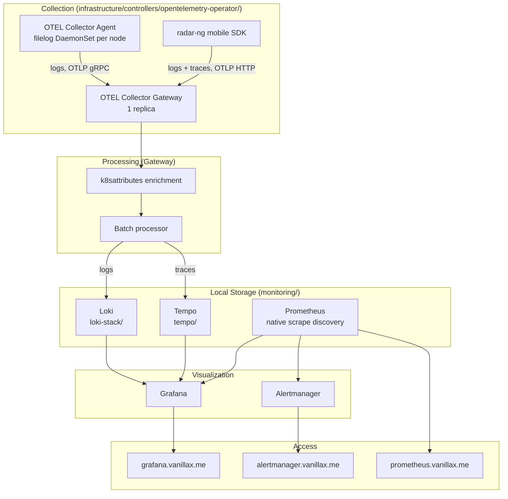

# Monitoring & Observability Stack

Full three-pillar observability (metrics / logs / traces) for the cluster,
fully self-hosted: metrics in Prometheus, logs in Loki, traces in Tempo,
visualized in Grafana. No SaaS in the pipeline.

## Architecture



## Design notes

Everything is self-hosted — no SaaS in the pipeline. Each signal has one
authoritative sink so there's never a "which one do I trust" question:

| Signal  | Sink                            | Query in      |
|---------|---------------------------------|---------------|
| Metrics | Prometheus (`prometheus-stack/`)| Grafana       |
| Logs    | Loki (`loki-stack/`)            | Grafana Explore |
| Traces  | Tempo (`tempo/`)                | Grafana Explore |
| Alerts  | Alertmanager                    | alertmanager.vanillax.me |

Retention: metrics 15d, logs 24h, traces 72h (see table near the bottom).
For anything longer-term, export from Loki/Tempo to S3 before rotation.

## Components

| Component | Location | Purpose |
|-----------|----------|---------|
| **OTEL Operator** | `infrastructure/controllers/opentelemetry-operator/` | Manages the two Collectors |
| **OTEL Agent** | Same (CRD: `collector-agent.yaml`) | DaemonSet, scrapes pod logs via filelog |
| **OTEL Gateway** | Same (CRD: `collector-gateway.yaml`) | Enriches logs and routes logs/traces to their backends |
| **Prometheus** | `monitoring/prometheus-stack/` | Metrics storage, alerting, Grafana |
| **Loki** | `monitoring/loki-stack/` | Log storage (S3 on RustFS) |
| **Tempo** | `monitoring/tempo/` | Trace storage (S3 on RustFS) |
| **HolmesGPT** | `monitoring/holmesgpt/` | AI cluster diagnostics via vLLM (`qwen3.8-27b`) |
| **Trivy Operator** | `monitoring/trivy-operator/` | Conservative vulnerability + exposed-secret scanning |
| **pod-cleanup** | `monitoring/pod-cleanup/` | 6-hourly CronJob deleting Failed/Succeeded pods cluster-wide |

## Telemetry scope

The node agents collect container stdout/stderr only. Prometheus already
collects Kubernetes and application metrics through kubelet, kube-state-metrics,
ServiceMonitors, and PodMonitors, so OTEL does not duplicate those metrics.
Application auto-injection is intentionally not deployed: the former blanket
experiment added startup and runtime cost without a maintained trace consumer.
The radar-ng mobile app remains the explicit exception and sends its own logs
and traces directly to the public gateway.

## Kubernetes Metrics: Two Pipelines

Two sources of Kubernetes metrics — they are NOT interchangeable:

```
                    kubelet :10250/metrics
                   /                       \
        Prometheus scrapes              metrics-server polls
               ↓                               ↓
      stores in time-series DB         holds latest snapshot in memory
               ↓                               ↓
      Grafana, Alertmanager            HPA, kubectl top
```

| | **Prometheus** | **metrics-server** |
|---|---|---|
| **What it stores** | Historical time-series (15-day retention) | Last ~30 seconds only, in-memory |
| **Consumers** | Grafana, Alertmanager | HPA, `kubectl top` |
| **Installed via** | `monitoring/prometheus-stack/` (Wave 5) | `infrastructure/controllers/metrics-server/` (Wave 4) |

If `kubectl top` works but Grafana dashboards are empty, metrics-server is
fine and Prometheus is the problem. If HPA is stuck at "unknown" but
Grafana has data, it's the reverse.

## Storage Backends

| Component | Storage | Location |
|-----------|---------|----------|
| Prometheus | Longhorn PVC (50Gi) | Local cluster |
| Grafana | Longhorn PVC (10Gi) | Local cluster |
| Alertmanager | Longhorn PVC (5Gi) | Local cluster |
| Loki | RustFS S3 (`loki` bucket) | TrueNAS 192.168.10.133:30293 |
| Tempo | RustFS S3 (`tempo` bucket) | TrueNAS 192.168.10.133:30293 |

> Loki/Tempo credentials go in via `extraEnvFrom: secretRef:` — do NOT
> reference `${VAR}` inline in the Helm values; those don't expand and
> the pod silently runs with no creds. See `monitoring/CLAUDE.md`.

## Access

| Service | URL |
|---------|-----|
| Grafana | https://grafana.vanillax.me |
| Prometheus | https://prometheus.vanillax.me |
| Alertmanager | https://alertmanager.vanillax.me |
| Loki | https://loki.vanillax.me |

## Performance Triage

Grafana opens on **START HERE — Cluster Performance**. This is the supported
front door for performance incidents; do not begin by browsing dashboard
folders.

1. Read the four red/yellow/green incident cards.
2. Check whether node CPU, memory, disk, or kubelet pressure is red.
3. Use the ranked workload panels to find the CPU/RAM consumer or the workload
   closest to a hard limit.
4. Click the workload bar. Grafana opens **WHY IS THIS APP SLOW?** with the
   namespace and workload already selected.
5. Match CPU throttling, memory growth, restarts, network/filesystem traffic,
   and the workload's Loki errors on the same time range.

Only two selectors are exposed on the investigator: **Namespace** and
**Workload**. The pod selector is derived automatically. Specialist dashboards
remain available from the START HERE instructions for PostHog, Longhorn,
Argo CD, VPA, GPU, and raw logs.

For PostHog, open **WHY IS POSTHOG SLOW?**. It deliberately keeps all of the
following on one page:

- Django web/API latency, 5xx rate, and the exact slow/failing view.
- PostgreSQL connections, cache hit, deadlocks, long transactions, locks,
  temporary data, and slow `pg_stat_statements` query IDs.
- Redpanda consumer lag by PostHog consumer group, active consumers, and
  unavailable partitions.
- ClickHouse queries, merges, failures, memory, MergeTree parts, CPU, and
  restarts.
- PostHog pod CPU/memory and correlated Loki error messages.

PostgreSQL uses a pinned `postgres_exporter` sidecar; Redpanda and ClickHouse
use their built-in Prometheus endpoints. Query text is not placed in metric
labels.

The kube-prometheus-stack stock dashboard bundle and the five community
Kubernetes views are deliberately disabled. They duplicated the same signals
across global/namespace/node/pod menus and obscured the incident workflow.
The three GitOps-managed entrypoints are:

- `monitoring/prometheus-stack/performance-cockpit-dashboard.yaml`
- `monitoring/prometheus-stack/app-performance-dashboard.yaml`
- `monitoring/prometheus-stack/posthog-performance-dashboard.yaml`

## Key Files

- Custom ServiceMonitors: `monitoring/prometheus-stack/custom-servicemonitors.yaml`
- Custom alerts: `monitoring/prometheus-stack/custom-alerts.yaml`
- Argo CD alerts: `monitoring/prometheus-stack/argocd-sync-alerts.yaml`
- GPU alerts/dashboard: `monitoring/prometheus-stack/gpu-alerts.yaml`, `gpu-dashboard.yaml`
- OTEL Collectors: `infrastructure/controllers/opentelemetry-operator/collector-*.yaml`
- k8sgpt runbook: `monitoring/k8sgpt/README.md`
- Trivy Operator runbook: `monitoring/trivy-operator/README.md`

## Retention

| Signal | Retention |
|--------|-----------|
| Metrics | 15 days (Prometheus) |
| Logs | 24 hours (Loki — deliberately short; see loki-stack/values.yaml) |
| Traces | 72 hours (Tempo) |
| Alerts | 72 hours (Alertmanager) |

Alert evaluation and notification delivery are separate. Prometheus evaluates
the rules and Grafana/Prometheus/Alertmanager show their state today. The live
Alertmanager receiver is intentionally `null`, so no message is delivered
outside the cluster until a real receiver credential and destination are
selected. Argo CD Notifications is not needed for this metrics-based path.

Argo CD is already covered by component ServiceMonitors, Grafana dashboard
14584, and dedicated alerts for component availability, reconcile stalls,
auto-sync drift, degraded apps, stuck progress, and failed syncs. Keep those
rules in `argocd-sync-alerts.yaml`; do not duplicate broad Argo rules in
`custom-alerts.yaml`.

## Troubleshooting

```bash
# OTEL Collector pods & health
kubectl get pods -n opentelemetry
kubectl logs -n opentelemetry -l app.kubernetes.io/component=opentelemetry-collector

# Prometheus scrape targets
# Visit: https://prometheus.vanillax.me/targets

# Loki is receiving logs — in Grafana Explore, try:
#   {k8s_namespace_name=~".+"}
# Labels are OTEL-semconv style (dots → underscores) because logs come from the
# OTEL Gateway's loki exporter, NOT Promtail. Available labels include:
#   k8s_cluster_name, k8s_namespace_name, k8s_pod_name, k8s_container_name,
#   k8s_deployment_name, k8s_daemonset_name, k8s_statefulset_name,
#   k8s_replicaset_name, service_name
# Querying `{namespace=~".+"}` returns "No data" — that Prometheus-legacy label
# does not exist here. If the right selector also returns nothing, then check
# Loki's ingester + the Gateway's loki exporter.

# Trace a specific app's pipeline end-to-end
kubectl logs -n opentelemetry ds/collector-agent        # agent received spans?
kubectl logs -n opentelemetry deploy/collector-gateway  # gateway forwarded?
```

### Common pitfalls (see `monitoring/CLAUDE.md` for details)
- Tempo/Loki S3 creds: use `extraEnvFrom: secretRef:`, not inline `${VAR}`.
- ArgoCD metrics: must be per-component (`controller.metrics`, `server.metrics`, …) — top-level `metrics:` does nothing.
- Longhorn ServiceMonitor: select `app: longhorn-manager` (NOT `app.kubernetes.io/name: …`).
- `ignoreDifferences`: use `jqPathExpressions`, not `jsonPointers` (RFC 6901 has no `*` wildcard).
- PVC storage in `ignoreDifferences`: do not ignore `.spec.resources.requests.storage`
  globally. `RespectIgnoreDifferences=true` would also suppress legitimate
  Git-driven expansions. Keep Git at or above the live size and scope any
  legacy exception to the affected Application/PVC.
- Loki tenant_id: multi-tenant mode requires `X-Scope-OrgID` header or `tenant_id` — 401 without it.
- OTEL Collector CRD versions: `v1beta1` for `OpenTelemetryCollector`, `v1alpha1` for `Instrumentation`.
