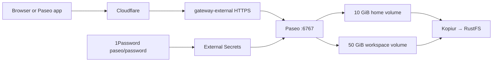

# Paseo in Kubernetes

Status: deployment definition prepared for review. Verify live readiness after merge.
This app runs a persistent development workstation at `https://paseo.vanillax.me`.
Argo CD discovers this directory as `my-apps-paseo` after it reaches `main`.



## Prerequisites

- The tested image digest in `deployment.yaml` must be available in GHCR.
- Vault `homelab-prod` must contain `paseo/password`.
- The `1password` ClusterSecretStore, Longhorn, Kopiur, and external gateway must be ready.
- Merge approval is required. Do not apply these manifests directly.

The image build and tool versions live in
[homelab-images](https://github.com/mitchross/homelab-images/tree/feat/paseo-dev/images/paseo-dev).
This deployment pins the locally tested image published from commit `2c37451`.
Switch to the CI-produced `main` tag plus digest after the image PR merges, so
Renovate can propose later digest updates. The current candidate tag is immutable.

## Storage and resources

The pod runs as `1000:1000`. `/home/paseo` holds settings, provider logins, and
sessions. `/workspace` holds project checkouts and uncommitted work. Both volumes
use Longhorn with restore-before-bind and daily Kopiur backups. Backup movers use
`1000:1000` so they can read private agent files. Push important work to Git too.

Initial requests are 1 CPU and 2 GiB RAM. The memory limit is 12 GiB; VPA can adjust
requests up to 4 CPUs and 8 GiB RAM. Size the limits from observed builds. VPA may
recreate the single pod, which interrupts active processes. Image rollouts use
`Recreate` to avoid an RWO volume attachment deadlock.

No liveness probe is configured: a busy build should not cause a health-probe
restart that kills its agents. Startup and readiness use the health endpoint.
Kubelet restarts a crashed process. Chromium gets a 1 GiB shared-memory mount.

## First login

After merge, verify the resources:

```sh
kubectl -n paseo get externalsecret,pvc,pod,httproute
kubectl -n paseo rollout status deployment/paseo --timeout=5m
kubectl -n paseo get httproute paseo -o yaml
curl -fsS https://paseo.vanillax.me/api/health
curl -s -o /dev/null -w '%{http_code}\n' https://paseo.vanillax.me/api/status
```

Expect the ExternalSecret to be ready, both PVCs bound, one ready pod, and route
conditions `Accepted=True` and `ResolvedRefs=True`. Health returns success;
unauthenticated `/api/status` returns `401`. The web page itself can load without
a password; control requests require the password.

Open the website and add a direct daemon connection using the password from
1Password. Verify terminal and agent communication over WebSocket before granting
infrastructure credentials. Relay access and workspace service publishing are disabled.

Authenticate providers in the pod terminal, for example:

```sh
kubectl -n paseo exec -it deploy/paseo -- claude
kubectl -n paseo exec -it deploy/paseo -- codex login --device-auth
```

Complete each provider's login flow. Login data persists in the home volume.
Clone project repositories under `/workspace`. Private repositories need a
separately configured Git identity and credentials.

## Follow-up configuration

ESO supplies the Paseo login password. Pi's LiteLLM credential is withheld until
a restricted key is ready. Do not give the pod LiteLLM's master key.

The agreed budget is $25 monthly. LiteLLM requires PostgreSQL for virtual keys
and persistent budget tracking; the current gateway has no database configured.
Add that prerequisite through GitOps before creating the key. Verify model routing
and budget enforcement, then store the key in `litellm/paseo_key` in 1Password.
A follow-up PR will supply that field as `LITELLM_API_KEY`.

The pod has no mounted Kubernetes service-account token or RBAC grants. Prepare
scoped access for Kubernetes, Omni/Talos, and Proxmox separately. A Kubernetes
service account does not authenticate to Omni or Proxmox. LAN endpoints may also
need app-specific Cilium egress rules; see the [network policy guide](../../../../docs/domains/networking/policy.md).
The cluster's current global allow rules mean this namespace is not an isolated sandbox.

Restore reviewed personal skills and settings through a private configuration
bundle. Rewrite workstation paths for `/home/paseo` and `/workspace`. Review Mink's
storage and hooks before migration. Do not copy credentials or desktop integrations
into the public image. Paseo plugins remain opt-in.

## Backups, failures, and rollback

```sh
kubectl -n paseo get secret kopiur-rustfs
kubectl -n paseo get snapshotpolicy,snapshotschedule,restore,snapshot
```

The first scheduled snapshots must reach `Succeeded` with nonzero files before
relying on recovery. New volumes bind empty when the backup repository is reachable
but no snapshot exists. A repository outage leaves restore-backed PVCs pending.
See the [backup guide](../../../../docs/domains/storage/kopiur-backup-architecture.md).

For `CreateContainerConfigError`, inspect the ExternalSecret status without
printing Secret values. For `403 Host not allowed`, check `PASEO_HOSTNAMES`.
For a pending PVC, inspect Restore and storage events; do not delete the PVC.

Password rotation reaches Kubernetes through ESO, but the process reads it at
startup. Arrange a restart when no agent work is active. Existing connections
should be explicitly closed and new-password authentication checked.

To roll back an image upgrade, revert its digest in Git through a PR. Keep the
PVCs. Restore backup data only if an incompatible data change requires it. Do not
remove this app directory as a rollback: Argo CD can prune its persistent volumes.
