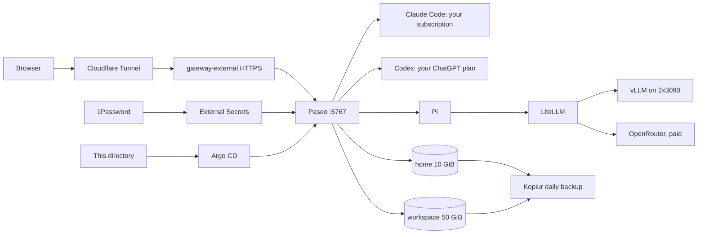

# Paseo in Kubernetes

**Purpose:** run Paseo, a browser workspace for coding agents, at `https://paseo.vanillax.me`.
**Status:** current deployment. Argo CD syncs this directory as `my-apps-paseo`.
**Concept guide:** [Paseo and the AI stack](../../../docs/domains/ai-gpu/paseo.md).
**Agent map:** [CLAUDE.md](CLAUDE.md) lists which repo owns which change.
**Image and a friend-friendly setup guide:** [homelab-images/paseo-dev](https://github.com/mitchross/homelab-images/tree/main/images/paseo-dev).



## What comes from where

| Item | Source | Changes how |
|---|---|---|
| Paseo password | 1Password `paseo/password` → Secret `paseo-secrets` | Edit 1Password, then restart the pod |
| Pi's LiteLLM key | 1Password `litellm/master_key` → `paseo-secrets` | Edit 1Password, then restart the pod |
| Pi model list | [`config/pi-models.json`](config/pi-models.json) → ConfigMap `pi-config` | PR; the ConfigMap hash rolls the pod |
| Qwen sampler hook | [`config/qwen-sampling.ts`](config/qwen-sampling.ts) → ConfigMap `pi-config` | PR to `scripts/pi/qwen-sampling.ts` and this copy |
| Claude, Codex, GitHub logins | One-time login, stored in `/home/paseo` | Log in again from the Paseo terminal |
| Tools, agents, Pi aliases | Image digest in [`deployment.yaml`](deployment.yaml) | homelab-images PR, then a digest PR here |

CI fails when `config/pi-models.json` or `config/qwen-sampling.ts` drift from their
workstation references. Kustomize cannot read files outside this directory, so the copies exist.

## 1. Connect from a browser

1. Open `https://paseo.vanillax.me`.
2. Click **Block** if the browser asks to "access other apps and services on this device".
3. Click **Direct connection** if Paseo does not connect by itself.
4. Enter host `paseo.vanillax.me`, port `443`, and turn on **Use SSL**.
5. Enter the password from 1Password `homelab-prod` → `paseo`.

Ignore **Paste pairing link**. It needs Paseo's relay, and this deployment turns the relay off.
The page itself loads without a password. All control requests need it.

## 2. Open a terminal

1. Click **Add project** → **Search for directory**.
2. Type `/workspace` and press Enter.
3. In the new workspace, change **Chat ⌄** to **Terminal**.
4. Leave the command box empty and press Enter.

The terminal runs inside the pod as user `paseo` (uid 1000).

## 3. Log in once

Each login stays in `/home/paseo`. Restarts and image updates keep it.

**GitHub:**

```bash
gh auth login --hostname github.com --git-protocol https --web
git config --global user.name "Mitch Ross"
git config --global user.email "mitchross@users.noreply.github.com"
```

1. Ignore the "failed to open browser" lines. The command keeps waiting.
2. Open `https://github.com/login/device` on your PC.
3. Enter the code that the terminal shows.

Expect `✓ Logged in as mitchross`. Answer **Yes** to "Authenticate Git", so `git push` works.

**Claude Code** (uses your Claude subscription, not API credit):

1. Run `claude`.
2. Type `/login` and choose the subscription account.
3. Open the link on your PC, approve, and paste the code back.
4. Type `/exit`.

**Codex** (uses your ChatGPT plan):

1. Turn on **device code sign-in** in chatgpt.com → Settings → Security and login.
2. Run `codex login --device-auth`.
3. Open the link on your PC and enter the code.

**Check all three:**

```bash
gh auth status; claude --version; codex login status
```

Expect a GitHub account, a Claude Code version, and `Logged in using ChatGPT`.

## 4. Use Pi with your own GPUs

Pi needs no login. It reads `LITELLM_API_KEY` from the pod environment.

```bash
pi -p "Reply with exactly: PASEO OK"
```

Expect `PASEO OK` from local Qwen. In the chat UI, choose **Select model** → **Pi**:

| Model | Runs on | Cost |
|---|---|---|
| `vanillax-vllm/qwen3.8-27b` | vLLM on the two RTX 3090s | free |
| `vanillax-auto/pi-auto` | LiteLLM picks Qwen or DeepSeek per request | sometimes paid |
| `vanillax-openrouter/deepseek-flash` | OpenRouter | paid |

Images built after the homelab-images onboarding PR add the bash aliases
`pi-qwen-only`, `pi-withflash`, and `pi-flash`. `pi-direct-openrouter` does not exist here:
only LiteLLM holds the OpenRouter key. See [Pi agent](../../../docs/domains/ai-gpu/pi-agent-local-dev.md)
for the routing rules.

## Verify after a change

```bash
kubectl -n argocd get application my-apps-paseo
kubectl -n paseo get pod,pvc,externalsecret,httproute
curl -s -o /dev/null -w '%{http_code}\n' https://paseo.vanillax.me/api/status
curl -s https://paseo.vanillax.me/ | grep -o '__PASEO_INITIAL_DAEMON_CONNECTION__=[^<]*'
```

Expect `Synced` and `Healthy`, one ready pod, both PVCs `Bound`, and `401` without a password.
The last command must show `"useTls":true`. `false` means the browser cannot auto-connect;
check `PASEO_TRUSTED_PROXIES`.

## Storage and resources

The pod runs as `1000:1000`. `/home/paseo` holds settings, sessions, and logins.
`/workspace` holds checkouts and uncommitted work. Both volumes use Longhorn with
restore-before-bind and daily Kopiur snapshots. The movers run as `1000:1000`.
Push important work to Git too.

Requests start at 1 CPU and 2 GiB. The memory limit is 12 GiB. VPA can raise
requests to 4 CPUs and 8 GiB. A VPA resize can recreate the pod and stop active agents.
`Recreate` rollouts prevent an RWO volume attach deadlock.

No liveness probe exists, so a busy build cannot trigger a restart. Chromium gets 1 GiB of `/dev/shm`.

## Known limits

- One password is the only gate on a public URL. Paseo has no login rate limit.
- `gh auth login` gives the pod access to every repo of the account.
- The shared Cilium policy lets the pod reach other cluster services. See the [network policy guide](../../../docs/domains/networking/policy.md).
- Pi uses LiteLLM's master key. An agent can spend OpenRouter credit through it.
- The pod has no Kubernetes service-account token and no RBAC grants.

## Backups, failures, and rollback

```bash
kubectl -n paseo get snapshotpolicy,snapshotschedule,restore,snapshot
```

Snapshots must reach `Succeeded` with nonzero files before you rely on a restore.
A new PVC binds empty when the repository has no snapshot. A repository outage keeps the PVC `Pending`.
See the [backup guide](../../../docs/domains/storage/kopiur-backup-architecture.md).

| Symptom | Check |
|---|---|
| `CreateContainerConfigError` | `kubectl -n paseo describe externalsecret paseo-secrets` |
| `403 Host not allowed` | `PASEO_HOSTNAMES` in `deployment.yaml` |
| Pi returns `400 No connected db` | `apiKey` in `config/pi-models.json` must start with `$` |
| A PVC stays `Pending` | Restore status and storage events. Never delete the PVC. |

Paseo reads the password only at startup. Restart the pod when no agent work runs.

Roll back an image by reverting its digest through a PR. Keep the PVCs.
Never delete this directory as a rollback: Argo CD can prune the volumes.
