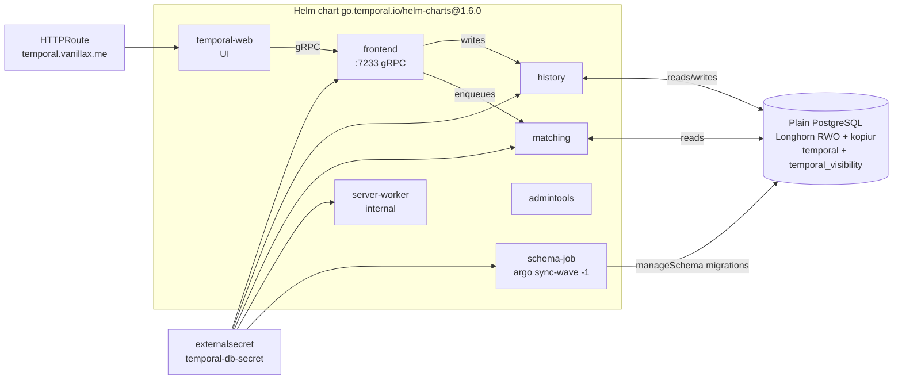
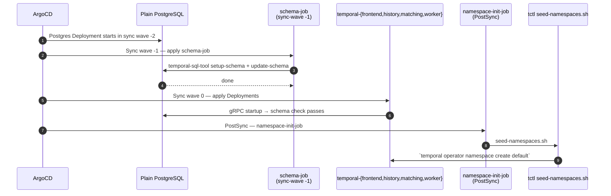

# temporal — server (cluster side)

Self-hosted Temporal server for the cluster. This directory deploys the
**server**; application workers (e.g. `news-reader-temporal-worker`,
`radar-ng`'s temporal worker) live in their own sibling dirs and connect
in via `TemporalConnection` CRs from the
[Temporal Worker Controller](../../../infrastructure/controllers/temporal-worker-controller/).

Read this *with* `news-reader/temporal/README.md` (in the news-reader
repo) — together they cover server side + app side of the same system.

---

## What this dir deploys



| Component   | Role |
|-------------|------|
| `frontend`  | gRPC API the SDKs and `temporal` CLI talk to (port 7233). |
| `history`   | Owns workflow history. Replays/persists events to PG. |
| `matching`  | Owns task queues; long-poll endpoint workers connect to. |
| `worker`    | **Internal** server worker — runs Temporal's own background workflows (archival, retention, schedule trigger). Distinct from *your* application workers. |
| `web`       | UI at `temporal.vanillax.me`. |
| `admintools`| Side-pod with `tctl` / `temporal` CLI shells out to. Handy via `kubectl exec`. |
| schema Job  | Runs `temporal-sql-tool` migrations against PG before pods boot. |

---

## Files

```
kustomization.yaml      # Helm chart inflation + JSON patches for ArgoCD sync waves
values.yaml             # Helm values: image pin, persistence (PG), resources
namespace.yaml          # `temporal` namespace
namespace-init-job.yaml # Post-install Job — creates the `default` Temporal namespace
externalsecret.yaml     # Pulls Postgres creds from 1Password into `temporal-db-secret`
httproute.yaml          # Gateway API route: temporal.vanillax.me → temporal-web
prometheusrule.yaml     # Timer DLQ and missing-visibility alerts
postgres/               # Plain Postgres, Longhorn RWO PVC, exporter, ServiceMonitor
kopiur/                  # Postgres backup and restore policy
scripts/
  seed-namespaces.sh    # Mounted by namespace-init-job; idempotent `tctl namespace register`
```

---

## How the bring-up sequence works

ArgoCD applies this app in sync-wave order. The critical part: SQL schema
migrations **must run before any temporal server Pod boots**, otherwise
`history` panics with "schema mismatch."



The JSON patch in `kustomization.yaml` is what makes this work:

```yaml
patches:
  - target: {kind: Job, labelSelector: helm.sh/chart}  # only the chart's Jobs
    patch: |
      - op: add
        path: /metadata/annotations/argocd.argoproj.io~1hook
        value: Sync
      - op: add
        path: /metadata/annotations/argocd.argoproj.io~1sync-wave
        value: "-1"
      - op: add
        path: /metadata/annotations/argocd.argoproj.io~1hook-delete-policy
        value: BeforeHookCreation
```

The selector is intentional — without it, the patch would also stomp our
own `temporal-namespace-seed` Job (the `PostSync` namespace creator) and
turn it into a pre-sync wave, which would deadlock because the seed Job
needs the server up.

---

## Persistence: plain PostgreSQL on Longhorn

The chart does not own a bundled database. This Application runs one plain
PostgreSQL Deployment backed by a Longhorn RWO volume and kopiur backups:

```yaml
# excerpt from values.yaml
server:
  config:
    persistence:
      defaultStore: default
      visibilityStore: visibility
      datastores:
        default:    {sql: {databaseName: temporal,            connectAddr: temporal-postgres.temporal.svc.cluster.local:5432, ...}}
        visibility: {sql: {databaseName: temporal_visibility, connectAddr: temporal-postgres.temporal.svc.cluster.local:5432, ...}}
```

`postgres/deployment.yaml` serves two databases: workflow history and
searchable visibility. Its RWO Deployment uses `Recreate`, and
`kopiur/temporal-postgres-data.yaml` provides restore-before-bind backups.
The PVC is on `longhorn-wired-ha`: two synchronous replicas on distinct
wired-storage nodes, and the pod is pinned to wired nodes as well. This is one
database instance, not database HA. Longhorn survives one node or disk loss
with a full copy intact; kopiur is the independent restore path. Changing the
StorageClass again is a restore-before-bind recreation, see
[pvc-storageclass-migration.md](../../../docs/domains/storage/pvc-storageclass-migration.md).

> 💡 **`numHistoryShards: 1`** is set in our values.yaml. This is
> **permanent for this Temporal database** — changing it requires a new
> control plane and data migration. The shared cluster stays at one shard;
> the dedicated Radar control plane is planned with 32 from its first boot.

---

## Versions & upgrades

```yaml
# kustomization.yaml (excerpt)
helmCharts:
  - name: temporal
    repo: https://go.temporal.io/helm-charts
    version: 1.6.0          # chart version — renovate auto-bumps via .github/renovate.json5
    valuesFile: values.yaml

# values.yaml (excerpt)
server:
  image:
    repository: temporalio/server
    tag: 1.31.2             # server version override — chart's default lags real releases
```

The **chart** and the **server image** rev independently. The chart
controls Helm templates (Deployments/Services/etc.); the image tag
controls the actual `temporalio/server` binary. The chart's bundled
default often lags Temporal's release cadence, so we pin the image
explicitly.

When bumping the server image:
1. Read [Temporal server release notes](https://github.com/temporalio/temporal/releases).
2. If the bump crosses a schema migration boundary, the schema Job will
   run automatically (sync-wave -1). Watch its logs the first time.

---

## Web UI

```
https://temporal.vanillax.me   (Cloudflare tunnel → Cilium gateway-external)
```

The HTTPRoute in `httproute.yaml` is what gets you there. UI is
unauthenticated today — if you ever expose it externally to multiple
people, gate it via Cloudflare Access on the tunnel.

For purely local access:
```bash
kubectl -n temporal port-forward svc/temporal-web 8080:8080
# open http://localhost:8080
```

---

## Server vs Worker Controller — two operator-style pieces

Important distinction (this confuses everyone the first time):

| Thing | Where | What it manages |
|---|---|---|
| **Temporal server** | `my-apps/development/temporal/` (this dir) | The server itself — frontend, history, matching, web, server-worker. Deployed via the official Helm chart. |
| **Temporal Worker Controller** | `infrastructure/controllers/temporal-worker-controller/` | A *Kubernetes controller* (CRD-based). Watches your `TemporalWorkerDeployment` CRs and turns each into a versioned `apps/v1 Deployment`. Handles Worker Versioning rollouts. |

You can run the server without the worker controller — workers would
just be plain Deployments and you'd lose progressive rollouts. We use
both because Worker Versioning is the whole point.

---

## Per-application workers in this cluster

| App | Path |
|---|---|
| `news-reader-temporal-worker` (news-digest task queue) | `my-apps/development/news-reader-temporal-worker/` |
| `radar-ng` workers | `my-apps/development/radar-ng/temporal-worker-deployment.yaml` |

Each ships its own `TemporalConnection` CR pointing at
`temporal-frontend.temporal.svc.cluster.local:7233` and its own
`TemporalWorkerDeployment` CR. They're independent Apps in ArgoCD.

---

## Operations cheatsheet

```bash
# Check server is healthy
kubectl -n temporal get pods
kubectl -n temporal logs deploy/temporal-frontend --tail=50

# Open a tctl shell inside the cluster (admintools sidecar)
kubectl -n temporal exec -it deploy/temporal-admintools -- bash
# now you can run `temporal workflow list ...`, etc.

# Force the Temporal server/schema ArgoCD app to resync after editing values.
# PostgreSQL is part of this same Application.
argocd app sync my-apps-temporal

# Check schema migration logs
kubectl -n temporal logs job/temporal-schema-1.x.y

# Watch the namespace-init job (first install only)
kubectl -n temporal logs job/temporal-namespace-seed
```

### Timer DLQ alert runbook

A non-zero timer DLQ is a control-plane incident. A Schedule can still look
`RUNNING` while its durable `TimerFired` task is stranded. Application-level
manual triggers can produce fresh runs, but they do not repair that timer.

Inventory first:

```bash
kubectl -n temporal exec deploy/temporal-admintools -- \
  tdbg dlq list --print-json

kubectl -n temporal exec deploy/temporal-admintools -- \
  tdbg dlq read --dlq-type 2 --cluster active --target-cluster active \
  --last-message-id <last-id> --max-message-count 100
```

For every message, identify the namespace, workflow ID, run ID, task type,
and current workflow state. Coordinate with every affected application owner.
DLQ merge uses prefix semantics, so a message cannot be skipped in the middle.

Only after the exact prefix is approved, re-enqueue it and watch the job:

```bash
kubectl -n temporal exec deploy/temporal-admintools -- \
  tdbg dlq merge --dlq-type 2 --cluster active --target-cluster active \
  --last-message-id <approved-prefix-last-id>

kubectl -n temporal exec deploy/temporal-admintools -- \
  tdbg dlq job describe --job-token '<token>'
```

Then list the DLQ again and verify affected schedules fire naturally for at
least two cadences. Do not treat manual triggers as proof. Never purge a DLQ,
and do not delete or recreate schedules as an automatic recovery action.

---

## Further reading

- [Tips for running Temporal on Kubernetes](https://temporal.io/blog/tips-for-running-temporal-on-kubernetes) — the article this setup follows
- [Temporal Helm chart](https://github.com/temporalio/helm-charts)
- [Temporal Worker Controller](https://github.com/temporalio/temporal-worker-controller)
- [news-reader temporal worker README](https://gitea.vanillax.me/vanillax/news-reader/src/branch/main/temporal/README.md) — application side of the same system, full worker-versioning walkthrough
